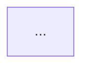

# Dependency Checker

Two independent dependency layers exist in this repo, and both must be
covered — conflating them produces a report developers can't act on:

1. **External dependencies** — third-party npm packages each of the five
   packages (`server/`, `client/`, `reviewer-core/`, `e2e/`, `mcp/`) pulls in,
   per that package's own manager and lockfile.
2. **Internal / component dependencies** — how the five packages depend on
   *each other* (import direction, the hand-vendored `shared` contracts) and,
   within a package, its own module graph.

Read-only throughout. This skill inventories and reports; it never installs,
updates, removes, or "fixes" anything, and it never runs a manager against a
package it doesn't own (see the package-manager map in the root
`CLAUDE.md` — `server/`, `client/` → pnpm; `reviewer-core/`, `e2e/`, `mcp/` →
npm). Running `pnpm install` inside an npm package to "check" it is itself
the bug this skill exists to catch — never do it.

## When to use
- Explicit ask: "перевір залежності", "аналіз залежностей", "скільки важать
  пакети", "dependency audit", "audit dependencies", "chart the dependency
  graph", `/dependency-checker`.
- Before a refactor or cleanup that will touch `package.json` in any
  package, to get a baseline first.
- When someone suspects duplicate/bloated dependencies or wants to know
  which package is "heaviest".

## When NOT to use
- Not a vulnerability-focused security audit — this skill surfaces `audit`
  output as one input among several, but for a dedicated CVE/OWASP pass use
  the `security` skill.
- Not for enforcing import-direction rules on a diff — that's
  `architecture-reviewer` / `onion-architecture`. This skill *reports* the
  graph; it doesn't gate a PR on it.
- Not a substitute for `pr-self-review` — don't run this as part of routine
  per-PR review unless `package.json` is actually in the diff.

## Phase 0 — inventory packages and confirm manager

Before touching any package, build the ground truth table:

| Package | Manager | Lockfile |
|---|---|---|
| `server/` | pnpm | `pnpm-lock.yaml` |
| `client/` | pnpm | `pnpm-lock.yaml` |
| `reviewer-core/` | npm | `package-lock.json` |
| `e2e/` | npm | `package-lock.json` |
| `mcp/` | npm | `package-lock.json` |

For every package, `ls` its root and flag immediately (as a **CRITICAL**
finding, don't wait for Phase 4) if:
- an npm-owned package has a `pnpm-lock.yaml` and/or `pnpm-workspace.yaml`,
  or a pnpm-owned package has a `package-lock.json` — a stray lockfile from
  the wrong manager having been run there at some point.
- any `pnpm-workspace.yaml` claims a real workspace (globs beyond
  `allowBuilds:` approvals) — there is no monorepo workspace in this repo;
  a real `packages:` glob is a structural break, not a style nit.
- a lockfile exists with no matching `package.json`, or vice versa.

This phase is cheap (a handful of `ls`/`test -f`) — do it before any deeper
collection so a manager mismatch doesn't quietly corrupt Phase 1's data.

## Phase 1 — external dependencies per package

For each package, using **only its own manager**, collect:

**pnpm packages** (`server/`, `client/`):
```
pnpm ls --depth 0 --json
pnpm outdated --format json     # non-zero exit on findings is expected, not an error
pnpm audit --json               # same
```

**npm packages** (`reviewer-core/`, `e2e/`, `mcp/`):
```
npm ls --omit=dev --depth 0 --json
npm ls --depth 0 --json         # devDependencies too
npm outdated --json
npm audit --json
```

**Size**, same command for either manager since it's filesystem-level, run
inside the package directory:
```
du -sh --max-depth=1 node_modules 2>/dev/null | sort -rh | head -20
du -sh node_modules 2>/dev/null   # package total
```
If `node_modules` doesn't exist for a package, say so plainly in the report
instead of estimating — don't install to make the number appear.

**Unused dependencies** (ad hoc, non-persistent — does not touch
`package.json` or the lockfile):
```
npx --yes depcheck
```
Run this from inside the package directory so it resolves that package's own
config, not the repo root.

Record, per dependency: name, declared range (`dependencies` vs
`devDependencies` vs `peerDependencies`), resolved version, whether
`outdated` flags it (and by how many majors), whether `audit` flags it (and
at what severity), and its `node_modules/<name>` size from the `du` output.

## Phase 2 — internal / component dependency graph

Two sub-graphs, both needed:

**A. Cross-package graph.** The five packages don't import each other's
source directly (no workspace) — they connect only through:
- TypeScript `paths` aliases in each package's `tsconfig.json` pointing at
  another package's compiled/source output (e.g. `reviewer-core`'s alias
  into `server`'s types, `mcp`'s `@devdigest/shared` alias into
  `server/src/vendor/shared`).
- The hand-vendored `shared` contracts: `server/src/vendor/shared` (source
  of truth) mirrored into `client/src/vendor/shared` (trimmed, UI-only
  subset) — grep both trees and diff which exported symbols exist only on
  one side.

Grep every package's `tsconfig.json` for `"paths"` and cross-check against
actual `import`/`export` statements that use those aliases, to confirm the
declared edges are real and match the direction rule: `client ↛ server`,
`server ↛ client`, `reviewer-core ↛ both`.

**B. Within-package module graph** (optional, only when the audit is scoped
to one package or a maintainer asks "which files are the most
depended-upon"). Reuse the pattern already in this repo
([server/src/adapters/depgraph/index.ts](../../../server/src/adapters/depgraph/index.ts)),
which wraps `dependency-cruiser`. For an ad hoc one-off outside that
adapter's actual runtime use (repo-intel indexing of *imported* repos, not
this repo itself), run read-only from the package root:
```
npx --yes dependency-cruiser --include-only "^src" --output-type json src
```
Never add `dependency-cruiser` to a package's own `package.json` just to run
this — it's already a `server/` dependency; invoke it via `npx` for every
other package so no package's manifest gains an audit-only dependency.

## Phase 3 — diagrams

Two Mermaid diagrams (see the `mermaid-diagram` skill for syntax), each
answering a different question — don't merge them into one:

**(a) Cross-package structure** — a `flowchart LR` with one node per package
plus external systems (Postgres, GitHub API, LLM provider), edges labeled by
what crosses (type-only alias vs. runtime HTTP call vs. vendored contract
mirror — use a dashed edge for the mirror since it's a manual copy, not an
import), and the forbidden directions explicitly *absent* rather than drawn
and crossed-out.

**(b) Per-package weight** — one diagram (bar-shaped via a `flowchart` of sized
nodes, or a simple ranked list if Mermaid would be less readable than a
table) showing each package's total `node_modules` size and its top 3–5
heaviest individual dependencies. If a table communicates the numbers more
clearly than a forced diagram, use the table instead — the diagram is for
*structure*, the numbers are for *tables* (Phase 5 template covers both).

## Phase 4 — findings, prioritized

Reuse this repo's existing CRITICAL / WARNING / SUGGESTION contract (same
one `pr-self-review` and `architecture-reviewer` use) so output is
consistent across skills:

- **CRITICAL** — wrong package manager used against a package (stray
  lockfile, Phase 0), a real `audit` finding at high/critical severity, an
  import crossing a forbidden direction (`client → server`, `server →
  client`, or `reviewer-core` reaching outside its alias), or `vendor/shared`
  drift where client is missing a symbol it actually needs (breaks the
  build) rather than a symbol it deliberately trims.
- **WARNING** — the same third-party dependency duplicated at materially
  different major versions across packages with no reason for the split,
  a dependency `depcheck` flags as unused, an `outdated` major-version gap
  on a dependency still receiving security patches only on the newer major,
  or one dependency dominating (>40%) a package's `node_modules` size.
- **SUGGESTION** — minor/patch version drift, a heavy dependency that has a
  materially lighter alternative for the same job, general housekeeping
  (e.g. a devDependency that could be a peerDependency).

Every finding cites the concrete evidence (package, dependency name, the
actual number from `du`/`outdated`/`audit`) — no finding without a number or
a file:line to back it.

## Phase 5 — output template

Deliver the complete report — every section below, including the diagrams —
in your final reply itself, not as a file you wrote earlier in the
conversation and then merely summarize or link back to. A recap of findings
without the report body isn't the deliverable.

```markdown
# Dependency Audit — <date>

## Overview
| Package | Manager | Deps | DevDeps | node_modules | Last audit |
|---|---|---|---|---|---|
| server | pnpm | … | … | … MB | … |
...

## Internal Dependency Graph

<1-2 sentence caption: what's notable about the shape, not a restatement>

## Per-Package Weight

(or a sorted table if that reads clearer — see Phase 3b)

## External Dependencies by Package
### server
| Dependency | Type | Declared | Resolved | Size | Outdated | Audit |
|---|---|---|---|---|---|---|
...
(repeat per package)

## Findings

### CRITICAL
- **<title>** — <package>/<dependency or path>: <evidence>. <concrete fix>

### WARNING
- ...

### SUGGESTION
- ...

## Recommendations
<ranked, short list — top 3-5 things worth doing next, in priority order>
```

Write the report to a file only if the user asks for one to keep (e.g. under
`.devdigest/`, mirroring `pr-self-review`'s report convention) — otherwise
just return it inline; this skill doesn't have a standing output location of
its own.

## Constraints — do not

- Never run `pnpm install`, `npm install`, `pnpm update`, `npm update`,
  `pnpm audit fix`, `npm audit fix`, or any variant that writes to a
  lockfile or `node_modules`. Every command in this skill is read-only.
- Never run `pnpm -r` or reference `workspace:*` — there is no workspace
  (root `CLAUDE.md`); a package-manager command must always be scoped to one
  package's directory.
- Never edit `package.json` or a lockfile as part of this audit — findings
  are reported for a human (or a follow-up implementer session) to act on,
  not auto-applied.
- Never treat `server/clones/**` (git-ignored checkouts of imported repos)
  as part of this repo's own dependency surface — exclude it from every
  scan.
- If `npx` needs to fetch a tool (`depcheck`, `dependency-cruiser`) and the
  environment has no network access, say so and skip that sub-check rather
  than failing the whole audit.
