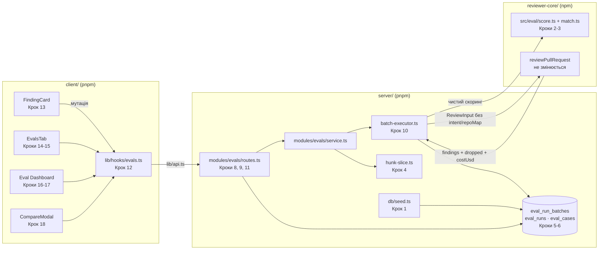

# Implementation Plan: Eval Pipeline (SPEC-05)

## 1. Вимоги

Spec ID: **SPEC-05** — `specs/eval-pipeline.md` (Status: approved, 912 рядків)

Коротко своїми словами: перетворити наявний, але невикористаний датасет рішень користувача (`findings.accepted_at` / `dismissed_at`) на регресійний гейт для рев'ю-агента. Знахідка одним кліком стає eval-кейсом (`accepted` → `must_find`, `dismissed` → `must_not_flag` з порожнім `expected_output`); набір кейсів агента прогоняється одним батчем (нова таблиця `eval_run_batches` + `eval_runs.batch_id`); детермінований скоринг (`recall`/`precision`/`citation_accuracy`) живе чистою функцією в `reviewer-core/src/eval/`; UI дає вкладку `Evals`, Eval Dashboard і модалку `Compare` двох прогонів; `pnpm verify:l06` перевіряє все одним рядком.

Незрозуміло / потребує уточнення: **немає блокуючих питань.** OQ-1…OQ-4 у спеці явно позначені як неблокуючі; я беру їхні рекомендації як рішення плану (див. §7). Дві невідповідності «спека ↔ код», знайдені при читанні коду, не блокують, але змінюють спосіб виконання кроків — винесені в §7 (`DiffHunk` не несе тексту хунка; `temperature` немає в `ReviewInput`).

## 1a. Покриття специфікації

88 AC + 23 EC. Кожен рядок → крок(и).

| ID | Кроки плану | Як верифікується | Примітка |
|---|---|---|---|
| AC-1 | Крок 5 | `pnpm typecheck` server + Крок 6 (міграція застосовується) | імпорти `./core`, `./agents` без `.js` |
| AC-2 | Крок 5 | typecheck + міграція | nullable FK |
| AC-3 | Крок 6 | `git status` показує лише згенеровані файли; `pnpm db:migrate` зелений | |
| AC-4 | Крок 7 | контрактний тест `server/test/contracts.test.ts` — `EvalBatchRecord.parse()` з `null`-метриками | |
| AC-5 | Крок 7 | `git diff --stat` по `knowledge.ts` і секції Eval у `eval-ci.ts` — 0 змінених рядків у наявних схемах | |
| AC-6 | Крок 7 (server), Крок 12 (дзеркало в client) | typecheck обох пакетів | |
| AC-7 | Кроки 8, 9, 10, 11 | `server/test/eval-cases.it.test.ts`, `eval-runs.it.test.ts` — чужий workspace → 404 | |
| AC-8 | Кроки 8, 9, 10, 11 | той самий it-тест: 404, не 403 | |
| AC-9 | Крок 8 | `eval-cases.it.test.ts`: accepted-знахідка → рядок `eval_cases` з очікуваними полями | |
| AC-10 | Крок 13 | RTL `FindingCard.test.tsx`: кнопка в ряду дій | |
| AC-11 | Крок 8 | it-тест: accepted → масив з 1 елемента; dismissed → `[]` | |
| AC-12 | Крок 4 (чиста функція зрізу) + Крок 8 (виклик) | юніт `server/test/eval-hunk-slice.test.ts`: знахідка 45-52 → весь хунк; `grep` не знаходить числового параметра вікна | |
| AC-13 | Крок 8 | it-тест перевіряє `input_meta` | |
| AC-14 | Крок 8 (сервер не має колонки) + Крок 3 (виведення в скорингу) | юніт `score`: тип виводиться з `expected_output` | |
| AC-15 | Крок 8 (422) + Крок 13 (підказка, кнопка активна) | it-тест 422; RTL — клік не викликає мутацію, показано «Accept or Dismiss first» | |
| AC-16 | Крок 13 | RTL: `reviewAgentId={null}` → кнопка disabled | |
| AC-17 | Крок 8 (ідемпотентність) + Крок 13 (стан кнопки) | it-тест: повторний POST → той самий `case_id`; RTL: стан «Eval case created» з лінком | |
| AC-17a | Крок 13 | RTL: після успіху показано toast з дією «Open in Evals» | |
| AC-18 | Крок 8 | it-тест: PR без `patch` → помилка, 0 нових рядків `eval_cases` | |
| AC-18a | Крок 8 (маршрут) + Крок 13 (не пропонується) | it-тест: `kind='secret_leak'` → відхилено; RTL: кнопки немає | |
| AC-19 | Крок 9 | `eval-runs.it.test.ts`: POST повертає `batch_id`, `status='running'` | |
| AC-20 | Крок 9 | it-тест: POST **без тіла** → 200, не 422 | |
| AC-21 | Крок 9 | код-рев'ю + it-тест: провал фонового прогону не валить процес (тест доходить до кінця) | |
| AC-22 | Крок 9 | it-тест: змінити `agents.system_prompt` після старту → `system_prompt_snapshot` незмінний | |
| AC-23 | Крок 9 | it-тест: кейс, створений після старту, не в `case_ids` (EC-20) | |
| AC-24 | Крок 9 | it-тест: агент без кейсів → 422, 0 рядків `eval_run_batches` | |
| AC-25 | Крок 10 | it-тест зі стабом `LLMProvider`: у переданому `ReviewInput` немає `intent`/`repoMap`/`callers`/`memory`/`specs`/`prDescription` | |
| AC-26 | Крок 10 | юніт/it: стаб фіксує `temperature` — фактично `undefined → 0` в адаптері (див. §7, ризик R-2) | |
| AC-27 | Крок 10 | it-тест: 1 кейс кидає → `pass=null`, батч `partial`, решта відпрацювала | |
| AC-28 | Крок 10 | it-тест: усі кейси кидають → `failed`, усі агрегати `null` | |
| AC-29 | Крок 10 | it-тест: під час виконання `status='running'`, `finished_at=null` | |
| AC-30 | Крок 10 | it-тест: `count(reviews)`/`count(findings)`/`count(agent_runs)` до і після батча рівні | |
| AC-31 | Крок 11 | it-тест: `GET` батча віддає `traces_passed`/`traces_total` + кількість завершених кейсів | |
| AC-32 | Крок 3 | юніт `reviewer-core/test/eval-score.test.ts` без жодного стабу LLM | |
| AC-33 | Крок 3 (розташування) + Крок 20 (grep-крок) | `scripts/verify-l06.sh` падає при штучно доданому забороненому імпорті | |
| AC-34 | Крок 2 | табличний юніт `match()` | |
| AC-35 | Крок 2 | юніт: `a/src/x.ts` == `src/x.ts`; різний регістр → не збіг | |
| AC-36 | Крок 2 | юніт: очікування без `end_line` → `end_line = start_line` | |
| AC-37 | Крок 3 | юніт: знахідка поза зоною `source_finding` → `unmatched`, не FP (EC-21) | |
| AC-38 | Крок 3 | юніт на синтетичному наборі | |
| AC-39 | Крок 3 | юніт: `kept`/`dropped` з `ReviewOutcome` | |
| AC-40 | Крок 3 | юніт + `grep`: у `src/eval/**` немає парсингу рядка `grounding` | |
| AC-41 | Крок 3 (обчислення), Крок 14/16 (рендер «—») | юніт: знаменник 0 → `null`; RTL: `null` → «—» | |
| AC-42 | Крок 3 | юніт `pass` для обох типів | |
| AC-43 | Крок 3 (значення) + Крок 10 (запис у `actual_output`) | юніт + it-тест: `unmatched_count` присутній у рядку `eval_runs` | |
| AC-44 | Крок 10 (запис агрегатів), Кроки 14 і 16 (читання) | it-тест на агрегати + RTL: обидва екрани читають `traces_passed`/`traces_total` батча | EC-22 |
| AC-45 | Крок 14 | RTL `AgentEditor.test.tsx`: рівно 4 вкладки, без `Stats`/`CI` | |
| AC-46 | Крок 14 | RTL `EvalsTab.test.tsx`: 4 плитки + список + кнопка | ключі в `agents.json`, не в новому ns |
| AC-47 | Крок 14 | RTL: мок мутації отримує аргумент `{}` (не `undefined`) | |
| AC-48 | Крок 14 | RTL з фейковими таймерами: інтервал 2000 мс, прогрес `N / traces_total`, кнопка disabled | |
| AC-49 | Крок 14 | RTL: батч `partial` → бейдж «partial» | |
| AC-49a | Крок 14 | RTL: 8 кейсів, 2 з `pass=null` → поруч з метриками «2» | |
| AC-50 | Крок 14 | RTL: `null`-метрика → «—»; вартість через `components/run-cost-badge/format.ts` | |
| AC-51 | Крок 14 | RTL: «never run»-кейс входить у `Y`, не входить у `X` (EC-12) | |
| AC-52 | Крок 15 | RTL: іконка + моноширинна назва + «expected N findings, got M» + бейдж | |
| AC-53 | Крок 15 | RTL: модалка без `Run case`/`Save`/`Delete`/`Run on save` | |
| AC-54 | Крок 14 | RTL: 0 кейсів → порожній стан, `Run all evals` disabled | |
| AC-55 | Крок 16 | RTL/юніт на `nav.ts`: пункт у групі `SKILLS LAB` | |
| AC-56 | Крок 16 | RTL сторінки дашборду | |
| AC-57 | Крок 16 | RTL: `enabled=false` → disabled-стан, запуск недоступний (EC-13) | |
| AC-58 | Крок 16 | RTL: 0 батчів → порожній стан (EC-11) | |
| AC-59 | Крок 17 | RTL сторінки агента: тренд із 2+ точок на `recharts` (`client/src/vendor/ui/charts/LineChart.tsx`), таблиця з чекбоксами | |
| AC-60 | Крок 17 | RTL: один батч → дельта порожня, не «▲0» | |
| AC-61 | Крок 17 (стан вибору) + Крок 18 (кнопка) | RTL: 1/3 вибраних або різні агенти → disabled (EC-14) | |
| AC-62 | Крок 18 | RTL `CompareModal.test.tsx` | |
| AC-63 | Крок 18 | юніт власного порядкового diff (`lineDiff`) | |
| AC-64 | Крок 18 | RTL: діф будується зі `system_prompt_snapshot` обох батчів (EC-19) | |
| AC-65 | Крок 18 | RTL: `pass→fail` першим рядком (EC-16) | |
| AC-65a | Крок 18 | RTL: кейс лише в одному батчі + кейс із `pass=null` → обидва в `Y`, жоден у `N` | |
| AC-66 | Крок 18 | RTL: «лише в <версія>» (EC-15) | |
| AC-67 | Крок 18 | RTL: `pass=null` → «error», не `fail` | |
| AC-68 | Крок 1 | `server/test/seed-dataset.test.ts`: кожен `pr_files.patch` непорожній | |
| AC-69 | Крок 1 | той самий тест: 10-12 знахідок, усі розмічені, рядки в межах `patch` | |
| AC-70 | Крок 1 | тест: `reviews.agent_id` не null | |
| AC-71 | Крок 1 | тест: ≥8 придатних до конвертації знахідок, ≥3 dismissed у тих самих файлах/хунках, що й accepted | |
| AC-72 | Крок 1 | тест: `seed()` двічі → кількість рядків не змінилась | пастка: зовнішній `if (!pr)` |
| AC-73 | Крок 19 | вручну: скріншот Compare з видимою зміною обох метрик | |
| AC-74 | Крок 19 | вручну + перевірка в БД: різні `system_prompt_hash`, однакові `case_ids` | |
| AC-75 | Крок 19 | вручну: `precision = null` на «шумовому» промпті = провал, повертаємось до Кроку 1 | |
| AC-76 | Крок 20 | `pnpm verify:l06` з `server/` існує й запускається | |
| AC-77 | Крок 20 | вміст скрипта в заданому порядку; ручний прогін зелений | |
| AC-78 | Крок 20 | штучно зламати крок → ненульовий код + назва кроку в виводі | |
| AC-79 | Крок 20 | `grep` у скрипті: `pnpm` лише для server/client, `npm` лише для reviewer-core | |
| AC-80 | всі кроки; перевірка — Крок 20 | typecheck трьох пакетів + `grep` імпортів | |
| AC-81 | Кроки 8-11 | код-рев'ю + typecheck: у `service.ts` немає типів Fastify/Drizzle | |
| AC-82 | Кроки 12-18 | `grep -r "fetch(" client/src/app/**/_components` — 0 влучань у нових файлах | |
| AC-83 | Крок 10 | `input_diff` іде через `parseUnifiedDiff` → `ReviewInput.diff` → `assemblePrompt`; юніт-тест збірки промпта | |
| AC-84 | Крок 8 (zod на межі) + Крок 10 (не в промпті) | юніт: у зібраному промпті немає жодного значення з `expected_output` | |
| EC-1 | Крок 8, Крок 13 | див. AC-15 | |
| EC-2 | Крок 13 | див. AC-16 | |
| EC-3 | Крок 8, Крок 13 | див. AC-17 | |
| EC-4 | Крок 8 | див. AC-18 | |
| EC-5 | Крок 14 | див. AC-48 | |
| EC-6 | Крок 10 | див. AC-27 | |
| EC-7 | Крок 10 | див. AC-28 | |
| EC-8 | Крок 3, Крок 19 | юніт: набір без `must_not_flag` → precision за формулою / `null` | |
| EC-9 | Крок 3 | юніт: `kept+dropped=0` → `citation_accuracy=null` | |
| EC-10 | Крок 9, Крок 14 | 422 + порожній стан | |
| EC-11 | Крок 16 | див. AC-58 | |
| EC-12 | Крок 14 | див. AC-51 | |
| EC-13 | Крок 16 | див. AC-57 | |
| EC-14 | Крок 17 | див. AC-61 | |
| EC-15 | Крок 18 | див. AC-66, AC-67 | |
| EC-16 | Крок 18 | див. AC-65 | |
| EC-17 | Крок 2 | див. AC-35 | |
| EC-18 | Крок 2 | див. AC-36 | |
| EC-19 | Крок 18 | див. AC-64 | |
| EC-20 | Крок 9 | див. AC-23 | |
| EC-21 | Крок 3 | див. AC-37 | |
| EC-22 | Кроки 14, 16 | див. AC-44 | |
| EC-23 | Крок 8, Крок 13 | див. AC-18a | |

## 2. Підхід і режим виконання

**Рекомендація:** планую саме те, що просить спека — вона вже містить ухвалені рішення D-1…D-9 і я їх не перевідкриваю. Одна свідома зміна порядку відносно тексту спеки: **зріз хунка (AC-12) виношу в окремий ранній крок (Крок 4) як чисту функцію в `server/`**, а не робить його частиною маршруту створення кейса. Причина конкретна: `DiffHunk` (`server/src/vendor/shared/adapters.ts:199`) **не містить тексту хунка** — лише `newStart`/`newLines`/`newLineNumbers`. Отже «взяти межі з парсера» означає окрему функцію, що по межах ріже сирий `patch`; вона тестується юнітом без БД і без Fastify, і без неї Крок 8 неможливо зробити атомарним.

Режим виконання: **мультиагентний пайплайн** (`researcher → implementation-planner → implementer → plan-verifier`, запуск через `sdd`) — підтверджено користувачем наперед. План нарізаний під виклики `implementer` по ≈3 кроки.

## 3. Контекст, який враховано

Пакети: `server/`, `reviewer-core/`, `client/`. Поза обсягом: `e2e/`, `mcp/`, `server/clones/**`, редагування `CLAUDE.md` руками агента (Крок 21 — виняток, узгоджений зі спекою P-5).

- **Кореневий `CLAUDE.md`**: `server`/`client` — pnpm, `reviewer-core` — npm (стрей-лок ламає CI); немає workspace (`pnpm -r`, `workspace:*` заборонені); `client ↛ server`, `server ↛ client`, `reviewer-core ↛ both`; контракти спершу в `server/src/vendor/shared`, потім дзеркало в client; міграції лише `pnpm db:generate`, `migrations/*` і `meta/` руками не чіпати; в шелі немає `node`/`pnpm` на `PATH` — потрібен `NODE_BIN`.
- **`server/INSIGHTS.md`** (2026-08-23) — «`pnpm db:generate` падає з `Cannot find module './_shared.js'`, якщо у файлі схеми є `.js`-розширення у відносному імпорті» → Крок 5: `eval.ts` уже імпортує `./core`, `./pulls` без розширення — новий імпорт `./agents` теж без розширення.
- **`server/INSIGHTS.md`** (2026-08-23) — «`z.object({}).default({})` не рятує body-less POST: тіло приходить як `null`» → Крок 9: `z.preprocess((v) => v ?? {}, …)`.
- **`server/INSIGHTS.md`** (2026-08-01) — «`enqueue()` повертає `done`, який реджектиться; кожен call-site мусить мати no-op `.catch()`» → Крок 9.
- **`server/INSIGHTS.md`** (2026-08-01) — «`costUsd` береться з `ReviewOutcome.costUsd`, fallback `priceBook.estimate()`; `cost_usd` лишається `null`, ніколи `0`» → Крок 10.
- **`server/INSIGHTS.md`** (2026-08-11) — «`pnpm typecheck` у server не бачить `test/**`» → Крок 20: `verify:l06` запускає **тести**, не покладається на typecheck.
- **`server/INSIGHTS.md`** (2026-08-11) — «`.it.test.ts` може хибно «скіпнутись» через `dockerAvailable()`» → §7, примітка до Кроку 20.
- **`server/INSIGHTS.md`** (2026-08-03) — «`tokens_in` немонотонний» → Крок 19: доказ порівнянності — `system_prompt_hash`, не токени.
- **`client/INSIGHTS.md`** (2026-08-11) — «не мокати барел `@/lib/hooks`; мокати конкретний модуль» → Кроки 14-18: `vi.mock("@/lib/hooks/evals")`.
- **`client/INSIGHTS.md`** (2026-08-01) — «новий i18n-namespace ламає наявні тести тихо-пізно» → Крок 14: ключі вкладки `Evals` ідуть у наявний `client/messages/en/agents.json`; сторінка дашборду користується наявним `eval.json`, який **уже містить** `dashboard`/`evalsTab`/`page` (перевірено).
- **`client/INSIGHTS.md`** (2026-08-01) — форматер вартості `client/src/components/run-cost-badge/format.ts` → Крок 14/17.
- **`client/INSIGHTS.md`** (2026-08-23) — «`mutate({})`, не `mutate()`» → Крок 14.
- **`client/INSIGHTS.md`** (2026-08-05) — «мутація з mount-ефекту ненадійна під StrictMode; `mutateAsync().then(setState)`» → Крок 14.
- **`client/INSIGHTS.md`** (2026-08-02) — «браузерними інструментами не перевіряти» → §6.
- **`reviewer-core/INSIGHTS.md`** — порожній.

Наявний код, що перевикористовується:
- `server/src/db/schema/eval.ts:7` (`evalCases`) і `:23` (`evalRuns`) — уже є, розширюємо.
- `server/src/db/seed.ts:122` — `pr_files` вставляються **без `patch`**; блок PR обгорнутий `if (!pr)` (рядок ~100) — саме тому наївний `seed` на наявній БД нічого не полагодить.
- `server/src/adapters/git/diff-parser.ts:14` `parseUnifiedDiff` — межі хунків; `DiffHunk` (`server/src/vendor/shared/adapters.ts:199`) без тексту.
- `server/src/modules/reviews/diff-loader.ts:32` `diffFromPrFiles` — як з `pr_files.patch` збирається `UnifiedDiff`.
- `server/src/modules/reviews/run-executor.ts:294` — виклик `reviewPullRequest`; `:325` — `costUsd ?? priceBook.estimate()`. Патерн фонового виконання.
- `server/src/modules/index.ts` — реєстр модулів (один імпорт + один запис).
- `server/src/platform/container.ts:49` `ContainerOverrides` (`llm` — стаб провайдера в тестах), `:98` конструктор.
- `server/src/modules/agents/routes.ts:69` — патерн `withTypeProvider<ZodTypeProvider>()` + `getContext(app.container, req)`.
- `reviewer-core/src/index.ts` — барел; `reviewer-core/vitest.config.ts` — alias `@devdigest/shared` → `../server/src/vendor/shared`.
- `reviewer-core/src/review/run.ts:45` `ReviewInput`, `:104` `ReviewOutcome` (`dropped[]`, `costUsd`).
- `server/test/helpers/pg.ts` — `startPg()` / `dockerAvailable()` для `.it.test.ts`.
- `server/src/vendor/shared/contracts/review-api.ts:15` `FindingRecord` (без `agent_id`), `:26` `ReviewRecord.agent_id`.
- `client/src/app/repos/[repoId]/pulls/[number]/_components/FindingCard/FindingCard.tsx:91` — ряд дій; `.../FindingsPanel/FindingsPanel.tsx:78` і `.../ReviewRunAccordion/ReviewRunAccordion.tsx:164` — ланцюг, яким `review.agent_id` дійде до картки.
- `client/src/app/agents/[id]/_components/AgentEditor/constants.ts:13` — `TABS`; `AgentEditor.tsx:22` — вибір тіла вкладки.
- `client/src/vendor/ui/nav.ts:23` — група `SKILLS LAB`.
- `client/src/vendor/ui/charts/LineChart.tsx` — наявний `recharts`.
- `client/src/lib/hooks/index.ts` — барел з явними іменованими експортами.

## 4. Кроки

### Крок 1 — Seed: `patch`, розмічені знахідки, `agent_id` · пакет: server
- Файли: `server/src/db/seed.ts` (правка: `pr_files` отримують детерміновані unified-diff `patch`-тіла; 10-12 `findings`, вирівняних по рядках цих patch'ів, кожна з `acceptedAt` **або** `dismissedAt`; `reviews` вставляються з `agentId` (id seed-агента `General Reviewer`, знайденого за `workspaceId`+`name`) — тому блок агентів має виконуватись **до** блоку PR/review, або review має дозаповнюватись після нього); `server/test/seed-dataset.test.ts` (новий, `.it.test.ts`-стиль через `startPg()`).
- Скіли: `drizzle-orm-patterns`, `onion-architecture`, `import-hygiene`
- Обмеження: ідемпотентність (AC-72) **не** може спиратись на зовнішній `if (!pr)` — на наявній dev-БД PR уже є, і patch'і ніколи не з'являться. Кожен блок (pr_files, review, findings) робить власний upsert / «якщо порожньо — дозаповни». Сідуються лише **входи**: жодного рядка в `eval_cases`, `eval_runs`, `eval_run_batches`. Датасет має давати ≥8 конвертованих знахідок і ≥3 `dismissed` у **тих самих файлах/хунках**, де є `accepted` (D-9).
- Готово, коли: `pnpm exec vitest run seed-dataset` зелений і доводить — (а) кожен `pr_files.patch` непорожній, (б) `diffFromPrFiles(repo, prId)` повертає `UnifiedDiff` з `files.length > 0`, (в) `findings` 10-12, у всіх заповнено рівно одне з `accepted_at`/`dismissed_at`, (г) `reviews.agent_id` не `null`, (д) ≥3 dismissed-знахідки лежать у файлах, де є accepted, (е) повторний виклик `seed(db)` не змінює `count(*)` жодної з чотирьох таблиць.

### Крок 2 — `match()` у `reviewer-core` · пакет: reviewer-core
- Файли: `reviewer-core/src/eval/match.ts` (новий: `normalizePath()` + `match(expected, finding)`), `reviewer-core/test/eval-match.test.ts` (новий, табличний)
- Скіли: `typescript-expert`, `onion-architecture`, `import-hygiene`
- Обмеження: жодного I/O; імпорт лише типів через alias `@devdigest/shared`. Нормалізація знімає `a/`, `b/`, `./`, лідируючий `/`, зводить `\` → `/`; порівняння **регістрозалежне**. Формула перетину буквально `exp.start <= f.end_line && f.start_line <= exp.end`; відсутній `end_line` в очікуванні → `= start_line`. Рівно **одна** експортована функція збігу.
- Готово, коли: `npm test` у `reviewer-core/` зелений і `eval-match.test.ts` покриває: `a/src/x.ts` vs `src/x.ts` → збіг; `./src/x.ts` vs `src/x.ts` → збіг; `src/X.ts` vs `src/x.ts` → **не** збіг; діапазони, що торкаються краями (`exp 10-12` vs `f 12-14`) → збіг; `exp 10-12` vs `f 13-14` → не збіг; очікування без `end_line`.

### Крок 3 — `score()` у `reviewer-core` · пакет: reviewer-core
- Файли: `reviewer-core/src/eval/score.ts` (новий: класифікація TP/FN/FP/TN, `pass`, `unmatched_count`, агрегати), `reviewer-core/src/eval/index.ts` (новий, тонкий барел), `reviewer-core/src/index.ts` (правка: додати експорт `match`, `score` і їхні типи), `reviewer-core/test/eval-score.test.ts` (новий)
- Скіли: `typescript-expert`, `onion-architecture`, `import-hygiene`
- Обмеження: чиста функція, жодного імпорту `llm/`, `openai`, `@anthropic-ai/sdk`, `postgres`, `drizzle` (це перевіряє Крок 20). Тип кейса **виводиться** з `expected_output` (непорожній → `must_find`, `[]` → `must_not_flag`). FP — **виключно** попадання в зону `input_meta.source_finding` за тим самим `match()`. `citation_accuracy = kept/(kept+dropped)`, де `kept = review.findings.length`, `dropped = dropped.length` — **числові поля** `ReviewOutcome`, ніколи не парсинг рядка `grounding`. Вироджений знаменник → `null`, ніколи `0`. Знахідки без збігу → `unmatched_count`, у метрики не входять.
- Готово, коли: `npm test` у `reviewer-core/` зелений; `eval-score.test.ts` містить кейси: набір без `must_not_flag` → `precision` за формулою; TP=0 і FP=0 → `precision === null`; агент без знахідок → `citation_accuracy === null`; знахідка в `must_not_flag`-кейсі **поза** зоною → `unmatched_count === 1` і `pass === true`; `must_find` без збігу → `pass === false`; жоден тест не створює й не стабить `LLMProvider`.

### Крок 4 — Зріз повного хунка · пакет: server
- Файли: `server/src/modules/evals/hunk-slice.ts` (новий: `sliceFindingHunks(patch, path, startLine, endLine): string | null`), `server/test/eval-hunk-slice.test.ts` (новий)
- Скіли: `typescript-expert`, `import-hygiene`, `onion-architecture`
- Обмеження: **межі беруться з `parseUnifiedDiff`** (`server/src/adapters/git/diff-parser.ts`) — але `DiffHunk` не несе тексту, тож функція повторно розбиває сирий `patch` по заголовках `@@` і повертає **цілі** блоки тих хунків, чиї `newLineNumbers` перетинають `[startLine, endLine]`. Жодного числового параметра розміру вікна в коді. Повертає `null`, якщо жоден хунк не підходить або `patch` порожній (це вхід для AC-18). Файл чистий: без Fastify, без Drizzle, без БД.
- Готово, коли: `pnpm exec vitest run eval-hunk-slice` зелений і покриває: знахідка 45-52 у другому з трьох хунків → повернено **весь** другий хунк цілком (включно з рядком `@@`) і нічого більше; знахідка, що перетинає два хунки → повернено обидва цілком; порожній `patch` → `null`; `grep -nE "[^a-zA-Z_](5|10|20|50)\b" server/src/modules/evals/hunk-slice.ts` не знаходить константи розміру вікна.

### Крок 5 — Схема: `eval_run_batches` + `eval_runs.batch_id` · пакет: server
- Файли: `server/src/db/schema/eval.ts` (правка: нова таблиця `evalRunBatches` перед `evalRuns`; у `evalRuns` — колонка `batchId`)
- Скіли: `drizzle-orm-patterns`, `postgresql-table-design`, `import-hygiene`
- Обмеження: **відносні імпорти без `.js`** (`./core`, `./agents`) — інакше `db:generate` падає (`server/INSIGHTS.md` 2026-08-23). Поля за AC-1: `id` uuid PK, `workspaceId` FK `workspaces` `onDelete:'cascade'`, `agentId` FK `agents`, `agentVersion` integer, `systemPromptSnapshot` text, `systemPromptHash` text, `model` text, `provider` text, `skillSlugs` jsonb, `caseIds` jsonb, `status` text (`running|succeeded|partial|failed`), `recall`/`precision`/`citationAccuracy`/`costUsd` doublePrecision (nullable), `tracesPassed`/`tracesTotal`/`durationMs` integer, `label` text, `error` text, `startedAt`/`finishedAt` timestamptz. `evalRuns.batchId` — **nullable** uuid FK на `evalRunBatches.id` з `onDelete:'cascade'`; решта полів `evalRuns` не змінюється. Postgres не індексує FK автоматично — додати індекси на `workspace_id`, `agent_id` (батчі) і `batch_id` (`eval_runs`), за зразком `reviews_pr_id_idx` у `server/src/db/schema/reviews.ts`.
- Готово, коли: `pnpm typecheck` у `server/` зелений і `grep -n "\.js'" server/src/db/schema/eval.ts` порожній.

### Крок 6 — Міграція · пакет: server
- Файли: `server/src/db/migrations/*` + `meta/` (**згенеровані**, не редаговані)
- Скіли: `drizzle-orm-patterns`
- Обмеження: рівно одна команда — `pnpm db:generate` з `server/`. Жодного ручного редагування чи перенумерації. Якщо генератор падає з `Cannot find module './_shared.js'` — це симптом `.js`-розширення з Кроку 5, а не привід правити міграцію руками.
- Готово, коли: `pnpm db:generate` завершився без помилки, `git status` показує лише нові файли в `migrations/` і зміну `meta/_journal.json`, а `pnpm exec vitest run seed-dataset` (Крок 1, він піднімає БД через `runMigrations`) лишається зеленим на свіжій БД.

### Крок 7 — Контракт `EvalBatchRecord` у server · пакет: server
- Файли: `server/src/vendor/shared/contracts/eval-ci.ts` (правка: **додати** `EvalBatchRecord`, `EvalBatchStatus`, `EvalCaseRecord` (кейс + статус останнього прогону для UI), `EvalCompare` — нижче наявних Eval-контрактів), `server/test/contracts.test.ts` (правка: додати parse-кейси)
- Скіли: `zod`, `typescript-expert`, `import-hygiene`
- Обмеження: **додавання, не зміна**. `EvalRun`, `EvalCase`, `EvalOwnerKind`, `EvalPerTrace`, `EvalCaseInput`, `EvalRunRecord`, `EvalRunResult`, `EvalTrendPoint`, `EvalDashboard` лишаються байт-у-байт. `recall`/`precision`/`citation_accuracy`/`cost_usd` — `z.number().nullable()`; `status` — `z.enum(['running','succeeded','partial','failed'])`. Імпорти всередині `contracts/` ідуть **з `.js`** (це працює для контрактів — на відміну від файлів схеми; див. наявний `import … from './findings.js'`).
- Готово, коли: `pnpm typecheck` і `pnpm exec vitest run contracts` у `server/` зелені; тест доводить `EvalBatchRecord.parse({... recall: null, precision: null, citation_accuracy: null, cost_usd: null ...})` успішний; `git diff server/src/vendor/shared/contracts/knowledge.ts` порожній, а diff по `eval-ci.ts` складається лише з доданих рядків.

### Крок 8 — Модуль `evals`: створення кейса зі знахідки · пакет: server
- Файли: `server/src/modules/evals/repository.ts` (новий), `server/src/modules/evals/service.ts` (новий: `createCaseFromFinding`), `server/src/modules/evals/routes.ts` (новий: `POST /findings/:id/eval-case`), `server/src/modules/index.ts` (правка: один імпорт + один запис `evals`), `server/test/eval-cases.it.test.ts` (новий)
- Скіли: `fastify-best-practices`, `zod`, `onion-architecture`, `drizzle-orm-patterns`, `import-hygiene`, `security`
- Обмеження: onion — типи Fastify/Drizzle не течуть у `service.ts`; репозиторій — єдине місце з Drizzle; `getContext(app.container, req)` дає `workspaceId`, і він **ніколи** не береться з тіла/параметрів (AC-7). Чужий ресурс → `404`, не `403`. Валідація `expected_output`/`input_meta`/`input_diff` zod-схемою на межі маршруту. Правила відмов: нерозмічена знахідка → `422` «Accept or Dismiss first»; `review.agent_id = null` → помилка (кнопка вже disabled на клієнті); `findings.kind !== 'finding'` → відмова; `sliceFindingHunks` повернув `null` → помилка, кейс **не** створюється (порожній `input_diff` заборонений). Повторний виклик по тій самій знахідці повертає **той самий** `case_id` (пошук за `input_meta.source_finding.finding_id` у межах `owner_id`). Ім'я — слаг заголовка, при колізії в межах `owner_id` — числовий суфікс (OQ-4).
- Готово, коли: `pnpm exec vitest run eval-cases.it.test` зелений (ізольовано — не в загальному прогоні, через ризик хибного скіпу) і покриває всі 6 гілок: accepted → `expected_output` з 1 елемента + `input_meta` за AC-13; dismissed → `[]`; нерозмічена → 422 і 0 нових рядків; `kind='secret_leak'` → відмова; PR без `patch` → помилка й 0 нових рядків; повторний виклик → той самий `case_id`; агент чужого воркспейсу → 404.

### Крок 9 — `POST /agents/:id/eval-runs`: створення батча · пакет: server
- Файли: `server/src/modules/evals/routes.ts` (правка: новий маршрут), `server/src/modules/evals/service.ts` (правка: `startBatch`), `server/src/modules/evals/repository.ts` (правка: вставка батча, читання кейсів агента), `server/test/eval-runs.it.test.ts` (новий, частина 1)
- Скіли: `fastify-best-practices`, `zod`, `onion-architecture`, `drizzle-orm-patterns`, `import-hygiene`
- Обмеження: тіло — `z.preprocess((v) => v ?? {}, z.object({ label: z.string().nullish() }))`, інакше body-less POST дає 422 (`server/INSIGHTS.md` 2026-08-23). Маршрут вставляє рядок зі `status='running'`, **знімком** конфігу агента (`system_prompt_snapshot`, `system_prompt_hash` — sha256 з `node:crypto`, `model`, `provider`, `skill_slugs`, `agent_version` = `agents.version`), фіксованим `case_ids` — і **негайно** повертає `batch_id`, не чекаючи моделі. Фонове виконання стартує з обов'язковим no-op `.catch(() => undefined)` на call-site (`server/INSIGHTS.md` 2026-08-01). Агент без кейсів → `422` і жодного рядка батча. Rate-limit — той самий, що на `POST /pulls/:id/intent`: `{ max: 5, timeWindow: '1 minute' }` (OQ-2).
- Готово, коли: `pnpm exec vitest run eval-runs.it.test` зелений і доводить: POST **без тіла** → 2xx з `batch_id` (не 422); відповідь приходить до завершення фонової роботи (`status` у відповіді — `'running'`); зміна `agents.system_prompt` після POST не змінює `system_prompt_snapshot` рядка батча; кейс, створений після POST, відсутній у `case_ids`; агент без кейсів → 422 і `count(eval_run_batches)` не змінився; чужий агент → 404.

### Крок 10 — Фоновий executor батча + скоринг · пакет: server
- Файли: `server/src/modules/evals/batch-executor.ts` (новий), `server/src/modules/evals/service.ts` (правка: виклик executor'а), `server/test/eval-runs.it.test.ts` (правка: частина 2 — виконання)
- Скіли: `onion-architecture`, `drizzle-orm-patterns`, `typescript-expert`, `import-hygiene`
- Обмеження: за зразком `server/src/modules/reviews/run-executor.ts`, але **без** запису в `reviews`/`findings`/`agent_runs` (D-6). Для кожного кейса: `parseUnifiedDiff(case.input_diff)` → `reviewPullRequest({ systemPrompt: snapshot, model: snapshot, diff, llm, skills })` — **без** `intent`, `repoMap`, `callers`, `memory`, `specs`, `prDescription`. `expected_output` **ніколи** не передається в `ReviewInput` (AC-84). Кейси виконуються **послідовно** (OQ-1). Скоринг — виклик `score()`/`match()` з `@devdigest/reviewer-core`, жодної власної копії правила збігу в `server/`. Кожен кейс → рядок `eval_runs` з `batch_id`, `pass`, `actual_output` (включно з `unmatched_count`). Падіння одного кейса: `pass=null`, причина в `actual_output`, цикл продовжується, батч → `partial`; усі впали → `failed` + усі агрегати `null`. `cost_usd` — сума `ReviewOutcome.costUsd` з fallback `container.priceBook.estimate()`; невідома → `null`, ніколи `0`. Наприкінці — один `UPDATE` агрегатів (`traces_total = case_ids.length`, `traces_passed` = кейси з `pass === true`) + `finished_at`.
- Готово, коли: `pnpm exec vitest run eval-runs.it.test` зелений зі стабом `LLMProvider` через `ContainerOverrides.llm` і доводить: перехід `running → succeeded`; `ReviewInput`, зафіксований стабом, **не має** ключів `intent`/`repoMap`/`callers`/`memory`/`specs`/`prDescription`; жодне значення з `expected_output` не зустрічається в тексті, переданому провайдеру; один кейс, що кидає → батч `partial`, решта кейсів має рядки; усі кидають → `failed` і всі 4 агрегати `null`; `count(reviews)`, `count(findings)`, `count(agent_runs)` до й після батча однакові; `traces_total === case_ids.length`.

### Крок 11 — Читальні маршрути (батчі, кейси, порівняння) · пакет: server
- Файли: `server/src/modules/evals/routes.ts` (правка: `GET /agents/:id/eval-cases`, `GET /agents/:id/eval-runs`, `GET /eval-runs/:batchId`, `GET /eval-runs/compare?a=&b=`, `GET /evals/dashboard`), `server/src/modules/evals/service.ts` + `repository.ts` (правка), `server/test/eval-read.it.test.ts` (новий)
- Скіли: `fastify-best-practices`, `zod`, `onion-architecture`, `drizzle-orm-patterns`, `import-hygiene`
- Обмеження: усе скоупиться по `workspace_id` з контексту; чужий ресурс → `404`. Дашборд і батч-ендпойнти віддають **уже пораховані** агрегати з `eval_run_batches` — жодних обчислень метрик на льоту (NFR-1) і жодного другого джерела правди (AC-44). `GET /eval-runs/:batchId` придатний для поллінгу: віддає `status`, `traces_passed`, `traces_total` і кількість завершених кейсів. Порівняння віддає обидва батчі зі **знімками** промптів + per-case зіставлення (кейс лише в одному батчі позначається, `pass = null` позначається окремо) — сервер віддає дані, класифікацію переходів рахує UI (Крок 18).
- Готово, коли: `pnpm exec vitest run eval-read.it.test` зелений і доводить: кожен з 5 маршрутів віддає 404 на ресурс чужого воркспейсу; `GET /eval-runs/:batchId` під час виконання віддає `status='running'` і зростаючу кількість завершених кейсів; `GET /evals/dashboard` без жодного батча віддає порожній список, а не нулі; порівняння двох батчів віддає обидва `system_prompt_snapshot`.

### Крок 12 — Дзеркало контрактів + хуки клієнта · пакет: client
- Файли: `client/src/vendor/shared/contracts/eval-ci.ts` (правка: додати **лише** `EvalBatchRecord`, `EvalBatchStatus`, `EvalCaseRecord`, `EvalCompare` — той обсяг, який реально споживає UI), `client/src/lib/hooks/evals.ts` (новий: `useAgentEvalCases`, `useAgentEvalBatches`, `useEvalBatch`, `useRunAgentEvals`, `useEvalDashboard`, `useEvalCompare`, `useCreateEvalCaseFromFinding`), `client/src/lib/hooks/index.ts` (правка: явні іменовані експорти нових хуків)
- Скіли: `zod`, `react-best-practices`, `frontend-architecture`, `import-hygiene`
- Обмеження: дзеркало **після** server (Крок 7) і **вужче** за нього — те, чого UI не читає, у client не потрапляє; наявні `EvalRun`/`EvalDashboard`/`EvalTrendPoint`/`EvalCaseInput`/`EvalRunRecord`/`EvalRunResult` у клієнтському файлі не чіпаються. Уся мережа — через `client/src/lib/api.ts`; жодного `fetch` поза `api`. `useEvalBatch` приймає `refetchInterval` (керується викликачем: 2000 мс поки `status === 'running'`, інакше `false`) — сам інтервал живе в константі компонента, не в хуку. Барел — **явні** експорти, без `export *`.
- Готово, коли: `pnpm typecheck` у `client/` зелений; `git diff client/src/vendor/shared/contracts/knowledge.ts` порожній; diff по клієнтському `eval-ci.ts` складається лише з доданих рядків; `grep -rn "fetch(" client/src/lib/hooks/evals.ts` порожній.

### Крок 13 — Кнопка «Turn into eval case» на `FindingCard` · пакет: client
- Файли: `client/src/app/repos/[repoId]/pulls/[number]/_components/FindingCard/FindingCard.tsx` (правка: новий проп `reviewAgentId?: string | null`, кнопка в ряду дій поруч з `Accept`/`Dismiss`, три стани), `.../FindingCard/helpers.ts` (правка: предикат придатності знахідки — `kind === 'finding'` і є `accepted_at` або `dismissed_at`), `.../FindingsPanel/FindingsPanel.tsx` (правка: прокидання `reviewAgentId`), `.../ReviewRunAccordion/ReviewRunAccordion.tsx` (правка: `reviewAgentId={review.agent_id}` — `ReviewRecord.agent_id` уже є, `FindingRecord` його не має), `client/messages/en/prReview.json` (правка: ключі кнопки, підказки, toast), `.../FindingCard/FindingCard.test.tsx` (правка: нові кейси)
- Скіли: `react-best-practices`, `frontend-architecture`, `react-testing-library`, `import-hygiene`
- Обмеження: три різні стани, які легко злити в один і цим зламати AC-15/AC-16: (а) знахідка нерозмічена → кнопка **активна**, клік показує «Accept or Dismiss first» і **не** викликає мутацію; (б) `reviewAgentId == null` → кнопка **disabled** з поясненням; (в) `kind !== 'finding'` → кнопки **немає** взагалі. Після успіху — toast з дією «Open in Evals» (разова подія) **і** окремо персистентний стан «Eval case created» з лінком на вкладку `Evals` агента (він лишається після зникнення toast'а). Іконочна кнопка має `aria-label`. Мутація — через `useCreateEvalCaseFromFinding` з Кроку 12, ніякого `fetch`.
- Готово, коли: `pnpm test` у `client/` зелений і `FindingCard.test.tsx` покриває всі три стани + успіх: нерозмічена → мок-мутація **не** викликана і видно текст підказки; `reviewAgentId={null}` → кнопка має атрибут `disabled`; `kind="secret_leak"` → кнопки немає в документі; після успішної мутації видно і toast з «Open in Evals», і персистентний напис «Eval case created» з `href` на `/agents/<id>?tab=evals`.

### Крок 14 — Вкладка `Evals` в `AgentEditor` · пакет: client
- Файли: `client/src/app/agents/[id]/_components/AgentEditor/constants.ts` (правка: четвертий запис у `TABS` — `{ key: "evals", labelKey: "editor.tabs.evals", icon: "Target" }`), `AgentEditor.tsx` (правка: гілка `tab === "evals"`), `.../AgentEditor/_components/EvalsTab/EvalsTab.tsx` (новий), `.../EvalsTab/MetricTile.tsx` (новий), `.../EvalsTab/helpers.ts` (новий: `formatMetric` → «—» для `null`, підрахунок «X / Y passing», кількість кейсів, що не відпрацювали), `.../EvalsTab/constants.ts` (новий: `POLL_INTERVAL_MS = 2000`), `.../EvalsTab/styles.ts`, `.../EvalsTab/index.ts`, `client/messages/en/agents.json` (правка: `editor.tabs.evals` + піддерево `editor.evals.*`), `.../EvalsTab/EvalsTab.test.tsx` (новий)
- Скіли: `react-best-practices`, `frontend-architecture`, `next-best-practices`, `react-testing-library`, `import-hygiene`
- Обмеження: **рівно одна** нова вкладка — `Stats`/`CI` з макета не додаються. Ключі йдуть у наявний namespace `agents`, **не** в новий файл і не в `eval.json` — інакше наявні тести `AgentEditor.test.tsx`, що передають у `NextIntlClientProvider` лише свої namespace'и, тихо впадуть (`client/INSIGHTS.md` 2026-08-01). `Run all evals` викликає `mutate({})` з **явним** аргументом (`client/INSIGHTS.md` 2026-08-23); результат створення батча читається через `mutateAsync().then(setBatchId)`, а не через ефект на mount (`client/INSIGHTS.md` 2026-08-05). Поки `status === 'running'`: поллінг 2000 мс, прогрес `N / traces_total`, кнопка disabled, контейнер прогресу з `aria-live="polite"`. `partial` → бейдж «partial» **і** поруч число кейсів, що не відпрацювали. `null`-метрика → «—»; вартість — наявним `client/src/components/run-cost-badge/format.ts`, не власним форматером. Метрики читаються з агрегатів батча, ніяких обчислень поверх per-case у компоненті. Мокати в тесті `@/lib/hooks/evals` напряму, **не** барел `@/lib/hooks` (`client/INSIGHTS.md` 2026-08-11).
- Готово, коли: `pnpm test` у `client/` зелений; `AgentEditor.test.tsx` бачить рівно 4 вкладки без `Stats`/`CI`; `EvalsTab.test.tsx` покриває: порожній стан (0 кейсів → пояснення «створюється зі знахідки» + `Run all evals` disabled); клік по `Run all evals` → мок отримав аргумент `{}` (`toHaveBeenCalledWith({})`, не `toHaveBeenCalledWith()`); з фейковими таймерами при `status='running'` — рефетч після 2000 мс, видно «N / 8», кнопка disabled; `status='partial'` з 8 кейсів і 2 `pass=null` → видно бейдж «partial» і число «2»; `recall=null` → «—»; кейс «never run» входить у `Y` бейджа «X / Y passing» і не входить у `X`.

### Крок 15 — Модалка кейса (read-only) + рядок кейса · пакет: client
- Файли: `client/src/app/agents/[id]/_components/AgentEditor/_components/EvalsTab/CaseRow.tsx` (новий), `.../EvalsTab/CaseModal.tsx` (новий), `.../EvalsTab/CaseModal.test.tsx` (новий), `client/messages/en/agents.json` (правка: ключі `editor.evals.case.*`)
- Скіли: `react-best-practices`, `frontend-architecture`, `react-testing-library`, `import-hygiene`
- Обмеження: модалка **read-only** — жодних `Run case`, `Save`, `Delete`, тумблера `Run on save`, жодних табів `Files`/`PR meta` (єдиний вміст — `Diff`, `expected_output`, результат останнього прогону). Рядок кейса: іконка статусу `✓`/`✗`/порожнє коло, моноширинна назва, підпис «expected N findings, got M», бейдж `CRITICAL · security` / `WARNING · bug` / `empty []`. Статус **не** кодується лише кольором/іконкою — має текстовий еквівалент у accessible name (NFR-10). Модалка тримає фокус і закривається Escape + видимою кнопкою Close.
- Готово, коли: `pnpm test` у `client/` зелений; `CaseModal.test.tsx` доводить, що `queryByRole("button", { name: /run case|save|delete/i })` → `null`, а діф і `expected_output` присутні; тест рядка доводить, що статус «failed» доступний через `getByRole`/accessible name текстом, а не лише через колір; кейс з `expected: []` рендерить бейдж «empty []».

### Крок 16 — Сторінка `Eval Dashboard` (список агентів) · пакет: client
- Файли: `client/src/vendor/ui/nav.ts` (правка: пункт `{ key: "evals", label: "Eval Dashboard", icon: "Target", href: "/evals" }` у групі `SKILLS LAB`, поруч зі `Skills`/`Conventions`), `client/src/app/evals/page.tsx` (новий, тонкий), `client/src/app/evals/_components/EvalDashboardView/EvalDashboardView.tsx` (новий), `.../EvalDashboardView/AgentEvalCard.tsx` (новий), `.../EvalDashboardView/RecentRunsTable.tsx` (новий), `.../EvalDashboardView/{helpers,styles,index}.ts` (нові), `.../EvalDashboardView/EvalDashboardView.test.tsx` (новий)
- Скіли: `next-best-practices`, `frontend-architecture`, `react-best-practices`, `react-testing-library`, `import-hygiene`
- Обмеження: `page.tsx` лишається тонким — уся логіка у `_components/`; `"use client"` ставиться на рівні компонента, що реально потребує хуків, а не на сторінці «про всяк випадок». Дані — через `useEvalDashboard` (Крок 12), без `fetch`. Картка агента показує метрики **останнього батча** (RECALL / PREC / CITE, версія `vN`, дата, `pass N/M`), читаючи ті самі агрегати, що й вкладка `Evals` (AC-44 / EC-22 — розбіжність чисел на макетах ігнорується). `enabled = false` → картка в явному disabled-стані і запуск з неї недоступний. Жодного батча у воркспейсі → порожній стан, **не** таблиця з нулями. Не додаються: `Run all agents`, фільтр `30 days`, alert-банер, спарклайни (N-4, N-5).
- Готово, коли: `pnpm test` у `client/` зелений; тест доводить: пункт `Eval Dashboard` присутній у групі `SKILLS LAB` (перевірка по `nav.ts`); при `batches: []` рендериться порожній стан і в документі немає таблиці `RECENT EVAL RUNS`; агент з `enabled: false` має disabled-стан і його кнопка запуску `disabled`; метрика `null` → «—».

### Крок 17 — Сторінка агента в дашборді (тренд + таблиця з чекбоксами) · пакет: client
- Файли: `client/src/app/evals/[agentId]/page.tsx` (новий, тонкий), `client/src/app/evals/[agentId]/_components/AgentEvalView/AgentEvalView.tsx` (новий), `.../AgentEvalView/MetricTrend.tsx` (новий, на наявному `client/src/vendor/ui/charts/LineChart.tsx`), `.../AgentEvalView/RunsTable.tsx` (новий: чекбокси + колонки RAN AT / VERSION / RECALL / PRECISION / CITATION / PASS / COST), `.../AgentEvalView/{helpers,styles,index}.ts` (нові), `.../AgentEvalView/AgentEvalView.test.tsx` (новий)
- Скіли: `next-best-practices`, `frontend-architecture`, `react-best-practices`, `react-testing-library`, `import-hygiene`
- Обмеження: графік — на **наявному** `recharts`-обгортанні `vendor/ui/charts/LineChart.tsx`, нової залежності не додається; три лінії (recall / precision / citation). Дельта відносно попереднього батча; **немає** попереднього → дельта не рендериться взагалі (порожньо), а не «▲0». Вибір прогонів — локальний ефемерний стан (`useState`) у таблиці, максимум два; кнопка `Compare` активна **тільки** коли вибрано рівно два прогони **одного** агента (на цій сторінці агент один, але предикат пишеться по `agent_id` батчів, бо та сама таблиця живе й на дашборді). Вартість — наявним форматером `run-cost-badge/format.ts`. Не додаються дропдаун вибору агента в шапці й фільтр `30 days` (N-5).
- Готово, коли: `pnpm test` у `client/` зелений; тест доводить: 2+ батчі → графік змонтовано (мок `LineChart` отримав 3 серії); рівно 1 батч → у документі немає жодного елемента дельти («▲»/«▼»); вибрано 1 → `Compare` disabled; вибрано 2 батчі одного агента → `Compare` enabled; вибрано 2 батчі різних `agent_id` → disabled; `cost_usd = null` → «—», не «$0.00».

### Крок 18 — Модалка `Compare` · пакет: client
- Файли: `client/src/app/evals/[agentId]/_components/CompareModal/CompareModal.tsx` (новий), `.../CompareModal/prompt-diff.ts` (новий: власний мінімальний порядковий line-diff), `.../CompareModal/case-transitions.ts` (новий: класифікація переходів + підрахунок `N` і `Y`), `.../CompareModal/{styles,index}.ts` (нові), `.../CompareModal/prompt-diff.test.ts` (новий), `.../CompareModal/case-transitions.test.ts` (новий), `.../CompareModal/CompareModal.test.tsx` (новий), `client/messages/en/eval.json` (правка: піддерево `compare.*` у наявному namespace)
- Скіли: `react-best-practices`, `frontend-architecture`, `react-testing-library`, `typescript-expert`, `import-hygiene`
- Обмеження: діф промпта — **власний** мінімальний порядковий алгоритм у чистому модулі (бібліотеки в репозиторії немає; `client/src/components/diff-viewer/` призначений для unified diff і не підходить), з підсвіткою доданих/видалених рядків; порівнюються `system_prompt_snapshot` **обох батчів**, ніколи не поточний промпт агента. Класифікація переходів — теж чистий модуль, не інлайн у JSX: `Y` = унікальні кейси, що є хоча б в одному батчі (включно з «лише в одному» і з `pass = null`); `N` = кейси, присутні **в обох**, де `pass` булевий в обох і значення **різні**. Кейс лише в одному батчі → «лише в <версія>», не регресія; `pass = null` → «error», не `fail`; обидва входять у `Y`, **жоден** — у `N`. Регресії (`pass → fail`) сортуються першими. Кнопки `Promote v7` немає (N-3).
- Готово, коли: `pnpm test` у `client/` зелений; `case-transitions.test.ts` на наборі з 5 кейсів (2 змінили `pass`, 1 лише в батчі A, 1 з `pass=null` у B, 1 без змін) повертає `{ N: 2, Y: 5 }`, а `pass → fail` стоїть першим у відсортованому списку; `prompt-diff.test.ts` на двох рядкових масивах повертає позначки `added`/`removed`/`same` у правильному порядку; `CompareModal.test.tsx` доводить, що діф побудовано зі `snapshot`-полів (зміна поточного промпта агента в моках нічого не змінює), рядок «лише в …» присутній, а `pass=null` показано як «error».

### Крок 19 — Експеримент «baseline vs шумовий промпт» · пакет: server + client (ручний, з реальним LLM)
- Файли: код не змінюється. Артефакти: скріншот модалки `Compare`, два батчі в БД з `label = 'baseline'` і `label = 'noisy prompt'`.
- Скіли: — (немає коду; це процесна перевірка D-9)
- Обмеження: прогін робиться **людиною** через UI, не агентом; браузерні інструменти для перевірки заборонені (`client/INSIGHTS.md` 2026-08-02), тож агент цей крок **не** виконує — він готує умови й формулює критерій. Порядок: (1) `pnpm db:seed` з `server/` дає датасет Кроку 1; (2) через `FindingCard` створюється 2-3 кейси наживо, решта — з решти розмічених знахідок; набір має ≥8 кейсів і ≥3 `must_not_flag` **у тих самих файлах/хунках**, де є `must_find`; (3) батч №1 на поточному промпті, `label='baseline'`; (4) system prompt агента замінюється на **шумовий** («звітуй про кожну потенційну проблему, мінімум одна знахідка на кожен файл, включно зі стилем і форматуванням») — саме шумовий, **не** звужувальний; (5) батч №2, `label='noisy prompt'`; (6) обидва вибираються чекбоксами → `Compare` → скріншот. Доказом того, що промпти різні, є `system_prompt_hash`, **не** різниця в токенах (`tokens_in` немонотонний через prompt-caching, `server/INSIGHTS.md` 2026-08-03).
- Готово, коли: у двох батчів **різні** `system_prompt_hash` і **однаковий** `case_ids`; на скріншоті `Compare` видно зміну **обох** метрик — `recall` **і** `precision` — і щонайменше один рядок per-case регресії `pass → fail`. **Провал, а не результат:** якщо на шумовому промпті `precision = null` (TP=0 і FP=0) — критерій AC-75 не виконано; тоді повертаємось до Кроку 1 і додаємо `must_not_flag`-кейси в зони, повз які агент не пройде, а не «пояснюємо» цифру.

### Крок 20 — `scripts/verify-l06.sh` + аліас · пакет: server (+ кореневий `scripts/`)
- Файли: `scripts/verify-l06.sh` (новий, виконуваний — `chmod +x`), `server/package.json` (правка: `"verify:l06": "../scripts/verify-l06.sh"`)
- Скіли: — (shell + конфіг; жоден скіл з таблиці не покриває `.sh`, тому маршрутизація для цього кроку порожня свідомо)
- Обмеження: **джерело правди — скрипт**, аліас у `server/package.json` лише проксі (кореневого `package.json` немає навмисно). Кроки строго в порядку AC-77: (1) `pnpm typecheck` у `server/`, потім у `client/`, потім `npm run typecheck` у `reviewer-core/`; (2) `npm test` у `reviewer-core/` (юніти скорингу); (3) тести eval-роутів у `server/` через `pnpm exec vitest run` по патерну eval; (4) `pnpm test` у `client/`; (5) статична перевірка D-5 — grep по `reviewer-core/src/eval/` на імпорти `llm/`, `openai`, `@anthropic-ai/sdk`, `postgres`, `drizzle` має **нічого не знайти**, інакше падіння. Менеджери не змішуються: `pnpm` — лише `server`/`client`, `npm` — лише `reviewer-core` (`pnpm install` у `reviewer-core/` створює стрей-лок і ламає CI). Жодного `|| true`; `set -euo pipefail`, кожен крок обгорнутий так, щоб при падінні друкувалась **назва** кроку і код виходу був ненульовим. Скрипт сам не встановлює `NODE_BIN` — він документує вимогу в шапці й запускається з `server/` (шляхи всередині — відносно кореня репозиторію, отриманого від розташування самого скрипта).
- Готово, коли: `pnpm verify:l06` з `server/` (з `NODE_BIN` у `PATH`) завершується кодом 0 і в виводі видно всі 5 кроків; тимчасово доданий у `reviewer-core/src/eval/score.ts` рядок `import 'postgres';` робить прогін **ненульовим** з повідомленням, що назвало крок 5 (після перевірки рядок прибрано); `grep -n "|| true" scripts/verify-l06.sh` порожній; `grep -n "pnpm" scripts/verify-l06.sh` не містить жодного влучання поруч із `reviewer-core`.

### Крок 21 — `CLAUDE.md` + `pnpm eval:workflow` · пакет: кореневий репозиторій
- Файли: `CLAUDE.md` (правка: один рядок про `pnpm verify:l06` у секції «Commands», поруч із `./scripts/dev.sh` — з приміткою «запускати з `server/`»)
- Скіли: — (документ; змістовних код-скілів немає)
- Обмеження: **окремий крок, не примітка** — за власним eval-routing репозиторію зміна routing-документа вимагає workflow-евала. Рядок додається саме в «Commands», не в «Do not touch» і не в «Map». Спека (P-5) каже, що цю зміну робить людина — тому `implementer` виконує її лише за явним підтвердженням користувача; інакше крок віддається людині, а агент лише готує текст рядка. `pnpm eval:workflow` запускається **з `evals/`**, з тим самим `NODE_BIN`; якщо `pnpm` спіткнеться об build-approval prompt — фолбек `./node_modules/.bin/tsx` за зразком з кореневого `CLAUDE.md`.
- Готово, коли: `grep -n "verify:l06" CLAUDE.md` знаходить рядок у секції «Commands», і `pnpm eval:workflow` з `evals/` відпрацював з тим самим (або кращим) результатом, що й до зміни — вивід прогону збережено й показано користувачу.

## 4a. Схема

Потік даних і межі пакетів (спека вже має власну sequence-діаграму; ця показує **чиї файли** які кроки чіпають):



## 5. Скіл-маршрутизація

| Файли (цього плану) | Обов'язкові скіли |
|---|---|
| `server/src/modules/evals/routes.ts` | `fastify-best-practices`, `zod`, `onion-architecture` |
| `server/src/modules/evals/{service,repository,batch-executor}.ts` | `onion-architecture`, `drizzle-orm-patterns` |
| `server/src/modules/evals/hunk-slice.ts` | `typescript-expert`, `onion-architecture` |
| `server/src/modules/index.ts` | `onion-architecture`, `import-hygiene` |
| `server/src/db/schema/eval.ts` | `drizzle-orm-patterns`, `postgresql-table-design` |
| `server/src/db/seed.ts` | `drizzle-orm-patterns`, `postgresql-table-design` |
| `server/src/vendor/shared/contracts/eval-ci.ts` | `zod`, `typescript-expert` |
| `server/test/**.it.test.ts`, `server/test/*.test.ts` | `zod` (фікстури контрактів), `typescript-expert` |
| `reviewer-core/src/eval/**` | `onion-architecture`, `typescript-expert` |
| `client/src/vendor/shared/contracts/eval-ci.ts` | `zod`, `typescript-expert` |
| `client/src/lib/hooks/evals.ts`, `client/src/lib/hooks/index.ts` | `react-best-practices`, `zod` |
| `client/src/app/evals/**/page.tsx` | `next-best-practices`, `frontend-architecture` |
| `client/src/app/**/_components/**` (FindingCard, EvalsTab, CaseModal, EvalDashboardView, AgentEvalView, CompareModal) | `react-best-practices`, `frontend-architecture` |
| `client/src/vendor/ui/nav.ts` | `frontend-architecture` |
| `client/**/*.test.tsx` | `react-testing-library` |
| `scripts/verify-l06.sh`, `server/package.json`, кореневий `CLAUDE.md` | — (немає профільного скіла; правила з кореневого `CLAUDE.md`) |
| будь-який новий чи змінений `import` | `import-hygiene` |
| будь-яка нетривіальна робота на рівні типів (`score()`, `EvalBatchRecord`, `case-transitions.ts`) | `typescript-expert` |
| маршрути, що приймають `:id` / `label` / `expected_output` (Кроки 8, 9, 11) | `security` |

## 6. Верифікація

**Преамбула — обов'язкова в кожному новому шелі** (у агентському шелі немає `node`/`pnpm` на `PATH`):

```bash
NODE_BIN="$(dirname "$(find "$HOME/Library/Application Support/JetBrains"/WebStorm*/node/versions/*/bin/node 2>/dev/null | head -1)")"
export PATH="$NODE_BIN:$PATH"
```

| Пакет | Менеджер | Typecheck | Тести |
|---|---|---|---|
| `server/` | **pnpm** | `pnpm typecheck` | юніти: `pnpm exec vitest run --exclude '**/*.it.test.ts'` · інтеграційні: `pnpm exec vitest run .it.test` |
| `client/` | **pnpm** | `pnpm typecheck` | `pnpm test` |
| `reviewer-core/` | **npm** | `npm run typecheck` | `npm test` |

Точкові прогони цього плану (усі — з каталогу відповідного пакета):

- Крок 1: `pnpm exec vitest run seed-dataset`
- Кроки 2-3: `npm test` у `reviewer-core/` (файли `eval-match.test.ts`, `eval-score.test.ts`)
- Крок 4: `pnpm exec vitest run eval-hunk-slice`
- Крок 5: `pnpm typecheck` у `server/`
- Крок 6: `pnpm db:generate` у `server/`
- Крок 7: `pnpm exec vitest run contracts`
- Кроки 8-11: `pnpm exec vitest run eval-cases.it.test`, `… eval-runs.it.test`, `… eval-read.it.test` — **кожен окремо**, не в загальному прогоні
- Кроки 12-18: `pnpm typecheck` і `pnpm test` у `client/`
- Крок 20: `pnpm verify:l06` з `server/`
- Крок 21: `pnpm eval:workflow` з `evals/`

Не використовується: `lint` (скрипта в репозиторії немає), браузерні інструменти (заборонені `client/INSIGHTS.md` 2026-08-02 — доказ це `pnpm test` + `pnpm typecheck`), `pnpm -r` і `workspace:*` (workspace'а немає).

## 7. Ризики та відкриті питання

**R-1. `DiffHunk` не несе тексту хунка.** `server/src/vendor/shared/adapters.ts:199` дає лише `newStart`/`newLines`/`newLineNumbers`; `parseUnifiedDiff` (`server/src/adapters/git/diff-parser.ts:14`) повертає `raw` цілком, але не текст окремого хунка. Спека каже «межі беруться з парсера» — це виконуване, але **не** «парсер віддасть готовий зріз». Уже враховано: Крок 4 — окрема функція, що ріже сирий `patch` по межах парсера. Ризик, якщо це проґавити: implementer напише власний парсер `@@` з магічним числом і зламає AC-12.

**R-2. `temperature` відсутній у `ReviewInput` — AC-26 не має куди записатись.** `ReviewInput` (`reviewer-core/src/review/run.ts:45`) не має поля `temperature`, а `reviewPullRequest` викликає `input.llm.completeStructured({...})` (`:184`) **не передаючи** температуру. Фактично `T=0` уже забезпечено адаптерами: `server/src/adapters/llm/openai.ts:102` і `anthropic.ts:107` роблять `req.temperature ?? 0` на структурованому шляху, `reviewer-core/src/llm/openrouter.ts:72` — так само. **Рішення плану:** AC-26 вважається виконаним наявною поведінкою; додавати поле `temperature` у `ReviewInput` **заборонено** — спека прямо каже, що движок `reviewPullRequest` не змінюється. Крок 10 лише фіксує це тестом на стабі. Якщо користувач вважає, що AC-26 вимагає явного поля, — це зміна спеки, і її треба ухвалити окремо, бо вона розширює `reviewer-core`.

**R-3. Хибний скіп `.it.test.ts`.** `server/test/helpers/pg.ts` кешує `dockerAvailable()`, і в повному прогоні інтеграційний файл може «скіпнутись» без падіння (`server/INSIGHTS.md` 2026-08-11). Тому §6 наказує запускати `eval-cases.it.test`, `eval-runs.it.test`, `eval-read.it.test` **ізольовано** перед висновком «зелено». Зелений загальний прогін, у якому ці файли скіпнуті, доказом виконання AC-9…AC-31 **не є**.

**R-4. `pnpm typecheck` у `server/` не бачить `test/**`** (`include: ["src/**/*.ts"]`, `server/INSIGHTS.md` 2026-08-11). Наслідок: типова помилка в новому it-тесті проявиться лише під час прогону тесту. Тому `verify:l06` (Крок 20) запускає тести, а не покладається на typecheck як проксі (AC-77).

**R-5. Ідемпотентність seed'а — найімовірніше місце тихого провалу.** Блок PR у `server/src/db/seed.ts` обгорнутий `if (!pr)`; на будь-якій наявній dev-БД наївне додавання `patch` **не застосується взагалі**, і EC-4 залишиться реальністю замість тестового кейса. Крок 1 вимагає пер-блокових upsert'ів; «готово, коли» перевіряє це двома прогонами `seed()`.

**R-6. Обсяг UI.** Кроки 13-18 створюють ~20 нових файлів. Крок 14 — найважчий у наборі; якщо він піде разом з іншими двома, ризик обриву виклику зростає.

**R-7. `pnpm eval:workflow` (Крок 21) може впасти з причин, не пов'язаних із цією фічею** — це системний евал усього репозиторію. Провал треба читати як «routing-таблиця зачеплена», а не як «фіча зламана».

**R-8. Спека не фіксує форму читальних маршрутів.** AC-31 вимагає «читальний маршрут, придатний для поллінгу», але імен маршрутів не задає. Крок 11 пропонує конкретний набір. Це рішення плану, не спеки — якщо `plan-verifier` або користувач захочуть іншу форму, змінюються лише Кроки 11-12.

**Відкриті питання зі спеки — рішення, взяті планом (усі неблокуючі):**
- **OQ-1 (паралельність кейсів):** послідовне виконання — Крок 10.
- **OQ-2 (rate-limit):** `{ max: 5, timeWindow: '1 minute' }`, як на `POST /pulls/:id/intent` — Крок 9.
- **OQ-3 (retention `input_diff`):** TTL не вводиться; рядки вмирають разом із воркспейсом через `on delete cascade`. Зафіксовано як відомий gap.
- **OQ-4 (унікальність імені кейса):** числовий суфікс (`-2`) при колізії слага в межах одного `owner_id` — Крок 8.

**Чого в цьому плані свідомо немає** (Non-goals спеки, щоб `implementer` не «доробив» їх з власної ініціативи): ручне створення/редагування/видалення кейса, `Run case` для одного кейса, `Promote v7`, `Run all agents`, фільтр `30 days`, alert-банер, спарклайни, таби `Files`/`PR meta` в модалці кейса, таби `Stats`/`CI` в `AgentEditor`, LLM-суддя в скорингу, будь-яка зміна `EvalRun`/`EvalDashboard`/`EvalTrendPoint`/`EvalCase`/`EvalCaseInput`/`EvalRunRecord`/`EvalRunResult`.
