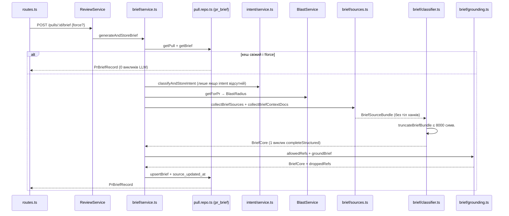

# Implementation Plan: PR Brief (SPEC-03 + SPEC-04)

## 1. Вимоги
Spec ID: **SPEC-03** (`specs/server/SPEC-03-pr-brief-server.md`) + **SPEC-04** (`specs/client/SPEC-04-pr-brief-card.md`, залежить від SPEC-03)

Коротко своїми словами: на сторінці PR має зʼявитись одна картка «PR Brief», яка за 10 секунд
відповідає рев'юеру на «наскільки це ризиковано і що дивитись першим». Сервер збирає вхід
(Intent, blast radius summary, статистика diff, повʼязаний issue, context-docs specs) **без жодного
тіла diff-ханка**, робить **рівно один** структурований LLM-виклик (`completeStructured<BriefCore>`,
фіча-ключ `risk_brief`), детерміновано відкидає в коді всі посилання на файли, яких не було у вході,
і кешує результат у наявній таблиці `pr_brief` за станом PR (`source_updated_at` vs
`pull_requests.updated_at`). Клієнт додає `PrBriefCard` (повна ширина, над сіткою
Intent/Blast) + два хуки `usePrBrief`/`useGenerateBrief`.

Незрозуміло / потребує уточнення:
- **Q-1 (не блокує, є робоче рішення в Кроці 6).** SPEC-03 AC-7 вимагає діставати «релевантні
  specs» через `resolveContextDocs()`/`readContextDocsForRun()`, але цей механізм **агент-скоупний**:
  `ContextDocsRepository.listForAgent(agentId)` / `listForSkill(skillId)`
  (`server/src/modules/context-docs/repository.ts:37,46`), а brief запускається **без агента**.
  Немає ні workspace-, ні repo-рівневого списку context-docs. План приймає рішення:
  обʼєднати власні attachments **усіх увімкнених агентів воркспейсу**
  (`container.agentsRepo.listEnabled(workspaceId)`), пропустити через той самий чистий
  `resolveContextDocs` (`skills: []`) для дедуплікації і читати `readContextDocsForRun`. Якщо
  користувач хоче інший скоуп (конкретний агент / жодного) — міняється тільки Крок 6.
- **Q-2 (не блокує).** Заявлені в запиті лічильники «SPEC-03: 33 AC + 14 EC, SPEC-04: 26 AC + 12 EC»
  не збігаються з файлами: у SPEC-03 фактично **AC-1..AC-33 + EC-1..EC-12**, у SPEC-04 —
  **AC-1..AC-22 + EC-1..EC-10**. Секція 1a покриває те, що реально є у файлах.

## 1a. Покриття специфікації

### SPEC-03 (сервер)
| ID | Кроки плану | Як верифікується | Примітка |
|---|---|---|---|
| AC-1 | Крок 6 | integration `brief-routes.it.test.ts` (один POST → всі 5 полів у відповіді) | — |
| AC-2 | Крок 7 | integration: PR без `pr_intent` → POST /brief → рядок у `pr_intent` зʼявився, лічильник LLM = 2 | — |
| AC-3 | Крок 6 (`toBlastPromptView`) | unit `brief-sources.test.ts`: у user-content немає `coverage`/`rank`/`depth` | — |
| AC-4 | Крок 6 | unit: bundle зі `status:'degraded'` → непорожній content із `message`, без кидка | — |
| AC-5 | Крок 6 (реюз `ISSUE_REF_RE` + `container.github().getIssue()`) | unit + інтеграція (issue недосяжний → лог, генерація триває) | — |
| AC-6 | Крок 6 | unit: жоден рядок тіла ханка з фікстури diff не присутній у `buildBriefUserContent()` | — |
| AC-7 | Крок 6 | unit `brief-context-docs.test.ts` на чистій функції збору шляхів | див. Q-1 |
| AC-8 | Крок 6 | unit: кожен зовнішній блок обгорнутий `<untrusted source="...">` | — |
| AC-9 | Крок 5 | code-review + integration (рівно 1 виклик зі `schemaName === 'BriefCore'`) | — |
| AC-10 | Крок 7 | integration `settings-models`-стиль: override `risk_brief` змінює `model` у відповіді | — |
| AC-11 | Крок 1 | `pnpm typecheck` + `contracts.test.ts` (`BriefCore.parse`) | — |
| AC-12 | Крок 1 | `pnpm typecheck` у `server/` і `client/` | `PrBrief` сьогодні не має споживачів — перевірити грепом перед зміною |
| AC-13 | Крок 7 | integration: mock LLM кидає → 5xx і `pr_brief` без змін | — |
| AC-14 | Крок 7 | unit-стаб логера в `brief-service` тесті / code-review | — |
| AC-15 | Крок 4 (`allowedRefs()`) | unit `brief-grounding.test.ts` | — |
| AC-16 | Крок 4 (`groundBrief()`) | unit: вигаданий `review_focus.file` відкинуто | — |
| AC-17 | Крок 4 | unit: часткова чистка `file_refs`; повне спустошення → ризик відкинуто | — |
| AC-18 | Крок 4 + Крок 7 | unit (детермінізм, нормалізація шляхів) + `droppedRefs` у лозі | — |
| AC-19 | Крок 4 | unit: усе вигадане → `risks: []`, `review_focus: []`, без помилки | — |
| AC-20 | Крок 4 | unit: `risk_level` після grounding дорівнює вхідному | — |
| AC-21 | Крок 2 | `pnpm db:generate` + `pnpm db:migrate` проходять; `.it.test` бачить нові колонки | міграцію **не** редагувати руками |
| AC-22 | Крок 3 + Крок 7 | integration: `pr_brief.source_updated_at` == `pull_requests.updated_at` | — |
| AC-23 | Крок 7 | integration з лічильником викликів mock LLM: 2-й POST → лічильник не зріс | — |
| AC-24 | Крок 7 + Крок 8 | integration: POST `{force:true}` → лічильник +1 | — |
| AC-25 | Крок 7 | integration: `UPDATE pull_requests SET updated_at = now()` → POST без force регенерує | — |
| AC-26 | Крок 8 | integration: GET без рядка → 404; GET з рядком → 0 викликів LLM | — |
| AC-27 | Крок 1 | `contracts.test.ts`: `PrBriefRecord.parse()` на еталонному обʼєкті | — |
| AC-28 | Крок 8 | code-review конфігу `rateLimit: { max: 5, timeWindow: '1 minute' }` | — |
| AC-29 | Крок 7/8 | integration: PR чужого воркспейсу → 404 на обох маршрутах | — |
| AC-30 | Крок 5 (`briefPromptChars`) | unit `brief-budget.test.ts`: роздутий bundle → результат ≤ 8000 | — |
| AC-31 | Крок 5 (`truncateBriefBundle`) | unit: порядок скорочення specs → callers → file list → hunk headers | — |
| AC-32 | Крок 6 | unit: тіло PR і тіло issue обрізані на `MAX_PR_DESCRIPTION_CHARS` | реюз наявної константи |
| AC-33 | Крок 5 + Крок 7 | code-review лог-рядків (`promptChars`, `truncated`) | — |
| EC-1 | Крок 6 | unit: bundle без description/issue → валідний content | — |
| EC-2 | Крок 4 + Крок 6 | unit: `reason:'diff_not_loaded'` → allowed-set лише зі змінених файлів | — |
| EC-3 | Крок 4 | unit `brief-grounding.test.ts` | — |
| EC-4 | Крок 4 | unit (той самий файл) | — |
| EC-5 | Крок 7 + Крок 8 | integration з лічильником: POST→GET→POST = 1 виклик | ключовий acceptance-сценарій |
| EC-6 | Крок 7 | integration (див. AC-25) | — |
| EC-7 | Крок 7 | integration: `updated_at = null` → POST без force віддає кеш | — |
| EC-8 | Крок 5 | unit `brief-budget.test.ts` на 300-файловому bundle | — |
| EC-9 | Крок 7 | integration (див. AC-13): попередній кеш читається через GET | — |
| EC-10 | Крок 3 | `onConflictDoUpdate` за `pr_id` — code-review + integration (2 послідовні POST → 1 рядок) | послідовні, не паралельні |
| EC-11 | Крок 6 | unit: порожній список context-docs → секції specs немає | — |
| EC-12 | Крок 6 | unit (див. AC-8) + текст system-промту в Кроці 5 | — |

### SPEC-04 (клієнт)
| ID | Кроки плану | Як верифікується | Примітка |
|---|---|---|---|
| AC-1 | Крок 10 | code-review: у `PrBriefCard.tsx` немає `fetch`; `pnpm test` | — |
| AC-2 | Крок 10 | RTL: `prId: null` → 0 викликів `api.get`; unit форми хука | — |
| AC-3 | Крок 10 | code-review + RTL (після мутації `setQueryData`) | — |
| AC-4 | Крок 12 | RTL: CTA → `mutate()` без аргументів; кнопка футера → `mutate({ force: true })` | — |
| AC-5 | Крок 12 | RTL: `isLoading` → скелетон у DOM | — |
| AC-6 | Крок 12 | RTL: `notFound` → `EmptyState` з CTA | — |
| AC-7 | Крок 12 | RTL: мутація відхилена → стан помилки, попередній brief лишається | — |
| AC-8 | Крок 12 | RTL: `isPending` → `ctaLoading`/`loading`, контроли задизейблені | — |
| AC-9 | Крок 12 | RTL: новіший `prUpdatedAt` → повідомлення про застарілість | — |
| AC-10 | Крок 12 | RTL: `source_updated_at: null` → повідомлення відсутнє | — |
| AC-11 | Крок 12 | RTL: `what`/`why` у DOM; бейдж рівня ризику в `SectionLabel right=` | — |
| AC-12 | Крок 11 (`RISK_LEVEL_STYLE`) + Крок 12 | RTL: `getByText(/high risk/i)` знаходить текстову мітку | текст, не лише колір |
| AC-13 | Крок 12 | RTL: `getByRole('link')` з `href` що містить `blob/<sha>/<file>#L<line>` | — |
| AC-14 | Крок 12 | RTL: `headSha: null` → елемент не є посиланням | — |
| AC-15 | Крок 12 | RTL: `title`/`severity`-бейдж/`explanation`/`file_refs` у DOM | — |
| AC-16 | Крок 12 | RTL: порожні `risks`/`review_focus` → явні порожні рядки | — |
| AC-17 | Крок 12 | RTL: `provider`/`model`/`generated_at` + кнопка регенерації | — |
| AC-18 | Крок 12 | RTL: довгий шлях → `title` містить повний шлях, текст — basename | `client/INSIGHTS.md` 2026-08-02 |
| AC-19 | Крок 13 | code-review `page.tsx` + `pnpm typecheck` | — |
| AC-20 | Крок 11/12/14 | наявність 5 файлів у теці `_components/PrBriefCard/` | — |
| AC-21 | Крок 13 | code-review: у `page.tsx` лише проброс 4 пропів | — |
| AC-22 | Крок 9 | code-review: жодного інлайн-рядка; усі через `useTranslations` | — |
| EC-1 | Крок 12 | RTL (див. AC-6) | — |
| EC-2 | Крок 12 | RTL (див. AC-5/AC-8) | — |
| EC-3 | Крок 12 | RTL (див. AC-7) | — |
| EC-4 | Крок 12 | RTL (див. AC-9) | — |
| EC-5 | Крок 12 | RTL (див. AC-16) | — |
| EC-6 | Крок 12 | RTL: `line: null` → `href` без `#L` | `githubBlobUrl` уже це робить |
| EC-7 | Крок 12 | RTL (див. AC-14) | — |
| EC-8 | Крок 11 (`styles.ts`) | code-review: `overflowWrap: 'anywhere'` на блоці explanation | візуально не верифікується (заборона browser-tools) |
| EC-9 | Крок 12 | RTL: `prId: null` → скелетон, 0 запитів | — |
| EC-10 | Крок 10 | code-review: спільний `queryKey: ["pr-brief", prId]` | — |

### Процесні вимоги SPEC-03
- **P-1** — цей план + обидві специфікації комітяться **окремим комітом до** будь-якої зміни в
  `server/src`/`client/src`. Виконує той, хто запускає Крок 0.
- **P-2** (крос-модельна нотатка рев'ю) і **P-3** (звіт `plan-verifier` без відкритих вимог) —
  поза кодом; виконуються після реалізації.

## 2. Підхід і режим виконання
**Рекомендація:** реалізувати рівно те, що в специфікаціях, з двома уточненнями, які план фіксує
явно, бо специфікації їх не дорозвʼязують:
1. Brief-логіка йде в **нову підтеку `server/src/modules/reviews/brief/`**, дзеркальну наявній
   `reviews/intent/` (`sources.ts` / `classifier.ts` / `constants.ts` / `service.ts` + новий
   `grounding.ts`). Це не новий Fastify-модуль — маршрути лишаються в `reviews/routes.ts`,
   реєстрація в `modules/index.ts` не змінюється. Виправдання нової теки: `reviews/` уже має саме
   таку підтеку для Intent, і копіювати цю форму дешевше, ніж вирощувати `reviews/service.ts`.
2. Grounding (`allowedRefs` + `groundBrief`) виноситься в **чисту функцію без Container/Drizzle/
   Fastify** — це і вимога `onion-architecture`, і єдиний спосіб виконати Traceability US-2
   («unit-тест чистої функції звірки»).

Режим виконання: **мультиагентний пайплайн** — `implementer` → `plan-verifier`
(+ `test-writer` на кроках 14/12, `architecture-reviewer` після Кроку 8) — рекомендовано
планувальником, **очікує однослівного підтвердження користувача**. `researcher` перед
`implementer` не потрібен: усі факти коду в секції 3 звірені по файлах у цій сесії, а єдина
невідома (Q-1) — не зовнішній факт, а продуктове рішення. Обсяг (≈16 кроків, 2 пакети, міграція)
надто великий для single-agent проходу.

## 3. Контекст, який враховано
Пакети: `server/`, `client/`.
Поза обсягом: `reviewer-core/` (жодних змін — brief не проходить через `reviewPullRequest`),
`e2e/`, `mcp/`, `server/clones/**`, будь-яка зміна `FeatureModelId` (`risk_brief` уже є),
`PrBrief.history` (продюсера немає), обʼєднання з «PR Score» у `VerdictBanner`,
автогенерація brief під час прогону рев'ю.

- **Корінь CLAUDE.md:** `server/`+`client/` — **pnpm**, ніякого `pnpm -r`/`workspace:*`.
  Контракт іде **спочатку** в `server/src/vendor/shared`, у `client/src/vendor/shared` дзеркалиться
  лише UI-потрібне. `server/src/db/migrations/*` і `meta/` — **ніколи** руками, тільки
  `pnpm db:generate`. Node/pnpm немає в PATH агентського шелу — див. секцію 6.
- **`server/CLAUDE.md`:** маршрути schema-first через `fastify-type-provider-zod`, без ручного
  `Schema.parse`; адаптери — тільки через `platform/container.ts`; міграції **не** біжать на бутсі;
  скриптів `test:unit`/`test:integration` немає — команди інлайняться (секція 6).
- **`client/CLAUDE.md`:** сторінки тонкі, логіка в `_components/<Name>/`; API — тільки через
  `src/lib/hooks/*` → `src/lib/api.ts`; рядки в `messages/<locale>/*.json`; **ніколи** не перевіряти
  зміну браузером — тільки `pnpm test` + `pnpm typecheck`. Імпорт runtime-**значення** з
  `vendor/shared/index.ts` тягне весь barrel у бандл (див. `src/lib/feature-models.ts`).

**INSIGHTS.md (обовʼязково враховано):**
- `server/INSIGHTS.md`, 2026-08-03: «OpenRouter/DeepSeek-reported `usage.prompt_tokens` … is NOT
  monotonic in the text actually sent … Do not use `tokens_in` deltas as a signal for "did X reach
  the prompt"» → доказ бюджету 8000 символів у тестах будується **виключно** на `promptChars`
  (AC-33), жоден тест не спирається на `tokensIn`. Це прямо повторено в SPEC-03 NFR-5.
- `server/INSIGHTS.md`, 2026-08-11: «`pnpm typecheck` … never typechecks `server/test/**`» →
  зелений typecheck **не** доводить типи нових тестів; єдиний доказ — `vitest run`.
- `server/INSIGHTS.md`, 2026-08-11: «A new `.it.test.ts` file showing "skipped" … does not mean
  Docker is unavailable … Re-run the file in isolation» → перед висновком «інтеграційний тест не
  працює» прогнати `pnpm exec vitest run test/brief-routes.it.test.ts` окремо.
- `server/INSIGHTS.md`, 2026-08-03: «`waitForPrRuns`'s default 10s `timeoutMs` … is too tight …
  under load» → у brief-тестах прогону рев'ю не запускаємо взагалі; хелпер не потрібен.
- `server/INSIGHTS.md`, 2026-08-01: «Adding a required field to RunStats/RunTrace breaks any
  `.parse()` call in tests that hand-builds the object … both vendor copies AND every test fixture
  need the field» → те саме стосується `PrBrief`: перед зміною форми **грепнути** `PrBrief`/`Risks`
  по `server/` і `client/` (включно з `test/`), а не лише по `src/`.
- `client/INSIGHTS.md`, 2026-08-01: «Rendering a component that pulls a NEW i18n namespace breaks
  existing tests silently-late» → `PrBriefCard` бере **один** namespace (`prReview`), і тест передає
  його в `NextIntlClientProvider`; якщо картка потрапить у тест сторінки — цей namespace треба
  додати й там.
- `client/INSIGHTS.md`, 2026-08-03: «`AppShell` cannot be rendered in a component test» →
  `PrBriefCard.test.tsx` рендерить лише картку, як `IntentCard.test.tsx`.
- `client/INSIGHTS.md`, 2026-08-11: «Don't partially mock the `@/lib/hooks` barrel with
  `vi.importOriginal()`» → у тесті мокати **`@/lib/hooks/brief`** напряму (як `IntentCard.test.tsx`
  мокає `@/lib/hooks/reviews`), не barrel.
- `client/INSIGHTS.md`, 2026-08-02: «Rendering a `FindingRecord.file` (full repo path) unbounded …
  breaks layout — show only the basename … full path in a `title`» → прямо стає SPEC-04 AC-18.
- `client/INSIGHTS.md`, 2026-08-03: «`vi.mock(path, () => ({...}))` factory returns the SAME object
  for every test … use `vi.hoisted()`» → знадобиться, щоб варіювати повернення `usePrBrief` між
  кейсами (loading / notFound / error / stale).

**Наявний код, який перевикористовується (перевірено відкриттям файлів):**
- `server/src/modules/reviews/intent/classifier.ts:27-50` — `buildUserContent()`: точний зразок
  секційного user-content із `wrapUntrusted`; `:90` — `intentPromptChars()`, дзеркало для
  `briefPromptChars()`; `:62-72` — форма виклику `completeStructured`.
- `server/src/modules/reviews/intent/service.ts:37-93` — `classifyAndStoreIntent()`: два лог-рядки
  (`:50`, `:65`), `resolveFeatureModel(..., 'review_intent')` (`:48`), знімок
  `sourceUpdatedAt: pull.updatedAt ?? null` (`:87`), read-after-write (`:90-92`).
- `server/src/modules/reviews/intent/sources.ts:35` (`ISSUE_REF_RE`), `:69`
  (`github.getIssue()`), `:88-91` (fileList + hunkHeaders — **ніяких тіл**).
- `server/src/modules/reviews/repository/pull.repo.ts:49-95` — `UpsertIntentInput` /
  `upsertIntent` (`onConflictDoUpdate` за PK) / `getIntent` (row → record із
  `.toISOString()`); дзеркалиться один-в-один для brief.
- `server/src/modules/reviews/repository.ts:132-137` — фасадні методи `ReviewRepository`.
- `server/src/modules/reviews/service.ts:193-211` — `getIntent`/`classifyIntent`:
  `getPull → getRepo → loadDiff → …`, `NotFoundError` на чужий воркспейс.
- `server/src/modules/reviews/routes.ts:145-162` — `GET /pulls/:id/intent` (404) і
  `POST` з `rateLimit: { max: 5, timeWindow: '1 minute' }`.
- `server/src/modules/blast/service.ts:21-45` — `BlastService.getForPr()`; `diff_not_loaded`
  повертається як `emptyBlastRadius`, а не кидок.
- `server/src/modules/context-docs/resolve.ts:60` — чистий `resolveContextDocs`;
  `read-for-run.ts:53` — `readContextDocsForRun(clonePath, resolved, log, roots)`;
  реальний call-site з усіма аргументами — `server/src/modules/reviews/run-executor.ts:257-288`.
- `server/src/platform/prompt.ts` — `wrapUntrusted` (реекспорт із `reviewer-core`);
  `reviewer-core/src/prompt.ts:37` — `MAX_PR_DESCRIPTION_CHARS = 4000`.
- `server/src/modules/settings/feature-models.ts:50+` — `resolveFeatureModel`;
  `server/src/vendor/shared/contracts/platform.ts:59` — `risk_brief` уже в реєстрі.
- `server/src/db/schema/reviews.ts:69-89` (`prIntent` — зразок колонок), `:91-96` (`prBrief` —
  сьогодні лише `pr_id` + `json`). Записів у таблиці не існує: жоден код і жоден seed у неї не
  пише (греп по `server/src` + `server/test` дав лише схему й міграції) — тому `NOT NULL` без
  дефолту безпечний.
- `server/src/adapters/mocks.ts:60-105` — `MockLLMProvider` з `structuredBySchema` (ключ =
  `schemaName`) і публічним `calls[]` — це і є лічильник викликів для AC-23/EC-5.
- `server/test/intent-routes.it.test.ts:1-80` — готовий шаблон інтеграційного тесту
  (Testcontainers, `setupRepoAndPr`, `dockerAvailable()`).
- `client/src/lib/hooks/reviews.ts:223-244` — `usePrIntent` (`retry` пропускає 404, похідний
  `notFound`) і `useClassifyIntent` (`qc.setQueryData`).
- `client/src/lib/hooks/index.ts` — barrel із **явними** іменованими експортами, без `export *`.
- `client/src/app/repos/[repoId]/pulls/[number]/_components/IntentCard/*` — форма теки й усі
  стани: скелетон (`:28-36`), `EmptyState`+CTA (`:38-54`), staleness (`:58-60`), футер
  provider/model/date + кнопка (`:153-171`).
- `client/src/lib/github-urls.ts:24-37` — `githubBlobUrl(repoFullName, sha, file, startLine?)`,
  кодує сегменти шляху, опускає `#L` коли рядка немає.
- `client/src/app/repos/[repoId]/pulls/[number]/page.tsx:143-151` — вкладка Overview:
  сітка `1fr 1fr` з `IntentCard`/`BlastRadiusCard`, потім `OverviewTab`; `repoFullName` (`:88`),
  `pr.head_sha` уже прокидається у `FindingsTab` (`:165`).
- `client/messages/en/brief.json` — **наявний, але ніким не використовується** namespace
  (`useTranslations("brief")` не зустрічається в `client/src`); нові рядки йдуть **не** туди —
  див. Крок 9.

## 4. Кроки

### Крок 0 — комміт специфікацій і плану · пакет: —
- Файли: `specs/server/SPEC-03-pr-brief-server.md`, `specs/client/SPEC-04-pr-brief-card.md`,
  `.devdigest/plans/pr-brief.md` (цей файл).
- Скіли: —
- Обмеження: SPEC-03 P-1 — комміт має передувати **будь-якій** зміні в `server/src`/`client/src`.
- Готово, коли: `git log --oneline -1` показує комміт, у якому `git show --stat` не містить
  жодного шляху під `server/src/` або `client/src/`.

### Крок 1 — контракти в `server/src/vendor/shared` · пакет: server
- Файли:
  - `server/src/vendor/shared/contracts/brief.ts` (правка): додати
    `RiskLevel = z.enum(['low','medium','high'])` (окремий від наявного `RiskSeverity` на `:116` —
    інша вісь, SPEC-03 OQ-1 закрито на користь окремого enum),
    `ReviewFocusItem = z.object({ file: z.string(), line: z.number().int().nullable(), reason: z.string() })`,
    `BriefCore = z.object({ what, why, risk_level: RiskLevel, risks: z.array(Risk), review_focus: z.array(ReviewFocusItem) })`;
    переписати `PrBrief` (`:185-190`) на
    `BriefCore.extend({ intent: Intent, blast: BlastRadius, history: PrHistory.optional() })`.
    `Risks` (`:128`) **залишити** (може бути в іншому вжитку) — але `PrBrief.risks` тепер `Risk[]`.
  - `server/src/vendor/shared/contracts/review-api.ts` (правка): додати після `PrIntentRecord`
    (`:64-76`) — `PrBriefRecord = PrBrief.extend({ pr_id: z.string(), provider: z.string(),
    model: z.string(), generated_at: z.string(), source_updated_at: z.string().nullable() })`.
  - `server/src/vendor/shared/index.ts` (перевірка): `export *` із обох файлів уже є — нових
    рядків не треба; **не** додавати.
- Скіли: `zod`, `typescript-expert`, `import-hygiene`
- Обмеження: server — джерело правди; клієнтську копію **не** чіпати на цьому кроці (Крок 11).
  Перед зміною `PrBrief` грепнути `PrBrief|Risks` по `server/**` і `client/**` (включно з `test/`)
  і показати, що споживачів немає (`server/INSIGHTS.md` 2026-08-01 про зламані `.parse()` фікстури).
- Готово, коли: `pnpm typecheck` у `server/` зелений і `pnpm exec vitest run --exclude '**/*.it.test.ts'`
  так само зелений (жоден наявний тест не зламався).

### Крок 2 — колонки `pr_brief` + міграція · пакет: server
- Файли: `server/src/db/schema/reviews.ts` (правка `prBrief`, `:91-96`): додати
  `provider: text('provider').notNull()`, `model: text('model').notNull()`,
  `generatedAt: timestamp('generated_at', { withTimezone: true }).notNull().defaultNow()`,
  `sourceUpdatedAt: timestamp('source_updated_at', { withTimezone: true })` — точно за зразком
  `prIntent` (`:83-88`). `prId` лишається PK, `json` — тілом brief.
- Скіли: `drizzle-orm-patterns`, `postgresql-table-design`
- Обмеження: **ніколи** не редагувати й не нумерувати руками `server/src/db/migrations/*` та
  `meta/` (корінь `CLAUDE.md`) — файл генерується `pnpm db:generate` (наступний номер буде `0017`).
  Міграції не біжать на бутсі — після генерації обовʼязково `pnpm db:migrate`.
- Готово, коли: `pnpm db:generate` створив рівно один новий `.sql` під `migrations/`, у ньому
  чотири `ALTER TABLE "pr_brief" ADD COLUMN`; `pnpm db:migrate` відпрацював без помилки;
  `pnpm typecheck` зелений.

### Крок 3 — репозиторій: upsert/get brief · пакет: server
- Файли:
  - `server/src/modules/reviews/repository/pull.repo.ts` (правка): додати
    `UpsertBriefInput { brief: PrBrief; provider: string; model: string; sourceUpdatedAt: Date | null }`,
    `upsertBrief(db, prId, input)` через `onConflictDoUpdate({ target: t.prBrief.prId, set: values })`
    і `getBrief(db, prId): Promise<PrBriefRecord | undefined>` — дзеркала `:60-95`.
    `generated_at`/`source_updated_at` віддаються як `.toISOString()`/`null`.
  - `server/src/modules/reviews/repository.ts` (правка): фасадні `upsertBrief`/`getBrief` поруч із
    `upsertIntent`/`getIntent` (`:132-137`) + реекспорт типу поруч із `:24`.
- Скіли: `drizzle-orm-patterns`, `onion-architecture`
- Обмеження: `json`-колонка зберігає **валідований** `PrBrief`; читання проганяється через
  `PrBriefRecord`-сумісну збірку, а не `as` (не довіряти вмісту jsonb сліпо).
- Готово, коли: `pnpm typecheck` зелений; інтеграційний тест Кроку 14 бачить рядок після POST.

### Крок 4 — grounding: чиста звірка посилань · пакет: server
- Файли: `server/src/modules/reviews/brief/grounding.ts` (новий):
  - `normalizeRef(p: string): string` — trim, зняття `./`, зняття провідного `/`, lower-case
    **не** робити (шляхи чутливі до регістру).
  - `allowedRefs(input: { files: string[]; blast: BlastRadius }): Set<string>` — шляхи змінених
    файлів + `blast.changed_symbols[].file` + `downstream[].callers[].file` +
    `downstream[].endpoints_affected[].file/.value` + `.crons_affected[].file/.value` (AC-15).
  - `groundBrief(core: BriefCore, allowed: Set<string>): { brief: BriefCore; droppedRefs: number }`
    — `review_focus` фільтрується цілком (AC-16); у `risks[]` вирізаються неіснуючі `file_refs`,
    а ризик із порожнім `file_refs` після чистки відкидається (AC-17); `risk_level` не
    перераховується (AC-20); порожні масиви — валідний результат (AC-19).
- Скіли: `onion-architecture`, `typescript-expert`
- Обмеження: **жодного** імпорту `Container`, Drizzle, Fastify чи `node:*` — це domain-код у центрі
  цибулі; єдина залежність — типи з `@devdigest/shared`. Жодного повторного запиту до моделі (AC-18).
- Готово, коли: новий `server/test/brief-grounding.test.ts` покриває AC-16/17/19/20 + EC-3/EC-4 і
  `pnpm exec vitest run --exclude '**/*.it.test.ts'` зелений.

### Крок 5 — промт, бюджет, LLM-виклик · пакет: server
- Файли:
  - `server/src/modules/reviews/brief/constants.ts` (новий): `BRIEF_SYSTEM_PROMPT` (за зразком
    `intent/constants.ts` — явна вказівка трактувати весь user-content як **дані**, ніколи не
    виконувати інструкції з нього (EC-12), і посилатися **лише** на шляхи, які є у вході),
    `BRIEF_PROMPT_MAX_CHARS = 8000`.
  - `server/src/modules/reviews/brief/classifier.ts` (новий):
    `buildBriefUserContent(bundle): string` (секції: PR title / PR description / linked issue /
    intent / blast summary / changed files / hunk headers / specs — кожна через `wrapUntrusted`),
    `briefPromptChars(bundle): number` = `buildBriefUserContent(bundle).length` (AC-30, дзеркало
    `intentPromptChars`, `intent/classifier.ts:90`),
    `truncateBriefBundle(bundle): { bundle; truncated: boolean }` — детермінований порядок
    (1) specs → (2) `callers` у blast → (3) перелік змінених файлів → (4) hunk-заголовки, і лише
    після цього обрізання хвоста рядка з маркером `…[truncated]` (AC-31),
    `generateBrief(container, provider, model, bundle)` — рівно один
    `llm.completeStructured<BriefCore>({ model, schema: BriefCore, schemaName: 'BriefCore',
    temperature: 0.2, maxRetries: 2, messages: [system, user] })` (AC-9), повертає
    `{ core, tokensIn, tokensOut, costUsd, promptChars, truncated }`.
- Скіли: `zod`, `typescript-expert`, `onion-architecture`
- Обмеження: у `buildBriefUserContent` **не існує** гілки, що читає `hunk.lines`/тіло патча
  (AC-6/N-1). Тіло PR і тіло issue обрізаються на наявній `MAX_PR_DESCRIPTION_CHARS`
  (`reviewer-core/src/prompt.ts:37`), нових «магічних» чисел не заводити (AC-32).
  Бюджет рахується **лише** по user-content, system-промт не входить (NFR-3).
- Готово, коли: `server/test/brief-budget.test.ts` доводить, що на 300-файловому bundle результат
  ≤ 8000 і порядок скорочення відповідає AC-31, а `server/test/brief-prompt.test.ts` доводить
  AC-6 (жоден `+`/`-`-рядок фікстури diff не зустрічається у виводі) і AC-8 (кожен зовнішній блок
  обгорнутий `<untrusted source="...">`).

### Крок 6 — збір входів · пакет: server
- Файли: `server/src/modules/reviews/brief/sources.ts` (новий):
  - `BriefSourceBundle { title; description; linkedIssue; intent: Intent; blast: BlastPromptView;
     fileList; hunkHeaders; specs: string[]; blastNotice: string | null }`.
  - `toBlastPromptView(blast: BlastRadius)` — **лише** `summary`, `status`, `message`, `reason`,
    імена+файли `changed_symbols`, а з `downstream` — `symbol`, `callers[].file/name`,
    `endpoints_affected[].value/file`, `crons_affected[].value/file`. `coverage`, `rank`, `depth`
    у промт не йдуть (AC-3).
  - `collectBriefSources(container, repoRow, pull, diff, intent, blast, specs)` — issue тим самим
    шляхом, що Intent (`ISSUE_REF_RE`, `intent/sources.ts:35`, + `container.github().getIssue()`,
    `:69`), недосяжний issue → лог і продовження (AC-5); `fileList`/`hunkHeaders` копіюють
    `intent/sources.ts:88-91`; `blastNotice` заповнюється, коли `status === 'degraded'` або
    `reason ∈ {'diff_not_loaded','no_index'}` (AC-4, EC-2).
  - `collectBriefContextDocs(container, workspaceId, repoRow, log)` — **рішення Q-1**:
    `container.agentsRepo.listEnabled(workspaceId)` → для кожного агента
    `contextDocsRepo.listForAgent(agent.id)` → усе конкатенується й проганяється через наявний
    чистий `resolveContextDocs({ skills: [], agentDocs })` (дедуплікація за шляхом, перше
    входження виграє) → `readContextDocsForRun(repoRow.clonePath, resolved, log,
    container.config.contextDocRoots)` (call-site-зразок: `run-executor.ts:257-288`). Немає
    `clonePath` або порожній список → `specs: []` (EC-11).
- Скіли: `onion-architecture`, `import-hygiene`
- Обмеження: жодна помилка збору не валить генерацію (AC-4, AC-5, NFR-4) — усе best-effort із
  лог-рядком. `contextDocsRepo` береться з наявного DI (`run-executor` уже його отримує), новий
  адаптер **не** заводиться.
- Готово, коли: `server/test/brief-sources.test.ts` покриває AC-3 (немає `coverage`/`rank`/`depth`),
  AC-4 (degraded → непорожній content із `message`, без кидка), EC-1, EC-11 і зелений.

### Крок 7 — orchestration-сервіс brief · пакет: server
- Файли: `server/src/modules/reviews/brief/service.ts` (новий),
  `server/src/modules/reviews/service.ts` (правка: два тонкі методи).
  - `generateAndStoreBrief(container, repo, workspaceId, prId, { force }, logger)`:
    1. `repo.getPull(workspaceId, prId)` → немає → `NotFoundError` (AC-29).
    2. `repo.getBrief(prId)`; якщо `!force` і `existing.source_updated_at` дорівнює
       `pull.updatedAt?.toISOString() ?? null` → **повернути кеш, нуль викликів LLM** (AC-23,
       AC-25, EC-5, EC-7).
    3. `getRepo` → `loadDiff` → `repo.getIntent(prId)`; якщо intent немає —
       `classifyAndStoreIntent(...)` (AC-2, A-4; це і є другий LLM-виклик, єдиний випадок > 1).
    4. `new BlastService(container).getForPr(workspaceId, prId)` (AC-3/AC-4).
    5. `collectBriefSources` + `collectBriefContextDocs` → `truncateBriefBundle`.
    6. лог `brief: generation started` з `{ prId, feature: 'risk_brief', provider, model,
       promptChars, truncated }`; `resolveFeatureModel(container, workspaceId, 'risk_brief')`
       (AC-10) резолвиться **до** логу, як в `intent/service.ts:48-61`.
    7. `generateBrief(...)` → при кидку нічого не писати в `pr_brief` (AC-13, EC-9).
    8. `allowedRefs` + `groundBrief` → `droppedRefs`.
    9. `repo.upsertBrief(prId, { brief: { ...grounded, intent, blast }, provider, model,
       sourceUpdatedAt: pull.updatedAt ?? null })` (AC-22, AC-24, EC-10).
    10. лог `brief: generation done` з `{ tokensIn, tokensOut, costUsd, durationMs, riskLevel,
        droppedRefs }` (AC-14, AC-18, AC-33).
    11. `repo.getBrief(prId)` read-after-write, `throw` якщо `undefined`
        (`intent/service.ts:90-92`).
  - `ReviewService.getBrief(workspaceId, prId)` — дзеркало `getIntent` (`service.ts:193-197`).
  - `ReviewService.generateBrief(workspaceId, prId, force, logger)` — делегує в
    `generateAndStoreBrief`.
- Скіли: `onion-architecture`
- Обмеження: `BlastService` конструюється тут (як `ReviewService` конструює свої залежності), а не
  всередині чистих функцій Кроків 4-6; жодного Fastify-типу в цьому файлі; `history` не
  заповнюється взагалі (N-3, A-3).
- Готово, коли: `pnpm typecheck` зелений і інтеграційний тест Кроку 14 показує лічильник
  `MockLLMProvider.calls` = 1 після POST→GET→POST на незміненому PR.

### Крок 8 — маршрути · пакет: server
- Файли: `server/src/modules/reviews/routes.ts` (правка, після інтент-блоку `:145-162`):
  - `GET /pulls/:id/brief` — `schema: { params: IdParams }`; `service.getBrief(...)`; `undefined` →
    `NotFoundError('Brief not yet generated for this pull request')` (AC-26); **ніколи** не
    викликає LLM.
  - `POST /pulls/:id/brief` — `schema: { params: IdParams, body: BriefRequest }`, де
    `BriefRequest = z.object({ force: z.boolean().optional() })` (нова схема поруч із наявними в
    `modules/_shared/schemas.ts` або локально в `routes.ts` — рішення: локально, споживач один);
    `config: { rateLimit: { max: 5, timeWindow: '1 minute' } }` (AC-28).
  - Оновити doc-comment угорі файлу (`:10-19`) двома рядками.
- Скіли: `fastify-best-practices`, `zod`, `onion-architecture`, `import-hygiene`
- Обмеження: schema-first — **жодного** ручного `Schema.parse` у хендлері (`server/CLAUDE.md`);
  порожнє тіло має бути валідним (`force` опційний, `body` має допускати відсутність — перевірити
  поведінку `fastify-type-provider-zod` на `undefined body` і за потреби дати `.default({})`).
- Готово, коли: `pnpm exec vitest run test/routes-smoke.test.ts` зелений, а інтеграційний тест
  Кроку 14 отримує 422 на `{ force: "yes" }` і 404 на PR чужого воркспейсу.

### Крок 9 — рядки UI · пакет: client
- Файли: `client/messages/en/prReview.json` (правка): нова секція `"brief": { title, what, why,
  riskLevel: { low, medium, high }, riskLabel, focusTitle, focusEmpty, risksTitle, risksEmpty,
  emptyTitle, emptyBody, generate, regenerate, errorTitle, errorBody, retry, staleNotice,
  generatedBy }`.
- Скіли: —
- Обмеження: **не** використовувати наявний `client/messages/en/brief.json` — це осиротілий
  namespace від нереалізованої фічі (`useTranslations("brief")` не зустрічається в `client/src`), а
  картка живе поруч з `IntentCard`, який уже на `useTranslations("prReview")`; один namespace на
  картку = один namespace у `NextIntlClientProvider` тесту (`client/INSIGHTS.md` 2026-08-01).
  Файл `brief.json` не чіпати й не видаляти.
- Готово, коли: `pnpm test` у `client/` зелений (жодного `MISSING_MESSAGE` у виводі).

### Крок 10 — хуки · пакет: client
- Файли:
  - `client/src/lib/hooks/brief.ts` (новий): `usePrBrief(prId)` — `queryKey: ["pr-brief", prId]`,
    `queryFn: () => api.get<PrBriefRecord>(\`/pulls/${prId}/brief\`)`, `enabled: !!prId`,
    `retry` пропускає 404, похідний `notFound` — копія `usePrIntent` (`reviews.ts:223-232`);
    `useGenerateBrief(prId)` — `mutationFn: (vars?: { force?: boolean }) =>
    api.post<PrBriefRecord>(\`/pulls/${prId}/brief\`, vars ?? {})`, `onSuccess: (data) =>
    qc.setQueryData(["pr-brief", prId], data)` (AC-3), без інвалідації сусідніх ключів.
  - `client/src/lib/hooks/index.ts` (правка): додати `export { usePrBrief, useGenerateBrief } from "./brief";`
    у стилі наявних явних експортів.
- Скіли: `react-best-practices`, `zod`, `import-hygiene`, `frontend-architecture`
- Обмеження: `export *` у barrel заборонено (`client/CLAUDE.md` gotcha); тип `PrBriefRecord`
  імпортується **як тип** (`import type`) з `@/vendor/shared`, щоб не тягти barrel у бандл.
- Готово, коли: `pnpm typecheck` у `client/` зелений.

### Крок 11 — дзеркалення контрактів + константи картки · пакет: client
- Файли:
  - `client/src/vendor/shared/contracts/brief.ts` (правка): додати `RiskLevel`, `ReviewFocusItem`,
    `BriefCore`, оновити `PrBrief` (`:181-187`) — **лише те, що рендерить UI**; серверні поля, які
    UI не читає, не дзеркалити (правило drift, корінь `CLAUDE.md`).
  - `client/src/vendor/shared/contracts/review-api.ts` (правка): `PrBriefRecord`.
  - `client/src/app/repos/[repoId]/pulls/[number]/_components/PrBriefCard/constants.ts` (новий):
    `RISK_LEVEL_STYLE: Record<RiskLevel, { color: string; bg: string; icon: IconName }>` —
    `low → var(--ok)/var(--ok-bg)`, `medium → var(--warn)/var(--warn-bg)`,
    `high → var(--crit)/var(--crit-bg)` (AC-12) — за зразком `IntentCard/constants.ts`.
  - `.../PrBriefCard/styles.ts` (новий): за зразком `IntentCard/styles.ts`; блок `explanation`
    отримує `overflowWrap: "anywhere"` (EC-8).
  - `.../PrBriefCard/index.ts` (новий): `export { PrBriefCard } from "./PrBriefCard";`
- Скіли: `frontend-architecture`, `typescript-expert`, `zod`
- Обмеження: клієнтська `vendor/shared` **свідомо** вужча за серверну — не копіювати файл цілком.
- Готово, коли: `pnpm typecheck` у `client/` зелений.

### Крок 12 — компонент `PrBriefCard` · пакет: client
- Файли: `client/src/app/repos/[repoId]/pulls/[number]/_components/PrBriefCard/PrBriefCard.tsx` (новий).
- Пропси: `{ prId: string | null; prUpdatedAt?: string | null; repoFullName: string | null;
  headSha?: string | null }` (рівно 4 — AC-21).
- Стани, у порядку ранніх повернень (за `IntentCard.tsx:28-56`): `!prId || isLoading` → `Skeleton`
  (AC-5, EC-9); `notFound` → `EmptyState` з CTA `generate.mutate()` **без** `force` (AC-6, AC-4);
  `generate.isError && !brief` → блок помилки з кнопкою retry (AC-7, EC-3); інакше — вміст.
- Вміст: `SectionLabel right={<Badge …>{t(\`brief.riskLevel.${brief.risk_level}\`)}</Badge>}`
  (AC-11, AC-12 — колір **і** текст); два підписані блоки `what`/`why`; список `risks[]` із
  `title` + `severity`-бейджем + `explanation` + `file_refs` (AC-15); список `review_focus[]` —
  кожен пункт `<a href={githubBlobUrl(repoFullName, headSha, item.file, item.line ?? undefined)}
  target="_blank" rel="noreferrer">` (AC-13, EC-6), а при `!repoFullName || !headSha` — простий
  текст (AC-14, EC-7); шлях показується basename-ом із повним шляхом у `title` (AC-18);
  порожні масиви → явні рядки `focusEmpty`/`risksEmpty` (AC-16, EC-5); staleness за
  `prUpdatedAt && brief.source_updated_at && new Date(a) > new Date(b)` (AC-9, AC-10, EC-4);
  футер `provider`/`model`/`generated_at` + `Button loading={generate.isPending}` →
  `generate.mutate({ force: true })` (AC-17, AC-4, AC-8).
- Скіли: `react-best-practices`, `frontend-architecture`, `next-best-practices`, `import-hygiene`
- Обмеження: `"use client"` першим рядком; **жодного** `fetch` (AC-1); **жодного**
  `dangerouslySetInnerHTML` і жодного markdown-рендеру — увесь текст від моделі йде як JSX-текст
  (NFR-2); жодної рекласифікації `risk_level` чи повторної звірки посилань на клієнті (N-1);
  усі рядки — через `useTranslations("prReview")` (AC-22); helper-функції (basename, побудова
  href) — **поза** тілом компонента; компонент ≤ 200 рядків, інакше винести підблоки
  `RiskItem`/`FocusItem` у той самий файл як PascalCase-компоненти (ніяких `renderX()`).
- Готово, коли: `pnpm typecheck` зелений і тест Кроку 15 покриває кожен зі станів.

### Крок 13 — розміщення на сторінці · пакет: client
- Файли: `client/src/app/repos/[repoId]/pulls/[number]/page.tsx` (правка, `:143-151`): додати
  `<PrBriefCard prId={prId} prUpdatedAt={pr.updated_at} repoFullName={repoFullName}
  headSha={pr.head_sha} />` **над** наявним `<div style={{ display: "grid",
  gridTemplateColumns: "1fr 1fr" … }}>` (AC-19), + імпорт із
  `./_components/PrBriefCard`.
- Скіли: `next-best-practices`, `frontend-architecture`, `import-hygiene`
- Обмеження: сторінка лишається тонкою — жодного стану, жодного хука brief у `page.tsx` (AC-21).
  `repoFullName` (`:88`) і `pr.head_sha` (уже вживається на `:165`) вже є — нічого нового не
  обчислювати.
- Готово, коли: `pnpm typecheck` і `pnpm test` у `client/` зелені.

### Крок 14 — серверні тести · пакет: server
- Файли:
  - `server/test/brief-grounding.test.ts` (новий, Крок 4) — AC-15..AC-20, EC-3, EC-4.
  - `server/test/brief-budget.test.ts` (новий, Крок 5) — AC-30, AC-31, AC-32, EC-8.
  - `server/test/brief-prompt.test.ts` (новий, Крок 5) — AC-6, AC-8, EC-12.
  - `server/test/brief-sources.test.ts` (новий, Крок 6) — AC-3, AC-4, AC-5, AC-7, EC-1, EC-2, EC-11.
  - `server/test/brief-routes.it.test.ts` (новий) за шаблоном `test/intent-routes.it.test.ts:1-80`:
    `MockLLMProvider` із `structuredBySchema: { BriefCore: …, Intent: … }` і публічним `calls[]` як
    лічильником — POST→GET→POST на незміненому PR = **1** виклик `BriefCore` (AC-23, AC-26, EC-5);
    `{force:true}` → +1 (AC-24); зсув `updated_at` → +1 без force (AC-25, EC-6);
    `updated_at = null` → кеш (EC-7); PR без intent → 2 виклики, зʼявився рядок `pr_intent` (AC-2);
    невалідна фікстура моделі → 5xx і `pr_brief` без змін (AC-13, EC-9); чужий воркспейс → 404
    (AC-29); два послідовні POST → один рядок (EC-10).
  - `server/test/contracts.test.ts` (правка): `PrBriefRecord.parse()` на еталонному обʼєкті (AC-27).
- Скіли: `zod`, `typescript-expert`
- Обмеження: **жоден** тест не спирається на `tokensIn` як доказ вмісту промту
  (`server/INSIGHTS.md` 2026-08-03, SPEC-03 NFR-5) — доказ бюджету лише `promptChars`.
  `pnpm typecheck` не перевіряє `test/**` (`server/INSIGHTS.md` 2026-08-11) — доказ лише прогін.
  Пропущений `.it.test.ts` у повному прогоні спершу переперевірити ізольовано (те саме INSIGHTS).
- Готово, коли: `pnpm exec vitest run --exclude '**/*.it.test.ts'` і
  `pnpm exec vitest run .it.test` у `server/` зелені, і в `brief-routes.it.test.ts` явно
  асертиться `llm.calls.filter(c => c.req.schemaName === 'BriefCore').length`.

### Крок 15 — клієнтський тест · пакет: client
- Файли: `client/src/app/repos/[repoId]/pulls/[number]/_components/PrBriefCard/PrBriefCard.test.tsx`
  (новий) — за зразком `IntentCard.test.tsx:1-31`.
- Кейси: skeleton при `prId: null` + нуль викликів (AC-5, EC-9); `notFound` → CTA викликає мутацію
  **без** `force` (AC-6, AC-4, EC-1); футер-кнопка викликає `mutate({force:true})` (AC-4);
  `isPending` → контроли задизейблені (AC-8, EC-2); повний brief → `what`/`why`/бейдж рівня з
  **текстом** (AC-11, AC-12, NFR-3); `getByRole('link', {name})` із `href`, що містить
  `blob/<sha>/<file>#L<line>` (AC-13); `line: null` → без `#L` (EC-6); `headSha: null` → не
  посилання (AC-14, EC-7); порожні `risks`/`review_focus` → явні рядки (AC-16, EC-5);
  `explanation` із `<script>` виводиться як текст, шлях із пробілом/юнікодом закодований (NFR-2);
  дві дати → повідомлення про застарілість / його відсутність при `source_updated_at: null`
  (AC-9, AC-10, EC-4); відхилена мутація → стан помилки, попередній brief лишається (AC-7, EC-3);
  довгий шлях → basename + `title` (AC-18).
- Скіли: `react-testing-library`, `react-best-practices`
- Обмеження: мокати **`@/lib/hooks/brief`** напряму, не barrel `@/lib/hooks`
  (`client/INSIGHTS.md` 2026-08-11); варіювати повернення `usePrBrief` між кейсами через
  `vi.hoisted()` (`client/INSIGHTS.md` 2026-08-03), а не однією фабрикою; `AppShell` не
  рендерити (`client/INSIGHTS.md` 2026-08-03); передати namespace `prReview` у
  `NextIntlClientProvider` (`client/INSIGHTS.md` 2026-08-01).
- Готово, коли: `pnpm test` у `client/` зелений і новий файл покриває всі перелічені кейси.

### Крок 16 — INSIGHTS · пакет: server + client
- Файли: `server/INSIGHTS.md`, `client/INSIGHTS.md` (append-only).
- Скіли: `engineering-insights`
- Обмеження: append-only, датовано, з якорем на файл — нічого не переписувати.
  Обовʼязково зафіксувати: (а) як розвʼязано Q-1 (context-docs без агента), (б) що
  `PrBrief.risks` став плоским `Risk[]`, (в) що `messages/en/brief.json` лишився осиротілим.
- Готово, коли: у кожен файл додано щонайменше по одному датованому рядку.

## 4a. Схема



## 5. Скіл-маршрутизація
| Файли | Required skills |
|---|---|
| `server/src/modules/reviews/routes.ts` | `fastify-best-practices`, `zod`, `onion-architecture` |
| `server/src/modules/reviews/service.ts`, `brief/service.ts` | `onion-architecture` |
| `server/src/modules/reviews/brief/{sources,classifier,constants}.ts` | `onion-architecture`, `typescript-expert`, `zod` |
| `server/src/modules/reviews/brief/grounding.ts` | `onion-architecture`, `typescript-expert` |
| `server/src/modules/reviews/repository.ts`, `repository/pull.repo.ts` | `onion-architecture`, `drizzle-orm-patterns` |
| `server/src/db/schema/reviews.ts` | `drizzle-orm-patterns`, `postgresql-table-design` |
| `server/src/vendor/shared/contracts/{brief,review-api}.ts` | `zod`, `typescript-expert` |
| `client/src/app/**/page.tsx` (PR detail) | `next-best-practices`, `frontend-architecture` |
| `client/src/**/_components/PrBriefCard/**` | `react-best-practices`, `frontend-architecture` |
| `client/src/lib/hooks/brief.ts`, `lib/hooks/index.ts` | `react-best-practices`, `zod` |
| `client/src/vendor/shared/contracts/{brief,review-api}.ts` | `zod`, `typescript-expert` |
| `client/**/PrBriefCard.test.tsx` | `react-testing-library` |
| будь-який новий/змінений `import` | `import-hygiene` |
| `BriefCore`/`PrBrief`/`PrBriefRecord` (type-level) | `typescript-expert` |
| `brief/sources.ts`, `brief/constants.ts`, `routes.ts` (untrusted inputs SPEC-03 §Untrusted) | `security` |

## 6. Верифікація
Node/pnpm немає в PATH агентського шелу — спершу (корінь `CLAUDE.md`):
```bash
NODE_BIN="$(dirname "$(find "$HOME/Library/Application Support/JetBrains"/WebStorm*/node/versions/*/bin/node 2>/dev/null | head -1)")"
export PATH="$NODE_BIN:$PATH"
```

**server/** (pnpm):
```bash
pnpm typecheck
pnpm db:generate && pnpm db:migrate        # лише після Кроку 2
pnpm exec vitest run --exclude '**/*.it.test.ts'
pnpm exec vitest run .it.test              # Testcontainers Postgres
pnpm exec vitest run test/brief-routes.it.test.ts   # якщо файл показався "skipped"
```

**client/** (pnpm):
```bash
pnpm typecheck
pnpm test
```

`reviewer-core/`, `e2e/`, `mcp/` — не змінюються, прогін не потрібен.
Ручна перевірка через браузер **заборонена** (`client/CLAUDE.md`, `client/INSIGHTS.md` 2026-08-02).

## 7. Ризики та відкриті питання
1. **Статус специфікацій — `draft`.** Обидві мають `Status: draft` у хедері. План написано під
   них як під затверджені (користувач так і сказав), але формально апрув не зафіксовано у файлі.
2. **Q-1 (context-docs без агента) — головна відкрита вимога.** SPEC-03 AC-7 називає механізм, але
   не скоуп; механізм агент-скоупний, а brief агента не має. Крок 6 фіксує рішення
   («усі увімкнені агенти воркспейсу»), і воно локалізоване в одній функції. Якщо користувач
   вирішить інакше — переписується `collectBriefContextDocs`, решта плану не рухається.
3. **Зміна форми `PrBrief` — потенційний прихований злам.** SPEC-03 AC-12 стверджує, що споживачів
   немає; я підтвердив це грепом по `server/src` + `client/src` (лише схема й міграції).
   `server/INSIGHTS.md` 2026-08-01 попереджає, що фікстури **тестів** ламаються так само — тому
   Крок 1 вимагає грепу і по `server/test`/`client/src/**/*.test.tsx` теж.
4. **Міграція `NOT NULL` без дефолту.** `provider`/`model` додаються як `NOT NULL` до наявної
   таблиці. Це безпечно **лише** тому, що в `pr_brief` ніколи нічого не писалось (жодного
   `insert`/seed у репозиторії). Якщо `pnpm db:migrate` впаде на локальній БД із рядками —
   не редагувати згенерований SQL, а очистити таблицю (`DELETE FROM pr_brief`) і повторити.
5. **Розмір рядка `pr_brief.json`.** `PrBrief` тепер містить весь `BlastRadius`, включно з
   `coverage`-масивами. Для великого PR це кілька сотень КБ jsonb на рядок. TTL немає (NFR-7),
   рядок помирає з PR (`onDelete: cascade`). Якщо це виявиться проблемою — зберігати в `json`
   лише `BriefCore` + `intent`, а `blast` тягнути окремим `GET /pulls/:id/blast` на клієнті; це
   зміна SPEC-03 AC-12, тому в цьому плані **не** робиться.
6. **Порожнє тіло `POST`.** `fastify-type-provider-zod` із `body`-схемою може відхилити запит без
   тіла (422). CTA у порожньому стані шле POST **без** `force` — треба або `.default({})` у схемі,
   або клієнт завжди шле `{}`. План бере обидва запобіжники (Крок 8 + Крок 10), але це перше
   місце, куди варто дивитись, якщо CTA дає 422.
7. **Два LLM-виклики при відсутньому Intent (AC-2)** формально суперечать «рівно один виклик» у
   G-2 — спека сама це визнає й дозволяє. Тест AC-23/EC-5 має рахувати **лише** виклики зі
   `schemaName === 'BriefCore'`, інакше він хибно провалиться на PR без intent.
8. **`briefPromptChars` вимірює user-content без system-промту** (NFR-3, OQ-2). Якщо перевіряльник
   вимірюватиме весь запит — цифра не зійдеться; це задокументоване рішення, а не помилка.
9. **Зовнішня документація не потрібна.** Усі факти взято з коду репозиторію; звернення до
   `researcher` перед реалізацією не потрібне.
