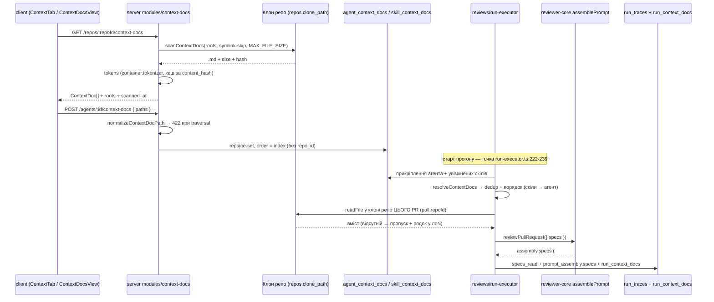

# Implementation Plan: Project Context (SPEC-01 + SPEC-02)

## 1. Вимоги

**Spec ID:** `SPEC-01` — `specs/server/SPEC-01-project-context-server.md` (approved, 35 AC / 18 EC)
**Spec ID:** `SPEC-02` — `specs/client/SPEC-02-project-context-ui.md` (approved, 48 AC / 16 EC, `Depends on: SPEC-01`)

Своїми словами: користувач вручну прикріплює `.md` документи репозиторію до **агента** і до **скіла**; сервер сканує клон під конфігурованими коренями (`specs`, `docs`, `insights`), віддає список з метаданими й приблизними токенами, зберігає в БД **лише шляхи + порядок** (без `repo_id`), а перед кожним прогоном читає ці файли з клону репо, якому належить PR, і подає їх у наявний слот `specs` `reviewPullRequest` → секція `## Project context` з `wrapUntrusted`. Trace фіксує `specs_read` і `prompt_assembly.specs`. UI отримує read-only сторінку `/repos/:repoId/context`, вкладку `Context` у редакторах агента й скіла, і підпис секції в Prompt Assembly.

`reviewer-core/` **не змінюється** — слот наскрізний уже сьогодні (`reviewer-core/src/review/run.ts:59` `specs?: string[]` → `reviewer-core/src/prompt.ts:103-105` → `prompt.ts:126` `## Project context`; `wrapUntrusted` + `INJECTION_GUARD` вже написані).

**Незрозуміло / потребує уточнення:** блокуючих питань немає (обидві специфікації закрили Open questions). Три місця, де специфікації не дають готової відповіді і план приймає рішення сам — зафіксовані в §2 і §7:
1. SPEC-02 AC-7/AC-23 вимагають preview вмісту, але SPEC-01 не має AC на роут читання вмісту → план додає `GET /repos/:repoId/context-docs/content`.
2. SPEC-01 AC-14 не каже, чи `GET /agents/:id/context-docs` віддає успадковані від скілів документи, а SPEC-02 AC-32/AC-33/AC-34/AC-35 без них нереалізовні без N+1 запитів → план розширює відповідь полем `source`.
3. SPEC-01 AC-5 фіксує `dir_type ∈ {'specs','docs','insights'}`, тоді як AC-2 робить корені конфігурованими → контракт типізується як `z.string()`.

## 1a. Покриття специфікації

### SPEC-01 (server) — 35 AC + 18 EC

| ID | Кроки плану | Як верифікується | Примітка |
|---|---|---|---|
| AC-1 | Крок 4 | unit `server/test/context-docs-reader.test.ts` (tmpdir-дерево) | — |
| AC-2 | Крок 2, Крок 4 | unit на `loadConfig` + reader з кастомними коренями | `CONTEXT_DOC_ROOTS`, default `specs,docs,insights` |
| AC-3 | Крок 4 | unit: symlink на файл і на директорію пропущено | дзеркалить `repo-intel/pipeline/walk.ts:89` |
| AC-4 | Крок 4 | unit: файл > `MAX_FILE_SIZE` → `excluded_reason: 'too_large'` | — |
| AC-5 | Крок 4, Крок 6 | integration `context-docs.it.test.ts`: сортування за `path`, форма об'єкта | — |
| AC-6 | Крок 6 | integration: репо без `clone_path` → `409 clone_missing` | `AppError('clone_missing', …, 409)` |
| AC-7 | Крок 4, Крок 6 | integration: `POST .../refresh` після зміни файлу віддає новий список + `scanned_at` | — |
| AC-8 | Крок 4 | unit з підставним `Tokenizer` через `ContainerOverrides.tokenizer` | `server/src/adapters/tokenizer/index.ts:26` |
| AC-9 | Крок 4, Крок 11 | код-рев'ю (коментар у контракті) + RTL на префікс «≈» | нічого не блокує |
| AC-10 | Крок 4 | unit: другий скан без зміни `content_hash` не викликає `tokenizer.count` | кеш у пам'яті, див. §2 |
| AC-11 | Крок 5, Крок 6 | integration: 2 агенти, один через скіл → `used_by_agents: 2` | дедуплікація за агентом |
| AC-12 | Крок 5, Крок 6 | integration: replace-семантика `POST /agents/:id/context-docs` | дзеркало `agents/routes.ts:152` |
| AC-13 | Крок 5, Крок 6 | integration: те саме для `POST /skills/:id/context-docs` | — |
| AC-14 | Крок 5, Крок 6 | integration: `GET` віддає впорядковане за `order` | + поле `source`, див. §2 |
| AC-15 | Крок 3 | код-рев'ю схеми: колонок `repo_id`/`content` немає | — |
| AC-16 | Крок 4, Крок 6 | unit на `normalizeContextDocPath` (`..`, абсолютний, `\0`, не-`.md`) + integration на `422` | чиста функція |
| AC-17 | Крок 5 | integration: чужий `agent_id` → `404` | дзеркало `agents/repository.ts:207` |
| AC-18 | Крок 3 | integration: `DELETE /agents/:id` прибирає прикріплення | `onDelete: 'cascade'` |
| AC-19 | Крок 5, Крок 6 | integration: неіснуючий, але валідний шлях приймається `200` | — |
| AC-20 | Крок 7 | unit `context-docs-resolve.test.ts` | чиста функція |
| AC-21 | Крок 7 | unit: дубль скіл+агент → одне входження, позиція першого | — |
| AC-22 | Крок 7 | unit: скіли (за `agent_skills.order`) → потім агент | A-3 |
| AC-23 | Крок 8 | integration `review-context-docs.it.test.ts` з mock-LLM | точка `run-executor.ts:222-239` |
| AC-24 | Крок 8 | integration: `prompt_assembly.specs` містить `<untrusted source="spec-0">` | без змін у reviewer-core |
| AC-25 | Крок 8 | integration: у `prompt_assembly.specs` присутній шлях документа | заголовок **всередині** обгортки |
| AC-26 | Крок 8 | integration: видалений файл → `status='done'`, шляху немає в `specs_read` | best-effort |
| AC-27 | Крок 8 | код-рев'ю: жодної константи бюджету токенів у коді | N-5 |
| AC-28 | Крок 8 | integration зі стабом LLM, що кидає overflow: `status='failed'`, `cost_usd=null` | наявний шлях `run-executor.ts:82` |
| AC-29 | Крок 8 | integration: агент без документів → `prompt_assembly.specs === null`, `specs_read: []` | — |
| AC-30 | Крок 8 | код-рев'ю: у гілці немає жодного `llm.*` виклику | — |
| AC-31 | Крок 8 | integration: `specs_read` = реально прочитані шляхи | — |
| AC-32 | Крок 8 | integration: `prompt_assembly.specs` = `outcome.assembly.specs` | passthrough, поле вже є |
| AC-33 | Крок 8 | integration: у `trace.log` є рядок про N документів і рядок на кожен пропуск | зразок `run-executor.ts:230` |
| AC-34 | Крок 3, Крок 8 | integration: рядки в `run_context_docs` після прогону | зразок `run_skills` (`runs.ts:66`) |
| AC-35 | Крок 8 | код-рев'ю: жодного TTL/редакції траси | відсутність механізму і є критерієм |
| EC-1 | Крок 6 | integration (той самий кейс, що AC-6) | — |
| EC-2 | Крок 6 | integration: клон без `.md` → `200 []` | відмінний від EC-1 |
| EC-3 | Крок 4 | unit (той самий кейс, що AC-3) | — |
| EC-4 | Крок 4, Крок 8 | unit + integration (файл виріс після прикріплення → пропуск) | — |
| EC-5 | Крок 4, Крок 8 | unit: `tokens: 0`; integration: порожній блок не рендериться | — |
| EC-6 | Крок 8 | integration (той самий кейс, що AC-26) | — |
| EC-7 | Крок 8 | код-рев'ю: перев'язування прикріплення відсутнє | трактується як EC-6 |
| EC-8 | Крок 8 | integration: змінений файл → у промті новий вміст | наслідок AC-15 |
| EC-9 | Крок 7 | unit (той самий кейс, що AC-21) | — |
| EC-10 | не покривається | ручний контрольний експеримент | автотест недоцільний (залежить від LLM); зафіксувати в `docs/experiments/project-context/RESULTS.md` — **поза цим планом**, окремий запуск за зразком `docs/experiments/skills/RESULTS.md` |
| EC-11 | Крок 7 | unit: `skill.enabled=false` → документи скіла відсутні | дзеркало `skills/prompt-blocks.ts:13` |
| EC-12 | не покривається | assertion у integration Кроку 8 | нового коду не потребує: вже забезпечено `reviewer-core/src/prompt.ts:32` |
| EC-13 | не покривається | код-рев'ю | нового коду не потребує: наявний `INJECTION_GUARD`, `reviewer-core/src/prompt.ts:16-28` |
| EC-14 | Крок 8 | integration: два репо в одному воркспейсі, прогон на PR другого | наслідок A-1 |
| EC-15 | Крок 4 | unit: дерево > `MAX_INDEXED_FILES` обмежується | — |
| EC-16 | Крок 8 | код-рев'ю: прогон читає з диска, не з кешу метаданих | автотест на гонку недоцільний |
| EC-17 | Крок 4, Крок 8 | integration: корінь прибрано з конфігу → у списку немає, на прогоні пропуск | A-2 |
| EC-18 | Крок 8 | integration (той самий кейс, що AC-28) | — |

### SPEC-02 (client) — 48 AC + 16 EC

| ID | Кроки плану | Як верифікується | Примітка |
|---|---|---|---|
| AC-1 | Крок 10 | RTL: пункт `Project Context` у групі `WORKSPACE`, href `/repos/:repoId/context` | `vendor/ui/nav.ts:29` |
| AC-2 | Крок 9, Крок 10 | код-рев'ю: у компонентах немає `fetch`; усе через `lib/hooks/context-docs.ts` | — |
| AC-3 | Крок 10 | RTL: `isLoading` → skeleton, не empty і не error | — |
| AC-4 | Крок 10 | RTL: `ApiError(409,'clone_missing')` → окремий стан із дією синхронізації | — |
| AC-5 | Крок 10 | RTL: `[]` → empty state з переліком коренів | — |
| AC-6 | Крок 10 | RTL: `isError` → `ErrorState` з `retry` | — |
| AC-7 | Крок 6, Крок 10 | RTL: клік по документу → рендер markdown у правій панелі | `vendor/ui/primitives/Markdown.tsx` |
| AC-8 | Крок 9, Крок 10 | RTL: клік refresh → мутація + інвалідація ключа | — |
| AC-9 | Крок 10 | RTL: у DOM немає контролів create/upload/rename/delete/Edit | негативний тест |
| AC-10 | Крок 10 | RTL: вибір документа пише `?doc=` у URL | зразок `?skill=` |
| AC-11 | Крок 10 | RTL: бейдж `dir_type` біля кожного рядка | — |
| AC-12 | Крок 10 | RTL: футер = кількість файлів + `scanned_at`; немає «chunks»/coverage | N-2 |
| AC-13 | Крок 10 | RTL: `used_by_agents` показано | — |
| AC-14 | Крок 12 | RTL: третя вкладка `Context` в `AgentEditor` | `AgentEditor/constants.ts:11` |
| AC-15 | Крок 9, Крок 12 | RTL: чекбокс → мутація з повним упорядкованим масивом | — |
| AC-16 | Крок 11, Крок 12 | RTL: `ArrowUp`/`ArrowDown` `IconBtn` міняють порядок | без DnD, `moveItem` як у `SkillsTab/helpers.ts` |
| AC-17 | Крок 11 | RTL: рядок «N of M attached» | — |
| AC-18 | Крок 11 | RTL: `userEvent.type` у фільтр → відфільтрований список | — |
| AC-19 | Крок 11 | RTL: порожній стан фільтра ≠ порожній стан AC-5 | — |
| AC-20 | Крок 11 | RTL: футер «≈ N tokens» + текст про недовірений блок | — |
| AC-21 | Крок 12 | RTL: підказка про значення порядку | — |
| AC-22 | Крок 11 | RTL: у DOM немає жодного попередження про поріг | негативний тест |
| AC-23 | Крок 11 | RTL: `Preview` показує вміст, не покидаючи вкладку | — |
| AC-24 | Крок 11 | RTL: під час `isPending` `Toggle`/`IconBtn` мають `disabled` | `client/INSIGHTS.md` 2026-08-03 |
| AC-25 | Крок 12 | RTL: помилка мутації → UI відкочується + toast | — |
| AC-26 | Крок 12 | RTL: loading і error стани вкладки | — |
| AC-27 | Крок 13 | RTL: п'ята вкладка `Context` у `SkillDetailTabs` | `SkillDetailTabs/constants.ts:12` |
| AC-28 | Крок 11 | код-рев'ю: обидві вкладки імпортують `@/components/context-doc-picker` | «підняти на другого споживача» |
| AC-29 | Крок 13 | RTL: підказка про успадкування присутня | — |
| AC-30 | Крок 13 | RTL: бейдж «N attached» | — |
| AC-31 | Крок 13 | RTL: блоку `SERIALIZES AS` немає | негативний тест |
| AC-32 | Крок 12 | RTL: успадкований рядок має мітку скіла-джерела | `source: 'skill'` |
| AC-33 | Крок 12 | RTL: в успадкованого рядка немає контролу від'єднання | A-5 |
| AC-34 | Крок 11, Крок 12 | unit на суматор + RTL на лічильники | дзеркало SPEC-01 AC-21 |
| AC-35 | Крок 11, Крок 12 | unit: документ вимкненого скіла не активний і не в сумі | дзеркало SPEC-01 EC-11 |
| AC-36 | Крок 11 | RTL: рядок `missing`, поза сумою, з дією прибрати | A-2 |
| AC-37 | Крок 14 | RTL: підпис «Project context — attached specs (untrusted)» | заміна `runs.json:50` |
| AC-38 | Крок 14 | RTL на наявному `PromptBlock` із непорожнім `specs` | функціональність уже є |
| AC-39 | Крок 8, Крок 14 | RTL: розгорнутий текст містить `<untrusted source="spec-0">` і шлях | — |
| AC-40 | Крок 14 | RTL: `approxTokens` біля підпису | `RunTraceDrawer/helpers.ts:34`, уже є |
| AC-41 | Крок 14 | RTL: «Specs read» показує шляхи з `trace.specs_read` | `TraceBody.tsx:38-53`, уже є |
| AC-42 | Крок 14 | RTL: `specs: null` → «none» і секції немає | — |
| AC-43 | Кроки 10-14 | код-рев'ю + `pnpm test`: інлайн-тексту немає, ключі в `messages/en/*.json` | — |
| AC-44 | Кроки 10-14 | код-рев'ю: `page.tsx` тонкий, логіка в `_components/<Name>/` з `*.test.tsx` | — |
| AC-45 | Крок 11 | RTL: усі токенові значення з префіксом «≈» | — |
| AC-46 | Крок 11 | RTL: `useRepos()` → 2 репо → попередження з `full_name` поточного репо | `lib/hooks/core.ts:70` |
| AC-47 | Крок 11 | RTL: 1 репо → попередження відсутнє в DOM | негативний тест |
| AC-48 | Крок 11 | RTL: біля «≈ N tokens» є застереження про поточне репо | — |
| EC-1 | Крок 10 | RTL (той самий кейс, що AC-4) | — |
| EC-2 | Крок 10 | RTL (той самий кейс, що AC-5) | — |
| EC-3 | Крок 11 | RTL (той самий кейс, що AC-19) | — |
| EC-4 | Крок 11 | RTL: показано basename, повний шлях у `title` | `client/INSIGHTS.md` 2026-08-02 |
| EC-5 | Крок 11 | RTL (той самий кейс, що AC-36) | — |
| EC-6 | Крок 12 | RTL: дубль скіл+агент → один рядок, позначений успадкованим | — |
| EC-7 | Крок 11, Крок 12 | RTL (той самий кейс, що AC-35) | — |
| EC-8 | Крок 6, Крок 10 | RTL: `truncated: true` → нота про обрізаний preview | серверний `PREVIEW_MAX_CHARS` |
| EC-9 | Крок 11 | RTL: `excluded_reason` → рядок недоступний для прикріплення з причиною | — |
| EC-10 | Крок 12 | RTL: після успіху мутації хук перечитує набір | replace-семантика |
| EC-11 | Крок 11 | RTL: 0 байтів → «≈ 0 tokens», порожній preview | — |
| EC-12 | Крок 14 | RTL: старий trace (`specs_read: []`, `specs: null`) рендериться без помилок | — |
| EC-13 | Крок 11 | RTL: перший рядок має `disabled` «вгору», останній — «вниз» | — |
| EC-14 | не покривається | код-рев'ю | окремого UI не додається — наявний стан помилки прогону в drawer-і |
| EC-15 | Крок 11 | RTL (той самий кейс, що AC-46/AC-47) | — |
| EC-16 | Крок 11 | RTL (покривається AC-46 + AC-48) | попередження існує саме заради цього випадку |

## 2. Підхід і режим виконання

**Рекомендація:** план реалізує рівно те, що просять специфікації, з чотирма уточненнями, які специфікації лишили планувальнику:

1. **Кеш метаданих і токенів — у пам'яті процесу, не в БД.** SPEC-01 AC-10 вимагає кеш за `(repo_id, path, content_hash)`, AC-7 — його скидання на refresh. Окрема таблиця дала б четверту міграцію заради даних, які тривіально перераховуються. Беру `Map` у сервісі `context-docs` (ключ `${repoId}:${path}:${hash}`), який refresh скидає для репо. Трейд-оф: після рестарту API перший скан платить повний `tokenizer.count` — прийнятно, бо скан і так поза гарячим шляхом прогону (NFR-1). Альтернатива (таблиця) — у §7.
2. **`GET /agents/:id/context-docs` віддає і власні, і успадковані прикріплення**, кожне з полем `source: 'agent' | 'skill'` (+ `skill_id`, `skill_name`, `skill_enabled` для успадкованих). Без цього SPEC-02 AC-32/AC-33/AC-35 змушують клієнт робити N+1 запит на кожен скіл агента. AC-14 не порушено: власні прикріплення й далі впорядковані за `order`. Успадкований набір рахує **та сама чиста функція**, що й прогон (Крок 7), тож UI і промт не можуть розійтися.
3. **Новий роут `GET /repos/:repoId/context-docs/content?path=…`** — SPEC-02 AC-7/AC-23 вимагають preview, SPEC-01 AC на це не має. Роут проганяє шлях через той самий нормалізатор (NFR-2) і обрізає до `PREVIEW_MAX_CHARS`, віддаючи `truncated: boolean` (закриває SPEC-02 EC-8).
4. **`dir_type` типізується як `z.string()`, не enum.** SPEC-01 AC-5 називає три значення, AC-2 робить корені конфігурованими; enum зробив би контракт брехливим при зміні `CONTEXT_DOC_ROOTS`.

Новий модуль `server/src/modules/context-docs/` виправданий тим, що фіча має власний цикл життя даних (reader клону + дві таблиці прикріплень + два власники — агент і скіл); розтягувати її по `agents/` і `skills/` означало б дублювати reader і резолвер у двох модулях.

**Режим виконання:** мультиагентний пайплайн (`implementer` → `plan-verifier` структурний ∥ `architecture-reviewer` → fix-loop → `test-writer` → `plan-verifier` повний) — **підтверджено користувачем** у постановці задачі.

## 3. Контекст, який враховано

**Пакети:** `server/` (первинний), `client/`.
**Поза обсягом:** `reviewer-core/` (слот уже наскрізний — жодного файлу не чіпати), `e2e/`, `mcp/`, запис у репозиторій з UI (SPEC-01 N-3), чанки/embeddings/`code_chunks` (N-2), автодобір документів (N-1), бюджет токенів (N-5), DnD (SPEC-02 N-3), нові пункти навігації понад один (N-4), вкладки Evals/Stats/CI (N-5), блок `SERIALIZES AS` (N-6).

**CLAUDE.md (root):**
- `server/`, `client/` — **pnpm**; жодного `pnpm -r`, жодного `workspace:*`.
- Контракт спочатку в `server/src/vendor/shared`, потім у клієнт дзеркалиться **лише потрібне UI**.
- `server/src/db/migrations/*` і `meta/` — тільки через `pnpm db:generate`, ніякого ручного нумерування.
- `server/clones/**` — не чіпати.
- Node немає на `PATH`: `NODE_BIN="$(dirname "$(find "$HOME/Library/Application Support/JetBrains"/WebStorm*/node/versions/*/bin/node | head -1)")"; export PATH="$NODE_BIN:$PATH"`.

**server/CLAUDE.md:** один модуль = один Fastify plugin `modules/<name>/{routes,service,repository}.ts`, реєстрація в `src/modules/index.ts`; роути schema-first через `fastify-type-provider-zod` (жодного ручного `Schema.parse`); адаптери — тільки через `platform/container.ts`; міграції на буті не запускаються.

**client/CLAUDE.md:** сторінки тонкі, логіка в `_components/<Name>/` з `*.test.tsx`; API тільки через `src/lib/hooks/*` → `src/lib/api.ts`; рядки в `messages/en/*.json`; ніколи не перевіряти зміну через браузер.

**server/INSIGHTS.md:**
- «**2026-08-03** — OpenRouter/DeepSeek-reported `usage.prompt_tokens` (→ `stats.tokens_in`) is NOT monotonic in the text actually sent… Do not use `tokens_in` deltas as a signal for "did X reach the prompt"» → **вплив:** жоден тест і жодна перевірка Кроку 8 не спирається на дельту `tokens_in`; свідок — `prompt_assembly.specs != null` (SPEC-01 NFR-5).
- «**2026-08-03** — `AgentsRepository.setSkills`/`linkSkill` validate a skill's workspace by a plain `select` join… cross-workspace validation belongs on the write path… — `server/src/modules/agents/repository.ts:207`» → **вплив:** Крок 5 повторює це правило для прикріплень (валідація воркспейсу на write-шляху, read-шлях `linkedContextDocs(agentId)` лишається нескоупленим, бо `run-executor` кличе його вже з довіреним id).
- «**2026-08-04** — Reverses the 2026-08-03 "no container.skillsRepo" decision… `container.skillsRepo` now exists, mirroring `agentsRepo`» → **вплив:** Крок 8 має право звертатися до `container.skillsRepo`; новий `contextDocsRepo` у контейнер **не** додається, поки споживач один (`ReviewRunExecutor` дістає його через власний конструктор, як `skillsRepo`).
- «**2026-08-01** — Adding a required field to RunStats/RunTrace breaks any `.parse()` call in tests that hand-builds the object, e.g. `server/test/contracts.test.ts:160` — both vendor copies AND every test fixture need the field» → **вплив:** ми **не** додаємо полів у `RunTrace`/`PromptAssembly` (вони вже є); нові контракти — окремий файл, який нічого наявного не ламає.
- «**2026-08-03** — `waitForPrRuns`'s default 10s `timeoutMs` … is too tight … A test calling `waitForPrRuns` more than once for the SAME PR must also pass `expected: <prior terminal count> + 1`» → **вплив:** integration-тести Кроку 8 задають `timeoutMs` і явний `expected`.
- «**2026-08-11** — `pnpm typecheck` … never typechecks `server/test/**`» → **вплив:** зелений typecheck нічого не доводить про тести; §6 вимагає ще й прогону тестів.

**client/INSIGHTS.md:**
- «**2026-08-03** — `AppShell` cannot be rendered in a component test… either test the inner view and `vi.mock` `"../../../../components/app-shell"` to a pass-through» → **вплив:** Крок 10 виносить усе у `ContextDocsView`, тестується inner view з pass-through `AppShell` (SPEC-02 NFR-6).
- «**2026-08-03** — `vi.mock(path, factory)` returns the SAME object for every test… declare `const { useXMock } = vi.hoisted(…)`» → **вплив:** Крок 14 варіює trace саме так у наявному `RunTraceDrawer.test.tsx`.
- «**2026-08-01** — Rendering a component that pulls a NEW i18n namespace breaks existing tests silently-late: `NextIntlClientProvider` in a test only carries the namespaces it is handed» → **вплив:** кожен новий тест передає `messages={{ context, agents, skills, common }}` за потребою.
- «**2026-08-03** — `Toggle.tsx` and `IconBtn.tsx` … added `disabled?: boolean` … used by `SkillsTab`'s attach/detach Toggle and reorder IconBtns» → **вплив:** SPEC-02 AC-24 закривається наявними пропсами, нових примітивів не треба.
- «**2026-08-02** — Rendering a `FindingRecord.file` (full repo path) unbounded in a narrow popover breaks layout — show only the basename… full path in a `title`» → **вплив:** SPEC-02 EC-4.
- «**2026-08-11** — Don't partially mock the `@/lib/hooks` barrel with `vi.importOriginal()`… return only the symbols the component needs» → **вплив:** тести Кроків 10-13 мокають `@/lib/hooks/context-docs` напряму або віддають лише потрібні символи.
- «**2026-08-05** — `useMutation().mutate()` fired from a mount effect does not reliably re-render under StrictMode… call `mutateAsync(...).then(setState)`» → **вплив:** якщо refresh (AC-8) знадобиться на маунті — не робити цього; refresh тільки за кліком.

**Наявний код, що перевикористовується:**
- `reviewer-core/src/prompt.ts:103-105,126` — `specs.map(wrapUntrusted('spec-N'))` → секція `## Project context`; `prompt.ts:16-34` — `INJECTION_GUARD` + екранування закриття делімітера. **Не чіпати.**
- `server/src/vendor/shared/contracts/trace.ts:39,89` — `PromptAssembly.specs`, `RunTrace.specs_read` уже існують у обох копіях. **Не змінювати.**
- `server/src/modules/reviews/run-executor.ts:222-239` — точка резолвінгу скілів + рядок логу `skills: N enabled skill(s) attached` + `insertRunSkills` → точний зразок для Кроку 8; `run-executor.ts:344` — `specs_read: []`, що замінюється.
- `server/src/modules/repo-intel/pipeline/walk.ts:73-120` — обхід з `entry.isSymbolicLink() → continue`, `MAX_FILE_SIZE`, posix-relpath; `repo-intel/constants.ts:44-45` — `MAX_INDEXED_FILES = 5000`, `MAX_FILE_SIZE = 400*1024`.
- `server/src/adapters/tokenizer/index.ts:26` — `TiktokenTokenizer` + `approxTokens` fallback; доступний як `container.tokenizer`.
- `server/src/modules/agents/routes.ts:145-165` + `repository.ts:207+` — зразок GET/POST replace-set із крос-воркспейс валідацією.
- `server/src/modules/skills/prompt-blocks.ts:13` — `selectSkillBodies`, зразок чистої функції-резолвера і правила `skill.enabled`.
- `server/src/db/schema/runs.ts:66` — `run_skills`, зразок таблиці атрибуції прогону.
- `server/src/platform/errors.ts:7` — `AppError(code, message, statusCode)`; `server/src/app.ts:155` віддає `{error:{code,message,details}}`, тож `409 clone_missing` виходить без нового механізму.
- `server/src/platform/config.ts:28,61,79` — `REPO_INTEL_ENABLED` → `repoIntelEnabled` як зразок нового поля `AppConfig`.
- `client/src/vendor/ui/primitives/Markdown.tsx:10` — `ReactMarkdown` **без** `rehype-raw`, з дефолтним `urlTransform` → сирий HTML відкидається, `javascript:` знімається. Це і є відповідь на SPEC-02 NFR-2 — окрема бібліотека санітизації не потрібна.
- `client/src/app/agents/[id]/_components/AgentEditor/_components/SkillsTab/SkillsTab.tsx` + `helpers.ts` (`moveItem`) — зразок реордера кнопками, `disabled` під час `isPending`, replace-set мутації.
- `client/src/lib/hooks/core.ts:70` — `useRepos()` для AC-46/47; `client/src/lib/repo-context.tsx:26` — `useActiveRepo()` для `full_name`.
- `client/src/app/repos/[repoId]/pulls/[number]/_components/RunTraceDrawer/` — `PROMPT_COLORS.specs` (`constants.ts:19`), `TraceBody.tsx:38-53` («Specs read»), `helpers.ts:34` (`approxTokens`). Порожні лише через сервер.
- `client/src/lib/form-errors.ts#fieldErrors` — розбір 422 для повідомлень про невалідний шлях.

**Пастка, яку треба обійти:** `client/src/lib/hooks/core.ts:137-151` уже містить `useContextFiles`/`useReindexContext` поверх **нереалізованого** старого API `/repos/:id/context` (скаффолдинг A3), а `client/messages/en/context.json` містить ключі `chunks`, `reindex`, `mode.edit`, `editor.save` — саме те, що SPEC-02 N-1/N-2 явно **не** реалізує. Нові хуки називаються `useContextDocs*` і живуть в окремому файлі; старі не чіпаємо і не перевикористовуємо.

## 4. Кроки

### Крок 1 — Контракти `ContextDoc` / `ContextDocLink` · пакет: server (+ дзеркало в client)
- Файли: `server/src/vendor/shared/contracts/context-docs.ts` (новий) · `server/src/vendor/shared/index.ts` (правка: один рядок `export * from './contracts/context-docs.js'`) · `client/src/vendor/shared/contracts/context-docs.ts` (новий, **тільки UI-підмножина**) · `client/src/vendor/shared/index.ts` (правка: один рядок) · `client/src/lib/types.ts` (правка: додати re-export нових типів у наявний блок `export type {…}`)
- Зміст (server, джерело правди):
  - `ContextDoc = { path, dir_type: string, size_bytes, tokens, content_hash, used_by_agents, excluded_reason: 'too_large' | null }`
  - `ContextDocsResponse = { docs: ContextDoc[], roots: string[], scanned_at: string }` (`roots` потрібні клієнту для AC-5 «під якими коренями шукали»)
  - `ContextDocContent = { path, content: string, truncated: boolean }`
  - `ContextDocLink = { path, order, source: 'agent' | 'skill', skill_id?: string, skill_name?: string, skill_enabled?: boolean }`
  - `SetContextDocsBody = z.object({ paths: z.array(z.string()).max(500) })`
  - `dir_type` — `z.string()` з коментарем, чому не enum (див. §2).
- Клієнтське дзеркало: `ContextDoc`, `ContextDocsResponse`, `ContextDocContent`, `ContextDocLink`. `SetContextDocsBody` **не** дзеркалиться (це серверна схема валідації; клієнт шле звичайний об'єкт).
- Скіли: `zod`, `typescript-expert`, `import-hygiene`
- Обмеження: server first → потім клієнт; жодних змін у `contracts/trace.ts`; у клієнті **не** імпортувати runtime-значення з барелю `vendor/shared/index.ts` у компонентах (`client/CLAUDE.md` Gotchas) — тільки `import type`.
- Готово, коли: `pnpm typecheck` зелений у `server/` і `client/`; `pnpm exec vitest run --exclude '**/*.it.test.ts'` у `server/` зелений (зокрема `test/contracts.test.ts` — новий файл нічого в ньому не ламає, бо жодне наявне поле не змінено).

### Крок 2 — Конфігурація коренів пошуку · пакет: server
- Файли: `server/src/platform/config.ts` (правка: `CONTEXT_DOC_ROOTS: z.string().optional()` в `EnvSchema`; `contextDocRoots: string[]` у `AppConfig`; парсинг у `loadConfig` — split по комі, trim, відкидання порожніх, дефолт `['specs','docs','insights']`) · `.env.example` (правка: закоментований рядок з дефолтом, якщо файл існує)
- Скіли: `zod`, `typescript-expert`
- Обмеження: за зразком наявного `repoIntelEnabled` (`config.ts:28,61,79`); секретів у конфіг не додавати; корені — відносні сегменти, ніяких абсолютних шляхів (валідація: відкинути сегмент, що містить `/`, `\` або `..`).
- Готово, коли: unit-тест `server/test/config-context-roots.test.ts` покриває дефолт, кастомний список `"a, b ,"` → `['a','b']` і відкидання `"../x"`; `pnpm typecheck` зелений.

### Крок 3 — Схема БД: три таблиці · пакет: server
- Файли: `server/src/db/schema/context.ts` (правка: додати три таблиці до наявного файлу — це вже «контекстний» файл схеми) · `server/src/db/migrations/**` (**генерується**, не пишеться руками)
- Таблиці:
  - `agent_context_docs`: `agent_id uuid NOT NULL REFERENCES agents(id) ON DELETE CASCADE`, `path text NOT NULL`, `order integer NOT NULL DEFAULT 0`, PK `(agent_id, path)`.
  - `skill_context_docs`: `skill_id uuid NOT NULL REFERENCES skills(id) ON DELETE CASCADE`, `path text NOT NULL`, `order integer NOT NULL DEFAULT 0`, PK `(skill_id, path)`.
  - `run_context_docs` (атрибуція, AC-34): `run_id uuid NOT NULL REFERENCES agent_runs(id) ON DELETE CASCADE`, `path text NOT NULL`, `content_hash text`, `source text NOT NULL` (`'agent'|'skill'`), PK `(run_id, path)`.
  - Індекси на `path` в обох таблицях прикріплень (backs `used_by_agents`, AC-11) — PostgreSQL не індексує FK автоматично, а `(agent_id, path)` як PK не покриває запит `WHERE path = ?`.
- Скіли: `drizzle-orm-patterns`, `postgresql-table-design`
- Обмеження: **жодного `repo_id` і жодної колонки з вмістом** (AC-15, A-1) — це свідома модель, не недогляд; `text`, не `varchar(n)`; міграція **тільки** `pnpm db:generate`, файли в `migrations/` і `meta/` не редагувати й не перейменовувати.
- Готово, коли: `pnpm db:generate` створив рівно один новий `.sql`, `pnpm db:migrate` пройшов на локальній БД, `pnpm typecheck` зелений, а `git status` не показує ручних правок у раніше наявних файлах під `migrations/`.

### Крок 4 — Reader клону + чисті хелпери шляху · пакет: server
- Файли: `server/src/modules/context-docs/constants.ts` (новий: `PREVIEW_MAX_CHARS`, реекспорт `MAX_FILE_SIZE`/`MAX_INDEXED_FILES` з `repo-intel/constants.ts`) · `server/src/modules/context-docs/helpers.ts` (новий: `normalizeContextDocPath(raw): string | null` — чиста функція) · `server/src/modules/context-docs/reader.ts` (новий: `scanContextDocs(clonePath, roots, tokenizer)`)
- Зміст:
  - `normalizeContextDocPath`: відкидає `\0`, абсолютні шляхи, будь-який сегмент `..` після `posix.normalize`, шляхи, що не закінчуються на `.md` (регістронезалежно); повертає posix-relpath або `null` (AC-16, NFR-2).
  - `scanContextDocs`: рекурсивний обхід **тільки** під `roots`, `entry.isSymbolicLink() → continue` (AC-3), `size > MAX_FILE_SIZE → excluded_reason:'too_large'` і **лишається в списку** (AC-4), обмеження `MAX_INDEXED_FILES` (EC-15), `content_hash` = sha256 вмісту, `tokens` через переданий `Tokenizer` (AC-8), сортування за `path` (AC-5).
- Скіли: `onion-architecture`, `typescript-expert`, `import-hygiene`
- Обмеження: reader приймає `Tokenizer` **параметром**, не тягне контейнер (Onion: інтерфейс живе у споживача, адаптер — на обідку); жодного звернення до БД чи HTTP усередині reader-а; імпорти з `node:fs/promises`, `node:path` — з префіксом `node:`, як у `walk.ts`.
- Готово, коли: `server/test/context-docs-reader.test.ts` зелений і покриває на tmpdir-дереві: symlink пропущено, `too_large` позначено, не-`.md` проігноровано, файл поза коренями не знайдено, порожній файл дає `tokens: 0`, `MAX_INDEXED_FILES` обрізає; `server/test/context-docs-path.test.ts` покриває `../`, абсолютний, `\0`, `.txt` → `null`.

### Крок 5 — Репозиторій прикріплень · пакет: server
- Файли: `server/src/modules/context-docs/repository.ts` (новий)
- Методи: `listForAgent(agentId)`, `listForSkill(skillId)` (ORDER BY `order`); `setForAgent(workspaceId, agentId, paths)` / `setForSkill(workspaceId, skillId, paths)` — **у транзакції**: перевірка належності воркспейсу → `delete` усіх рядків → `insert` з `order = index` (AC-12/AC-13); `usedByAgents(workspaceId, paths)` → `Map<path, number>` одним запитом (прямі прикріплення ∪ через `agent_skills` join `skills` з `skills.enabled = true`, `COUNT(DISTINCT agent_id)`) (AC-11); `insertRunContextDocs(runId, rows)` (AC-34).
- Скіли: `onion-architecture`, `drizzle-orm-patterns`
- Обмеження: крос-воркспейс перевірка **на write-шляху** плейн-селектом усередині цього ж репозиторію (`server/INSIGHTS.md` 2026-08-03, `agents/repository.ts:207`) — повертає `false`/`null`, а роут мапить у `404` (AC-17); read-шлях (`listForAgent`) лишається нескоупленим, бо його кличе `run-executor` з уже довіреним id; **існування файлу не перевіряється** (AC-19); `drizzle` типізує `count()` як `SQL<string|null>` — коерсити `Number()` (`server/INSIGHTS.md` 2026-08-01).
- Готово, коли: `server/test/context-docs-attach.it.test.ts` зелений і покриває replace-семантику (другий POST замінює набір і переприсвоює `order`), чужий воркспейс → `null`, каскадне видалення агента прибирає рядки, `usedByAgents` = 2 для документа, прикріпленого напряму до A і через увімкнений скіл до B, і не рахує B двічі.

### Крок 6 — Сервіс + роути + реєстрація модуля · пакет: server
- Файли: `server/src/modules/context-docs/service.ts` (новий) · `server/src/modules/context-docs/routes.ts` (новий) · `server/src/modules/index.ts` (правка: один import + один рядок у реєстрі `contextDocs`)
- Роути (усі schema-first через `fastify-type-provider-zod`, `params`/`body`/`querystring` — zod):
  - `GET /repos/:repoId/context-docs` → `ContextDocsResponse` (AC-5); `409 clone_missing` через `new AppError('clone_missing', …, 409)` коли `repos.clone_path` порожній або директорія недоступна (AC-6, EC-1); `200` з `docs: []` коли `.md` немає (EC-2).
  - `POST /repos/:repoId/context-docs/refresh` → скидає кеш для `repoId`, пересканує, віддає `ContextDocsResponse` зі свіжим `scanned_at` (AC-7).
  - `GET /repos/:repoId/context-docs/content?path=…` → `ContextDocContent`; `422` на невалідний шлях, `404` на відсутній файл, обрізання до `PREVIEW_MAX_CHARS` з `truncated: true` (SPEC-02 AC-7/EC-8).
  - `GET|POST /agents/:id/context-docs`, `GET|POST /skills/:id/context-docs` (AC-12, AC-13, AC-14); `POST` повертає новий набір; невалідний шлях → `422` і **жодного** запису (AC-16).
  - `GET /agents/:id/context-docs` повертає власні (`source:'agent'`) + успадковані (`source:'skill'` з `skill_id`/`skill_name`/`skill_enabled`), порахувані резолвером із Кроку 7.
- Сервіс тримає кеш `Map<repoId, { scannedAt, docs }>` + токен-кеш за `(repoId, path, content_hash)`; `container.tokenizer` передається в reader.
- Скіли: `fastify-best-practices`, `zod`, `onion-architecture`, `import-hygiene`
- Обмеження: жодного `Schema.parse` у хендлері; `workspaceId` — тільки з `getContext(app.container, req)` (`modules/_shared/context.ts`), ніколи з тіла; `repoId` перевіряється на належність воркспейсу перед читанням клону; `container.tokenizer` не конструюється в сервісі напряму.
- Готово, коли: `server/test/context-docs.it.test.ts` зелений і покриває AC-5/AC-6/AC-7/AC-16/AC-17/AC-19 + EC-1/EC-2; `server/test/routes-smoke.test.ts` бачить новий модуль без падінь; `pnpm typecheck` зелений.

### Крок 7 — Чиста функція резолвінгу · пакет: server
- Файли: `server/src/modules/context-docs/resolve.ts` (новий: `resolveContextDocs(input): ResolvedContextDoc[]`)
- Вхід: `{ skills: { id, name, enabled, order, docs: {path, order}[] }[], agentDocs: {path, order}[] }`. Вихід: впорядкований дедуплікований масив `{ path, source, skillId?, skillName? }`.
- Правила: скіли з `enabled === false` відкидаються цілком (EC-11, дзеркало `prompt-blocks.ts:13`); порядок — скіли за `agent_skills.order`, документи всередині скіла за `order`, потім документи агента за `order` (AC-22, A-3); дедуплікація за `path` із збереженням **першого** входження і його позиції (AC-21, EC-9).
- Скіли: `onion-architecture`, `typescript-expert`
- Обмеження: жодного I/O, жодного типу Drizzle чи Fastify у сигнатурі — вхід описується власними структурними типами модуля (це доменне ядро; зразок — `selectSkillBodies`). Цю ж функцію використовує і Крок 6 (`GET /agents/:id/context-docs`), і Крок 8 (прогон) — одна реалізація, дві точки виклику.
- Готово, коли: `server/test/context-docs-resolve.test.ts` зелений: порядок скіл→агент, дубль дає одне входження в позиції першого, вимкнений скіл виключено, порожній вхід → `[]`.

### Крок 8 — Резолвінг, читання клону, ін'єкція і trace у `run-executor` · пакет: server
- Файли: `server/src/modules/reviews/run-executor.ts` (правка: у блоці на місці `:222-239`, поруч із резолвінгом скілів) · `server/src/modules/context-docs/read-for-run.ts` (новий: `readContextDocsForRun(clonePath, resolved, log)` — читання, пропуск, форматування)
- Зміст:
  - Після `insertRunSkills` викликати `resolveContextDocs` на `linkedSkills(agent.id)` + прикріпленнях агента (AC-20).
  - Прочитати кожен документ з клону **репо цього PR** (`pull.repoId` → `repos.clone_path`), знову проганяючи шлях через `normalizeContextDocPath` (NFR-2: шлях лежав у БД між запитами) (AC-23, EC-14).
  - Формат одного елемента `specs[i]`: `` `# <path>\n\n<вміст>` `` — шлях **усередині** блоку, який `wrapUntrusted` потім обгорне (AC-25, EC-10).
  - Відсутній / нечитний / завеликий → пропустити, рядок у лозі з шляхом і причиною, продовжити прогон (AC-26, EC-4, EC-6, EC-7, EC-17); порожній файл не дає окремого блоку (EC-5).
  - Лог: один рядок `context docs: N document(s) attached — <paths>` + рядок на кожен пропуск (AC-33, зразок `run-executor.ts:230`).
  - Передати `...(specs.length ? { specs } : {})` у `reviewPullRequest` (AC-24, AC-29, AC-30).
  - `trace.specs_read` = шляхи реально прочитаних (замінити літерал `specs_read: []` на `run-executor.ts:344`) (AC-31); `prompt_assembly` вже несе `outcome.assembly` → `specs` приходить сам (AC-32).
  - `insertRunContextDocs(runId, …)` одразу після резолвінгу (AC-34).
  - Нічого не додавати в `catch`-гілку і не робити превентивної перевірки розміру промту (AC-27, AC-28, EC-18); `traceFromBuffer` (`run-executor.ts:502`) лишається зі `specs_read: []` і `specs: null` — це коректний стан невдалого прогону.
- Скіли: `onion-architecture`, `drizzle-orm-patterns`, `import-hygiene`
- Обмеження: `reviewer-core/**` **не змінювати** — жодного файлу; `ReviewRunExecutor` отримує `ContextDocsRepository` через конструктор (як `skillsRepo`), у `platform/container.ts` новий геттер **не** додається, поки споживач один; читання клону — це I/O на обідку, у `resolve.ts` воно не потрапляє; `stats.tokens_in` ніде не використовується як доказ (`server/INSIGHTS.md` 2026-08-03).
- Готово, коли: `server/test/review-context-docs.it.test.ts` зелений (за зразком `review-skills.it.test.ts`, з mock-LLM і явними `expected`/`timeoutMs` у `waitForPrRuns`) і в збереженому trace доводить: `prompt_assembly.specs` містить `<untrusted source="spec-0">` і шлях документа; `specs_read` дорівнює прочитаним; агент без документів дає `specs === null` і `specs_read: []`; видалений файл не валить прогон (`status='done'`) і лишає рядок у лозі; два репо в одному воркспейсі резолвлять шлях у клоні репо цього PR; стаб LLM з overflow дає `status='failed'`, `cost_usd === null`.

### Крок 9 — Клієнтські хуки · пакет: client
- Файли: `client/src/lib/hooks/context-docs.ts` (новий) · `client/src/lib/hooks/index.ts` (правка: реекспорт нового файлу)
- Хуки: `useContextDocs(repoId)` (ключ `["context-docs", repoId]` — **спільний** для сторінки і обох вкладок, NFR-1), `useRefreshContextDocs()`, `useContextDocContent(repoId, path)` (`enabled: !!path`), `useAgentContextDocs(agentId)`, `useSetAgentContextDocs()`, `useSkillContextDocs(skillId)`, `useSetSkillContextDocs()`. Мутації інвалідують відповідні ключі **і** `["context-docs", repoId]` (бо змінюється `used_by_agents`).
- Скіли: `react-best-practices`, `zod`, `import-hygiene`
- Обмеження: усе через `api` з `src/lib/api.ts`, жодного `fetch` (AC-2); шлях у query-параметрі — через `encodeURIComponent` (SPEC-02 «Untrusted inputs» п.2); **не чіпати** наявні `useContextFiles`/`useReindexContext` у `core.ts:137-151` і не перевикористовувати їх.
- Готово, коли: `pnpm typecheck` у `client/` зелений; `pnpm test` зелений (наявні тести не зламані додаванням реекспорту в барель).

### Крок 10 — Сторінка Project Context · пакет: client
- Файли: `client/src/vendor/ui/nav.ts` (правка: **рівно один** пункт `{ key: "context", label: "Project Context", icon: "FileText", href: "/repos/:repoId/context" }` у групі `WORKSPACE`) · `client/src/app/repos/[repoId]/context/page.tsx` (новий, тонкий) · `client/src/app/repos/[repoId]/context/_components/ContextDocsView/{ContextDocsView.tsx,styles.ts,constants.ts,index.ts,ContextDocsView.test.tsx}` (нові) · `client/messages/en/context.json` (правка: **додати** нову гілку `docs.*`, наявні ключі не чіпати й не перевикористовувати)
- Зміст: двопанельний вигляд (список ліворуч, preview праворуч), вибір у URL `?doc=` (AC-10), бейдж `dir_type` (AC-11), `used_by_agents` (AC-13), футер = `docs.length` + `scanned_at` (AC-12), тулбар = **тільки** refresh (AC-9), стани loading / `409 clone_missing` / empty з переліком `roots` / error+retry (AC-3-AC-6), preview через `Markdown` з `@devdigest/ui` + нота при `truncated` (AC-7, EC-8).
- Скіли: `next-best-practices`, `frontend-architecture`, `react-best-practices`, `import-hygiene`
- Обмеження: `page.tsx` тонкий — тільки `AppShell` + `ContextDocsView` (AC-44); `"use client"` — на `ContextDocsView`, не на layout; усі рядки з `messages/en/context.json` (AC-43); **не** використовувати `rehype-raw` і не додавати нових markdown-залежностей — санітизація забезпечена дефолтами `Markdown.tsx` (NFR-2); нових пунктів навігації понад один не додавати (N-4).
- Готово, коли: `ContextDocsView.test.tsx` зелений із pass-through моком `AppShell` (`client/INSIGHTS.md` 2026-08-03) і покриває AC-3/AC-4/AC-5/AC-6/AC-7/AC-9 (негативний: у DOM немає `button` для create/upload/rename/delete/Edit)/AC-10/AC-11/AC-12/AC-13 + EC-8; окремий тест на NFR-2: документ із `<script>alert(1)</script>`, `[x](javascript:alert(1))` і сирим `` не дає ні `<script>` у DOM, ні `href^="javascript:"`.

### Крок 11 — Спільний компонент вибору документів · пакет: client
- Файли: `client/src/components/context-doc-picker/{ContextDocPicker.tsx,ContextDocRow.tsx,helpers.ts,styles.ts,index.ts,ContextDocPicker.test.tsx,helpers.test.ts}` (нові)
- Зміст: список з чекбоксами, фільтр, реордер `ArrowUp`/`ArrowDown` через `IconBtn` (AC-16, EC-13), `Preview` інлайн (AC-23), лічильник «N of M attached» (AC-17), футер «≈ N tokens» + текст про недовірений блок `## Project context` (AC-20, AC-45), рядки `missing` (AC-36, EC-5) і `excluded_reason` (EC-9), basename + `title` для довгих шляхів (EC-4), `disabled` на всіх контролах під час `isPending` (AC-24), неблокуюче попередження при `repos.length > 1` з `full_name` поточного репо (AC-46, AC-47, EC-15, EC-16) і застереження біля суми токенів (AC-48).
- `helpers.ts`: чиста `sumActiveTokens(links, docs)` — дедуплікація за `path`, виключення документів вимкнених скілів і `missing` (AC-34, AC-35, EC-6, EC-7, EC-11); `moveItem` перевикористати/скопіювати за зразком `SkillsTab/helpers.ts`.
- Пропси (≤7): `{ repoId, links, docs, onChange, isPending, variant: 'agent' | 'skill' }`.
- Скіли: `react-best-practices`, `frontend-architecture`, `import-hygiene`
- Обмеження: компонент живе у `src/components/` (два споживачі з різних гілок `app/` — правило «підняти на другого споживача», AC-28); **жодних** порогів/попереджень про обсяг токенів (AC-22, NFR-3); джерело кількості репо — наявний `useRepos()`, нового контракту не вводити (A-6); доступні імена на чекбоксах, фільтрі й кнопках реордера (NFR-4).
- Готово, коли: `helpers.test.ts` покриває AC-34/AC-35 (дубль рахується раз, документ вимкненого скіла і `missing` — поза сумою); `ContextDocPicker.test.tsx` покриває AC-16/AC-17/AC-18/AC-19/AC-20/AC-22 (негативний: жодного попередження про поріг)/AC-23/AC-24/AC-36/AC-45/AC-46/AC-47/AC-48 + EC-3/EC-4/EC-9/EC-11/EC-13, включно з клавіатурним шляхом реордера (`userEvent.tab` + `Enter`, NFR-4).

### Крок 12 — Вкладка `Context` у редакторі агента · пакет: client
- Файли: `client/src/app/agents/[id]/_components/AgentEditor/constants.ts` (правка: третій запис `{ key: "context", labelKey: "editor.tabs.context", icon: "FileText" }`) · `client/src/app/agents/[id]/_components/AgentEditor/AgentEditor.tsx` (правка: гілка рендера вкладки) · `client/src/app/agents/[id]/_components/AgentEditor/_components/ContextTab/{ContextTab.tsx,styles.ts,index.ts,ContextTab.test.tsx}` (нові) · `client/messages/en/agents.json` (правка: `editor.tabs.context` + гілка `context.*`)
- Зміст: `useContextDocs(repoId)` (repoId з `useActiveRepo()`) + `useAgentContextDocs(agent.id)` → `ContextDocPicker` (`variant:'agent'`); успадковані рядки (`source:'skill'`) мають мітку назви скіла і **не мають** контролу від'єднання (AC-32, AC-33, EC-6); мутація шле повний упорядкований масив шляхів **власних** прикріплень (AC-15); підказка про значення порядку (AC-21); стани loading/error (AC-26); відкат UI + помилка при невдачі мутації (AC-25).
- Скіли: `react-best-practices`, `frontend-architecture`, `next-best-practices`, `import-hygiene`
- Обмеження: derive-don't-store — рендер прямо з даних запиту, як у `SkillsTab.tsx:28-32`; після успіху хук перечитує набір (EC-10); не додавати вкладок `Evals`/`Stats`/`CI` (N-5); тести передають усі потрібні i18n-неймспейси в `NextIntlClientProvider` (`client/INSIGHTS.md` 2026-08-01).
- Готово, коли: `ContextTab.test.tsx` зелений і покриває AC-14/AC-15/AC-21/AC-25/AC-26/AC-32/AC-33 + EC-6/EC-10; наявний `AgentEditor.test.tsx` лишається зеленим із трьома вкладками.

### Крок 13 — Вкладка `Context` у редакторі скіла · пакет: client
- Файли: `client/src/app/skills/_components/SkillDetailTabs/constants.ts` (правка: п'ятий запис) · `client/src/app/skills/_components/SkillDetailTabs/SkillDetailTabs.tsx` (правка: гілка рендера) · `client/src/app/skills/_components/SkillDetailTabs/_components/ContextTab/{ContextTab.tsx,styles.ts,index.ts,ContextTab.test.tsx}` (нові) · `client/messages/en/skills.json` (правка: `detail.tabs.context` + гілка `context.*`)
- Зміст: той самий `ContextDocPicker` (`variant:'skill'`, без успадкованих рядків) (AC-28), підказка «будь-який агент, що використовує цей скіл, отримує ці документи» (AC-29), бейдж «N attached» (AC-30).
- Скіли: `react-best-practices`, `frontend-architecture`, `import-hygiene`
- Обмеження: блоку `SERIALIZES AS` чи будь-якого прев'ю серіалізації бути не повинно (AC-31, N-6); `?tab=` URL-стан працює як у наявних чотирьох вкладках.
- Готово, коли: `ContextTab.test.tsx` зелений і покриває AC-27/AC-29/AC-30 + AC-31 (негативний: у DOM немає тексту `SERIALIZES AS` і жодного блоку прев'ю серіалізації), і доводить, що компонент списку — той самий імпорт із `@/components/context-doc-picker` (AC-28).

### Крок 14 — Підпис секції в Prompt Assembly · пакет: client
- Файли: `client/messages/en/runs.json` (правка: рядок `trace.prompt.specs` → `"Project context — attached specs (untrusted)"`, замість `"Project context (dynamic)"`) · `client/src/app/repos/[repoId]/pulls/[number]/_components/RunTraceDrawer/RunTraceDrawer.test.tsx` (правка: два нові кейси)
- Зміст: **коду не додається** — `PromptBlock`, `PROMPT_COLORS.specs` (`constants.ts:19`), `approxTokens` (`helpers.ts:34`) і «Specs read» (`TraceBody.tsx:38-53`) уже реалізовані; змінюється рядок і додаються тести (AC-37-AC-42, EC-12).
- Скіли: `react-testing-library`, `react-best-practices`
- Обмеження: варіювати мок trace через `vi.hoisted` + `mockReturnValue` per-test, **не** через фабрику `vi.mock` з фіксованим об'єктом (`client/INSIGHTS.md` 2026-08-03); окремого UI під переповнення контексту не додавати (EC-14).
- Готово, коли: `RunTraceDrawer.test.tsx` зелений із двома новими кейсами: (а) `prompt_assembly.specs` непорожній + `specs_read: ['docs/a.md']` → секція є з новим підписом, розгортається, показує `<untrusted source="spec-0">` і шлях, «Specs read» перелічує шлях; (б) `specs: null`, `specs_read: []` → секції немає, «Specs read» показує «none» і жодної помилки рендера.

## 4a. Схема



## 5. Скіл-маршрутизація

| Файли | Required skills |
|---|---|
| `server/src/modules/context-docs/routes.ts` | `fastify-best-practices`, `zod`, `onion-architecture` |
| `server/src/modules/context-docs/{service,repository}.ts` | `onion-architecture`, `drizzle-orm-patterns` |
| `server/src/modules/context-docs/{reader,resolve,helpers,read-for-run,constants}.ts` | `onion-architecture`, `typescript-expert` |
| `server/src/modules/reviews/run-executor.ts` | `onion-architecture`, `drizzle-orm-patterns` |
| `server/src/modules/index.ts` | `fastify-best-practices`, `onion-architecture` |
| `server/src/db/schema/context.ts` | `drizzle-orm-patterns`, `postgresql-table-design` |
| `server/src/platform/config.ts` | `zod`, `onion-architecture` |
| `server/src/vendor/shared/contracts/context-docs.ts`, `server/src/vendor/shared/index.ts` | `zod`, `typescript-expert` |
| `client/src/vendor/shared/contracts/context-docs.ts`, `client/src/vendor/shared/index.ts`, `client/src/lib/types.ts` | `zod`, `typescript-expert` |
| `client/src/app/repos/[repoId]/context/page.tsx` | `next-best-practices`, `frontend-architecture` |
| `client/src/app/**/_components/**` (`ContextDocsView`, `ContextTab` ×2, `AgentEditor`, `SkillDetailTabs`) | `react-best-practices`, `frontend-architecture` |
| `client/src/components/context-doc-picker/**` | `react-best-practices`, `frontend-architecture` |
| `client/src/lib/hooks/context-docs.ts`, `client/src/lib/hooks/index.ts` | `react-best-practices`, `zod` |
| `client/src/vendor/ui/nav.ts` | `frontend-architecture` |
| `client/**/*.test.tsx` | `react-testing-library` |
| будь-який новий чи змінений `import` | `import-hygiene` |
| `normalizeContextDocPath`, `read-for-run.ts`, `routes.ts` (шляхи з API, вміст `.md`), `ContextDocsView` preview (рендер недовіреного markdown) | `security` |
| типізація `ContextDocLink` / `resolveContextDocs` | `typescript-expert` |

## 6. Верифікація

`node`/`pnpm` немає на `PATH` — перед будь-якою командою:
```bash
NODE_BIN="$(dirname "$(find "$HOME/Library/Application Support/JetBrains"/WebStorm*/node/versions/*/bin/node 2>/dev/null | head -1)")"
export PATH="$NODE_BIN:$PATH"
```

**`server/`** (pnpm):
```
pnpm typecheck
pnpm exec vitest run --exclude '**/*.it.test.ts'      # unit
pnpm exec vitest run .it.test                          # integration (Testcontainers Postgres)
pnpm db:generate && pnpm db:migrate                    # один раз, Крок 3
```

**`client/`** (pnpm):
```
pnpm typecheck
pnpm test
```

**`reviewer-core/`** (npm) — регресійна перевірка, що пакет не зачеплено:
```
npm run typecheck
npm test
```

**`e2e/`** — не запускається (фіча не додає браузерних флоу).

Змін не перевіряти прогоном застосунку в браузері (`client/CLAUDE.md`, Verification). Якщо `.it.test.ts` показує «skipped» у повному прогоні — перезапустити файл ізольовано перед висновками (`server/INSIGHTS.md` 2026-08-11).

## 7. Ризики та відкриті питання

1. **`SPEC-01 A-1` (шлях без `repo_id`) — не «виправляти».** Це свідома модель. План її не змінює; пом'якшення — попередження в UI (Крок 11, AC-46/47/48). Якщо `architecture-reviewer` захоче додати `repo_id`, це відхилення від затвердженої специфікації, а не покращення.
2. **`GET /agents/:id/context-docs` віддає успадковані документи** (§2 п.2). Це розширення понад букву SPEC-01 AC-14, зроблене заради SPEC-02 AC-32/33/35. Якщо `plan-verifier` вважатиме це відхиленням — альтернатива (клієнт сам ходить по `GET /skills/:id/context-docs` для кожного скіла) дає N+1 і ризик розходження UI з промтом, тож рекомендація лишається.
3. **Кеш у пам'яті, а не в БД** (§2 п.1) — після рестарту API перший скан репо з сотнями `.md` заплатить повний прохід токенайзера. Якщо на реальному репо це виявиться помітним, наступний крок — таблиця `context_doc_tokens (repo_id, path, content_hash) → tokens`; **у цьому плані її свідомо немає**, щоб не тягнути четверту міграцію.
4. **`server/pnpm db:generate` вимагає працездатного Node і доступної БД.** Історичний прецедент: `server/INSIGHTS.md` 2026-08-01 — міграцію run-cost badge не згенерували з першого разу саме через відсутній Node. `implementer` має спершу перевірити `pnpm --version` і зупинитися з явним повідомленням, якщо середовище не готове, а не вигадувати SQL руками.
5. **Мертвий скаффолдинг `useContextFiles`/`useReindexContext` (`client/src/lib/hooks/core.ts:137-151`) і легасі-ключі в `client/messages/en/context.json`** (`chunks`, `reindex`, `mode.edit`, `editor.save`) вказують на нереалізований старий API `/repos/:id/context` і на функціональність, яку SPEC-02 N-1/N-2 явно виключає. План їх **не чіпає** (прибирання — окрема зачистка), але вимагає, щоб нові хуки й ключі не перетиналися з ними за іменами. Ризик: реалізатор «перевикористає» старий хук і піде не на той роут.
6. **`dir_type` як `z.string()`** (§2 п.4) розходиться з буквою SPEC-01 AC-5, який перелічує три значення. Обґрунтування — AC-2 робить корені конфігурованими. Якщо потрібна саме enum-типізація, конфігурованість коренів треба зводити до фіксованого набору — це рішення користувача, не реалізатора.
7. **`SPEC-01 EC-10` (finding посилається на конкретний документ) автотестом не покривається** — це ручний контрольний експеримент на реальній моделі. План залишає його поза обсягом; після реалізації варто запланувати окремий запуск і зафіксувати результат у `docs/experiments/project-context/RESULTS.md` за зразком `docs/experiments/skills/RESULTS.md`.
8. **Зовнішньої документації план не потребує** — усі факти встановлені з репозиторію. Єдине, що варто перевірити реалізатору на місці, а не приймати на віру: точна поведінка `react-markdown@9` `defaultUrlTransform` щодо `javascript:` у встановленій версії. Тест NFR-2 у Кроці 10 і є цією перевіркою; якщо він упаде, потрібен `researcher`, перш ніж додавати будь-яку санітизуючу залежність.
9. **Обсяг Кроку 8 — найризикованіший.** Він чіпає гарячий шлях прогону, що вже несе п'ять best-effort збагачень. Правило: гілка проєктного контексту не має жодного `throw` назовні, окрім того, що природно піднімається від провайдера (AC-28).

---

## Розбиття на виклики `implementer`

Порядок обрано так, щоб репозиторій типчекався між викликами: контракти й схема йдуть першими (від них залежить усе), серверна логіка — до клієнтської, а клієнт спирається на вже наявні типи в `vendor/shared`.

| # | Кроки | Пакет / фаза | Чому межа саме тут |
|---|---|---|---|
| **1** | 1-3 | server — контракти, конфіг, схема БД | Єдиний виклик, що торкається `vendor/shared` (обидві копії) і генерує міграцію. Після нього обидва пакети типчекаються, а `pnpm db:generate` більше не запускається жодного разу. Ізолює найризикованішу операцію (міграція) від логіки. |
| **2** | 4-6 | server — reader, репозиторій, роути | Замкнена вертикаль модуля `context-docs`: після цього виклику API повністю робочий і покритий integration-тестами, ще до того, як прогон про нього дізнається. |
| **3** | 7-8 | server — резолвінг і trace | Найризикованіший виклик (гарячий шлях прогону) ізольований у власному вікні, з `resolve.ts` як чистим ядром перед ним. Тут же закривається `specs_read: []`. |
| **4** | 9-10 | client — хуки + сторінка Project Context | Перший клієнтський виклик; хуки і сторінка — один споживчий зріз. Спільний query-ключ `["context-docs", repoId]` вводиться тут і далі лише перевикористовується. |
| **5** | 11-14 | client — спільний picker, дві вкладки, підпис у trace | Picker і обидві його вкладки мусять бути в одному вікні, інакше AC-28 («спільний компонент, не копія») не можна перевірити. Крок 14 приєднано сюди, бо він майже без коду (один рядок i18n + два тести) і не виправдовує окремого виклику. |

Альтернативний поріз, який планувальник **не** рекомендує: розділити виклик 5 на «picker» і «вкладки». Це дало б виклик, чий результат неможливо ні протипчекати осмислено, ні протестувати — компонент без жодного споживача.
