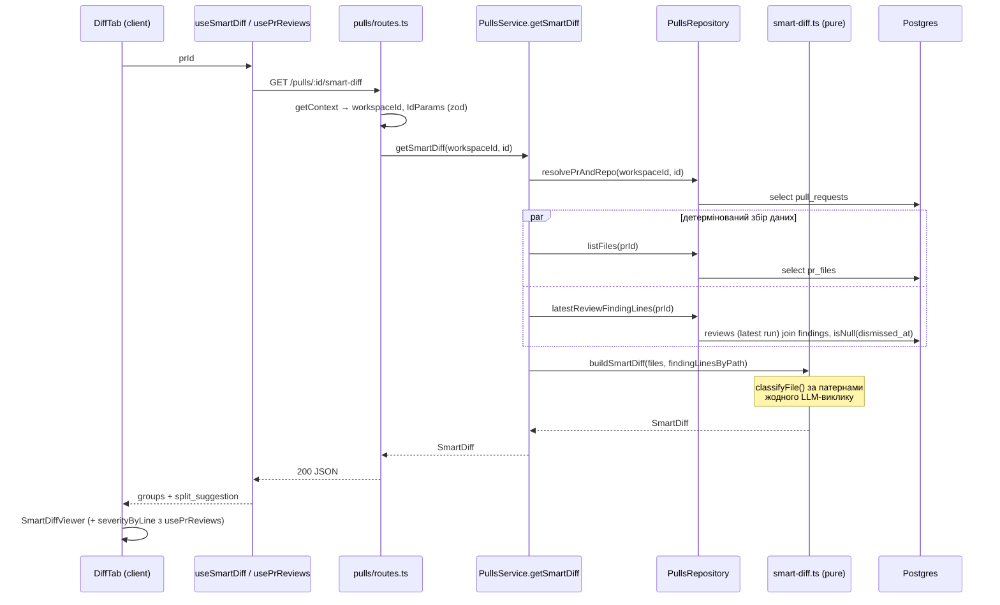

# Development Plan: Smart Diff (сортування файлів PR за core / wiring / boilerplate)

> Згенеровано агентами `researcher` → `planner` (branch: `feat/l-03`, дата: 2026-08-11).
> Джерело вимог: скріншот макета Files changed + вимоги користувача (нижче, розділ 0).

## 0. Вимоги користувача (дослівно)

Фіча використовує три наявні джерела:
1. `GET /pulls/:id` повертає змінені файли: `path`, `additions`, `deletions`, `patch`. Цього достатньо, щоб детерміновано віднести файл до `core`, `wiring` або `boilerplate`. Класифікація працює одразу після імпорту PR і не викликає модель.
2. `GET /pulls/:id/reviews` повертає findings із `file`, `line` і `severity`. Після першого Run Review ці дані дають бейджі, підсвітку рядків та автоматичне розгортання файлів зі знахідками. До рев'ю сортування працює без накладок.
3. Zod-контракт `SmartDiff` у `vendor/shared/contracts/brief.ts` задає відповідь `groups[{ role, files[] }] + split_suggestion`.

Smart Diff не робить нового LLM-виклику. Він детерміновано поєднує вже імпортовані файли з готовими знахідками останнього рев'ю.

Початковий план роботи від користувача:
1. Реалізувати класифікатор файлів за шляхом і патернами: `core` для бізнес-логіки, `wiring` для конфігурації та індексних файлів, `boilerplate` для lock-файлів, `dist` і snapshots. Пороги та патерни винести в окремий файл констант.
2. Додати `GET /pulls/:id/smart-diff`. Роут бере файли PR і findings останнього рев'ю та повертає контракт `SmartDiff`.
3. Створити `SmartDiffViewer`: показувати групи файлів, тримати `boilerplate` згорнутим, додавати бейдж `N findings` і прокручувати diff до потрібного рядка після кліку.

### UI-референс зі скріншоту макета
- Перемикач "Smart order / Original order" над списком файлів.
- 3 групи-секції з кольоровим індикатором ролі, підписом-поясненням курсивом ("The substance of the change — review closely" для core, "Hooks the core into the app" для wiring, "Generated / mechanical — skim" для boilerplate) і лічильником файлів групи праворуч.
- Кожен файл: іконка, шлях, за наявності — бейдж `summary`, +N/-M, шеврон розгорнути/згорнути.
- Inline severity-бейджі на конкретних рядках diff: `blocker` (критичний), `warning`, `suggestion` — прив'язані до рядка через finding line number.
- Core і файли зі знахідками розгорнуті за замовчуванням; boilerplate згорнутий.

---

## 1. Обсяг
Пакети: `server/`, `client/`

Поза обсягом:
- `reviewer-core/` — Smart Diff не робить LLM-виклику, тож рушій не зачіпається.
- `e2e/` — нових флоу не додаємо.
- Будь-які міграції БД: фіча читає наявні `pr_files`, `reviews`, `findings`, нових таблиць/колонок не потребує.
- `pseudocode_summary` у `SmartDiffFile` — залишаємо `null` (генерація резюме = LLM-виклик, який вимога явно забороняє). Бейдж `summary` в UI рендериться лише за наявності значення.
- `server/clones/**`.

## 2. Контекст, який враховано

**CLAUDE.md (root)**
- Пакет-менеджери: `server/`, `client/` — тільки **pnpm**; жодних `pnpm -r` / `workspace:*`.
- Напрям імпортів: `client ↛ server`. Клієнт бере контракт лише зі свого `src/vendor/shared`.
- Контракт-first: нове — спершу в `server/src/vendor/shared`, потім дзеркало в client. **У цьому плані дзеркалювання НЕ потрібно** — перевірено: `SmartDiff`/`SmartDiffRole`/`SmartDiffFile`/`SmartDiffGroup`/`ProposedSplit` уже присутні в `client/src/vendor/shared/contracts/brief.ts:97-129`, а `SmartDiffResponse = SmartDiff` — у `client/src/vendor/shared/contracts/review-api.ts:79-80` (ідентично серверній `server/src/vendor/shared/contracts/review-api.ts:79-80`). Контракти вже синхронні — не чіпати.
- Міграції drizzle не редагувати руками — тут вони й не потрібні.

**server/CLAUDE.md**
- Один модуль = один Fastify-плагін `modules/<name>/{routes,service,repository}.ts`, реєстрація в `src/modules/index.ts` (`pulls` уже зареєстрований — `server/src/modules/index.ts:4,29`).
- Роути schema-first через `fastify-type-provider-zod`; жодного ручного `Schema.parse`.
- Адаптери — тільки через `platform/container.ts`.
- Тести: unit `pnpm exec vitest run --exclude '**/*.it.test.ts'`, integration `pnpm exec vitest run .it.test`. Скриптів `test:unit`/`lint` немає.

**client/CLAUDE.md**
- Сторінки тонкі, логіка в `_components/<Name>/`; уся робота з API — через `src/lib/hooks/*` → `src/lib/api.ts`, ніякого `fetch` з компонента.
- Рядки UI — у `messages/<locale>/*.json` (є лише локаль `en`), namespace диф-в'ювера — `shell.diffViewer` (`client/messages/en/shell.json:33`).
- Верифікація тільки `pnpm test` + `pnpm typecheck`, ніколи не гнати застосунок через браузер.
- Gotcha: імпорт runtime-**значення** з `vendor/shared/index.ts` тягне весь barrel у бандл → на клієнті імпортувати `SmartDiff` **тільки як тип** (`import type`).

**server/INSIGHTS.md**
- «Adding a field to `PrMeta` also changes `GET /pulls/:id`, because `PrDetail = PrMeta.extend({...})`» → **наслідок для плану**: не додаємо нічого в `PrMeta`/`PrDetail`; Smart Diff — окремий ендпойнт, `GET /pulls/:id` лишається байт-у-байт незмінним.
- «Per-PR severity rollup pattern: `findingsByPr()` … one `inArray` join (`findings` has no `pr_id`, join through `reviews`), filtered to `kind: 'review'` + `isNull(dismissedAt)`, grouped in JS» → **наслідок**: новий запит findings у `PullsRepository` пишемо тим самим шаблоном (join через `reviews`, фільтр `kind='review'` + `isNull(dismissedAt)`), а не новим стилем. Дивись `server/src/modules/pulls/repository.ts` (`findingsByPr`).
- «Cost-split math … deliberately pulled out of the repository query into a pure `apportionCostByCategory()` so it is unit-testable without Postgres» → **наслідок**: класифікація + збірка `SmartDiff` живуть у чистих модулях (`smart-diff.ts`), а не всередині SQL чи роут-хендлера.

**client/INSIGHTS.md**
- «`?findingItem=<id>` deep-link … scrolls to a `FindingCard` via `document.querySelector('[data-finding-id="..."]')` polled with `requestAnimationFrame` (up to 30 frames) — a plain post-effect query fails because the owning accordion must first flip `open` … Always call the "handled" callback on both success and give-up» → **наслідок**: скрол до рядка diff після кліку робимо тим самим механізмом (data-атрибут + rAF-полінг), бо цільовий `FileCard` теж може бути ще згорнутий у момент кліку.
- «`countBySeverity()` … intentionally duplicates the server's `rollupSeverities` logic client-side» → **наслідок**: прецедент дозволяє клієнтську агрегацію findings по файлу; але тут severity per line ми беремо з `usePrReviews` (сервер `finding_lines` віддає без severity — контракт `SmartDiffFile` має лише `finding_lines: number[]`).
- «Rendering a component that pulls a NEW i18n namespace breaks existing tests silently-late: `NextIntlClientProvider` in a test only carries the namespaces it is handed» → **наслідок**: нові рядки Smart Diff класти в наявний namespace `shell` (де вже `diffViewer`), і в тестах передавати `messages={{ shell: ... }}`.
- «`AppShell` cannot be rendered in a component test without extensive setup» → тестуємо `SmartDiffViewer` ізольовано, не через сторінку.

**Наявний код (перевірено)**
- `server/src/modules/pulls/routes.ts:20-50` — плагін `pullsRoutes`, патерн: `const { workspaceId } = await getContext(app.container, req)` + `schema: { params: IdParams }`, уся логіка делегується в `PullsService`. Сюди додається новий GET.
- `server/src/modules/pulls/service.ts:133-181` (`getDetail`) — local-first: пробує GitHub, при помилці читає `this.repo.listFiles(pr.id)` / `listCommits(pr.id)`; є приватний `resolvePrAndRepo(workspaceId, id)`, що кидає `NotFoundError`.
- `server/src/modules/pulls/repository.ts` — `listFiles(prId)` повертає рядки `t.prFiles` (`path`, `additions`, `deletions`, `patch`); `findingsByPr(prIds)` — зразок join-у `findings → reviews`; `getPr`, `getRepoById`.
- `server/src/modules/reviews/repository/review.repo.ts:58-75` — `reviewsForPull(db, prId)`: усі reviews PR-а `desc(createdAt)` + їх findings. Це **не** те, що нам потрібно (тягне все), але воно фіксує форму «останній перший».
- `server/src/modules/reviews/helpers.ts:33-52` — `findingRowToDto`: `start_line`/`end_line` з `row.startLine`/`row.endLine`.
- `server/src/vendor/shared/contracts/brief.ts:95-129` — контракт `SmartDiff` (`ProposedSplit = { name, files: string[] }`).
- `server/test/pulls-list.it.test.ts:8-40` — харнес інтеграційних тестів: `startPg`/`dockerAvailable` з `test/helpers/pg.ts`, `buildApp`, `seed`, `MockGitHubClient`, ручний insert `t.repos` + `t.pullRequests`.
- `client/src/components/diff-viewer/` — `index.ts` експортує лише `DiffViewer` + тип `DiffCommentApi`; `DiffViewer/DiffViewer.tsx:14-32` мапить `files` у `FileCard`; `FileCard/FileCard.tsx:33-96` тримає власний `open` (авто-розгортання за `AUTO_EXPAND_MAX_LINES` з `constants.ts:4`), рендерить `parsePatch` → `CodeLine`; `CodeLine/CodeLine.tsx:12-22` приймає `{ ln, path, threads, commenting }`; стилі — inline-об'єкти з `styles.ts` (`s.fileCard`, `s.fileHeader`, `chevronFor`), **не Tailwind**.
- `client/src/app/repos/[repoId]/pulls/[number]/_components/DiffTab/DiffTab.tsx:18-64` — рендерить `SectionLabel` + `DiffViewer files={files}`; сторінка `page.tsx:178-185` передає `prId`, `files={pr.files}`, `filesCount`, `canComment`.
- `client/src/lib/hooks/core.ts:101-120` — `usePulls`/`usePullDetail` (ключі `["pulls", repoId]`, `["pull", prId]`); `client/src/lib/hooks/reviews.ts:51-58` — `usePrReviews` (ключ `["reviews", prId]`); `client/src/lib/hooks/index.ts` — barrel з **явними** іменованими експортами (без `export *`).
- `client/src/components/severity-counts/SeverityCounts.tsx` — готові severity-бейджі (є `.test.tsx` поруч → прецедент тестів під `src/components/**`).
- `server/src/modules/repo-intel/repository.ts:92,362,443-457` — `t.fileRank` (PageRank по файлах репозиторію) існує, але це **repo-scoped** ранг, наповнюється лише після індексації repo-intel і не має ролей core/wiring/boilerplate. Класифікатор Smart Diff **не** будуємо на ньому: він має працювати одразу після імпорту PR без індексації (пряма вимога). Не змішувати ці механізми.

## 3. Кроки

### Крок 1 — Константи класифікації · пакет: `server`
- Файли: `server/src/modules/pulls/smart-diff.constants.ts` (новий)
- Скіли: `typescript-expert`, `import-hygiene`
- Зміст:
  - `BOILERPLATE_PATTERNS` — lock-файли (`pnpm-lock.yaml`, `package-lock.json`, `yarn.lock`, `*.lock`), збірки (`dist/`, `build/`, `.next/`, `out/`, `coverage/`), снапшоти (`__snapshots__/`, `*.snap`), згенероване (`*.min.js`, `*.map`, `*.generated.*`, `src/db/migrations/`).
  - `WIRING_PATTERNS` — барелі (`index.ts`, `index.tsx`), конфіги (`*.config.{ts,js,mjs,cjs,json}`, `tsconfig*.json`, `package.json`), CI/інфра (`.github/workflows/`, `Dockerfile`, `docker-compose*`), env (`.env*`), i18n-ресурси (`messages/`), точки підключення (`routes.ts`, `container.ts`).
  - `SPLIT_TOO_BIG_LINES` (пропоную `400`) і `SPLIT_MIN_CORE_FILES` (пропоную `8`) — пороги `split_suggestion.too_big`.
  - Кожен експорт із однорядковим коментарем-обґрунтуванням; жодних імпортів із `db`/`fastify` (файл має лишатись чистим).
- Обмеження: тільки дані, нуль логіки; порядок перевірки (boilerplate → wiring → core) задокументувати тут же як коментар, реалізувати — у кроці 2.
- Готово, коли: файл компілюється (`pnpm typecheck`), не імпортує нічого, крім типів із `@devdigest/shared`.

### Крок 2 — Чистий класифікатор + збірка контракту · пакет: `server`
- Файли: `server/src/modules/pulls/smart-diff.ts` (новий)
- Скіли: `onion-architecture`, `typescript-expert`, `zod`, `import-hygiene`
- Зміст:
  - `export function classifyFile(path: string): SmartDiffRole` — first-match-wins у порядку boilerplate → wiring → core.
  - `export function buildSmartDiff(files: { path; additions; deletions }[], findingLinesByPath: Map<string, number[]>): SmartDiff` — групує в порядку `core`, `wiring`, `boilerplate` (стабільний порядок груп навіть якщо група порожня — рішення зафіксувати коментарем), у межах групи сортує за спаданням `additions + deletions`, `finding_lines` бере з мапи (відсортовані за зростанням, унікальні), `pseudocode_summary: null`.
  - `split_suggestion`: `total_lines` = сума `additions + deletions` по всіх файлах; `too_big = total_lines > SPLIT_TOO_BIG_LINES || coreFiles.length > SPLIT_MIN_CORE_FILES`; `proposed_splits` — по одному `ProposedSplit` на кожну **непорожню** групу (`name` = людський підпис ролі, `files` = шляхи), і `[]` коли `too_big === false`.
- Обмеження: **чистий модуль** — жодного `Db`, `fastify`, `this`, дат чи env. Прецедент: `server/src/modules/pulls/status.ts` і `server/src/modules/skills/stats.ts`. Тип повернення анотувати як `SmartDiff` з `@devdigest/shared` (тип, не runtime-парс).
- Готово, коли: існує `server/test/smart-diff.test.ts` (крок 6), який ганяє `classifyFile` і `buildSmartDiff` без Postgres, і `pnpm typecheck` чистий.

### Крок 3 — Читання findings останнього рев'ю · пакет: `server`
- Файли: `server/src/modules/pulls/repository.ts` (правка: додати метод `latestReviewFindingLines(prId: string): Promise<Map<string, number[]>>`)
- Скіли: `drizzle-orm-patterns`, `onion-architecture`
- Зміст:
  - Крок 1: знайти найсвіжіший `t.reviews` рядок для PR із `kind = 'review'` (`orderBy(desc(t.reviews.createdAt))`, `limit(1)`) → взяти його `runId`.
  - Крок 2: зібрати множину review-id «останнього прогону»: якщо `runId != null` — усі `reviews` з тим самим `runId` (мультиагентний run дає кілька reviews); інакше — тільки той один review.
  - Крок 3: `select` з `t.findings` по `inArray(reviewId, ids)` + `isNull(t.findings.dismissedAt)`; згрупувати в JS у `Map<file, number[]>`, розгортаючи **весь діапазон** `startLine..endLine` в окремі числа (напр. `Array.from({length: endLine - startLine + 1}, (_, i) => startLine + i)`), потім дедуплікувати й відсортувати по файлу.
  - Порожній результат (рев'ю ще не було) → порожня `Map`.
- Обмеження: іменована стилістика має точно повторювати сусідній `findingsByPr` (join через `reviews`, `kind='review'`, `isNull(dismissedAt)`, групування в JS) — див. цитату з `server/INSIGHTS.md` у розділі 2. Ніякої бізнес-логіки в репозиторії: тільки читання.
- Готово, коли: метод типізовано без `any`, `pnpm typecheck` чистий, і інтеграційний тест кроку 6 бачить `finding_lines` непорожнім після вставки review+finding.

### Крок 4 — Сервісний метод · пакет: `server`
- Файли: `server/src/modules/pulls/service.ts` (правка: додати `async getSmartDiff(workspaceId: string, id: string): Promise<SmartDiff>`)
- Скіли: `onion-architecture`, `import-hygiene`
- Зміст: `const { pr } = await this.resolvePrAndRepo(workspaceId, id)` (перевикористати наявний приватний метод — він уже кидає `NotFoundError`), далі `Promise.all([this.repo.listFiles(pr.id), this.repo.latestReviewFindingLines(pr.id)])`, потім `return buildSmartDiff(files, findingLines)`.
- Обмеження: **без GitHub-виклику і без LLM** — читаємо тільки те, що вже персистовано (`getDetail` уже наповнює `pr_files` при кожному відкритті PR). Не викликати `this.container.github()` у цьому методі. Не конструювати адаптери в сервісі.
- Готово, коли: `pnpm typecheck` чистий; метод не містить жодного `gh.`/`container.github`.

### Крок 5 — Роут `GET /pulls/:id/smart-diff` · пакет: `server`
- Файли: `server/src/modules/pulls/routes.ts` (правка: додати роут після `GET /pulls/:id`), оновити doc-коментар плагіна вгорі файлу (він перелічує роути)
- Скіли: `fastify-best-practices`, `zod`, `onion-architecture`
- Зміст:
  ```ts
  app.get('/pulls/:id/smart-diff', { schema: { params: IdParams } },
    async (req): Promise<SmartDiff> => {
      const { workspaceId } = await getContext(app.container, req);
      return service.getSmartDiff(workspaceId, req.params.id);
    });
  ```
- Обмеження: schema-first через `IdParams` з `../_shared/schemas.js` (як усі сусідні роути), ніякого ручного `.parse()`; тип відповіді — `SmartDiff` (або `SmartDiffResponse`) через `import type` з `@devdigest/shared`. Роут живе в `pulls`, **не** в `reviews`: ресурс — це файли PR-а (`pr_files`), findings тут лише накладка; локація узгоджена з `GET /pulls/:id` і `GET /pulls/:id/comments` у тому ж плагіні. Реєстрації в `modules/index.ts` не потрібно — `pulls` уже зареєстровано.
- Готово, коли: `server/test/routes-smoke.test.ts` (або новий it-тест кроку 6) бачить 200 на `GET /pulls/<id>/smart-diff` і 404 на неіснуючому id.

### Крок 6 — Тести сервера · пакет: `server`
- Файли: `server/test/smart-diff.test.ts` (новий, unit) · `server/test/smart-diff.it.test.ts` (новий, integration)
- Скіли: `typescript-expert`, `drizzle-orm-patterns`
- Зміст:
  - Unit: `classifyFile` для щонайменше по 3 представники кожної ролі (`src/modules/pulls/service.ts` → core, `src/modules/index.ts` та `vitest.config.ts` → wiring, `pnpm-lock.yaml` та `dist/app.js` → boilerplate); порядок пріоритету (напр. `dist/index.ts` → boilerplate, не wiring); `buildSmartDiff` — порядок груп, сортування всередині групи, `finding_lines` з мапи, `total_lines`, `too_big` на межі порогу, `proposed_splits === []` коли не `too_big`; `SmartDiff.parse(result)` (zod-контракт) проходить.
  - Integration: харнес як у `server/test/pulls-list.it.test.ts:8-40` (`dockerAvailable`, `startPg`, `buildApp`, `MockGitHubClient`) — вставити repo + PR + `pr_files` + `reviews(kind:'review')` + `findings`, зробити `app.inject GET /pulls/:id/smart-diff`, перевірити: 200, групи, `finding_lines` містить `start_line` вставленого finding, dismissed-finding **не** потрапляє, PR без рев'ю дає всі `finding_lines: []`.
- Обмеження: файл із `.it.test.ts` має пропускатися без Docker (`const d = hasDocker ? describe : describe.skip`) — точно як існуючий харнес.
- Готово, коли: `pnpm exec vitest run --exclude '**/*.it.test.ts'` і `pnpm exec vitest run .it.test` зелені, і обидва нові файли в них присутні.

### Крок 7 — Клієнтський хук `useSmartDiff` · пакет: `client`
- Файли: `client/src/lib/hooks/core.ts` (правка: додати після `usePullDetail`, у секцію «Pull requests») · `client/src/lib/hooks/index.ts` (правка: додати `useSmartDiff` до явного списку експортів із `./core`)
- Скіли: `react-best-practices`, `zod`, `import-hygiene`
- Зміст:
  ```ts
  export function useSmartDiff(prId: string | null | undefined) {
    return useQuery({
      queryKey: ["smart-diff", prId],
      queryFn: () => api.get<SmartDiff>(`/pulls/${prId}/smart-diff`),
      enabled: !!prId,
    });
  }
  ```
- Обмеження: `SmartDiff` імпортувати **тільки як тип** (`import type { SmartDiff } from "@devdigest/shared"`) — інакше спрацьовує bundle-gotcha з `client/CLAUDE.md`. Барель `index.ts` — без `export *`. Жодного `fetch` поза `api`.
- Готово, коли: `pnpm typecheck` у `client/` чистий і `useSmartDiff` резолвиться з `@/lib/hooks`.

### Крок 8 — Розширення `FileCard` і `CodeLine` під знахідки · пакет: `client`
- Файли: `client/src/components/diff-viewer/FileCard/FileCard.tsx` (правка) · `client/src/components/diff-viewer/CodeLine/CodeLine.tsx` (правка) · `client/src/components/diff-viewer/styles.ts` (правка: стилі бейджа ролі/severity) · `client/src/components/diff-viewer/constants.ts` (правка: константи ролей — колір-токен і ключ підпису на роль)
- Скіли: `react-best-practices`, `frontend-architecture`, `import-hygiene`
- Зміст:
  - `FileCard` отримує нові **опційні** пропси: `defaultOpen?: boolean` (перекриває обчислення за `AUTO_EXPAND_MAX_LINES`), `findingCount?: number` (бейдж `N findings` у хедері), `summary?: string | null` (бейдж `summary`), `severityByLine?: Map<number, Severity>` (для підсвітки), `data-file-path` атрибут на кореневому вузлі для скрол-таргету.
  - `CodeLine` отримує опційний `severity?: Severity` → рендерить inline-бейдж (`blocker`/`warning`/`suggestion`) праворуч від тексту рядка + `data-diff-line={ln.newNo}`.
  - Усі нові пропси опційні — існуючий виклик із `DiffViewer.tsx:26-28` лишається без змін.
- Обмеження: стилізація — inline-об'єкти в `styles.ts` (`satisfies CSSProperties`), як уся решта каталогу; **не** Tailwind і не `style={{...}}` розкидані по JSX. Рядки — з `useTranslations("shell")`, namespace `shell.diffViewer`. Іконки — з `@devdigest/ui` (`Icon.*`), severity-бейдж брати з наявного `@/components/severity-counts` замість власного, якщо його compact-варіант дає потрібний вигляд.
- Готово, коли: `pnpm test` у `client/` лишається зеленим **без правок** існуючих тестів diff-в'юера (доказ зворотної сумісності пропсів), `pnpm typecheck` чистий.

### Крок 9 — `SmartDiffViewer` · пакет: `client`
- Файли: `client/src/components/diff-viewer/SmartDiffViewer/SmartDiffViewer.tsx` (новий) · `.../SmartDiffViewer/index.ts` (новий) · `client/src/components/diff-viewer/index.ts` (правка: додати іменований експорт `SmartDiffViewer`) · `client/messages/en/shell.json` (правка: нові ключі під `diffViewer`)
- Скіли: `react-best-practices`, `frontend-architecture`, `import-hygiene`
- Зміст:
  - Пропси: `{ smartDiff: SmartDiff, files: PrFile[], severityByFileLine?: Map<string, Map<number, Severity>>, commenting?: DiffCommentApi }`. `files` потрібні заради `patch` (контракт `SmartDiffFile` його не несе) — мапити `path → PrFile` один раз через `useMemo`.
  - Рендер: 3 секції в порядку груп із контракту; кожна — кольоровий індикатор ролі, назва, курсивний підпис-пояснення (i18n-ключі `diffViewer.role.core.hint` = «The substance of the change — review closely», `wiring.hint` = «Hooks the core into the app», `boilerplate.hint` = «Generated / mechanical — skim»), лічильник файлів праворуч.
  - Розгортання за замовчуванням: `defaultOpen = role !== "boilerplate" && (role === "core" || file.finding_lines.length > 0)`; boilerplate завжди згорнутий. Формулу винести константою/чистою функцією над компонентом (не інлайн у JSX).
  - Порожня група не рендериться.
  - Бейдж `N findings` = `file.finding_lines.length`.
- Обмеження: компонент — `"use client"`, суто презентаційний, **без власного data-fetching** (дані приходять пропсами з `DiffTab`). Розмір < 200 рядків: секцію групи виділити в підкомпонент `SmartDiffGroupSection` у тому ж файлі або сусідній папці (PascalCase, не `renderGroup()`). Барель `diff-viewer/index.ts` — іменовані експорти, без `export *`. Ключі `map` — `file.path`, не індекс.
- Готово, коли: `SmartDiffViewer.test.tsx` (крок 11) рендерить усі три групи, перевіряє, що boilerplate-файл згорнутий, а core — розгорнутий; `pnpm typecheck` чистий.

### Крок 10 — Інтеграція в `DiffTab`: перемикач і скрол · пакет: `client`
- Файли: `client/src/app/repos/[repoId]/pulls/[number]/_components/DiffTab/DiffTab.tsx` (правка)
- Скіли: `react-best-practices`, `frontend-architecture`, `next-best-practices`
- Зміст:
  - Викликати `useSmartDiff(prId)` і `usePrReviews(prId)` (останній уже використовується деінде з тим самим ключем `["reviews", prId]` → кеш теплий).
  - Побудувати `severityByFileLine` чистим хелпером у сусідньому `helpers.ts` в тій же папці: `ReviewRecord[]` → `Map<file, Map<line, Severity>>`, беручи findings **останнього** рев'ю і відкидаючи `dismissed_at != null` (прецедент клієнтського дублювання серверної агрегації — `client/INSIGHTS.md`, `countBySeverity`). Хелпер — чистий, покритий тестом.
  - Перемикач «Smart order / Original order» у слоті `right` наявного `SectionLabel` (поряд із кнопкою коментарів). Стан — **URL-owned** (`?diffOrder=smart|original`, підтверджено користувачем) через той самий `setParam`-патерн, що вже використовує сторінка для `?tab=`; за потреби прокинути `setParam` пропом зі сторінки в `DiffTab`. Глобальний стор не заводити.
  - Дефолт: `smart`, якщо `useSmartDiff` повернув дані; фолбек на `DiffViewer` (поточна поведінка), якщо запит у стані `isLoading`/`isError` — Smart Diff не має ламати вкладку.
  - Клік по бейджу finding у групі → скрол до `[data-file-path="…"] [data-diff-line="N"]` через `requestAnimationFrame`-полінг (до ~30 кадрів), бо цільовий `FileCard` спершу має розгорнутись; «handled»-колбек викликати і на успіху, і на здачі — точно за патерном із `client/INSIGHTS.md` (`FindingsTab` deep-link).
- Обмеження: `DiffTab` лишається тонким контейнером — уся розкладка груп у `SmartDiffViewer`, уся трансформація даних у `helpers.ts`. Жодного `fetch`, тільки хуки. Нові рядки — в `messages/en/shell.json`.
- Готово, коли: `DiffTab.test.tsx` (крок 11) підтверджує, що при `?diffOrder=original`/вимкненому перемикачі рендериться старий `DiffViewer`, а за замовчуванням — згруповані секції.

### Крок 11 — Клієнтські тести · пакет: `client`
- Файли: `client/src/components/diff-viewer/SmartDiffViewer/SmartDiffViewer.test.tsx` (новий) · `client/src/app/repos/[repoId]/pulls/[number]/_components/DiffTab/helpers.test.ts` (новий) · за потреби `.../DiffTab/DiffTab.test.tsx` (новий)
- Скіли: `react-testing-library`, `react-best-practices`
- Зміст:
  - `SmartDiffViewer`: три групи з підписами; core-файл розгорнутий (видно рядки patch); boilerplate згорнутий (рядків не видно); бейдж `2 findings` на файлі з двома `finding_lines`; порожня група не рендериться.
  - `helpers.test.ts`: `ReviewRecord[]` → `Map` — dismissed finding відкинуто, беруться findings лише останнього рев'ю.
  - `DiffTab`: перемикання smart/original.
- Обмеження: обгортати в `NextIntlClientProvider` із **явно** переданим namespace `shell` (інакше тест мовчки падає — `client/INSIGHTS.md`). Хуки (`useSmartDiff`, `usePrReviews`) мокати через `vi.hoisted` + `vi.fn()`, щоб варіювати значення по тестах (той самий INSIGHTS-запис). Прецедент розміщення тесту під `src/components/**`: `client/src/components/severity-counts/SeverityCounts.test.tsx`.
- Готово, коли: `pnpm test` у `client/` зелений, зокрема нові файли, і жоден існуючий тест не довелося правити через зміну сигнатур.

## 3a. Схема



## 4. Скіл-маршрутизація

| Файли | Обов'язкові скіли |
|---|---|
| `server/src/modules/pulls/routes.ts` | `fastify-best-practices`, `zod`, `onion-architecture` |
| `server/src/modules/pulls/service.ts`, `server/src/modules/pulls/repository.ts` | `onion-architecture`, `drizzle-orm-patterns` |
| `server/src/modules/pulls/smart-diff.ts`, `smart-diff.constants.ts` | `onion-architecture`, `typescript-expert` |
| `server/test/smart-diff.test.ts`, `server/test/smart-diff.it.test.ts` | `typescript-expert`, `drizzle-orm-patterns` |
| `client/src/lib/hooks/core.ts`, `client/src/lib/hooks/index.ts` | `react-best-practices`, `zod` |
| `client/src/components/diff-viewer/**` (`SmartDiffViewer`, `FileCard`, `CodeLine`, `styles.ts`, `constants.ts`, `index.ts`) | `react-best-practices`, `frontend-architecture` |
| `client/src/app/repos/[repoId]/pulls/[number]/_components/DiffTab/**` | `react-best-practices`, `frontend-architecture`, `next-best-practices` |
| `client/**/*.test.tsx` | `react-testing-library` |
| будь-який новий/змінений `import` | `import-hygiene` |
| типізація `SmartDiff`/мап `Map<string, Map<number, Severity>>` | `typescript-expert` |

## 5. Верифікація

`server/` (pnpm):
```
pnpm typecheck
pnpm exec vitest run --exclude '**/*.it.test.ts'
pnpm exec vitest run .it.test
```

`client/` (pnpm):
```
pnpm typecheck
pnpm test
```

`reviewer-core/` і `e2e/` не зачіпаються — запускати не потрібно.

Node/pnpm у цій оболонці немає на `PATH`; перед запуском експортувати бандл WebStorm за рецептом із root `CLAUDE.md` (`NODE_BIN="$(dirname "$(find "$HOME/Library/Application Support/JetBrains"/WebStorm*/node/versions/*/bin/node | head -1)")"`). Ніякої браузерної перевірки — заборонено `client/CLAUDE.md`.

## 6. Ризики та відкриті питання

**Вирішено по ходу планування (не питання, а зафіксовані рішення):**
- **Модуль для роуту** — `pulls`, не `reviews`. Ресурс — файли PR-а (`pr_files`, `PullsRepository.listFiles`), findings лише накладка; `GET /pulls/:id` і `GET /pulls/:id/comments` уже живуть там. Якщо ревʼювер наполягатиме на `reviews` — це переїзд одного роуту + сервісного методу, решта плану не змінюється.
- **Дзеркалювання контракту в `client/src/vendor/shared`** — **не потрібне**: `SmartDiff` уже присутній у `client/src/vendor/shared/contracts/brief.ts:97-129` і `review-api.ts:79-80`, ідентично серверному. Кроку дзеркалювання в плані свідомо немає.
- **`file_rank`/PageRank з repo-intel** — не використовується: він repo-scoped, вимагає індексації і не має ролей. Класифікатор — окремий, чистий, path-based.
- **«Останнє рев'ю» при мультиагентному прогоні** (підтверджено користувачем) — беремо найсвіжіший `reviews.kind='review'`, з нього `run_id`, і включаємо **всі** reviews цього ж `run_id`. Крок 3 уже реалізує саме це.
- **Стан перемикача «Smart order / Original order»** (підтверджено користувачем) — **URL-owned** (`?diffOrder=smart|original`), той самий `setParam`-патерн, що вже використовує сторінка для `?tab=`. Крок 10 оновлено.
- **`finding_lines` для багаторядкових знахідок** (підтверджено користувачем) — розгортати **весь діапазон** `start_line..end_line` в окремі числа (з дедуплікацією). Крок 3 оновлено; варто врахувати, що для дуже великих діапазонів (50+ рядків) масив може бути довгим — якщо це стане проблемою продуктивності UI, повернутись до цього рішення.

**Відкриті питання (варто узгодити ДО реалізації):**
1. **Пороги `too_big`.** `SPLIT_TOO_BIG_LINES = 400` і `SPLIT_MIN_CORE_FILES = 8` — мої припущення, у репозиторії прецеденту немає. Якщо є продуктова цифра — підставити її в `smart-diff.constants.ts`.
2. **`pseudocode_summary`** свідомо `null` (бейдж `summary` з макета не заповнюється), бо будь-яка його генерація = LLM-виклик, заборонений вимогою. Якщо бейдж має бути видимим у першій ітерації — потрібне окреме джерело даних, і це вже інша фіча.
3. **Severity-мапінг для inline-бейджів.** Макет називає рівні `blocker`/`warning`/`suggestion`, контракт — `CRITICAL`/`WARNING`/`SUGGESTION` (`server/src/vendor/shared/contracts/findings.ts:11-12`). План припускає `CRITICAL → blocker`. Перевірити, чи наявний `SeverityCounts`/`SeverityBadge` уже вживає слово «blocker» — якщо ні, підпис береться з i18n, а не з коду.

Ключові файли, які реалізатор відкриватиме: `server/src/modules/pulls/{routes,service,repository}.ts`, `server/src/vendor/shared/contracts/brief.ts`, `client/src/components/diff-viewer/`, `client/src/app/repos/[repoId]/pulls/[number]/_components/DiffTab/DiffTab.tsx`, `client/src/lib/hooks/core.ts`.
