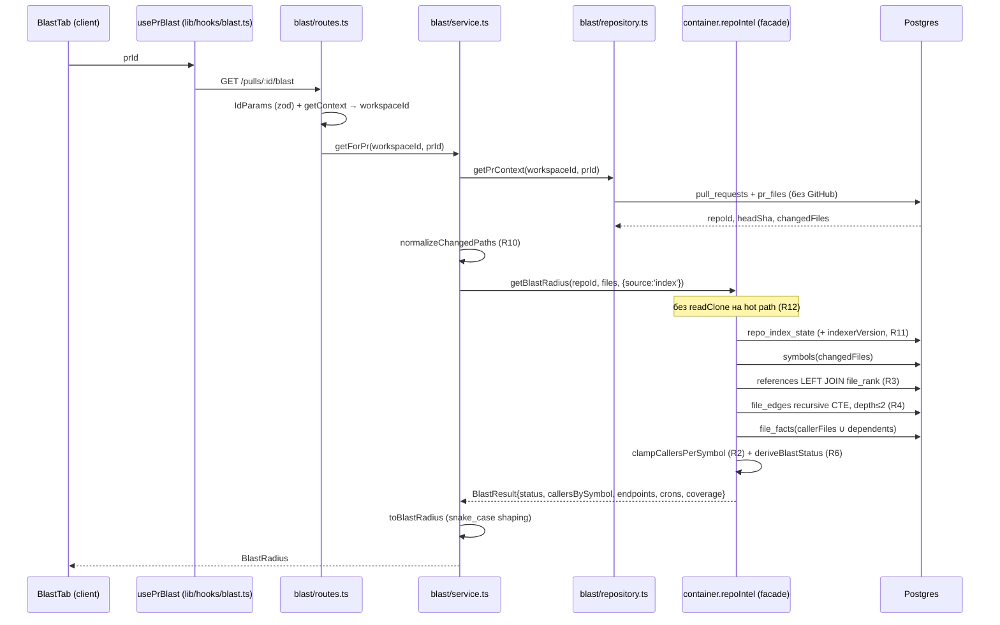
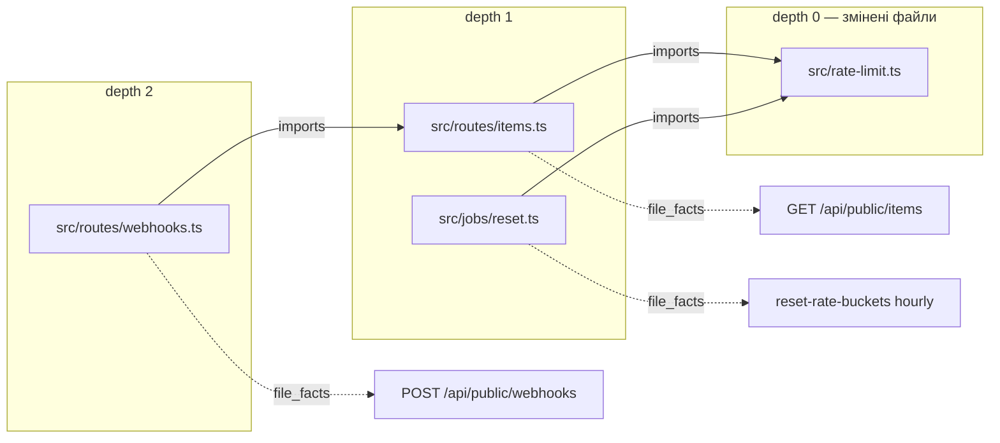

# Development Plan: Blast Radius (server → client → mcp)

## 1. Обсяг

**Пакети:** `server/`, `client/`, `mcp/`.

**У обсязі:**
- новий серверний модуль `server/src/modules/blast/` + маршрут `GET /pulls/:id/blast`;
- розширення графової логіки всередині `server/src/modules/repo-intel/` (per-symbol clamp, LEFT JOIN з `file_rank`, зворотний BFS по `file_edges`, атрибуція endpoints/crons, чесний статус);
- розширення наявного HTTP-контракту `BlastRadius` у `server/src/vendor/shared/contracts/brief.ts` (status/reason/message/coverage/head_sha + атрибуція endpoints/crons) + дзеркало в `client/src/vendor/shared/contracts/brief.ts`;
- вкладка Blast на сторінці PR (`?tab=blast`) з деревом символів, чіпами ендпоінтів/кронів і клікабельними `file:line`;
- реальна реалізація `get_blast_radius` у `mcp/`.

**Поза обсягом (явно):**
- блок «Prior PRs touching these files» із макета — це `PrHistory`-домен, окрема фіча; вкладка його **не рендерить** (не робити заглушку з порожнім масивом — це прямо суперечить вимозі 6);
- зміни в індексері (`repo-intel/pipeline/**`), у `extractEndpoints`/`extractCrons`, у схемі БД і будь-які нові міграції — усі потрібні таблиці та індекси вже є (`file_edges` + `file_edges_repo_to_idx`, `file_facts`, `file_rank`, `repo_index_state`);
- `reviewer-core/`, `e2e/` — не зачіпаються;
- підключення `getBlastRadius` до `run-executor.ts` (промпт-збірка) — воно й далі використовує `getCallerSignatures`/`getRepoMap`/`getFileRank`;
- підтримка мов поза `SUPPORTED_EXT` (ts/tsx/js/jsx/mjs/cjs) — план лише **чесно репортить** непокриття, а не розширює індексер.

---

## 2. Контекст, який враховано

### CLAUDE.md (root)
- `server/` і `client/` — **pnpm**; `mcp/` — **npm**. Жодного `pnpm -r`, жодного `workspace:*`.
- Новий контракт іде **спершу** в `server/src/vendor/shared`, потім у `client/src/vendor/shared` дзеркалиться лише те, що потрібне UI. `mcp/` копії не має — резолвить серверну через tsconfig alias `@devdigest/shared`.
- `server/src/db/migrations/*` і `meta/` — не чіпати руками. У цьому плані міграцій немає взагалі.
- Напрям імпортів: `client ↛ server`, `server ↛ client`.

### server/CLAUDE.md
- Один модуль = один Fastify-плагін `modules/<name>/{routes,service,repository}.ts`, статична реєстрація в `src/modules/index.ts`.
- Маршрути schema-first через `fastify-type-provider-zod`; ніяких ручних `Schema.parse` у хендлері.
- Адаптери — тільки через `platform/container.ts`.
- Тести: unit `pnpm exec vitest run --exclude '**/*.it.test.ts'`, integration `pnpm exec vitest run .it.test`.

### client/CLAUDE.md
- Сторінки тонкі, логіка в колокованих `_components/<Name>/` з власним `*.test.tsx`.
- Весь доступ до API — через `src/lib/hooks/*` → `src/lib/api.ts`. Ніякого `fetch` із компонента.
- Рядки — у `messages/<locale>/*.json`.
- Верифікація — тільки `pnpm test` + `pnpm typecheck`, **ніколи** браузером.

### mcp/CLAUDE.md
- Вхід кожного тула — **плоский** Zod-shape; `src/resolvers.ts` — єдине місце, що кличе `GET /repos`, `GET /repos/:id/pulls`, `GET /agents`.
- Тримані вихідні форми — у `src/schemas.ts` (`AgentSummary`, `FindingSummary`, `ConventionSummary` — `mcp/src/schemas.ts:9-57`).
- **`PrMeta.id` nullable** — кожен виклик мусить гардити `pr.id` (трактувати null як pr-not-found).
- Ніякого `console.log` — тільки stderr.

### INSIGHTS.md — записи, що прямо впливають на план

**`server/INSIGHTS.md`:**
- «`pnpm typecheck` (`tsc --noEmit -p tsconfig.json`) **never typechecks `server/test/**`** — `tsconfig.json:50` `include` is `["src/**/*.ts"]` only… `tsconfig.test.json` … deliberately NOT wired into `pnpm typecheck`/CI, because doing so immediately surfaces 15 pre-existing latent type errors … (`repo-intel-facade-degraded.test.ts`)» → **вплив:** зелений `pnpm typecheck` НЕ доводить коректність нових тестів; типи тестів валідуються тільки прогоном vitest. `tsconfig.test.json` у typecheck **не вмикати**. Оскільки ми правимо `BlastResult`, файл `repo-intel-facade-degraded.test.ts` (уже в списку «15 latent errors») треба оновити руками й перевірити прогоном, не тайпчеком.
- «Adding a field to `PrMeta` also changes `GET /pulls/:id` … Declare list-only aggregates with `.nullish()`» і «Adding a required field to RunStats/RunTrace breaks any `.parse()` call in tests that hand-builds the object … both vendor copies AND every test fixture need the field» (`server/test/contracts.test.ts:160`) → **вплив (перегляд):** цей урок стосується контрактів із реальними викликачами й кількома hand-built фікстурами. `BlastRadius` (`contracts/brief.ts:55`) і `PrBrief` (`brief.ts:134`), який його містить, не мають продакшн-споживачів і рівно ОДНУ фікстуру — `server/test/contracts.test.ts:73-83`. Тому розширюємо наявний `BlastRadius` (не заводимо паралельний контракт) і оновлюємо цю одну фікстуру в кроці S1 — дешевше й без постійного дублювання контракту.
- «`PostgresError: deadlock detected` (40P01) on relation `references` = two repo-intel index jobs for the SAME repo at once» → **вплив:** blast — read-only шлях, нічого не пише; жодних DELETE/INSERT у нових запитах.
- «A new `.it.test.ts` showing "skipped" … `dockerAvailable()` caches a 5s `docker info` timeout … Re-run the file in isolation» → **вплив:** записано в розділ 5 як обов'язковий крок при «skipped».
- «`waitForPrRuns`'s default 10s `timeoutMs` is too tight … under load» → **вплив:** нові `.it.test.ts` не залежать від run-ів взагалі (seed таблиць напряму), таймаутів не додаємо.

**`client/INSIGHTS.md`:**
- «Rendering a `FindingRecord.file` (full repo path) unbounded in a narrow popover/tooltip breaks layout — show only the basename (`path.slice(path.lastIndexOf("/") + 1)`) and put the full path in a `title` tooltip» (`FindingsPreviewList.tsx:8`) → **вплив:** усі `file:line` у BlastTab рендеряться як `basename:line` + `title={fullPath}`. Пряма вимога R16.
- «Rendering a component that pulls a NEW i18n namespace breaks existing tests silently-late: `NextIntlClientProvider` in a test only carries the namespaces it is handed» (`RunHistory.test.tsx:39`) → **вплив:** `BlastTab.test.tsx` мусить передати `messages={{ blast: … }}`; якщо BlastTab покаже щось із `common`, додати і його.
- «Don't partially mock the `@/lib/hooks` barrel with `vi.importOriginal()` when the test also separately mocks one of the modules it re-exports» → **вплив:** у `BlastTab.test.tsx` мокати **тільки** `@/lib/hooks/blast`, не барель.
- «to vary a mocked hook's return value per-test … declare `const { useXMock } = vi.hoisted(...)`» (`RunTraceDrawer.test.tsx`) → **вплив:** саме цей патерн для `usePrBlast` (тести на ok / partial / degraded).
- «Never use browser tools … rely on `pnpm test` + `pnpm typecheck`» → **вплив:** розділ 5 не містить жодного браузерного кроку.

**`mcp/INSIGHTS.md`:**
- «editing `src/**` does nothing to the live tool: the stdio server loads its sources once at startup, so the MCP client must reconnect … Verify a handler without a reconnect by importing it in a throwaway script and running `npx tsx --tsconfig tsconfig.json .try-run.ts`» + «that throwaway `tsx` script must live INSIDE `mcp/`» → **вплив:** R14; у розділі 5 верифікація MCP описана саме так (скрипт всередині `mcp/`, потім видалити).

### Наявний код, який перевикористовується

| Файл:рядок | Що вже є |
|---|---|
| `server/src/modules/repo-intel/service.ts:220` | `getBlastRadius(repoId, changedFiles)` — точка входу, яку розширюємо (опції + статус) |
| `server/src/modules/repo-intel/service.ts:315` | `tryPersistentBlast` — persistent-шлях; тут і живуть R2/R3/R5/R11 |
| `server/src/modules/repo-intel/service.ts:386` | `callers.slice(0, MAX_CALLERS_PER_SYMBOL)` — **глобальний** clamp (R2) |
| `server/src/modules/repo-intel/service.ts:291` | `readClone(...)` у циклі по caller-файлах — disk I/O на HTTP hot path (R12) |
| `server/src/modules/repo-intel/service.ts:301` | `degraded:true, reason:'no_data'` навіть коли дані є (R6) |
| `server/src/modules/repo-intel/service.ts:320` | `if (!state \|\| (state.status !== 'full' && state.status !== 'partial')) return null` — без звірки `indexerVersion` (R11) |
| `server/src/modules/repo-intel/types.ts:24-31` | `IndexStatus`, `DegradedReason` — розширюємо `DegradedReason` |
| `server/src/modules/repo-intel/types.ts:57-87` | `BlastChangedSymbol` / `BlastCallerRow` / `BlastResult` — контракт, що змінюється |
| `server/src/modules/repo-intel/types.ts:146` | `interface RepoIntel` — сигнатура `getBlastRadius` тут |
| `server/src/modules/repo-intel/repository.ts:503-527` | `getResolvedCallers` — `innerJoin(t.fileRank …)` (R3) |
| `server/src/modules/repo-intel/repository.ts:434` | `getEdges(repoId)` — тягне **всі** ребра; для кроку 5 НЕ використовувати (R4) |
| `server/src/modules/repo-intel/repository.ts:530` | `getFileFacts(repoId, files)` — уже повертає `{filePath, endpoints, crons}` |
| `server/src/modules/repo-intel/repository.ts:485` | `getSymbolRows(repoId, paths)` |
| `server/src/db/schema/repo-intel.ts:56-67` | `fileEdges` + `file_edges_repo_to_idx` на `(repo_id, to_file)` — саме зворотний індекс для кроку 5 |
| `server/src/modules/repo-intel/constants.ts` | `MAX_CALLERS_PER_SYMBOL=20`, `BFS_DEPTH=2`, `INDEXER_VERSION=2`, `SUPPORTED_EXT` |
| `server/src/modules/pulls/routes.ts:22-40` | зразок транспорту: `withTypeProvider<ZodTypeProvider>()`, `IdParams`, `getContext`, `new PullsService(app.container)` |
| `server/src/modules/pulls/service.ts:199` | `getSmartDiff` — зразок «змінені файли з `pr_files`, без GitHub» (R8) |
| `server/src/modules/pulls/repository.ts:131` | `listFiles(prId)` над `t.prFiles` |
| `server/src/modules/repo-intel/routes.ts:39` | зразок: `await getContext(container, req)` для tenancy + `container.repoIntel.…` |
| `server/src/modules/index.ts` | реєстр із 10 модулів, `blast` відсутній |
| `server/src/vendor/shared/contracts/brief.ts:32-60` | наявні `ChangedSymbol` / `BlastCaller` / `DownstreamImpact` / `BlastRadius` — **розширюємо їх** (не заводимо паралельний контракт, розд. 4b) |
| `server/src/vendor/shared/index.ts:19` | `export * from './contracts/brief.js'` — нові експорти підхопляться автоматично |
| `client/src/app/repos/[repoId]/pulls/[number]/page.tsx:36` | резолв `number → uuid` (`pulls?.find(p => p.number === Number(number))?.id`) |
| `client/src/app/…/page.tsx:141-186` | рендер вкладок по `tab === "…"`; сюди додається `blast` |
| `client/src/app/…/_components/PrDetailHeader/PrDetailHeader.tsx:115-119` | масив `tabs=[…]` (лейбли зараз хардкоджені англійською) |
| `client/src/lib/github-urls.ts:31` | `githubBlobUrl(repoFullName, sha, file, startLine, endLine)` |
| `client/src/app/…/_components/FindingCard/FindingCard.tsx:46-49` | прецедент виклику `githubBlobUrl` |
| `client/src/lib/hooks/repo-intel.ts:13` | прецедент локального оголошення server-only типу на клієнті |
| `client/src/lib/hooks/index.ts` | бареля з **явними** named-експортами, без `export *` |
| `client/messages/en/blast.json` | **уже існує**: `stat.symbols/callers/endpoints/crons`, `view.tree/graph`, `callerCount`, `noDownstream`, `graph.empty/ariaLabel` |
| `mcp/src/tools/get-blast-radius.ts:5-17` | стаб: `inputShape` вже має `repo`/`pr`/`file`, handler повертає `not_implemented` |
| `mcp/src/resolvers.ts:11-23` | `resolveRepo` / `resolvePr` |
| `mcp/src/tools/get-conventions.ts` | еталон «resolve → `api.get` → `fromApiError` → trim через `schemas.ts`» |
| `mcp/src/errors.ts:24-96` | `repoNotFoundError`, `prNotFoundError`, `fromApiError` |

---

## 3. Рішення по R1 — межа між `blast/` і `repo-intel/`

**Рішення:** `blast/` — **тонкий transport + shaping шар**. Уся графова та SQL-логіка (символи, викликачі, зворотний обхід імпортів, факти файлів, ранг, деградація) лишається в `repo-intel/`.

Розподіл відповідальностей — жорсткий:

| Відповідальність | Де живе | Чому |
|---|---|---|
| зворотний BFS по `file_edges` (крок 5) | `repo-intel/repository.ts` (SQL) + `repo-intel/service.ts` (композиція) | це запит до `file_edges` — таблиці, якою володіє repo-intel; `blast/` не має права знати про схему індексу |
| per-symbol clamp, сортування за rank | `repo-intel/blast.ts` (чисті функції) | пов'язано з `MAX_CALLERS_PER_SYMBOL` — константою repo-intel; має бути однакове для будь-якого споживача фасаду, не тільки HTTP |
| атрибуція endpoints/crons до символу | `repo-intel/service.ts` | потребує `factsByFile` + графу — знову дані repo-intel |
| визначення `status`/`reason`/`coverage` | `repo-intel/blast.ts` + `service.ts` | вимагає доступу до `repo_index_state.indexerVersion`, `file_rank`, `SUPPORTED_EXT` |
| резолв `:id → (workspaceId, prId) → repoId + changedFiles + headSha` | `blast/repository.ts` + `blast/service.ts` | це PR-домен, не індекс |
| нормалізація шляхів GitHub → шляхи індексу | `blast/blast-paths.ts` (чиста функція) | вхід — `pr_files.path`, тобто PR-домен |
| мапінг внутрішнього `BlastResult` → HTTP `BlastRadius` (snake_case) | `blast/shape.ts` (чиста функція) | транспортний контракт |
| Fastify/zod/HTTP-коди | `blast/routes.ts` | rim |

**Обґрунтування:** `repo-intel` — це фасад (`interface RepoIntel`, `types.ts:146`), який уже проектувався як «SINGLE interface every feature codes against» (докстрінг `types.ts:1-8`, де `blast` названий одним із споживачів). Продублювати граф у `blast/` означало б другий шлях до тих самих таблиць із власною деградацією — рівно те, чого фасад мав уникнути. Onion-напрям: `blast/service.ts` залежить від **інтерфейсу** `RepoIntel` через `container.repoIntel`, ніколи не від `RepoIntelRepository` і ніколи не від Drizzle-таблиць repo-intel.

**Чому `blast/repository.ts` окремий, а не `PullsRepository`:** blast потребує рівно три поля (`repoId`, `headSha`, `changedFiles`) з workspace-скоупом; `PullsRepository.getPr` + `listFiles` тягнуть повні рядки і додали б крос-модульну залежність `blast → pulls`. Один вузький метод дешевший за зв'язок. (Прецедент із `server/INSIGHTS.md` 2026-08-03/04: крос-модульний репозиторій додається лише коли з'явився **другий** споживач.)

---

## 4. Зміни контракту

### 4a. Внутрішній фасадний контракт — `server/src/modules/repo-intel/types.ts`

**`DegradedReason`** (зараз `types.ts:26-31`) — додати причини, щоб `no_data` перестав означати п'ять різних речей (**R6**):

```
'flag_off' | 'index_failed' | 'index_partial' | 'repo_too_large' | 'no_data'
+ 'no_index'           // рядка repo_index_state немає взагалі
+ 'index_stale'        // state.indexerVersion !== INDEXER_VERSION            (R11)
+ 'rank_missing'       // індекс є, file_rank порожній                        (R3)
+ 'unsupported_files'  // жоден змінений файл не входить у SUPPORTED_EXT      (R9)
+ 'no_symbols'         // файли підтримувані, але в індексі для них символів нема (R10)
```

**Нові інтерфейси:**

```
BlastRef        { value; file; viaSymbol: string | null; viaFile: string; depth: number }
BlastCoverage   { changedFiles; analyzedFiles; unsupportedFiles;
                  filesWithoutRank; callersTruncated: boolean;
                  indexerVersion: number | null; lastIndexedSha: string | null }
BlastStatus     = 'ok' | 'partial' | 'degraded'
```

**`BlastResult`** (зараз `types.ts:73-87`) — додається, нічого не видаляється:

| Поле | Тип | Чому (ризик) |
|---|---|---|
| `status` | `BlastStatus` | R6 — `ok`/`partial`/`degraded` замість булевого `degraded`, який зараз завжди `true` на fallback і завжди `false` на persistent |
| `endpoints` | `BlastRef[]` | R5 — атрибуція «який ендпоінт через який символ і на якій глибині»; плоский `impactedEndpoints: string[]` цього не дає |
| `crons` | `BlastRef[]` | R5 — крони зараз узагалі не доходять окремим полем (лише всередині `factsByFile`), а макет вимагає лічильник «1 cron» і чіп `reset-rate-buckets (hourly)` |
| `coverage` | `BlastCoverage` | R3/R9/R10 — «скільки файлів реально проаналізовано» і «чи був rank»; без цього UI не відрізнить «впливу немає» від «нічого не знайдено» |
| `callersBySymbol` | `Record<string, { rows: BlastCallerRow[]; total: number; truncated: boolean }>` | R2 — clamp застосовується **per-symbol**, і споживач бачить, що обрізано |

`impactedEndpoints: string[]`, `callers: BlastCallerRow[]`, `factsByFile`, `degraded?`, `reason?` **лишаються** (є споживач-тест `repo-intel-facade-degraded.test.ts`); `degraded` стає похідним: `degraded === (status === 'degraded')`.

**`RepoIntel.getBlastRadius`** (`types.ts:146`) — новий необов'язковий параметр:

```
getBlastRadius(repoId, changedFiles, opts?: { source?: 'index' | 'best-effort' }): Promise<BlastResult>
```

`source: 'index'` (його передає HTTP-маршрут) забороняє fallback-гілку, що читає клон із диска в циклі — **R12**. Дефолт `'best-effort'` зберігає поточну поведінку для всіх наявних викликів → жодного breaking-change для існуючих тестів.

### 4b. HTTP-контракт — `server/src/vendor/shared/contracts/brief.ts` (source of truth)

**РІШЕННЯ (перегляд планувальника):** наявний `BlastRadius` (`brief.ts:55`) **розширюється**, новий паралельний контракт не заводимо. `BlastRadius`/`DownstreamImpact`/`BlastCaller` не мають жодного продакшн-споживача — єдина точка дотику це один `.parse()`-виклик у `server/test/contracts.test.ts:73`, і `DownstreamImpact` (`symbol, callers, endpoints_affected, crons_affected`) уже структурно відповідає тому, що потрібно для R5 (per-symbol атрибуція). Заводити другий майже ідентичний контракт коштувало б постійного дублювання; альтернатива — оновити одну тестову фікстуру.

`BlastRadius` входить у `PrBrief` (`brief.ts:134`), але `PrBrief` так само без продакшн-споживачів (перевірено: жодного результату поза `brief.ts`/тестами/докстрінгами) — застереження з `server/INSIGHTS.md` (2026-08-01, про `RunStats`) стосується контракту з реальними викликачами й хендмейд-фікстурами в кількох файлах; тут фікстура рівно одна.

**Зміни (усе — розширення, нічого не видаляється з наявних полів):**

```
// НОВІ enum-и
BlastStatus  = z.enum(['ok','partial','degraded'])
BlastReason  = z.enum(['flag_off','no_index','index_stale','index_partial',
                       'index_failed','repo_too_large','rank_missing',
                       'unsupported_files','no_symbols','no_data'])

// НОВИЙ тип — атрибутований ендпоінт/крон (замінює string[] у DownstreamImpact)
BlastRef = { value: string, file: string, via_symbol: string|null,
             via_file: string, depth: z.number().int() }

// НОВИЙ тип — покриття індексу
BlastCoverage = { changed_files: string[], analyzed_files: string[],
                   unsupported_files: string[], files_without_rank: string[],
                   indexer_version: number|null, last_indexed_sha: string|null }

// BlastCaller (brief.ts:39-43) — додається поле
BlastCaller = { name, file, line: int,
                rank: z.number() }                          // НОВЕ — R2/R3

// DownstreamImpact (brief.ts:45-51) — тип полів змінюється, назви лишаються
DownstreamImpact = {
  symbol: string,
  callers: BlastCaller[],
  callers_total: z.number().int(),                          // НОВЕ — R2
  callers_truncated: z.boolean(),                            // НОВЕ — R2
  endpoints_affected: z.array(BlastRef),   // було z.array(z.string()) — R5
  crons_affected: z.array(BlastRef),       // було z.array(z.string()) — R5
}

// BlastRadius (brief.ts:53-58) — додаються поля
BlastRadius = {
  changed_symbols: ChangedSymbol[],
  downstream: DownstreamImpact[],
  summary: string,
  status: BlastStatus,                                       // НОВЕ — R6
  reason: BlastReason.nullable(),                             // НОВЕ — R6
  message: z.string(),                                        // НОВЕ — непорожнє, коли status !== 'ok'
  coverage: BlastCoverage,                                     // НОВЕ — R3/R9/R10/R11
  head_sha: z.string().nullable(),                            // НОВЕ — для file:line посилань без 2-го запиту
}
```

`endpoints_affected`/`crons_affected` міняють тип `string[] → BlastRef[]` — це єдина зміна, що не є чистим доповненням. Оскільки продакшн-споживачів немає, це безпечно; торкається рівно одного місця для правки — фікстури `server/test/contracts.test.ts:73-83` (замінити рядкові `'GET /x'`/`'c'` на об'єкти `BlastRef`).

`message` — обов'язкове, бо вимога 6 каже «повертати `partial`/`degraded` **з поясненням**»; порожній масив без пояснення заборонений. `head_sha` — щоб MCP і будь-який інший споживач могли будувати `file:line`-посилання без другого запиту.

Жодних нових експортів у `server/src/vendor/shared/index.ts` не потрібно — `BlastRadius` уже реекспортується (`export * from './contracts/brief.js'`, `index.ts:19`); докстрінг-рядок 6 лишається без змін.

### 4c. Дзеркало на клієнті

У `client/src/vendor/shared/contracts/brief.ts` дзеркалиться **той самий розширений блок** (`ChangedSymbol`, `BlastCaller`, `DownstreamImpact`, `BlastRadius`, плюс нові `BlastRef`/`BlastCoverage`/`BlastStatus`/`BlastReason`) — UI споживає всі поля: лічильники, дерево, чіпи, банер статусу. Імпорт у клієнтському коді — **тільки `import type`**, щоб не тягнути barrel у бандл (гоча в `client/CLAUDE.md`).

---

## 5. Кроки

### Крок S1 — контракт у shared (server) · пакет: `server`
- **Файли:** `server/src/vendor/shared/contracts/brief.ts` (правка за розділом 4b: додати `BlastStatus`/`BlastReason`/`BlastRef`/`BlastCoverage`; додати поле `rank` у `BlastCaller`; змінити тип `endpoints_affected`/`crons_affected` в `DownstreamImpact` з `string[]` на `BlastRef[]`, додати `callers_total`/`callers_truncated`; додати `status`/`reason`/`message`/`coverage`/`head_sha` у `BlastRadius`); `server/test/contracts.test.ts` (правка: фікстура `BlastRadius.parse(...)` у тесті `'Intent / BlastRadius / Risks / PrHistory'` — замінити `endpoints_affected: ['GET /x']`/`crons_affected: ['c']` на об'єкти `BlastRef`, додати `callers_total`/`callers_truncated`/`status`/`reason`/`message`/`coverage`/`head_sha`).
- **Скіли:** `zod`, `typescript-expert`, `import-hygiene`.
- **Обмеження:** contract-first — server є source of truth; `PrBrief` як контейнер не чіпати структурно (лише вкладений `BlastRadius` змінюється); усі нові поля snake_case (як у решті `brief.ts`); `reason` — `.nullable()`, не `.optional()`, щоб JSON завжди мав ключ; `endpoints_affected`/`crons_affected` — єдина зміна типу існуючого поля в усьому плані, тому саме тут типчек має впіймати компіляційну помилку у фікстурі, поки її не виправлено.
- **Готово, коли:** `pnpm typecheck` у `server/` зелений і `pnpm exec vitest run --exclude '**/*.it.test.ts'` (включно з оновленим `test/contracts.test.ts`) зелений.

### Крок S2 — розширення фасадного контракту repo-intel · пакет: `server`
- **Файли:** `server/src/modules/repo-intel/types.ts` (правка: `DegradedReason` +5 значень; нові `BlastRef`/`BlastCoverage`/`BlastStatus`; поля `status`/`endpoints`/`crons`/`coverage`/`callersBySymbol` у `BlastResult`; `opts` у `RepoIntel.getBlastRadius`).
- **Скіли:** `onion-architecture`, `typescript-expert`.
- **Обмеження:** `types.ts` — центр цибулі: жодного імпорту Fastify/Drizzle/zod. Нові поля `BlastResult` — **required** (крім `factsByFile`/`degraded`/`reason`, що лишаються optional), бо їх заповнюють обидві гілки. `opts` — необов'язковий, дефолт зберігає поточну поведінку.
- **Готово, коли:** `pnpm typecheck` червоний **рівно** в `service.ts` (місця, де `BlastResult` конструюється) — це підтверджує, що компілятор ловить усі гілки; після S5 стає зеленим.

### Крок S3 — чисті хелпери blast у repo-intel · пакет: `server`
- **Файли:** `server/src/modules/repo-intel/blast.ts` (новий).
- **Що містить (усе — чисті функції, без DB/fs/env):**
  - `clampCallersPerSymbol(rows: BlastCallerRow[], limit: number)` → `{ bySymbol: Record<string, {rows,total,truncated}>; flat: BlastCallerRow[]; anyTruncated: boolean }` — групує за `viaSymbol`, сортує `rank DESC`, потім `file ASC, line ASC` (детермінізм при рівних rank, важливо для тестів), бере перші `limit` **у кожній групі** — **R2**;
  - `deriveBlastStatus(input)` → `{ status, reason, message }` за таблицею нижче — **R3/R6/R9/R10/R11**;
  - `partitionBySupportedExt(paths, SUPPORTED_EXT)` → `{ supported, unsupported }` — **R9**.
- **Таблиця деградації (порядок перевірок — зверху вниз, перший збіг виграє):**

  | Умова | status | reason | message (суть) |
  |---|---|---|---|
  | `config.repoIntelEnabled === false` | `degraded` | `flag_off` | «Repo intelligence вимкнено» |
  | немає рядка `repo_index_state` | `degraded` | `no_index` | «Репозиторій ще не проіндексовано — запустіть resync» |
  | `state.status === 'failed'` | `degraded` | `index_failed` | «Останній індекс завершився помилкою» |
  | `state.indexerVersion !== INDEXER_VERSION` | `degraded` | `index_stale` | «Індекс зібрано версією N, потрібна M — потрібен повний реіндекс» |
  | усі змінені файли поза `SUPPORTED_EXT` | `degraded` | `unsupported_files` | «K з K змінених файлів не покриваються індексером (лише ts/tsx/js/jsx/mjs/cjs)» |
  | підтримувані файли є, але символів у індексі — 0 | `degraded` | `no_symbols` | «Для змінених файлів символів в індексі немає (файл поза індексом або шляхи не збігаються)» |
  | `file_rank` порожній для всіх caller-файлів | `partial` | `rank_missing` | «Ранг файлів недоступний — викликачі не відсортовані за важливістю» |
  | `state.status === 'partial'` | `partial` | `index_partial` | «Індекс неповний (ліміт 5000 файлів / бюджет часу)» |
  | `unsupportedFiles > 0` (частково) | `partial` | `unsupported_files` | «K з N змінених файлів не покриваються індексером» |
  | `anyTruncated` | `partial` | `no_data`→ні; використати `index_partial` | «Список викликачів обрізано до 20 на символ» |
  | інакше | `ok` | `null` | `''` |

- **Скіли:** `onion-architecture`, `typescript-expert`.
- **Обмеження:** нуль I/O — файл має бути юніт-тестований без Postgres (прецедент: `server/src/modules/skills/stats.ts:33` + `server/test/skills-stats.test.ts`).
- **Готово, коли:** новий `server/test/repo-intel-blast-shape.test.ts` зелений і містить кейс «40 викликачів на 2 символи (30 + 10) → 20 + 10, `anyTruncated === true`», який **падає** на поточному глобальному `slice(0,20)` (`service.ts:386`).

### Крок S4 — репозиторні запити repo-intel · пакет: `server`
- **Файли:** `server/src/modules/repo-intel/repository.ts` (правки).
- **S4.1 — `getResolvedCallers` (рядок 503):** замінити `innerJoin(t.fileRank, …)` на `leftJoin` і селектити `rank: sql<number>\`coalesce(${t.fileRank.rank}, 0)\``. Додатково повернути прапорець наявності рангу (напр. `hasRank: sql<boolean>\`${t.fileRank.rank} is not null\``), щоб сервіс міг порахувати `filesWithoutRank` — **R3**. Ліміт **не** ставити тут: clamp per-symbol робиться в `blast.ts` після групування.
- **S4.2 — новий `getReverseDependents(repoId, roots: string[], depth: number, limit: number)`** → `Array<{ rootFile: string; file: string; depth: number }>` — **R4**:
  - recursive CTE: seed = `roots` на `depth 0`; крок — `SELECT e.from_file FROM file_edges e JOIN dep d ON e.repo_id = $repoId AND e.to_file = d.file WHERE d.depth < $depth`;
  - `UNION` (не `UNION ALL`) на `(root_file, file)`, зовнішній `SELECT root_file, file, min(depth) … GROUP BY 1,2`, `LIMIT $limit`;
  - запит **обов'язково** фільтрує `repo_id` в обох гілках → влучає в `file_edges_repo_to_idx (repo_id, to_file)`;
  - **не використовувати `getEdges(repoId)`** (`repository.ts:434`) — він тягне всі ребра репо в пам'ять; це прямий предмет R4.
  - `roots.length === 0` → повернути `[]` без запиту (як інші методи файлу, напр. `getFileRankFor:439`).
- **Скіли:** `drizzle-orm-patterns`, `postgresql-table-design`, `onion-architecture`.
- **Обмеження:** repository повертає **плоскі рядки**, жодної бізнес-логіки; типи параметрів bindяться Drizzle-плейсхолдерами (raw-конкатенації шляхів у SQL — заборонено). Нових таблиць/індексів немає → міграції **не генеруються**.
- **Готово, коли:** `server/test/repo-intel-blast.it.test.ts` (крок S7) містить кейси: (а) `getResolvedCallers` над репо з **порожнім** `file_rank` повертає непорожній список із `rank: 0` — падає на поточному `innerJoin`; (б) `getReverseDependents` на ланцюжку `a.ts ← b.ts ← c.ts ← d.ts` з `depth=2` від `a.ts` повертає `b.ts(1)`, `c.ts(2)` і **не** повертає `d.ts`.

### Крок S5 — persistent blast у сервісі repo-intel · пакет: `server`
- **Файли:** `server/src/modules/repo-intel/service.ts` (правки в `getBlastRadius:220` і `tryPersistentBlast:315`).
- **Що робиться:**
  1. `getBlastRadius(repoId, files, opts)`: якщо `opts?.source === 'index'` — **ніколи** не падати у ripgrep-гілку; повернути `deriveBlastStatus`-результат із порожніми масивами й чесним `reason`. Це прибирає `readClone` у циклі (`service.ts:291`) з HTTP hot path — **R12**. Дефолтна поведінка (`best-effort`) лишається як є, щоб не зачепити наявних споживачів.
  2. `tryPersistentBlast`: додати перевірку `state.indexerVersion !== INDEXER_VERSION` → повернути degraded-результат із `reason: 'index_stale'` (а не `null`, бо `null` означає «спробуй fallback») — **R11**.
  3. Замінити `callers.sort(...).slice(0, MAX_CALLERS_PER_SYMBOL)` (`service.ts:381-386`) на `clampCallersPerSymbol(callers, MAX_CALLERS_PER_SYMBOL)` з S3; заповнити `callersBySymbol` — **R2**.
  4. Порахувати `filesWithoutRank` із прапорця з S4.1 → входить у `coverage` і в `deriveBlastStatus` — **R3**.
  5. **Атрибуція фактів (R5), два джерела, обидва з `depth`:**
     - **depth 0** — файли викликачів: `getFileFacts(repoId, callerFiles)`, кожен endpoint/cron прив'язується до `viaSymbol` того caller-рядка (`BlastRef.viaSymbol = c.viaSymbol`, `viaFile = файл оголошення символу`);
     - **depth 1..BFS_DEPTH** — зворотні залежності самих **змінених файлів**: `getReverseDependents(repoId, changedFiles, BFS_DEPTH, limit)` → `getFileFacts` по знайдених файлах; `viaSymbol = null` (шлях знайдено через граф імпортів, не через конкретний символ), `viaFile = rootFile`, `depth` із CTE. Це і є вимога 5 (**R4**).
     - Дедуплікація за `(value, file)` із збереженням **мінімального** `depth` і непорожнього `viaSymbol`, якщо він є хоч в одному входженні.
     - `impactedEndpoints` лишається як `[...new Set(endpoints.map(e => e.value))]` для зворотної сумісності.
  6. `coverage` заповнюється завжди; `status`/`reason`/`message` — з `deriveBlastStatus`; `degraded = status === 'degraded'` — **R6**.
- **Скіли:** `onion-architecture`, `typescript-expert`, `drizzle-orm-patterns` (для читання нових рядків репозиторію).
- **Обмеження:** сервіс не імпортує Fastify і не читає `process.env`; клон-читання (`readClone`) на шляху `source: 'index'` — заборонене. Ліміт зворотного обходу винести константою в `constants.ts` (напр. `MAX_REVERSE_DEPENDENTS = 500`) поруч із `BFS_DEPTH`, а не магічним числом.
- **Готово, коли:** `pnpm typecheck` у `server/` зелений; `server/test/repo-intel-facade-degraded.test.ts` оновлено під новий контракт і зелений; `pnpm exec vitest run --exclude '**/*.it.test.ts'` зелений.

### Крок S6 — модуль `blast/` · пакет: `server`
- **Файли (усі нові):**
  - `server/src/modules/blast/repository.ts` — єдиний метод `getPrContext(workspaceId, prId)` → `{ repoId, headSha, changedFiles: string[] } | null`: `pull_requests` (workspace-скоуп) + `pr_files.path` через `t.prFiles` (як `pulls/repository.ts:131`). **Жодного виклику GitHub** — **R8**.
  - `server/src/modules/blast/blast-paths.ts` — чиста `normalizeChangedPaths(paths: string[]): string[]`: прибрати провідні `./` і `/`, нормалізувати `\` → `/`, згорнути дубльовані слеші, dedup, зберегти порядок — **R10**.
  - `server/src/modules/blast/shape.ts` — чиста `toBlastRadius(result: BlastResult, headSha: string | null): BlastRadius`: `changed_symbols` — з `result.changedSymbols`; `downstream: DownstreamImpact[]` — групує `callersBySymbol` (порядок символів — за `callers_total DESC`, потім `name ASC`), приєднує атрибутовані `endpoints`/`crons` (внутрішні `BlastRef[]`) відповідного символу в `endpoints_affected`/`crons_affected`; мапить внутрішній `BlastRef` у snake_case; переносить `status`/`reason`/`message`/`coverage`/`head_sha`; `summary` — короткий рядок, похідний від `status`+лічильників (напр. «2 symbols, 14 callers, 3 endpoints, 1 cron»).
  - `server/src/modules/blast/service.ts` — `BlastService(container)`: `getForPr(workspaceId, prId)` → `getPrContext` → 404 (`NotFoundError`, як `pulls/service.ts:216`) якщо null → `normalizeChangedPaths` → `container.repoIntel.getBlastRadius(repoId, files, { source: 'index' })` → `toBlastRadius`.
  - `server/src/modules/blast/routes.ts` — `GET /pulls/:id/blast`, `{ schema: { params: IdParams } }`, `await getContext(app.container, req)` для `workspaceId`, `withTypeProvider<ZodTypeProvider>()`, тип повернення `Promise<BlastRadius>`.
- **Правки:** `server/src/modules/index.ts` — один імпорт + один запис `blast` (реєстр із 10 модулів стає 11).
- **Скіли:** `fastify-best-practices`, `zod`, `onion-architecture`, `drizzle-orm-patterns`, `import-hygiene`.
- **Обмеження:** маршрут не робить `Schema.parse` руками; `:id` — це uuid `pull_requests.id`, а не PR number (**R7**); сервіс конструюється як `new BlastService(app.container)` (дзеркало `pulls/routes.ts:23`) і **ніколи** не конструює адаптери сам; `blast/` не імпортує `RepoIntelRepository` і не звертається до таблиць `repo-intel` (**R1**).
- **Обґрунтування нового модуля:** blast — окремий Fastify-плагін із власним HTTP-контрактом і власним доступом до `pr_files`; вкладати його в `repo-intel/routes.ts` означало б дати індексному модулю знання про PR-домен, а в `pulls/` — навпаки, про індекс.
- **Готово, коли:** `pnpm typecheck` зелений, і `server/test/blast-route.it.test.ts` (крок S7) отримує 200 із валідним `BlastRadius.parse(body)` та 404 на неіснуючий uuid.

### Крок S7 — серверні тести · пакет: `server`
- **Файли (усі нові, крім оновлення):**
  - `server/test/repo-intel-blast-shape.test.ts` (**unit**, без Postgres): per-symbol clamp (30+10 → 20+10, `truncated` тільки в першого); детермінізм сортування при рівних rank; `deriveBlastStatus` — по одному кейсу на кожен рядок таблиці з S3; `partitionBySupportedExt` на `.py`/`.md`.
  - `server/test/blast-paths.test.ts` (**unit**): `./src/a.ts` → `src/a.ts`; `/src/a.ts` → `src/a.ts`; `src\\a.ts` → `src/a.ts`; dedup — **R10**.
  - `server/test/blast-shape.test.ts` (**unit**): `toBlastRadius` над зафіксованим `BlastResult` → результат проходить `BlastRadius.parse()`; кейс `status:'degraded'` має непорожній `message` і порожні масиви (доказ, що ми не маскуємо відсутність даних).
  - `server/test/repo-intel-blast.it.test.ts` (**integration, Postgres**) — **R15**, бо persistent-шлях ніколи не виконувався в проді. Seed напряму в `repo_index_state` / `symbols` / `references` / `file_edges` / `file_facts` / `file_rank`:
    1. щасливий шлях: 2 змінені символи → викликачі, відсортовані за rank; `status:'ok'`;
    2. **порожній `file_rank`** → викликачі не зникають, `rank: 0`, `status:'partial'`, `reason:'rank_missing'` — **R3**;
    3. **per-symbol clamp** проти реальних 25+25 рядків `references` → 20+20 — **R2**;
    4. **зворотний BFS**: `a.ts ← b.ts ← c.ts ← d.ts`, `file_facts` з ендпоінтом на `c.ts` і кроном на `d.ts` → ендпоінт присутній із `depth:2`, крон **відсутній** (depth 3 > `BFS_DEPTH`) — **R4/R5**;
    5. **`indexerVersion` = 1** при `INDEXER_VERSION = 2` → `status:'degraded'`, `reason:'index_stale'`, порожні масиви — **R11**;
    6. **шляхи**: `pr_files.path = './src/a.ts'`, індекс має `src/a.ts` → символи знайдено (падає без `normalizeChangedPaths`) — **R10**;
    7. **мова**: змінені файли `.py`/`.go` → `status:'degraded'`, `reason:'unsupported_files'`, `message` називає причину; **не** порожній `ok` — **R9**;
    8. `repoIntelEnabled = false` (через `ContainerOverrides`) → `reason:'flag_off'` і **жодного** читання клона (перевірити мок-адаптером `codeIndex`, що його не викликали) — **R12**.
  - `server/test/blast-route.it.test.ts` (**integration**): 200 + `BlastRadius.parse`; 404 на невідомий uuid; 422 на не-uuid у `:id` (доказ, що zod-схема параметрів працює до хендлера) — **R7**.
  - `server/test/repo-intel-facade-degraded.test.ts` (**оновлення**) — привести до нового `BlastResult`.
- **Скіли:** `drizzle-orm-patterns` (seed), `typescript-expert`.
- **Обмеження:** unit-файли не мають імпортувати нічого, що тягне `pg`/Fastify. **R13:** типи тестів `pnpm typecheck` не покриває — валідність доводиться **прогоном** vitest; `tsconfig.test.json` у typecheck не вмикати.
- **Готово, коли:** `pnpm exec vitest run --exclude '**/*.it.test.ts'` і `pnpm exec vitest run .it.test` зелені; кожен із кейсів 2, 3, 5, 6, 7 **перевірено як такий, що падає** на коді до S4/S5 (запустити його один раз до правки або тимчасово відкотити — інакше тест нічого не доводить).

### Крок C1 — дзеркало контракту на клієнті · пакет: `client`
- **Файли:** `client/src/vendor/shared/contracts/brief.ts` (правка: розширити наявні `ChangedSymbol`/`BlastCaller`/`DownstreamImpact`/`BlastRadius` тим самим блоком із 4b — дзеркалом серверної правки з S1, а не окремим доповненням).
- **Скіли:** `zod`, `typescript-expert`, `import-hygiene`.
- **Обмеження:** дзеркало має бути **ідентичним** серверному блоку (UI використовує всі поля); напрям — server → client, ніколи навпаки; у клієнтському коді імпортувати тільки `import type` (гоча про barrel у `client/CLAUDE.md`).
- **Готово, коли:** `pnpm typecheck` у `client/` зелений.

### Крок C2 — хук даних · пакет: `client`
- **Файли:** `client/src/lib/hooks/blast.ts` (новий): `usePrBlast(prId: string | null)` — `useQuery({ queryKey: ['pr-blast', prId], queryFn: () => api.get<BlastRadius>(\`/pulls/${prId}/blast\`), enabled: !!prId })`; `client/src/lib/hooks/index.ts` (правка: один іменований експорт `usePrBlast`).
- **Скіли:** `react-best-practices`, `zod`, `import-hygiene`.
- **Обмеження:** ніякого `fetch` — тільки `api` з `src/lib/api.ts`; барель — **явні named-експорти**, ніякого `export *` (докстрінг `hooks/index.ts:1-6`); ключ запиту в тому ж стилі, що `['pr-active-runs', prId]` / `['pr-runs', prId]` (`page.tsx:46-48`).
- **Готово, коли:** `pnpm typecheck` у `client/` зелений і хук імпортується з `@/lib/hooks/blast` у BlastTab без циклів.

### Крок C3 — компоненти вкладки · пакет: `client`
- **Файли (усі нові, у `client/src/app/repos/[repoId]/pulls/[number]/_components/BlastTab/`):**
  - `BlastTab.tsx` — контейнер: `usePrBlast(prId)`, стани loading (`Skeleton`) / error (`ErrorState`) / degraded-банер / контент; локальний `useState<'tree'|'graph'>` для перемикача (ефемерний client-state → **не** в URL, на відміну від `?tab=`);
  - `_components/BlastStats/BlastStats.tsx` — рядок лічильників «2 symbols · 14 callers · 3 endpoints · 1 cron» із `coverage`/довжин масивів (обчислюється **під час рендера**, без `useState`/`useEffect`);
  - `_components/SymbolTree/SymbolTree.tsx` — дерево `symbols[]`: заголовок `rateLimit()` + `t('callerCount', {count})`, діти — `CallerLink`;
  - `_components/CallerLink/CallerLink.tsx` — `basename:line` як `<a href={githubBlobUrl(repoFullName, headSha, file, line)} target="_blank" rel="noreferrer" title={file}>` — **R16** + вимога 8;
  - `_components/ImpactChips/ImpactChips.tsx` — чіпи ендпоінтів і кронів; `title` містить `file` + `depth` («via 2 import hops»);
  - `_components/BlastGraph/BlastGraph.tsx` — режим Graph: три колонки «змінений символ → викликачі → ендпоінти» зі з'єднаннями; порожній стан — `t('graph.empty')`, контейнер має `aria-label={t('graph.ariaLabel')}`;
  - `BlastTab.test.tsx`, `SymbolTree.test.tsx` (крок C6).
- **Пропси BlastTab:** `prId: string | null`, `repoFullName: string | null`, `headSha: string`. Не більше — решта береться з хука.
- **Скіли:** `react-best-practices`, `frontend-architecture`, `next-best-practices`.
- **Обмеження:** `"use client"` тільки на `BlastTab.tsx` (сторінка вже client, але межу тримаємо якнайнижче); жодних `renderX()`-фабрик — тільки PascalCase-компоненти; жодного derived-state у `useState`; `{count > 0 && …}`, ніколи `{count && …}` (лічильники бувають 0); ключі списків — `${symbol.file}:${symbol.name}` і `${caller.file}:${caller.line}`, ніколи індекс масиву; кожен компонент ≤ 200 рядків, ≤ 5-7 пропсів.
- **Обробка статусів (вимога 6):** `status === 'degraded'` → банер із `message` **замість** дерева (не порожній список); `status === 'partial'` → дерево **плюс** попереджувальний банер із `message`; `status === 'ok'` і `symbols.length === 0` → `t('noDownstream', {count})`.
- **Готово, коли:** `pnpm test` у `client/` зелений і `BlastTab.test.tsx` покриває три статуси (див. C6).

### Крок C4 — під'єднання вкладки · пакет: `client`
- **Файли:** `client/src/app/repos/[repoId]/pulls/[number]/_components/PrDetailHeader/PrDetailHeader.tsx` (правка: додати `{ key: "blast", label: "Blast radius", icon: <existing Icon key> }` у масив `tabs` на рядку 115, після `findings`); `client/src/app/repos/[repoId]/pulls/[number]/page.tsx` (правка: блок `{tab === "blast" && <BlastTab prId={prId} repoFullName={repoFullName} headSha={pr.head_sha} />}` поруч із `{tab === "diff" && …}` на рядку ~184).
- **Скіли:** `next-best-practices`, `frontend-architecture`, `react-best-practices`, `import-hygiene`.
- **Обмеження:** сторінка лишається тонкою — тільки умовний рендер і прокидання трьох пропсів, жодної логіки blast у `page.tsx`; `prId` уже резолвиться з `number` на `page.tsx:36` — **R7** на клієнті закрито наявним кодом, дублювати резолв не можна; лейбли вкладок у `PrDetailHeader` наразі хардкоджені англійською (рядки 116-118) — новий лейбл додається **в тому самому стилі**, i18n-рефакторинг усього масиву — поза обсягом (зафіксувати як відоме відхилення від правила «строки в messages»; усі строки самої вкладки — у `blast.json`).
- **Готово, коли:** `pnpm typecheck` + `pnpm test` у `client/` зелені; наявні тести `PrDetailHeader`-споживачів не зламані.

### Крок C5 — i18n · пакет: `client`
- **Файли:** `client/messages/en/blast.json` (правка — файл **уже існує** з `stat.*`, `view.*`, `callerCount`, `noDownstream`, `graph.*`).
- **Додати ключі:** `title` («Blast radius»), `status.partial`/`status.degraded` (префікси банерів), `chip.endpointTitle`, `chip.cronTitle`, `depth.hops`, `coverage.unsupported`, `empty.noIndex`.
- **Скіли:** `frontend-architecture`.
- **Обмеження:** `message` із сервера показується **як є** (він уже пояснювальний і залежить від даних); i18n-ключі — лише для обгорток і статичних лейблів. Наявні ключі не перейменовувати — компоненти будуються під них.
- **Готово, коли:** жоден рядок у `BlastTab/**` не є літералом англійського тексту (окрім лейбла вкладки з C4), і `pnpm test` зелений.

### Крок C6 — клієнтські тести · пакет: `client`
- **Файли:** `client/src/app/repos/[repoId]/pulls/[number]/_components/BlastTab/BlastTab.test.tsx` (новий), `.../SymbolTree/SymbolTree.test.tsx` (новий).
- **Кейси:**
  1. `status:'ok'` з 2 символами / 14 викликачами / 3 ендпоінтами / 1 кроном → лічильники рендеряться, дерево має обидва символи;
  2. `status:'degraded'`, `reason:'no_index'` → видно `message`, дерево **не** відрендерене (`queryByRole('tree')` → null) — доказ, що відсутні дані не маскуються порожнім списком;
  3. `status:'partial'`, `reason:'rank_missing'` → видно і банер, і дерево;
  4. клік/href на `file:line` → `expect(link).toHaveAttribute('href', expect.stringContaining('/blob/<sha>/src/a.ts#L42'))`;
  5. текст лінка — `basename:line`, а `title` — повний шлях (**R16**);
  6. перемикач Tree/Graph міняє контент (`userEvent.click`).
- **Скіли:** `react-testing-library`, `react-best-practices`.
- **Обмеження:** мокати **тільки** `@/lib/hooks/blast` через `vi.hoisted` + `mockReturnValue` per-test (патерн із `RunTraceDrawer.test.tsx`), **не** барель `@/lib/hooks` із `importOriginal` (`client/INSIGHTS.md`, 2026-08-11); `NextIntlClientProvider` у тесті мусить нести namespace `blast` (і `common`, якщо компонент його торкнеться) — інакше падіння буде «silently-late» (`client/INSIGHTS.md`, 2026-08-01); запити RTL за пріоритетом ролей, не за class-name.
- **Готово, коли:** `pnpm test` у `client/` зелений і два нові файли покривають усі 6 кейсів.

### Крок M1 — тримана вихідна форма MCP · пакет: `mcp`
- **Файли:** `mcp/src/schemas.ts` (правка: додати `BlastSymbolSummary` `{ symbol, file, kind, callers: { file, line }[], callers_total, truncated }` і `BlastRadiusSummary` `{ status, reason, message, symbols, endpoints: string[], crons: string[], coverage: {…} }`).
- **Скіли:** `zod`, `typescript-expert`.
- **Обмеження:** вихід тула — **тримана** форма (конвенція `mcp/CLAUDE.md`), а не сирий `BlastRadius`: у `symbols[].callers` віддавати максимум 5 рядків на символ (`callers_total` зберігає правду), у `endpoints`/`crons` — тільки `value`. Це власна схема пакета, не серверний контракт.
- **Готово, коли:** `npm run typecheck` у `mcp/` зелений.

### Крок M2 — реалізація `get_blast_radius` · пакет: `mcp`
- **Файли:** `mcp/src/tools/get-blast-radius.ts` (перепис стабу), `mcp/src/tools/index.ts` (правка: опис тула + `handler: async (args) => getBlastRadius(args)` замість `getBlastRadius()`).
- **Реалізація:** `inputShape` = `{ repo: z.string(), pr: z.number().int() }` — `pr` стає **обов'язковим** (blast прив'язаний до PR), поле `file` **видаляється** (сервер його не приймає; лишати необов'язковий ігнорований аргумент — це брехня в схемі). Далі: `resolveRepo(input.repo)` → `resolvePr(repo.id, input.pr, input.repo)` → **гард `if (!pr.id) throw prNotFoundError(input.pr, input.repo)`** (`PrMeta.id` nullable — **R7**) → `api.get<BlastRadius>(\`/pulls/${pr.id}/blast\`)` у `try/catch` із `fromApiError(err)` → тримання через `BlastRadiusSummary.parse(...)`.
- **Скіли:** `zod`, `typescript-expert`, `import-hygiene`.
- **Обмеження:** жодного інлайн-виклику `GET /repos` чи `GET /repos/:id/pulls` — тільки через `src/resolvers.ts`; типи `BlastRadius`/`PrMeta` — виключно через alias `@devdigest/shared` (у `mcp/` **немає** і не буде `src/vendor/`); ніякого `console.log`; `annotations` лишаються `READ_ONLY`. Коли сервер повернув `status:'degraded'`, тул повертає його `message` як є — не підміняє на «no impact».
- **Готово, коли:** `npm run typecheck` у `mcp/` зелений і одноразовий tsx-скрипт (розділ 6) друкує реальний `BlastRadiusSummary` для відомого PR проти запущеного сервера.

---

## 5a. Схема

Потік запиту (крос-пакетний, з межею R1):



Напрям обходу графу на кроці 5 (зворотний, від зміненого файла до залежних):



---

## 6. Скіл-маршрутизація

| Крок | Файли | Обов'язкові скіли |
|---|---|---|
| S1 | `server/src/vendor/shared/contracts/brief.ts`, `vendor/shared/index.ts` | `zod`, `typescript-expert`, `import-hygiene` |
| S2 | `server/src/modules/repo-intel/types.ts` | `onion-architecture`, `typescript-expert` |
| S3 | `server/src/modules/repo-intel/blast.ts` | `onion-architecture`, `typescript-expert` |
| S4 | `server/src/modules/repo-intel/repository.ts` | `onion-architecture`, `drizzle-orm-patterns`, `postgresql-table-design` |
| S5 | `server/src/modules/repo-intel/service.ts`, `constants.ts` | `onion-architecture`, `drizzle-orm-patterns`, `typescript-expert` |
| S6 | `server/src/modules/blast/routes.ts` | `fastify-best-practices`, `zod`, `onion-architecture`, `import-hygiene` |
| S6 | `server/src/modules/blast/{service,repository}.ts`, `shape.ts`, `blast-paths.ts` | `onion-architecture`, `drizzle-orm-patterns` |
| S6 | `server/src/modules/index.ts` | `fastify-best-practices`, `import-hygiene` |
| S7 | `server/test/*.test.ts`, `server/test/*.it.test.ts` | `drizzle-orm-patterns`, `typescript-expert` |
| C1 | `client/src/vendor/shared/contracts/brief.ts` | `zod`, `typescript-expert`, `import-hygiene` |
| C2 | `client/src/lib/hooks/blast.ts`, `lib/hooks/index.ts` | `react-best-practices`, `zod`, `import-hygiene` |
| C3 | `client/src/app/.../\_components/BlastTab/**` | `react-best-practices`, `frontend-architecture` |
| C4 | `client/src/app/.../page.tsx`, `_components/PrDetailHeader/PrDetailHeader.tsx` | `next-best-practices`, `frontend-architecture`, `react-best-practices` |
| C5 | `client/messages/en/blast.json` | `frontend-architecture` |
| C6 | `client/src/app/.../BlastTab/**/*.test.tsx` | `react-testing-library`, `react-best-practices` |
| M1 | `mcp/src/schemas.ts` | `zod`, `typescript-expert` |
| M2 | `mcp/src/tools/get-blast-radius.ts`, `mcp/src/tools/index.ts` | `zod`, `typescript-expert`, `import-hygiene` |
| усі кроки | будь-який новий/змінений `import` | `import-hygiene` |
| S2, S3, S5, M1 | нетривіальна типова робота (union-звуження `status`/`reason`, `Record`-мапи) | `typescript-expert` |

---

## 7. Верифікація

**`server/` (pnpm):**
```
pnpm typecheck
pnpm exec vitest run --exclude '**/*.it.test.ts'
pnpm exec vitest run .it.test
```
- Якщо новий `.it.test.ts` показує «skipped» — це може бути хибний негатив `dockerAvailable()` під навантаженням (`server/INSIGHTS.md`, 2026-08-11). Перезапустити файл ізольовано: `pnpm exec vitest run test/repo-intel-blast.it.test.ts`.
- Міграції **не генеруються** — нових таблиць/колонок немає. Якщо `.it.test` падає з `relation ... does not exist`, це означає непримигровану базу, а не потребу в новій міграції: `pnpm db:migrate`.
- `pnpm typecheck` не покриває `server/test/**` (`server/INSIGHTS.md`, 2026-08-11) — типи тестів вважаються перевіреними лише після зеленого прогону vitest. `tsconfig.test.json` у CI/typecheck **не вмикати**.

**`client/` (pnpm):**
```
pnpm typecheck
pnpm test
```
Браузером нічого не перевіряти (`client/CLAUDE.md` → Verification).

**`mcp/` (npm, не pnpm):**
```
npm run typecheck
```
Тестів у пакеті немає. Ручна перевірка хендлера без реконекту MCP-клієнта (`mcp/INSIGHTS.md`, 2026-08-16) — тимчасовий скрипт **усередині `mcp/`** (не в scratchpad, інакше esbuild трактує його як CJS і падає на top-level await):
```
# у mcp/, при запущеному server на :3001
npx tsx --tsconfig tsconfig.json .try-blast.ts   # імпортує getBlastRadius і друкує результат
rm .try-blast.ts
```
Після мержу MCP-клієнт треба **реконектнути** — сервер завантажує джерела один раз на старті (**R14**).

**Перевірка PATH (немає системного Node):**
```
NODE_BIN="$(dirname "$(find "$HOME/Library/Application Support/JetBrains"/WebStorm*/node/versions/*/bin/node 2>/dev/null | head -1)")"
export PATH="$NODE_BIN:$PATH"
```

**Крос-пакетна перевірка дрейфу контракту:** блок `BlastRadius` у `server/src/vendor/shared/contracts/brief.ts` і `client/src/vendor/shared/contracts/brief.ts` має бути ідентичним — звірити `diff` вручну перед фіналізацією.

---

## 8. Мапінг ризиків на кроки

| Ризик | Крок(и), що його закривають | Як саме |
|---|---|---|
| **R1** — `blast/` дублює repo-intel | Розділ 3 + S3–S6 | Граф/SQL/деградація — у `repo-intel`; `blast/` тримає лише `getPrContext`, нормалізацію шляхів, shaping і Fastify. `blast/` не імпортує `RepoIntelRepository` і таблиці repo-intel |
| **R2** — глобальний `slice(0,20)` замість per-symbol | S3 (`clampCallersPerSymbol`) + S5 + S7 (unit 30+10→20+10, it 25+25→20+20) | Групування за `viaSymbol` перед clamp; `truncated` виводиться в контракт |
| **R3** — `innerJoin` з `file_rank` дає 0 викликачів як `degraded:false` | S4.1 + S3 (`rank_missing`) + S7 (it-кейс з порожнім `file_rank`) | `leftJoin` + `coalesce(rank,0)` + `filesWithoutRank` → `status:'partial'`, `reason:'rank_missing'` |
| **R4** — зворотного BFS не існує | S4.2 (recursive CTE по `file_edges_repo_to_idx`) + S5 крок 5 + S7 (ланцюжок a←b←c←d, depth 2) | Таргетований CTE із фільтром `repo_id` в обох гілках; `getEdges` **не** використовується |
| **R5** — плоский union ендпоінтів без атрибуції, крони не доходять | S2 (`BlastRef`, `crons`) + S5 крок 5 + 4b (`BlastRef.via_symbol`/`depth`) + C3 (`ImpactChips`) | Кожен ендпоінт/крон несе `file`, `via_symbol`, `via_file`, `depth`; крони — окреме поле, лічильник у макеті рендериться з нього |
| **R6** — `no_data` навіть коли дані є | S2 (розширений `DegradedReason`) + S3 (`deriveBlastStatus`, таблиця) + 4b (`status`/`reason`/`message`) + C3 (три банери) | 10 різних причин замість однієї; `message` завжди пояснює |
| **R7** — `:id` = uuid, клієнт роутиться за number, MCP має nullable `PrMeta.id` | S6 (`IdParams` + `getContext`) + S7 (`blast-route.it.test.ts`: 422 на не-uuid) + C4 (перевикористання наявного резолву на `page.tsx:36`) + M2 (гард `if (!pr.id)`) | — |
| **R8** — брати changedFiles з `pr_files`, не з `getDetail` | S6 (`blast/repository.ts` → `pr_files`) | `getDetail` (`pulls/service.ts:141`) не викликається взагалі; жодної мережі на цьому шляху |
| **R9** — індекс лише JS/TS, PR іншою мовою ≠ «впливу немає» | S3 (`partitionBySupportedExt`) + S3-таблиця (`unsupported_files`) + S7 (it-кейс `.py`/`.go`) + C3 (банер) | Повертається `degraded`/`partial` із лічильниками в `coverage`, ніколи порожній `ok` |
| **R10** — нормалізація шляхів GitHub vs клона | S6 (`blast-paths.ts`) + S7 (`blast-paths.test.ts` + it-кейс `./src/a.ts`) | Явний тест, що падає без нормалізації; при 0 збігах — `reason:'no_symbols'`, а не порожній `ok` |
| **R11** — `tryPersistentBlast` не звіряє `INDEXER_VERSION` | S5 (перевірка `state.indexerVersion !== INDEXER_VERSION` → `index_stale`) + S7 (it-кейс з версією 1) | Стейл-індекс явно позначається degraded, а не мовчки віддає старі дані |
| **R12** — фолбек читає клон у циклі на HTTP hot path | S2 (`opts.source`) + S5.1 + S6 (маршрут передає `{source:'index'}`) + S7 (кейс 8: мок `codeIndex` не викликано) | На HTTP-шляху `readClone`/`codeIndex` не викликаються жодного разу |
| **R13** — `pnpm typecheck` не покриває `server/test/**` | S7 + розділ 7 | Валідність тестів доводиться прогоном vitest; `tsconfig.test.json` не вмикається в CI; `repo-intel-facade-degraded.test.ts` оновлюється руками |
| **R14** — зміни в `mcp/src` не діють без реконекту | Розділ 7 (tsx-скрипт усередині `mcp/`) + M2 | Перевірка без реконекту описана; після мержу — реконект клієнта |
| **R15** — persistent-шлях ніколи не виконувався в проді | S7 (`repo-intel-blast.it.test.ts`, 8 кейсів проти реального Postgres) | Не лише unit — seed реальних таблиць `symbols`/`references`/`file_edges`/`file_facts`/`file_rank`/`repo_index_state` |
| **R16** — повний repo-path ламає верстку у вузькому контейнері | C3 (`CallerLink`: basename + `title`) + C6 (кейс 5) | Тест перевіряє і текст (basename), і `title` (повний шлях) |

**Свідомо прийняті без дії:** жодного. Усі R1–R16 мають закріплений крок.

---

## 9. Ризики та відкриті питання

1. **`repo-intel-facade-degraded.test.ts` уже в списку «15 pre-existing latent type errors»** (`server/INSIGHTS.md`, 2026-08-11). Зміна `BlastResult` цей файл зачепить. Не намагатися «заодно» полагодити решту 14 помилок — це окремий обсяг; правити рівно те, що ламає S2/S5, і фіксувати результат прогоном vitest.
2. **Ціна recursive CTE на великих репо.** `MAX_INDEXED_FILES = 5000`, глибина 2 — очікувано дешево, але на файлі-«хабі» (`utils/index.ts`) fan-out може бути в сотнях. Тому в S4.2 закладено `LIMIT` (`MAX_REVERSE_DEPENDENTS`). **Відкрите:** чи потрібен окремий сигнал у `coverage`, що зворотний обхід було зрізано лімітом. Пропозиція за замовчуванням — використати наявний `status:'partial'` + `reason:'index_partial'`; якщо це виявиться заплутаним у UI, додати окремий булев `reverse_truncated` у `BlastCoverage` (адитивна зміна, безпечна).
3. **Значення `depth` для endpoint-ів через caller-файли vs через граф імпортів.** У плані depth 0 = «ендпоінт у файлі викликача», depth 1-2 = «через зворотні імпорти зміненого файла». Це два різні механізми в одному полі. Якщо в рев'ю це визнають плутаним — розділити на `source: 'caller' | 'import_graph'` поруч із `depth`. Рішення можна прийняти під час S5, зміна локальна (одне поле в `BlastRef` + мапінг у `shape.ts` + один рядок у клієнтському tooltip).
4. **Режим Graph.** i18n-ключі (`view.graph`, `graph.empty`, `graph.ariaLabel`) вже існують у `client/messages/en/blast.json`, тож режим передбачався. План закладає **просту** трьохколонкову реалізацію без графової бібліотеки (в `client/package.json` такої залежності немає, і додавати її для однієї вкладки — надмір). Якщо потрібен справжній force-directed граф — це окремий обсяг із рішенням про залежність; **уточнити з користувачем ДО C3**, якщо просту версію визнають недостатньою.
5. **«Prior PRs touching these files»** — свідомо поза обсягом (розділ 1). Якщо блок потрібен у цій ітерації, це окремий крок із джерелом даних (`pr_files` overlap за `repo_id`) і власним контрактом; **уточнити ДО початку C3**, бо це змінить композицію вкладки.
6. **Хардкоджені лейбли вкладок у `PrDetailHeader.tsx:116-118`** суперечать правилу «UI strings live in messages/». План додає четвертий лейбл у тому ж стилі, замість часткової міграції, яка зачепила б наявні тести. Якщо це неприйнятно — винести всі чотири лейбли в `prReview.json` окремим кроком перед C4 (тоді треба перевірити всі тести, що рендерять `PrDetailHeader`, на наявність namespace `prReview`).
7. **Зовнішньої документації план не потребує** — всі факти встановлені з репозиторію. Виклик `researcher` не потрібен.agentId: a83347b9397cb1746 (use SendMessage with to: 'a83347b9397cb1746', summary: '<5-10 word recap>' to continue this agent)
<usage>subagent_tokens: 119908
tool_uses: 20
duration_ms: 585943</usage>