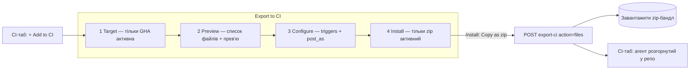

# Spec: Export to CI — UI (wizard, CI-таб агента, сторінка CI Runs)
Spec ID: SPEC-06
Status: draft
Supersedes: —
Depends on: [`specs/server/SPEC-05-export-to-ci-server.md`](../server/SPEC-05-export-to-ci-server.md)

## Affected packages
- **`client/`** — первинний пакет: 4-кроковий wizard «Export to CI», нова вкладка
  **CI** на сторінці агента, глобальна сторінка **CI Runs**, і хуки доступу до API
  в `lib/hooks/*`.
- **`server/`** — усі дані приходять з модуля `ci`, описаного в SPEC-05; нового
  контракту тут не вводиться.
- **`vendor/shared`** — усі потрібні контракти (`CiExportInput`, `CiExport`,
  `CiFile`, `CiInstallation`, `CiRun`, `CiRunStatus`, `CiTarget`) **вже
  віддзеркалені** в `client/src/vendor/shared/contracts/eval-ci.ts`. Нового
  дзеркалення в загальному випадку не потрібно.

## Проблема й користувач
**Хто:** той самий автор ревʼю-агента зі SPEC-05, але у Studio UI.

**Проблема:** серверний модуль `ci` без UI непридатний. Сторінка агента
(`client/src/app/agents/[id]/_components/AgentEditor/AgentEditor.tsx`) сьогодні
має вкладки Config/Skills/Context/Evals, а коментар прямо зазначає, що Stats/CI
«stay out of scope» (`AgentEditor.tsx:2-3`). Немає ні вкладки CI, ні wizard-а
розгортання, ні сторінки моніторингу CI-прогонів (нав-ключ `ci-runs` уже
змаплений у `app-shell/helpers.ts:38`, але самого пункту меню й сторінки немає).
Ця специфікація додає всі три поверхні.

## Goals / Non-goals

**Goals:**
- G-1. Вкладка **CI** на сторінці агента: заголовок «CI deployment» + пілюля
  «Active in N repos», контрол `Fail CI on`, список розгорнутих репозиторіїв зі
  статус-пілюлями, кнопки «Add to CI» (відкриває wizard) і «Update CI config».
- G-2. 4-кроковий wizard «Export to CI»: Target → Preview → Configure → Install.
- G-3. Функціональний install-шлях «Copy files as a zip» — віддача завантажуваного
  бандла; після інсталяції CI-таб показує агента розгорнутим у репо.
- G-4. Глобальна сторінка **CI Runs**: історія CI-прогонів (репо, агент, подія,
  статус, серйозність vs поріг, час) з посиланням у деталі прогону.
- G-5. Повний набір станів усіх трьох поверхонь: loading, порожньо, помилка,
  disabled-заглушки.

**Non-goals:**
- N-1. Реалізація недоступних цілей (CircleCI/Jenkins/Generic CLI) — рендеряться
  **disabled** з «coming soon», не вибираються (scope #1).
- N-2. Реалізація «Open a PR with these files» — рендериться, але **disabled/
  stub** (scope #2). Функціональний вибір — тільки «Copy files as a zip».
- N-3. Будь-яка клієнтська генерація workflow/маніфесту — усі файли й `contents`
  приходять із сервера (SPEC-05 AC-4). Клієнт лише показує/віддає їх.
- N-4. Будь-яка звірка severity/статусу на клієнті — статус і поріг приходять із
  сервера; клієнт довіряє отриманому.
- N-5. Будь-яке пряме `fetch` із компонента — тільки через `lib/hooks/*` →
  `lib/api.ts` (`client/CLAUDE.md`).
- N-6. Наповнення `ci_runs` (ingest результатів CI-прогонів) — **поза scope цієї
  ітерації** (SPEC-05 D-6). CI-таб і сторінка CI Runs рендеряться **лише над
  наявними** рядками `ci_runs` (напр. seed-даними) і можуть бути порожні; фіча їх
  не наповнює.

## User stories
- **US-1.** Як автор агента, я хочу відкрити вкладку CI й побачити, у яких репо
  агент розгорнутий і як пройшов останній прогін.
- **US-2.** Як автор агента, я хочу пройти wizard і отримати zip із файлами, щоб
  закомітити їх у цільовий репозиторій.
- **US-3.** Як автор агента, я хочу бачити прев'ю згенерованих файлів і
  налаштувати тригери та спосіб публікації перед експортом.
- **US-4.** Як автор агента, я хочу керувати порогом `Fail CI on` прямо на CI-табі.
- **US-5.** Як користувач, я хочу на сторінці CI Runs побачити історію CI-прогонів
  і перейти в деталі будь-якого.

## Потік wizard (для контексту)

## Acceptance criteria (EARS)

### Дані й хуки
- **AC-1** (Ubiquitous). Система повинна тримати доступ до API у хуках
  `client/src/lib/hooks/ci.ts` (TanStack Query → `lib/api.ts`) і **ніколи** не
  викликати `fetch` із компонента (`client/CLAUDE.md`): щонайменше
  `useAgentCi(agentId)` (список інсталяцій + статуси), `useExportCi(agentId)`
  (мутація експорту), `useCiRuns()` (глобальний список), і засіб зміни
  `Fail CI on`.
- **AC-2** (Event-driven). КОЛИ користувач завершує wizard вибором «Copy files as
  a zip», система повинна викликати мутацію експорту з тілом
  `{ repo, target:'gha', action:'files', post_as, triggers, base }` і на успіх
  оновити кеш CI-таба (список інсталяцій) для цього агента.
- **AC-3** (Ubiquitous). Хуки повинні використовувати спільні `queryKey`
  (напр. `["agent-ci", agentId]`, `["ci-runs"]`) так, щоб усі споживачі однієї
  поверхні читали один кеш.

### Вкладка CI (сторінка агента)
- **AC-4** (Ubiquitous). Система повинна додати вкладку **CI** у `AgentEditor`
  поряд із наявними (Config/Skills/Context/Evals), у колокованій теці
  `_components/CITab/` за зразком сусідніх вкладок, зі станом у `?tab=ci`
  (`AgentEditor.tsx`).
- **AC-5** (Ubiquitous). CI-таб повинен показувати заголовок «CI deployment» і
  пілюлю «● Active in N repos», де **N = кількість інсталяцій** із хука (не
  захардкоджене).
- **AC-6** (Ubiquitous). CI-таб повинен показувати сегментний контрол
  `Fail CI on` зі значеннями `Critical`/`Warning +`/`Never`, чиє поточне значення
  береться з даних агента (`ci_fail_on`), і зміна якого викликає відповідну
  мутацію (SPEC-05 AC-16), з описом «Exit non-zero when a finding at or above
  this severity lands…».
- **AC-7** (Ubiquitous). CI-таб повинен показувати список розгорнутих репозиторіїв,
  по рядку на інсталяцію: іконка + `repo` + бейдж цілі («GitHub Actions») +
  статус-пілюля останнього прогону + відносний час, і рядок-кнопку
  «+ Add repository».
- **AC-8** (Event-driven). КОЛИ користувач натискає «+ Add to CI» (або
  «+ Add repository»), система повинна відкрити wizard «Export to CI» на кроці 1.
- **AC-9** (Event-driven). КОЛИ користувач натискає «↻ Update CI config», система
  повинна перегенерувати бандл для наявних інсталяцій із **поточного стану
  агента + дефолтів** (wizard-вибір не персиститься — SPEC-05 D-1) і віддати
  оновлений zip; пре-філу попередніх виборів немає (рішення D-C2).
- **AC-10** (State-driven). ПОКИ триває завантаження інсталяцій, таб повинен
  показувати скелетон, а не порожній чи помилковий стан.
- **AC-11** (State-driven). ПОКИ в агента немає жодної інсталяції, таб повинен
  показувати порожній стан «ще не розгорнуто» з єдиним CTA «+ Add to CI», а
  пілюля показує «Active in 0 repos» (або приховується).
- **AC-12** (State-driven). ПОКИ для інсталяції ще немає жодного прогону, її рядок
  повинен показувати нейтральний статус («ще не запускалось»), а не вигаданий
  «succeeded» (SPEC-05 AC-19). Оскільки цією ітерацією `ci_runs` не наповнюється
  (SPEC-05 D-6), нейтральний статус — очікувано типовий стан.

### Wizard — крок 1 (Target)
- **AC-13** (Ubiquitous). Крок Target повинен показувати сітку 2×2 карток
  (GitHub Actions / CircleCI / Jenkins / Generic CLI), де **GitHub Actions**
  вибрана за замовчуванням і має бейдж «recommended».
- **AC-14** (Optional feature). ДЕ ціль ≠ GitHub Actions, картка повинна
  рендеритись **disabled** з міткою «coming soon» і не давати перейти далі
  (scope #1). «Continue →» активна лише для GitHub Actions.

### Wizard — крок 2 (Preview)
- **AC-15** (Ubiquitous). Крок Preview повинен показувати двопанельний вигляд:
  ліворуч — список «FILES TO CREATE» (кожен файл із `CiExport.files`), праворуч —
  monospace-прев'ю `contents` вибраного файлу з його шляхом у заголовку.
- **AC-16** (Ubiquitous). Список файлів і прев'ю повинні відображати **фактичний**
  набір із сервера (SPEC-05 AC-4..AC-9), а не захардкоджений із мокапу: бандл
  містить маніфест + skill-файли + workflow + **рунер-бандл**, а
  `.devdigest/memory.jsonl` у ньому **немає** (SPEC-05 D-3). Прев'ю рендерить рівно
  те, що повернув сервер.
- **AC-17** (Event-driven). КОЛИ користувач обирає файл у лівому списку, права
  панель повинна показати `contents` саме цього файлу.

### Wizard — крок 3 (Configure)
- **AC-18** (Ubiquitous). Крок Configure повинен показувати мульти-селект чипів
  тригерів (`pull_request:opened`/`synchronize`/`reopened`) з двома вибраними за
  замовчуванням, і радіо-групу «Post results as»
  (`GitHub review` [recommended, default] / `PR comment` / `None`).
- **AC-19** (Event-driven). КОЛИ користувач змінює тригери, крок Preview (workflow
  YAML) повинен відобразити оновлений `on.pull_request.types`, **перезапитавши
  серверне прев'ю** з поточними виборами (debounced) — жодної клієнтської
  генерації YAML (N-3, рішення D-C1).
- **AC-20** (Unwanted behavior). ЯКЩО користувач зняв усі тригери, ТОДІ система
  повинна не дати продовжити (щонайменше один тригер обовʼязковий), показавши
  причину.
- **AC-21** (Ubiquitous). Інфо-виноска повинна пояснювати звʼязок із `Fail CI on`
  (CI-таб) і required status check для блокування мерджу (мокап 03), як текст, не
  як активну дію.

### Wizard — крок 4 (Install)
- **AC-22** (Ubiquitous). Крок Install повинен показувати дві картки: «Open a PR
  with these files» (бейдж «recommended», але **disabled/stub**, scope #2) і
  «Copy files as a zip» — **функціональний** шлях.
- **AC-23** (Optional feature). ДЕ вибрано «Open a PR…», кнопка «Install» повинна
  лишатися недоступною або показувати, що шлях недоступний у цій ітерації; реально
  інсталювати можна тільки через «Copy files as a zip».
- **AC-24** (Event-driven). КОЛИ користувач тисне «✓ Install» з вибором
  «Copy files as a zip», система повинна викликати експорт (AC-2), сформувати
  завантажуваний **zip** (або копійований бандл) із `CiExport.files` і віддати
  його користувачу.
- **AC-25** (State-driven). ПОКИ триває експорт, кнопка «Install» повинна бути в
  стані завантаження й недоступна для повторного натискання.
- **AC-26** (Unwanted behavior). ЯКЩО експорт завершився помилкою, ТОДІ wizard
  повинен показати стан помилки з можливістю повторити і **не** закритись мовчки,
  вдаючи успіх.
- **AC-27** (Event-driven). КОЛИ експорт успішний, система повинна закрити wizard і
  показати агента розгорнутим у цільовому репо на CI-табі (кеш оновлено, AC-2).

### Сторінка CI Runs (глобальна)
- **AC-28** (Ubiquitous). Система повинна додати пункт навігації **CI Runs** у
  реєстр нав-меню (`client/src/vendor/ui/nav.ts`) у групі GLOBAL нижче
  «Agent Performance» і маршрут `client/src/app/ci-runs/page.tsx` (нав-ключ
  `ci-runs` уже змаплений у `app-shell/helpers.ts:38`).
- **AC-29** (Ubiquitous). Сторінка CI Runs повинна показувати список CI-прогонів
  (`useCiRuns`) над **наявними** рядками `ci_runs` (SPEC-05 D-6 — фіча їх не
  наповнює, тож список може бути порожнім), по рядку на прогін, з колонками: репо,
  агент, подія-тригер, статус (`succeeded`/`failed`/`running`/`no_findings`),
  серйозність vs поріг `Fail CI on`, час — і посиланням у деталі/трейс прогону
  (склад колонок — пропозиція, лишається на розсуд користувача, див. OQ-1).
- **AC-30** (State-driven). ПОКИ прогонів немає, сторінка повинна показувати
  порожній стан (а не спінер назавжди й не помилку).
- **AC-31** (Ubiquitous). Сторінка `page.tsx` повинна лишатися тонкою: логіка — у
  колокованому `_components/`, дані — лише через хук (`client/CLAUDE.md`).

### Конвенції
- **AC-32** (Ubiquitous). Усі нові рядки UI повинні жити в
  `client/messages/en/*.json` (`next-intl`) і діставатись через `useTranslations`;
  інлайн-тексту в компонентах бути не повинно.
- **AC-33** (Ubiquitous). Кожен новий компонент повинен мати колокований
  `*.test.tsx`; сторінкові тести не рендерять `AppShell` напряму, а мокають його
  як pass-through і передають потрібні namespace-и в `NextIntlClientProvider`
  (`client/INSIGHTS.md`, 2026-08-01/2026-08-03).

## Edge cases
- **EC-1.** Агент без інсталяцій → порожній стан CI-таба з єдиним CTA (AC-11).
- **EC-2.** Інсталяція без прогонів → нейтральний статус у рядку (AC-12).
- **EC-3.** Вибір недоступної цілі (Circle/Jenkins/CLI) → картка disabled,
  «Continue» неактивна (AC-14).
- **EC-4.** Вибір «Open a PR…» → «Install» недоступний/повідомлення; реальний
  шлях тільки zip (AC-23).
- **EC-5.** Усі тригери зняті на кроці 3 → не дає продовжити (AC-20).
- **EC-6.** Бандл містить 0 skill-файлів (агент без навичок) → список файлів
  показує лише маніфест/workflow/рунер, прев'ю не ламається (SPEC-05 EC-1).
- **EC-7.** Дуже довгий `system_prompt` у прев'ю файлу → monospace-панель
  скролиться, не ламаючи розкладку wizard (та сама UX-обачність, що для довгих
  шляхів у `client/INSIGHTS.md`).
- **EC-8.** Експорт впав (5xx/мережа) → стан помилки в кроці Install, wizard не
  закривається, дані не «вдають» успіх (AC-26).
- **EC-9.** Повторний експорт у той самий репо → на CI-табі рядок не дублюється
  (сервер робить upsert, SPEC-05 AC-11); кеш оновлюється коректно.
- **EC-10.** Наявний рядок `ci_runs` із `ci_installation_id: null` (інсталяцію
  видалили) → на сторінці CI Runs прогін показується без активного посилання на
  репо (SPEC-05 EC-7).
- **EC-11.** `prId`/деталі прогону відсутні → посилання «в деталі» рендериться
  неактивним, не «мертвим».

## Non-functional requirements
- **NFR-1 (Продуктивність).** CI-таб і CI Runs роблять по одному `GET` на
  монтування, без polling; спільні `queryKey` (AC-3). Прев'ю файлів рендериться з
  уже отриманих `contents`, без повторних запитів per-file (окрім регенерації
  прев'ю при зміні тригерів, AC-19).
- **NFR-2 (Безпека).** `CiFile.contents` (workflow, маніфест із `system_prompt`,
  тіла навичок) виводяться як **plain text** у monospace-прев'ю (JSX-екранування),
  без `dangerouslySetInnerHTML` і без виконання. Zip формується з отриманих
  байтів; жодного парсингу/eval вмісту на клієнті.
- **NFR-3 (Доступність).** Статус-пілюлі й рівень severity розрізняються **текстом**,
  не лише кольором; сегментний контрол `Fail CI on`, чипи тригерів і радіо
  «Post results as» досяжні з клавіатури й мають доступні мітки; disabled-стани
  (недоступні цілі, stub «Open a PR») мають `aria-disabled`/пояснення, а не лише
  візуальне затемнення.
- **NFR-4 (Стан UI).** Вибір wizard (target/triggers/post_as/install-опція) —
  **ефемерний client-owned стан** (локальний `useState` у контейнері wizard), не
  URL і не глобальний стор; активна вкладка агента лишається в `?tab=`
  (frontend-architecture: state ownership).
- **NFR-5 (Тестованість).** Кожен компонент колокований із тестом; хук `ci.ts`
  мокається безпосередньо (`vi.hoisted`), не через барел `@/lib/hooks`, аби
  вар'ювати відповідь per-test (`client/INSIGHTS.md`, 2026-08-11).

## Inputs and provenance
| Вхід | Джерело | Довіра | Відповідальний |
|---|---|---|---|
| `CiInstallation[]` + статуси | `GET /agents/:id/ci` (SPEC-05 AC-15) | Структура довірена | Сервер |
| `CiExport` (`files`, `installation`, `pr_url`) | `POST /agents/:id/export-ci` (SPEC-05 AC-4) | Структура довірена; `contents` — авторський текст агента/навичок | Сервер |
| `CiRun[]` | `GET /ci/runs` (SPEC-05 AC-17) — **лише наявні рядки, може бути порожнім** (SPEC-05 D-6) | Довірена | Сервер |
| `agent.ci_fail_on` | дані агента | Довірена | Сервер |
| Вибір wizard (`repo`, `target`, `triggers`, `post_as`, `action`) | ввід користувача у Studio | Валідовний на сервері (SPEC-05 AC-14/AC-21) | Клієнт збирає, сервер валідує |

## Untrusted inputs
1. **`CiFile.contents`** — містять `system_prompt` агента й тіла навичок (текст,
   який автор ввів у Studio). Вивід як plain text у прев'ю (NFR-2), zip — з сирих
   байтів, без інтерпретації на клієнті.
2. **`repo` (`"owner/name"`)** — вводить користувач у wizard; клієнт може зробити
   базову перевірку формату для UX, але **авторитетна** валідація — на сервері
   (SPEC-05 AC-21). Клієнт не інтерполює `repo` у небезпечні контексти.

## Traceability
| ID | Джерело | Повʼязані AC/EC | Як верифікувати |
|---|---|---|---|
| US-1 | мокап 05 (CI-таб) | AC-4, AC-5, AC-7, AC-10, AC-11, AC-12, EC-1, EC-2 | RTL-тест `CITab` із мокнутим `useAgentCi`: пілюля показує N=len(інсталяцій); рядки репо зі статус-пілюлями; порожній стан із CTA; loading → скелетон |
| US-2 | мокапи 01/04 + вимога | AC-2, AC-8, AC-22, AC-23, AC-24, AC-25, AC-27, EC-4, EC-8, EC-9 | RTL-тест wizard: «Add to CI» відкриває крок 1; «Copy as zip» + Install → мутація з `action:'files'`, зʼявляється завантаження zip; `isPending` дизейблить кнопку; помилка → стан помилки, wizard не закрито |
| US-3 | мокапи 02/03 | AC-15, AC-16, AC-17, AC-18, AC-19, AC-20, AC-21, EC-5, EC-6, EC-7 | RTL-тест: список файлів = `CiExport.files`; клік файлу → його `contents` у прев'ю; зняти всі тригери → «Continue» заблокована; зміна тригерів відображена в прев'ю workflow |
| US-4 | мокап 05 («Fail CI on») | AC-6 | RTL-тест: поточне значення = `agent.ci_fail_on`; клік сегмента → мутація зміни порогу |
| US-5 | мокап 05B (CI Runs) | AC-28, AC-29, AC-30, AC-31, EC-10, EC-11 | RTL-тест `CiRunsView` із мокнутим `useCiRuns`: рядки з репо/агент/статус/час + посилання; порожній стан; тонка `page.tsx`. Пункт меню присутній у `nav.ts` |
| US-1 (scope) | scope #1 | AC-13, AC-14, EC-3 | RTL-тест: GHA вибрана за замовчуванням; Circle/Jenkins/CLI disabled; «Continue» активна лише для GHA |
| NFR-2 | security-skill (A05 XSS) | AC-15, AC-24 | RTL/Unit: `contents` із `<script>` виводиться як текст; zip формується з сирих байтів без парсингу |
| NFR-3 | аналіз доступності + `client/INSIGHTS.md` (aria) | AC-6, AC-7, AC-18, AC-29 | RTL: `getByRole` знаходить сегментний контрол/чипи/радіо; статус доступний `getByText`; disabled має `aria-disabled` |
| NFR-4/NFR-5, AC-32, AC-33 | `client/CLAUDE.md` + `client/INSIGHTS.md` | AC-31, AC-32, AC-33, NFR-4 | `pnpm test` + `pnpm typecheck`; код-рев'ю на відсутність інлайн-рядків, `fetch` у компоненті й логіки в `page.tsx`; wizard-стан у `useState` |

## Прийняті припущення
- **A-1 (розміщення zip-віддачі).** «Copy files as a zip» реалізується як
  завантаження zip-файлу (Blob → download); точний UX (миттєве завантаження vs
  кнопка «Download») не заданий дизайном — вимога лише в тому, що бандл
  віддається користувачу (AC-24). Форма — на розсуд імплементації.
- **A-2 (колонки CI Runs).** Дизайн називає CI Runs лише як пункт меню; набір
  колонок (репо, агент, подія, статус, severity vs поріг, час, посилання) —
  **пропозиція** цієї специфікації (AC-29), винесена в OQ-1.
- **A-3 (нав-група GLOBAL).** `nav.ts` наразі не має групи GLOBAL/«Agent
  Performance» (є лише SKILLS LAB і WORKSPACE), хоча нав-ключі `agent-performance`
  і `ci-runs` уже змаплені в `helpers.ts`. Пункт «CI Runs» додається в нову/наявну
  групу GLOBAL; якщо групи ще немає — її створення входить у цю фічу (AC-28).
- **A-4 (мова UI).** Нові рядки — англійською в `messages/en/*.json`; українська
  лишається мовою специфікацій.
- **A-5 (склад прев'ю).** Список файлів у кроці Preview дзеркалить фактичний
  серверний бандл (SPEC-05 AC-4..AC-9), а не 5 файлів із мокапу; фінальний склад
  (рунер-бандл включено, `memory.jsonl` виключено) визначає SPEC-05 D-3.

## Прийняті рішення
- **D-C1 (регенерація прев'ю).** Прев'ю workflow при зміні тригерів оновлюється
  **повторним серверним запитом** (debounced), без клієнтської генерації YAML —
  узгоджено з N-3 (AC-19). Закриває колишнє OQ-4.
- **D-C2 («Update CI config»).** «↻ Update CI config» регенерує бандл із поточного
  стану агента + дефолтів і віддає оновлений zip; **пре-філу** попередніх
  wizard-виборів немає, бо вони не персистяться (SPEC-05 D-1). Закриває колишнє
  OQ-2.

## Open questions
Лишаються два питання суто на розсуд користувача (обидва не блокують імплементацію):

- **OQ-1 (колонки CI Runs).** Підтвердити фінальний набір колонок сторінки CI
  Runs (AC-29). Пропозиція: репо · агент · подія-тригер · статус · severity vs
  поріг · час · посилання в деталі. Чи потрібні ще (провайдер/модель, вартість,
  тривалість, фільтр за репо/агентом)? — до підтвердження діє пропозиція.
- **OQ-3 (ціль посилання «в деталі»).** Куди веде посилання з рядка CI Runs
  (AC-29/EC-11) — на наявну сторінку деталей ревʼю/трейсу PR, чи потрібна окрема
  сторінка деталей CI-прогону? Дизайн деталей не надано. (Зауваж: оскільки
  `ci_runs` цією ітерацією не наповнюється — SPEC-05 D-6 — це питання не блокуюче:
  список зазвичай порожній.)
</content>
