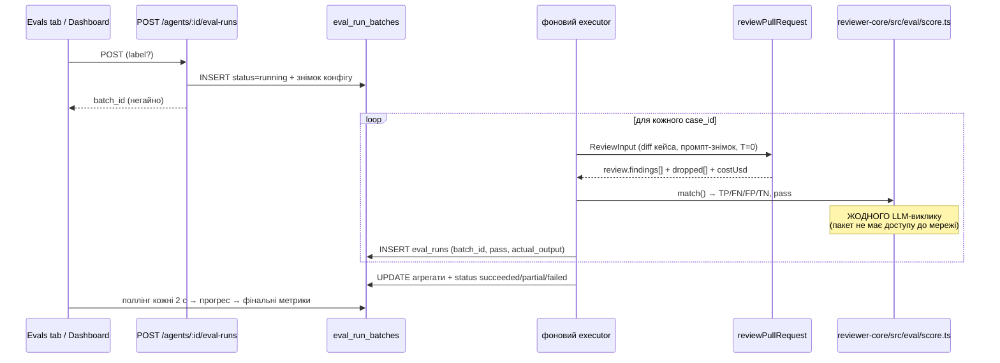
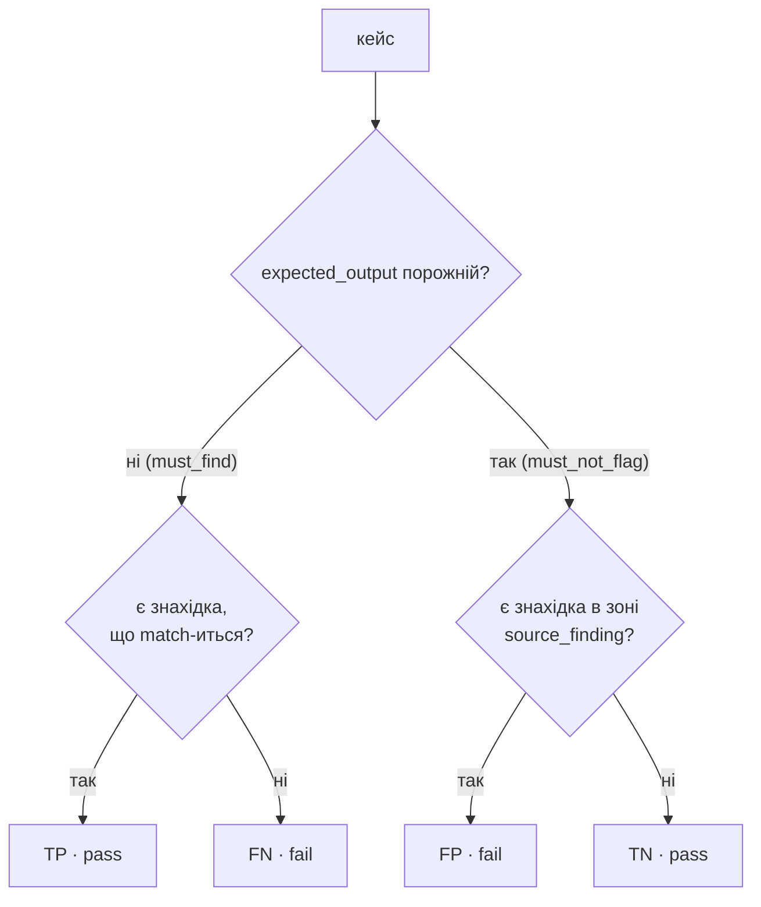

# Spec: Eval Pipeline — регресійний захист рев'ю-агента на датасеті з реальних знахідок
Spec ID: SPEC-05
Status: draft
Supersedes: —

## Affected packages

- **`server/`** — первинний пакет: нова таблиця `eval_run_batches` + колонка `eval_runs.batch_id`,
  маршрути створення кейса зі знахідки, `POST /agents/:id/eval-runs` з фоновим виконанням,
  читання батчів/кейсів/порівняння, розширення `seed.ts`.
- **`reviewer-core/`** — новий чистий модуль `src/eval/` (правило збігу + скоринг). Движок
  `reviewPullRequest` **не змінюється**.
- **`client/`** — кнопка «Turn into eval case» на `FindingCard`, вкладка **Evals** в `AgentEditor`,
  сторінка **Eval Dashboard** (список агентів + сторінка агента), модалка **Compare**.
- **`vendor/shared`** — новий контракт `EvalBatchRecord` (+ супутні) додається **спочатку** в
  `server/src/vendor/shared/contracts/eval-ci.ts`, потім дзеркалиться в
  `client/src/vendor/shared/contracts/eval-ci.ts` лише в обсязі, потрібному UI (правило drift
  з кореневого `CLAUDE.md`).
- **Кореневий `CLAUDE.md`** — секція «Commands» отримує рядок про `verify:l06`. Це зміна
  routing-документа, тож за власним eval-routing репозиторію вона вимагає `pnpm eval:workflow`
  (див. «Готово, коли»). Зміну робить людина, не ця специфікація.

---

## Проблема й користувач

**Хто:** інженер, який редагує system prompt рев'ю-агента в Agent Studio (`/agents/:id`).

**Проблема:** сьогодні єдиний спосіб дізнатися, чи новий промпт кращий за старий — запустити
агента на PR і подивитись очима. Немає жодного механізму, який ловив би регресію: агент перестав
знаходити те, що знаходив учора, або почав завалювати рев'ю шумом. При цьому в продукті **вже є**
готовий датасет — рішення користувача `Accept`/`Dismiss` по кожній знахідці (`findings.accepted_at`
/ `findings.dismissed_at`): accepted-знахідка це «сюди агент мусить дивитись», dismissed —
«сюди агент дивитись не мусив». Ці дані нікуди не використовуються.

**Що дає фіча:** знахідка одним кліком перетворюється на eval-кейс; набір кейсів агента
прогоняється однією кнопкою; результат — `recall` / `precision` / `citation_accuracy` по всьому
набору; історія прогонів зберігається, і два прогони («старий промпт vs новий») порівнюються
поруч — з дельтами метрик, дифом system prompt і переліком кейсів, які змінили `pass`.

**Стан репозиторію на старті (перевірено):** таблиці `eval_cases` / `eval_runs`
(`server/src/db/schema/eval.ts`) і контракти `EvalCase` / `EvalRun` / `EvalPerTrace` / `EvalCaseInput`
/ `EvalRunRecord` / `EvalRunResult` / `EvalTrendPoint` / `EvalDashboard` вже вмерджені курсом, але
**у продукті не використовуються** — жодного споживача `evalCases` поза схемою немає. Фіча будується
поверх них, а не з нуля.

---

## Goals / Non-goals

**Goals:**

- **G-1.** Кейс створюється з реальної знахідки одним кліком; тип очікування (`must_find` /
  `must_not_flag`) виводиться з рішення користувача по цій знахідці.
- **G-2.** Прогін агента на **всьому** наборі кейсів однією дією; батч має власну ідентичність
  і власні агрегати.
- **G-3.** Скоринг детермінований і не робить **жодного** LLM-виклику — це доводиться механічно
  (розташуванням коду + статичною перевіркою), а не обіцянкою в тексті.
- **G-4.** Історія прогонів зберігається так, щоб два прогони були **порівнянні**: конфіг агента
  знімається на старті батча, а не читається з агента при перегляді.
- **G-5.** Зміна system prompt **видимо** рухає `recall` **і** `precision` між двома прогонами
  (D-9) — це і є доказ, що пайплайн вимірює щось реальне.
- **G-6.** Seed дає готовий набір **≥8** кейсів, придатний для демо без ручної підготовки.
- **G-7.** `pnpm verify:l06` існує як команда й зелений.

**Non-goals** (є на дизайні або напрошуються, але свідомо не робимо):

- **N-1.** Ручне створення / редагування / видалення кейса («New eval case», ✎, 🗑, `Run on save`).
  Єдине джерело кейсів — знахідка.
- **N-2.** `Run case` для одного кейса. Прогін тільки батчем.
- **N-3.** Кнопка `Promote v7` у модалці Compare.
- **N-4.** `Run all agents` на дашборді.
- **N-5.** Фільтр `30 days`, дропдаун вибору агента в шапці сторінки агента, alert-банер
  («Precision dipped 2pts…»), спарклайни в картках агентів.
- **N-6.** Таби `Files` / `PR meta` в модалці кейса; модалка read-only, лише `Diff`.
- **N-7.** Таби `Stats` / `CI` в `AgentEditor` (на макеті вони є — додається **тільки** `Evals`).
- **N-8.** Зміна наявних контрактів `EvalRun`, `EvalDashboard`, `EvalTrendPoint`, `EvalCase`,
  `EvalCaseInput`, `EvalRunRecord`, `EvalRunResult` — вони лишаються байт-у-байт (D-1a).
- **N-9.** Заміна таблиці `eval_runs` на батчеву — рядок-на-кейс лишається (D-1).
- **N-10.** Використання eval-прогону як продуктового рев'ю: жодного запису в `reviews`,
  `findings`, `agent_runs` (D-6).
- **N-11.** LLM-суддя (LLM-as-judge) у скорингу — заборонено конструктивно (D-5).

---

## Ключові рішення (D-1…D-9)

Ці рішення **ухвалені до написання специфікації** й не перевідкриваються нижче — решта документа
є їх розгорткою в перевірювані критерії.

### D-1. Батч поверх наявних таблиць; наявні контракти не ламаємо

У вихідному матеріалі є внутрішня невідповідність: контракт `EvalRun`
(`server/src/vendor/shared/contracts/knowledge.ts:59`) уже **батчевий** (`traces_passed`,
`traces_total`, `per_trace[]`), а таблиця `eval_runs` (`server/src/db/schema/eval.ts:23`) —
рядок на **ОДИН** кейс (`case_id` + одиничні `recall`/`precision`/`citation_accuracy`). Завдання
вимагає прогін на всьому наборі й порівняння двох прогонів, тобто **батчу потрібна власна
ідентичність** — без неї «прогін» неможливо ні вибрати чекбоксом, ні порівняти.

**Рішення:** `eval_runs` лишається рядком-на-кейс. Додається таблиця **`eval_run_batches`**:
`id`, `workspace_id`, `agent_id`, `agent_version`, `system_prompt_snapshot`, `system_prompt_hash`,
`model`, `provider`, `skill_slugs`, `case_ids`, `status`, агрегати `recall` / `precision` /
`citation_accuracy` / `traces_passed` / `traces_total` / `duration_ms` / `cost_usd`, `label`,
`error`, `started_at`, `finished_at`. Плюс колонка **`eval_runs.batch_id`** (FK на
`eval_run_batches.id`, **nullable** — щоб наявні рядки, якщо вони колись з'являться поза батчем,
лишались валідними).

**Причина, чому не переробити `eval_runs` на батчеву:** тоді зникає per-case гранулярність, без
якої неможлива per-case таблиця «кейс: pass → fail» у Compare — а це найцінніший екран усієї фічі.

Міграція — **тільки** через `pnpm db:generate` (кореневий `CLAUDE.md`: `server/src/db/migrations/*`
і `meta/` ніколи не редагуються й не нумеруються руками).

### D-1a. Nullable-метрики — новим контрактом, а не зміною старого

`EvalRun` вимагає `recall` / `precision` / `citation_accuracy` як `z.number().min(0).max(1)` —
**не** nullable; так само `EvalDashboard.current` / `.delta` і `EvalTrendPoint`. Але вироджені
знаменники (див. D-2a) мають давати `null`, а не `0`: `0` читається як «агент нічого не знайшов»,
а це протилежне за змістом «нема чого рахувати».

**Рішення:** батч отримує **новий** контракт `EvalBatchRecord` у
`server/src/vendor/shared/contracts/eval-ci.ts` (**додавання**, не зміна) з nullable-метриками.
`EvalRun`, `EvalDashboard`, `EvalTrendPoint`, `EvalCase`, `EvalCaseInput`, `EvalRunRecord`,
`EvalRunResult` **не чіпаються взагалі**. Спочатку server, потім дзеркало в client лише в обсязі,
потрібному UI.

### D-2. Формат очікувань — як у дизайні, із зоною в `input_meta`

`eval_cases.expected_output` = масив Finding-подібних об'єктів, буквально як у макеті модалки
кейса: `[{ severity, category, title, file, start_line }]`.

Тип очікування **виводиться**, окремої колонки немає:
- непорожній масив → **`must_find`**;
- порожній масив `[]` → **`must_not_flag`**.

`input_diff` кейса = **повний хунк знахідки** (усі хунки, що містять рядки знахідки, цілком), а не
весь діф PR і не вікно ±N рядків. Межі беруться **з парсера** (`adapters/git/diff-parser.ts`) —
жодного нового магічного числа. Тоді агент бачить рівно той контекст, у якому людина ухвалила
рішення, і `must_not_flag`-кейс фізично не може «не показати» заборонену зону.

Зверни увагу на розмежування, яке легко переплутати: **діф кейса** (повний хунк) — це те, що
бачить агент; **заборонена зона для FP** — це вужче, лише діапазон
`input_meta.source_finding.start_line…end_line` (D-2a). Знахідка в тому самому хунку, але поза цим
діапазоном, FP **не** є.

`input_meta` зберігає походження:
```json
{
  "source_finding": {
    "finding_id": "…", "file": "src/config.ts",
    "start_line": 12, "end_line": 12,
    "decision": "accepted"
  },
  "pr_id": "…", "pr_number": 482, "review_id": "…"
}
```

**Чому не «будь-яка знахідка поза очікуваннями = FP»:** тоді `precision` був би стабільно ≈0 —
агент правомірно знаходить речі, яких у наборі немає, і метрика перестала б вимірювати що-небудь.
Тут FP — попадання саме в зону, яку людина вже **відхилила**.

### D-2a. Метрики (найкритичніше місце фічі)

| Термін | Визначення |
|---|---|
| **TP** | `must_find`-кейс, для якого є хоч одна знахідка зі збігом за D-3 |
| **FN** | `must_find`-кейс без збігу |
| **FP** | `must_not_flag`-кейс (`expected: []`), у якому агент видав знахідку, що влучає в зону `input_meta.source_finding` за тим самим правилом збігу D-3 |
| **TN** | `must_not_flag`-кейс без такої знахідки |

- `recall = TP / (TP + FN)` — рахується **лише** по `must_find`-кейсах;
- `precision = TP / (TP + FP)`;
- `citation_accuracy = kept / (kept + dropped)` — по **всіх** знахідках батча, з `ReviewOutcome`;
- `pass` кейса: `must_find` → є збіг; `must_not_flag` → немає знахідки в забороненій зоні;
- знахідки, що не збіглися **ні з чим**, у метрики не входять; їхня кількість зберігається як
  діагностика `unmatched_count` (в `eval_runs.actual_output`), **не** як критерій;
- вироджений знаменник → **`null`**, ніколи не `0`; UI показує «—».

Фіксується явно: **FP визначається по зоні `source_finding`**, а не «будь-яка знахідка в порожньому
кейсі» — на багатофайловому зрізі це різні цифри.

### D-3. Правило збігу

`match(expected, finding)` = нормалізовані шляхи **рівні** І діапазони рядків **перетинаються**:

```
exp.start <= f.end_line && f.start_line <= exp.end
```

Нормалізація шляху: зняти префікси `a/`, `b/`, `./`, лідируючий `/`, звести роздільники до `/`;
порівняння **регістрозалежне**. Якщо в очікуванні немає `end_line` (формат дизайну його не має) —
`end_line = start_line`.

Це має бути **ОДНА експортована функція** з юніт-тестами: саме тут пайплайн ламається тихо —
розбіжність `a/src/x.ts` vs `src/x.ts` перетворює recall на 0 без жодної помилки в логах.

### D-4. Порівнянність прогонів

- Діф береться **з кейса**, а не з PR.
- Intent, repo-intel, memory і context-docs у eval-прогоні **вимкнені** — у `ReviewInput` вони
  просто не передаються; тоді пост-grounding scope-фільтр (`applyScopeFilter`) — no-op, а вивід
  залежить лише від промпта, моделі й діфа кейса.
- `temperature = 0`, де провайдер це підтримує.
- System prompt, його хеш, модель, провайдер, набір скілів і версія агента пишуться в батч
  **НА СТАРТІ**, а не читаються з агента при перегляді історії — інакше порівняння двох прогонів
  недоказове: агента могли відредагувати між прогоном і переглядом.

### D-5. Скоринг — у `reviewer-core`

Чиста функція в **`reviewer-core/src/eval/score.ts`**. Пакет фізично не має доступу до БД, мережі
та LLM (`reviewer-core ↛ both`, кореневий `CLAUDE.md`) — це і є **механічний** доказ критерію
«жодного LLM-виклику», а не обіцянка. Додатково — статична перевірка у verify-скрипті: у
`reviewer-core/src/eval/**` немає імпортів `llm/`, `openai`, `@anthropic-ai/sdk`, `postgres`,
`drizzle`.

### D-6. Прогін не забруднює продуктові дані

Eval-прогін **НЕ пише** в `reviews`, `findings`, `agent_runs`. Результат живе лише в
`eval_runs` / `eval_run_batches`. Інакше метрики продукту (accept_rate, severity-роллапи, cost-per-PR)
почали б рахувати штучні прогони.

### D-7. `verify:l06`

Живе як **`scripts/verify-l06.sh`** — кореневого `package.json` у репозиторії немає **навмисно**
(«no monorepo tooling»). Плюс аліас `"verify:l06": "../scripts/verify-l06.sh"` у
`server/package.json`, щоб команда `pnpm verify:l06` буквально існувала; **джерело правди —
скрипт**, аліас лише проксі.

Вміст скрипта, у порядку:
1. `typecheck` у `server/`, `client/`, `reviewer-core/`;
2. юніт-тести скорингу (`reviewer-core`);
3. тести eval-роутів (`server`);
4. тести UI-компонентів (`client`);
5. статична перевірка D-5.

Запускати треба **з `server/`**. У агентському шелі немає `node`/`pnpm` на `PATH` — потрібен
`NODE_BIN` з кореневого `CLAUDE.md`:

```bash
NODE_BIN="$(dirname "$(find "$HOME/Library/Application Support/JetBrains"/WebStorm*/node/versions/*/bin/node 2>/dev/null | head -1)")"
export PATH="$NODE_BIN:$PATH"
```

Пакетні менеджери не змішуються: `server`/`client` — **pnpm**, `reviewer-core` — **npm**
(кореневий `CLAUDE.md`; `pnpm install` у `reviewer-core/` створює стрей-лок і ламає CI).

### D-8. Датасет ≥8 кейсів — розширення seed

`server/src/db/seed.ts:122` вставляє `pr_files` **без поля `patch`**, тому `diffFromPrFiles`
(`server/src/modules/reviews/diff-loader.ts`) поверне порожній `UnifiedDiff` — тобто дифа для
кейсів фізично немає. Крім того, seed-`reviews` вставляється **без `agentId`**, а
`eval_cases.owner_id` обов'язковий.

Seed отримує: детермінований `patch` у `pr_files`, **10-12** знахідок, **вирівняних по рядках цих
patch'ів**, з проставленими `accepted_at` / `dismissed_at`, і `agent_id` на seed-`reviews`.
Прогін агента при цьому лишається **справжнім** LLM-викликом — сідуються тільки входи, не
результати. На відео 2-3 кейси створюються наживо кліком.

### D-9. Псування промпта має ламати саме `precision`

**Ризик:** якщо зіпсувати промпт у бік «репортуй лише про форматування», агент піде **геть** від
dismissed-зон — `recall` впаде до ~0, а `precision` лишиться `1.0` або взагалі `null`
(TP=0, FP=0), і критерій «видимо рухає recall/precision» провалиться.

Тому:
- зіпсований промпт — **«шумовий»**, а не «звужувальний»: «звітуй про кожну потенційну проблему,
  мінімум одна знахідка на кожен файл, включно зі стилем і форматуванням»;
- датасет має містити **≥3 `must_not_flag`**-кейси, зрізи яких лежать **у тих самих файлах/хунках**,
  де є `must_find` — тобто в зонах, повз які агент не пройде.

Це вимога і до seed (D-8), і до тексту експерименту — і винесена в AC, а не в примітку.

---

## Записи `INSIGHTS.md`, що стосуються справи

Прочитано `INSIGHTS.md` трьох зачеплених пакетів (`server`, `client`, `reviewer-core`;
останній порожній). Релевантні записи:

- **`server` 2026-08-23, «Recurring Errors & Fixes»** — `pnpm db:generate` падає з
  `Cannot find module './_shared.js'`, якщо у файлі схеми є **`.js`-розширення** у відносному
  імпорті. Нова таблиця `eval_run_batches` в `server/src/db/schema/eval.ts` мусить імпортувати
  сусідів **без розширення** (`./core`, `./agents`), як це вже роблять `core.ts`/`pulls.ts`.
  → NFR-8, AC-1.
- **`server` 2026-08-23, «Recurring Errors & Fixes»** — `z.object({}).default({})` не рятує
  body-less `POST` від 422 під `fastify-type-provider-zod`: тіло приходить як `null`. Для
  `POST /agents/:id/eval-runs` (тіло опційне) треба
  `z.preprocess((v) => v ?? {}, z.object({...}))`. → AC-20.
- **`server` 2026-08-03, «Tool & Library Notes»** — `tokens_in` **немонотонний** через
  провайдерське prompt-caching; не використовувати його як доказ «що дійшло до промпта» в жодному
  експерименті/евалі. → NFR-6: доказ порівнянності — `system_prompt_hash`, не токени.
- **`server` 2026-08-11** — `pnpm typecheck` у `server/` **не** типечекає `server/test/**`
  (`include: ["src/**/*.ts"]`), тож зелений typecheck нічого не доводить про типи тестів.
  → AC-77: `verify:l06` має запускати **тести**, не покладатись на typecheck як проксі.
- **`server` 2026-08-11** — `.it.test.ts` може «скіпнутись» у повному прогоні через
  false-negative `dockerAvailable()`; перевіряти файл ізольовано перед висновками.
  → NFR-4 / примітка до `verify:l06`.
- **`server` 2026-08-01, «Codebase Patterns»** — `enqueue()` повертає `done`, який **реджектиться**
  на помилці; кожен call-site мусить мати no-op `.catch()`, інакше `unhandledRejection` вбиває
  процес API. Стосується фонового запуску батча. → AC-21, AC-27.
- **`server` 2026-08-01, «What Works»** — `costUsd` береться з `ReviewOutcome.costUsd`
  (OpenRouter повертає `usage.cost` у тій самій відповіді), fallback —
  `container.priceBook.estimate()`. Жодного додаткового виклику заради вартості. → NFR-2.
- **`server` 2026-08-01, «Decisions»** — `cost_usd` має лишатись `null` (ніколи `0`) на
  провалених прогонах: UI читає `null` як «невідомо», `0` як «безкоштовно». Те саме правило
  переноситься на `eval_run_batches.cost_usd`. → AC-41, NFR-2.
- **`client` 2026-08-11, «What Doesn't Work»** — не мокати барел `@/lib/hooks` через
  `vi.importOriginal()`, якщо тест окремо мокає один із ре-експортованих модулів; мокати
  конкретний модуль (`@/lib/hooks/evals`). → Traceability (як верифікувати UI).
- **`client` 2026-08-01, «Recurring Errors & Fixes»** — новий i18n-namespace ламає наявні тести
  тихо-пізно: `NextIntlClientProvider` у тесті несе лише передані namespace'и. Ключі `evals.*`
  краще додати в наявний namespace сторінки агента, а не заводити новий файл. → AC-46, EC-22.
- **`client` 2026-08-01, «What Works»** — вартість форматується 3 значущими цифрами нижче $1,
  невідома — «—», ніколи «$0.00» (`components/run-cost-badge/format.ts`). Переюзати той самий
  форматер у таблиці прогонів. → AC-50.
- **`client` 2026-08-02, «Decisions»** — заборонено перевіряти зміни браузерними інструментами;
  доказ — `pnpm test` + `pnpm typecheck`. Скріншот/відео (див. «Готово, коли») знімає **людина**,
  це процесна вимога, не крок агента. → P-3, P-4.
- **`client` 2026-08-23, «Decisions»** — `useMutation().mutate()` не можна викликати без
  аргументу, навіть коли змінні опційні: передавати `mutate({})`. Стосується кнопки
  «Run all evals». → AC-47.
- **`client` 2026-08-05, «Tool & Library Notes»** — мутація, запущена з mount-ефекту, ненадійно
  ре-рендерить компонент під StrictMode; читати результат через `mutateAsync().then(setState)`.
  Стосується автостарту поллінгу після створення батча. → AC-48.
- **`reviewer-core/INSIGHTS.md`** — порожній; жодного запису, що стосується справи.

---

## User stories

- **US-1.** Як інженер, я хочу перетворити реальну знахідку на eval-кейс **одним кліком**, щоб
  датасет накопичувався з моєї щоденної роботи, а не з окремого ручного ритуалу.
- **US-2.** Як інженер, я хочу бачити всі кейси набору агента з їхнім статусом останнього прогону,
  щоб розуміти, на чому агент зараз ламається.
- **US-3.** Як інженер, я хочу однією кнопкою прогнати агента на **всіх** кейсах і отримати
  `recall` / `precision` / `citation_accuracy` по набору.
- **US-4.** Як інженер, я хочу бачити історію прогонів агента й тренд метрик, щоб помітити
  повільну деградацію.
- **US-5.** Як інженер, я хочу порівняти **два** прогони поруч — дельти метрик, діф system prompt
  і перелік кейсів, що змінили `pass`, — щоб довести, що новий промпт кращий (або гірший).
- **US-6.** Як інженер, я хочу бачити зведення по **всіх** агентах воркспейсу на одній сторінці,
  щоб знати, який агент просів.
- **US-7.** Як власник якості, я хочу бути впевненим, що скоринг детермінований і не витрачає
  ні цента на LLM, щоб метриці можна було довіряти як регресійному гейту.
- **US-8.** Як інженер, я хочу однією командою (`pnpm verify:l06`) перевірити, що вся фіча
  ціла — типи, скоринг, роути, UI і заборона LLM у скорингу.

---

## Acceptance criteria (EARS)

### A. Схема даних і контракти

- **AC-1** (Ubiquitous). Система повинна мати таблицю `eval_run_batches` з полями: `id`,
  `workspace_id` (FK `workspaces`, `on delete cascade`), `agent_id` (FK `agents`), `agent_version`,
  `system_prompt_snapshot`, `system_prompt_hash`, `model`, `provider`, `skill_slugs` (jsonb),
  `case_ids` (jsonb), `status`, `recall`, `precision`, `citation_accuracy`, `traces_passed`,
  `traces_total`, `duration_ms`, `cost_usd`, `label`, `error`, `started_at`, `finished_at`
  (D-1). Відносні імпорти у файлі схеми повинні бути **без `.js`-розширення** (`server/INSIGHTS.md`
  2026-08-23).
- **AC-2** (Ubiquitous). Таблиця `eval_runs` повинна отримати колонку `batch_id` — **nullable** FK
  на `eval_run_batches.id` з `on delete cascade`; решта її полів не змінюється (D-1).
- **AC-3** (Ubiquitous). Міграція повинна бути згенерована **виключно** через `pnpm db:generate`;
  жоден файл у `server/src/db/migrations/` чи `meta/` не редагується й не нумерується руками
  (кореневий `CLAUDE.md`).
- **AC-4** (Ubiquitous). Система повинна додати в `server/src/vendor/shared/contracts/eval-ci.ts`
  новий контракт `EvalBatchRecord`, у якому `recall`, `precision`, `citation_accuracy` і `cost_usd`
  — `z.number().nullable()`, а `status` — `z.enum(['running','succeeded','partial','failed'])`
  (D-1a).
- **AC-5** (Ubiquitous). Система повинна лишити `EvalRun`, `EvalCase`, `EvalOwnerKind`,
  `EvalPerTrace`, `EvalCaseInput`, `EvalRunRecord`, `EvalRunResult`, `EvalTrendPoint`,
  `EvalDashboard` **незміненими** — жодного редагування наявних полів (D-1a, N-8).
- **AC-6** (Ubiquitous). Нові контракти повинні бути додані **спочатку** в `server/src/vendor/shared`,
  і лише потім дзеркалені в `client/src/vendor/shared` — і лише в тому обсязі, який реально
  споживає UI (кореневий `CLAUDE.md`, правило drift).
- **AC-7** (Ubiquitous). Кожен запит читання чи запису eval-даних повинен скоупитись по
  `workspace_id`, взятому з контексту запиту, а не з тіла/параметрів.
- **AC-8** (Unwanted behavior). ЯКЩО агент, кейс або батч не належить воркспейсу запиту, ТОДІ
  система повинна відповісти `404` (а не `403`), не розкриваючи існування ресурсу.

### B. Створення кейса зі знахідки

- **AC-9** (Event-driven). КОЛИ користувач натискає «Turn into eval case» на `FindingCard` і
  знахідка придатна до конвертації (AC-15…AC-18a), система повинна створити рядок `eval_cases` з `owner_kind = 'agent'`,
  `owner_id = review.agent_id`, `workspace_id` з контексту, `name` — детермінованим слагом з
  заголовка знахідки, `input_diff` — зрізом хунка (AC-12), `expected_output` — за AC-11 і
  `input_meta` — за AC-13.
- **AC-10** (Ubiquitous). Кнопка «Turn into eval case» повинна стояти в наявному ряду дій
  `FindingCard` поруч із `Accept` / `Dismiss` / `Learn` / `Reply to author`.
- **AC-11** (Ubiquitous). Система повинна формувати `expected_output` так: для знахідки з
  непорожнім `accepted_at` — масив з **одного** об'єкта
  `{ severity, category, title, file, start_line }`, скопійованого зі знахідки (кейс `must_find`);
  для знахідки з непорожнім `dismissed_at` — порожній масив `[]` (кейс `must_not_flag`) (D-2).
- **AC-12** (Ubiquitous). Система повинна класти в `input_diff` **повний хунк знахідки** — усі
  хунки `pr_files.patch`, що містять рядки знахідки, цілком, з межами, взятими з
  `server/src/adapters/git/diff-parser.ts`. Ні весь діф PR, ні вікно ±N рядків не допускаються;
  жодного числового параметра розміру зрізу в коді бути не повинно (D-2).
- **AC-13** (Ubiquitous). Система повинна записувати в `input_meta` об'єкт
  `{ source_finding: { finding_id, file, start_line, end_line, decision }, pr_id, pr_number,
  review_id }`, де `decision ∈ {'accepted','dismissed'}` (D-2).
- **AC-14** (Ubiquitous). Система повинна **виводити** тип очікування з `expected_output`
  (непорожній → `must_find`, порожній → `must_not_flag`) і **не** зберігати його окремою
  колонкою (D-2).
- **AC-15** (Unwanted behavior). ЯКЩО знахідка не має ні `accepted_at`, ні `dismissed_at`, ТОДІ
  система повинна **не створювати** кейс і показати підказку «Accept or Dismiss first», при цьому
  сама кнопка «Turn into eval case» лишається **активною** — рішення користувача, збігається з
  макетом. Маршрут при прямому виклику відповідає `422`.
- **AC-16** (Unwanted behavior). ЯКЩО `review.agent_id` дорівнює `null` (старі дані), ТОДІ кнопка
  повинна бути **disabled** з поясненням, бо `eval_cases.owner_id` обов'язковий. Розмежування з
  AC-15 свідоме: «нерозмічена знахідка» — стан, який користувач може виправити тут і зараз
  (кнопка активна + підказка), а відсутній `agent_id` — властивість даних, яку кліком не
  полагодиш (кнопка мертва).
- **AC-17** (Unwanted behavior). ЯКЩО для цієї знахідки кейс уже створено, ТОДІ повторний клік
  **не** повинен створювати другий кейс; кнопка повинна показувати стан «Eval case created» з
  посиланням у вкладку **Evals** відповідного агента.
- **AC-18** (Unwanted behavior). ЯКЩО для PR знахідки немає `pr_files.patch`, з якого можна
  вирізати хунк, ТОДІ система повинна відповісти помилкою й **не** створювати кейс із порожнім
  `input_diff` — кейс із порожнім дифом мовчки дає `recall = 0`.
- **AC-18a** (Unwanted behavior). ЯКЩО `findings.kind` не дорівнює `'finding'` (напр. знахідка
  hook-детектора — `secret_leak`/`phantom`), ТОДІ система повинна **не** пропонувати конвертацію,
  а при прямому виклику маршруту відхилити її. Причина: hook-знахідки генеруються **детерміновано**
  і частина з них grounding-exempt, тож міряти ними якість промпта беззмістовно — метрика
  вимірювала б детектор, а не агента.

### C. Запуск батча

- **AC-19** (Event-driven). КОЛИ надходить `POST /agents/:id/eval-runs`, система повинна створити
  рядок `eval_run_batches` зі `status = 'running'` і **негайно** повернути `batch_id`, виконуючи
  прогін у фоні — за наявним патерном `server/src/modules/reviews/run-executor.ts`
  (`ReviewRunExecutor`).
- **AC-20** (Ubiquitous). Тіло `POST /agents/:id/eval-runs` повинно нормалізуватись через
  `z.preprocess((v) => v ?? {}, z.object({ label: z.string().nullish() }))` — інакше запит без тіла
  впаде `422` (`server/INSIGHTS.md` 2026-08-23).
- **AC-21** (Ubiquitous). Фоновий промис запуску повинен мати no-op `.catch()` на call-site —
  інакше відхилення вбиває процес API через `unhandledRejection` (`server/INSIGHTS.md` 2026-08-01).
- **AC-22** (Event-driven). КОЛИ батч створюється, система повинна записати **знімок** конфігу
  агента: `system_prompt_snapshot`, `system_prompt_hash`, `model`, `provider`, `skill_slugs`,
  `agent_version`, і надалі читати для порівняння **саме знімок**, а не поточний стан агента (D-4).
- **AC-23** (Ubiquitous). Набір кейсів батча повинен фіксуватись на старті в `case_ids`; кейси,
  створені під час виконання батча, у цей батч не потрапляють.
- **AC-24** (Unwanted behavior). ЯКЩО в агента немає жодного eval-кейса, ТОДІ `POST` повинен
  відповісти `422` і **не** створювати батч.
- **AC-25** (Ubiquitous). Система повинна виконувати кожен кейс через
  `reviewPullRequest(input: ReviewInput)` з `reviewer-core`, передаючи `diff` = розпарсений
  `input_diff` кейса, `systemPrompt` = знімок, `model` / провайдер = знімок, і **не передаючи**
  `intent`, `repoMap`, `callers`, `memory`, `specs`, `prDescription` (D-4).
- **AC-26** (Ubiquitous). Система повинна задавати `temperature = 0` там, де провайдер це
  підтримує (D-4).
- **AC-27** (Unwanted behavior). ЯКЩО виконання окремого кейса впало, ТОДІ система повинна
  записати рядок `eval_runs` з `pass = null` і причиною в `actual_output`, продовжити решту кейсів,
  а батч завершити зі `status = 'partial'`; метрики рахуються **лише** по кейсах, що відпрацювали.
- **AC-28** (Unwanted behavior). ЯКЩО впали **всі** кейси, ТОДІ батч повинен завершитись зі
  `status = 'failed'`, а всі агрегатні метрики — бути `null`.
- **AC-29** (State-driven). ПОКИ батч не завершено, `status` повинен лишатись `'running'`, а
  `finished_at` — `null`.
- **AC-30** (Ubiquitous). Eval-прогін повинен **ніколи** не писати в `reviews`, `findings` і
  `agent_runs` (D-6).
- **AC-31** (Ubiquitous). Система повинна віддавати прогрес батча (`traces_passed` /
  `traces_total` і кількість завершених кейсів) через читальний маршрут, придатний для поллінгу.

### D. Скоринг

- **AC-32** (Ubiquitous). Скоринг повинен бути реалізований як **чиста функція** в
  `reviewer-core/src/eval/score.ts`, без жодного I/O (D-5).
- **AC-33** (Ubiquitous). Модуль `reviewer-core/src/eval/**` повинен **не містити** імпортів
  `llm/`, `openai`, `@anthropic-ai/sdk`, `postgres`, `drizzle` — і це повинно перевірятись
  статично у `verify:l06` (D-5), а не лише декларуватись.
- **AC-34** (Ubiquitous). Правило збігу повинно бути **однією експортованою функцією**
  `match(expected, finding)`, яка повертає `true` тоді й лише тоді, коли нормалізовані шляхи рівні
  **І** `exp.start <= finding.end_line && finding.start_line <= exp.end` (D-3).
- **AC-35** (Ubiquitous). Нормалізація шляху повинна знімати префікси `a/`, `b/`, `./`, лідируючий
  `/` і зводити роздільники до `/`; порівняння лишається **регістрозалежним** (D-3).
- **AC-36** (Unwanted behavior). ЯКЩО в очікуванні відсутній `end_line`, ТОДІ система повинна
  вважати `end_line = start_line` (D-3).
- **AC-37** (Ubiquitous). Система повинна класифікувати кожен кейс як TP / FN / FP / TN за
  визначеннями D-2a, де **FP** визначається **виключно** попаданням у зону
  `input_meta.source_finding`, а не будь-якою знахідкою в `must_not_flag`-кейсі.
- **AC-38** (Ubiquitous). Система повинна обчислювати `recall = TP / (TP + FN)` **лише** по
  `must_find`-кейсах і `precision = TP / (TP + FP)`.
- **AC-39** (Ubiquitous). Система повинна обчислювати
  `citation_accuracy = kept / (kept + dropped)`, де `kept = review.findings.length`, а
  `dropped = dropped.length` з `ReviewOutcome`, підсумовані по всіх кейсах батча.
- **AC-40** (Ubiquitous). Система повинна **ніколи** не парсити рядок `ReviewOutcome.grounding`
  (напр. «3/4 passed») для отримання citation-метрики — джерелом є числові поля `review.findings`
  і `dropped` (поправка 1).
- **AC-41** (Unwanted behavior). ЯКЩО знаменник будь-якої метрики дорівнює нулю, ТОДІ система
  повинна повернути `null`, а **не** `0`; UI повинен показати «—» (D-2a, D-1a).
- **AC-42** (Ubiquitous). `pass` кейса повинен обчислюватись так: `must_find` → є збіг;
  `must_not_flag` → немає знахідки в забороненій зоні.
- **AC-43** (Ubiquitous). Знахідки, що не збіглися ні з чим, повинні **не** входити в жодну
  метрику; їхня кількість зберігається як `unmatched_count` в `eval_runs.actual_output` — як
  діагностика, не як критерій.
- **AC-44** (Ubiquitous). `traces_total` батча повинен дорівнювати кількості кейсів у наборі
  (`case_ids.length`), а `traces_passed` — кількості кейсів із `pass = true`; **обидва** екрани
  (вкладка Evals і Eval Dashboard) повинні читати ці самі агрегати батча, а не рахувати свої.

### E. Вкладка Evals в `AgentEditor`

- **AC-45** (Ubiquitous). `AgentEditor` повинен отримати **одну** нову вкладку `Evals` поруч із
  наявними `Config` / `Skills` / `Context`; вкладки `Stats` / `CI` з макета не додаються (N-7).
- **AC-46** (Ubiquitous). Вкладка `Evals` повинна показувати чотири плитки метрик — RECALL,
  PRECISION, CITATION ACCURACY, TRACES PASSED — з дельтою до попереднього батча, список кейсів
  і кнопку `Run all evals`.
- **AC-47** (Event-driven). КОЛИ користувач натискає `Run all evals`, клієнт повинен викликати
  мутацію з явним аргументом (`mutate({})`, не `mutate()`) і перейти в стан поллінгу
  (`client/INSIGHTS.md` 2026-08-23).
- **AC-48** (State-driven). ПОКИ батч у стані `running`, UI повинен опитувати статус кожні
  **2 секунди**, показувати прогрес `N / traces_total` і тримати кнопку `Run all evals`
  недоступною.
- **AC-49** (Unwanted behavior). ЯКЩО батч завершився зі `status = 'partial'`, ТОДІ UI повинен
  **явно** позначити це (бейдж/підпис «partial»), а не показувати метрики як повні.
- **AC-50** (Unwanted behavior). ЯКЩО метрика дорівнює `null`, ТОДІ UI повинен рендерити «—»;
  вартість форматується наявним форматером (`components/run-cost-badge/format.ts`), який уже
  показує «—» замість «$0.00» (`client/INSIGHTS.md` 2026-08-01).
- **AC-51** (Ubiquitous). Бейдж «X / Y passing» повинен рахувати `X` = кейси з `pass = true` в
  **останньому** батчі, `Y` = загальна кількість кейсів агента; кейс зі статусом «never run»
  входить у `Y` і **не** входить у `X`.
- **AC-52** (Ubiquitous). Рядок кейса повинен показувати іконку статусу (`✓` / `✗` / порожнє коло
  «never run»), моноширинну назву, підпис «expected N findings, got M» і бейдж
  `CRITICAL · security` / `WARNING · bug` / `empty []`.
- **AC-53** (Event-driven). КОЛИ користувач відкриває кейс, система повинна показати **read-only**
  модалку з дифом кейса, `expected_output` і результатом останнього прогону; кнопок `Run case`,
  `Save`, `Delete` і тумблера `Run on save` бути не повинно (N-1, N-2).
- **AC-54** (Unwanted behavior). ЯКЩО в агента немає жодного кейса, ТОДІ вкладка `Evals` повинна
  показувати порожній стан з поясненням, як кейс створюється (зі знахідки), а `Run all evals`
  бути недоступною.

### F. Eval Dashboard

- **AC-55** (Ubiquitous). У лівому сайдбарі, у групі **SKILLS LAB** (`client/src/vendor/ui/nav.ts`),
  повинен з'явитись пункт `Eval Dashboard`.
- **AC-56** (Ubiquitous). Сторінка `Eval Dashboard` повинна показувати картки агентів воркспейсу
  з метриками останнього батча (RECALL / PREC / CITE, версія, дата, `pass N/M`) і таблицю
  `RECENT EVAL RUNS · ALL AGENTS`.
- **AC-57** (Unwanted behavior). ЯКЩО агент має `enabled = false`, ТОДІ його картка повинна
  показуватись із явним disabled-станом, а запуск прогону з неї — бути недоступним.
- **AC-58** (Unwanted behavior). ЯКЩО в воркспейсі немає жодного батча, ТОДІ дашборд повинен
  показати порожній стан, а не таблицю з нулями.
- **AC-59** (Ubiquitous). Сторінка агента в дашборді повинна показувати три великі плитки з
  дельтою, графік `METRIC TREND` (три лінії) на наявному `recharts` і таблицю `RECENT RUNS` з
  чекбоксами, колонками RAN AT / VERSION / RECALL / PRECISION / CITATION / PASS / COST.
- **AC-60** (Unwanted behavior). ЯКЩО попереднього батча немає (перший прогін), ТОДІ дельта
  **не** показується (порожньо), а не «▲0».

### G. Compare

- **AC-61** (State-driven). ПОКИ вибрано **рівно два** прогони **одного** агента, кнопка `Compare`
  повинна бути активною; в усіх інших випадках — недоступною.
- **AC-62** (Event-driven). КОЛИ користувач відкриває `Compare`, система повинна показати:
  плитки «старе → нове» з дельтою по `recall` / `precision` / `citation_accuracy` / `cost_usd`,
  секцію `SYSTEM PROMPT DIFF` і **per-case таблицю** зі зміною `pass`.
- **AC-63** (Ubiquitous). Діф system prompt повинен будуватись **власним мінімальним порядковим
  diff** (бібліотеки в репозиторії немає; `client/src/components/diff-viewer/` призначений для
  unified diff і не підходить), з підсвіткою доданих і видалених рядків.
- **AC-64** (Ubiquitous). Діф system prompt повинен порівнювати `system_prompt_snapshot`
  **обох батчів**, а не поточний промпт агента (D-4).
- **AC-65** (Ubiquitous). Per-case таблиця повинна для кожного кейса показувати перехід
  `pass → fail` / `fail → pass` / без змін, і сортувати регресії (`pass → fail`) першими.
- **AC-66** (Unwanted behavior). ЯКЩО кейс присутній лише в одному з двох батчів (створений між
  прогонами або видалений), ТОДІ рядок повинен позначатись як «лише в <версія>», а не
  інтерпретуватись як регресія.
- **AC-67** (Unwanted behavior). ЯКЩО кейс у батчі має `pass = null` (впав), ТОДІ його рядок
  повинен позначатись як «error», а не як `fail`.

### H. Датасет (seed)

- **AC-68** (Ubiquitous). `server/src/db/seed.ts` повинен вставляти `pr_files` **з полем `patch`**
  — детермінованим, валідним unified-diff тілом (D-8; сьогодні `patch` не вставляється взагалі,
  через що `diffFromPrFiles` дає порожній `UnifiedDiff`).
- **AC-69** (Ubiquitous). Seed повинен створювати **10-12** знахідок, рядки яких **вирівняні** з
  рядками цих `patch`-тіл, кожна з проставленим `accepted_at` **або** `dismissed_at`.
- **AC-70** (Ubiquitous). Seed-`reviews` повинні вставлятись з непорожнім `agent_id`, інакше
  жодна знахідка не конвертується в кейс (`eval_cases.owner_id` обов'язковий).
- **AC-71** (Ubiquitous). Набір повинен містити **≥8** кейсів загалом і **≥3** `must_not_flag`
  кейси, зрізи яких лежать **у тих самих файлах або хунках**, де є `must_find` (D-9).
- **AC-72** (Ubiquitous). Seed повинен лишатись ідемпотентним (повторний запуск не дублює рядки)
  і не містити готових результатів прогону — сідуються **входи**, не метрики (D-8).

### I. Експеримент «старий промпт vs новий»

- **AC-73** (Event-driven). КОЛИ system prompt агента замінено на «шумовий» варіант («звітуй про
  кожну потенційну проблему, мінімум одна знахідка на кожен файл, включно зі стилем і
  форматуванням») і зроблено другий батч, система повинна показати **видиму** зміну **обох**
  метрик — `recall` **і** `precision` — між двома батчами (D-9).
- **AC-74** (Ubiquitous). Обидва батчі повинні мати **різний** `system_prompt_hash` і однаковий
  `case_ids` — інакше порівняння не є контрольованим (D-4).
- **AC-75** (Unwanted behavior). ЯКЩО «зіпсований» промпт дав `precision = null` (TP=0 і FP=0),
  ТОДІ це вважається **провалом критерію**, а не результатом — датасет треба доповнити
  `must_not_flag`-кейсами в зонах, повз які агент не пройде (D-9).

### J. `verify:l06`

- **AC-76** (Ubiquitous). Репозиторій повинен містити `scripts/verify-l06.sh` як **джерело правди**
  і аліас `"verify:l06": "../scripts/verify-l06.sh"` у `server/package.json`, щоб команда
  `pnpm verify:l06` буквально існувала (D-7).
- **AC-77** (Ubiquitous). `scripts/verify-l06.sh` повинен виконувати, у порядку: typecheck
  `server` / `client` / `reviewer-core` → юніт-тести скорингу (`reviewer-core`) → тести eval-роутів
  (`server`) → тести UI-компонентів (`client`) → статичну перевірку D-5 (AC-33).
- **AC-78** (Unwanted behavior). ЯКЩО будь-який крок скрипта провалився, ТОДІ скрипт повинен
  завершитись **ненульовим** кодом і назвати крок, що впав (жодного `|| true`).
- **AC-79** (Ubiquitous). Скрипт повинен використовувати `pnpm` для `server`/`client` і `npm` для
  `reviewer-core`, ніколи не змішуючи їх (кореневий `CLAUDE.md`); документація команди повинна
  вказувати, що запуск робиться **з `server/`** і що в агентському шелі `PATH` треба доповнити
  `NODE_BIN` (D-7).

### K. Межі й безпека

- **AC-80** (Ubiquitous). Напрямок імпортів повинен лишатись незмінним: `client ↛ server`,
  `server ↛ client`, `reviewer-core ↛ both`; `reviewer-core/src/eval/**` імпортує лише типи
  через свій alias.
- **AC-81** (Ubiquitous). У `server/` типи Fastify і Drizzle не повинні протікати в сервісний шар
  eval-модуля; адаптери підключаються через `server/src/platform/container.ts` (onion, кореневий
  `CLAUDE.md`).
- **AC-82** (Ubiquitous). Клієнт повинен ходити в API **виключно** через `client/src/lib/hooks/*`
  → `client/src/lib/api.ts`; жодного `fetch` у компоненті.
- **AC-83** (Ubiquitous). `input_diff` кейса повинен потрапляти в промпт **тим самим** шляхом, що
  й діф PR (через `assemblePrompt` у `reviewer-core`) — нового шляху довіри не вводиться.
- **AC-84** (Ubiquitous). `expected_output`, `input_meta` та `input_diff` повинні валідуватись
  zod-схемою на межі маршруту; вміст `expected_output` **ніколи** не потрапляє в промпт (інакше
  агент отримав би відповідь наперед і метрика стала б безглуздою).

---

## Edge cases

- **EC-1.** Знахідка нерозмічена (ні `accepted_at`, ні `dismissed_at`) → кнопка **активна** (як на
  макеті), але клік не створює кейс і показує «Accept or Dismiss first» (AC-15).
- **EC-2.** `review.agent_id = null` (старі/seed-дані до AC-70) → кнопка disabled (AC-16) — на
  відміну від EC-1, це не виправляється дією користувача.
- **EC-3.** Повторний клік по вже сконвертованій знахідці → другий кейс не створюється, кнопка
  показує «Eval case created» з лінком (AC-17).
- **EC-4.** У PR немає `pr_files.patch` → кейс не створюється з явною помилкою (AC-18); саме цей
  стан має seed **до** AC-68.
- **EC-5.** Батч у стані `running` → прогрес `N / traces_total`, поллінг 2 с, `Run all evals`
  недоступна (AC-48).
- **EC-6.** Один кейс упав → `pass = null`, батч `partial`, метрики по решті (AC-27, AC-49).
- **EC-7.** Усі кейси впали → `failed`, усі метрики `null` (AC-28).
- **EC-8.** Набір **без жодного** `must_not_flag`-кейса → FP=0 і TP≥0 → `precision` рахується,
  але не вимірює нічого; якщо TP=0 теж — `precision = null` → «—» (AC-41). Саме цей стан робить
  D-9 обов'язковим.
- **EC-9.** Агент не видав жодної знахідки на всьому наборі → `kept + dropped = 0` →
  `citation_accuracy = null` → «—» (AC-41).
- **EC-10.** Агент без жодного кейса → порожня вкладка Evals, `Run all evals` недоступна (AC-54);
  прямий `POST` → `422` (AC-24).
- **EC-11.** Дашборд без жодного батча → порожній стан (AC-58).
- **EC-12.** Кейс «never run» (створений після останнього батча) → входить у знаменник «X / Y
  passing», не входить у чисельник (AC-51).
- **EC-13.** Вимкнений агент (`enabled = false`) у списку дашборду → показується з disabled-станом
  (AC-57).
- **EC-14.** Вибрано 1 або 3 прогони, або два прогони **різних** агентів → `Compare` недоступна
  (AC-61).
- **EC-15.** Кейс присутній лише в одному з двох порівнюваних батчів → «лише в <версія>», не
  регресія (AC-66); кейс із `pass = null` → «error», не `fail` (AC-67).
- **EC-16.** Кейс змінив `pass` між прогонами → окремий рядок per-case таблиці, регресії
  (`pass → fail`) сортуються першими (AC-65). Це головний кадр демо-відео.
- **EC-17.** Модель повернула знахідку з шляхом `b/src/config.ts`, а очікування має
  `src/config.ts` → нормалізація робить їх рівними (AC-35). Без цього recall тихо стає 0.
- **EC-18.** Очікування без `end_line` (формат дизайну його не має) → `end_line = start_line`
  (AC-36).
- **EC-19.** Агента відредагували між двома прогонами → Compare показує знімки обох батчів,
  а не поточний промпт (AC-64).
- **EC-20.** Кейс створено під час виконання батча → у цей батч не потрапляє (AC-23).
- **EC-21.** Знахідка з `must_not_flag`-кейса збіглася зі знахідкою агента **поза** зоною
  `source_finding` (інший файл того самого зрізу) → це **не** FP, а `unmatched` (AC-37, AC-43).
- **EC-22.** Числа на макетах неконсистентні («17/20 traces» на дашборді vs «3/5 passing» у
  вкладці Evals для того самого агента) → обидва екрани читають **ті самі** агрегати батча
  (AC-44); розбіжність дизайну ігнорується як декоративна.
- **EC-23.** Знахідка hook-детектора (`kind ≠ 'finding'`), навіть розмічена accept/dismiss →
  конвертація не пропонується й відхиляється маршрутом (AC-18a).

---

## Non-functional requirements

- **NFR-1 (Продуктивність).** `POST /agents/:id/eval-runs` повертає відповідь **до** початку
  роботи моделі (AC-19) — жодного синхронного очікування LLM у HTTP-запиті. Читання дашборду —
  агрегати, вже пораховані в `eval_run_batches`, без обчислень на льоту.
- **NFR-2 (Вартість).** Скоринг коштує **$0** конструктивно (D-5). Вартість батча = сума
  `ReviewOutcome.costUsd` по кейсах; додаткового виклику заради вартості не робиться
  (`server/INSIGHTS.md` 2026-08-01). `cost_usd` лишається `null`, а не `0`, коли невідома.
- **NFR-3 (Ліміти).** Конкретні числа **не задані вимогою** і не вигадуються тут: ліміт
  паралельності виконання кейсів у батчі, rate-limit на `POST /agents/:id/eval-runs` і верхня межа
  розміру `input_diff` винесені у «Відкриті питання» (OQ-1, OQ-2) з рекомендацією, а не зафіксовані
  як AC.
- **NFR-4 (Надійність).** Падіння одного кейса ніколи не валить батч (AC-27); фоновий промис має
  no-op `.catch()` (AC-21). Примітка для запуску тестів: `.it.test.ts`, що показався «skipped» у
  повному прогоні, треба перезапустити ізольовано перед висновками (`server/INSIGHTS.md`
  2026-08-11).
- **NFR-5 (Спостережуваність).** Батч повинен бути повністю відновлюваним із БД: `status`,
  `error`, `started_at`, `finished_at`, знімок конфігу і `case_ids`. Per-case діагностика
  (`unmatched_count`, причина падіння) живе в `eval_runs.actual_output`.
- **NFR-6 (Доказовість порівняння).** Доказом того, що два батчі бігли з різними промптами, є
  `system_prompt_hash`, а **не** різниця в токенах: `tokens_in` немонотонний через провайдерське
  prompt-caching (`server/INSIGHTS.md` 2026-08-03), і жоден тест чи скріншот не повинен на нього
  спиратись.
- **NFR-7 (Мультитенантність).** Усі запити скоупляться по `workspace_id` (AC-7); чужий ресурс —
  `404` (AC-8).
- **NFR-8 (Міграції).** Тільки `pnpm db:generate` (AC-3); у файлі схеми — жодного
  `.js`-розширення у відносних імпортах (`server/INSIGHTS.md` 2026-08-23).
- **NFR-9 (Приватність / retention).** `eval_cases` зберігають **фрагмент коду** з PR
  (`input_diff`) і копію знахідки — тобто клієнтський код живе довше, ніж сам PR. TTL не вводиться;
  рядки вмирають разом із воркспейсом (`on delete cascade`). Якщо потрібне окреме правило
  retention — це продуктове рішення, винесене в OQ-3.
- **NFR-10 (Доступність).** Плитки метрик і статуси кейсів не повинні кодуватись **лише** кольором
  (`✓`/`✗`/«—» мають текстовий еквівалент), а прогрес батча — мати `aria-live` для стану
  «завершено».
- **NFR-11 (Безпека).** Нової поверхні prompt-injection фіча не додає: `input_diff` іде тим самим
  шляхом, що діф PR (AC-83). Нова поверхня — **витік відповіді в промпт**: `expected_output`
  ніколи не потрапляє в запит до моделі (AC-84).

---

## Inputs and provenance

| Вхід | Джерело | Довіра | Відповідальний |
|---|---|---|---|
| `finding` (file, lines, severity, category, title) | `findings` (результат моделі, підтверджений людиною через accept/dismiss) | Структура довірена, текст — від моделі | Сервер / користувач |
| `accepted_at` / `dismissed_at` | Рішення користувача в UI | Довірений | Користувач |
| `pr_files.patch` | GitHub (або seed) | **Недовірений** (код третьої сторони) | Автор PR |
| `input_diff` кейса | Зріз `patch` через `adapters/git/diff-parser.ts` | **Недовірений** | Автор PR |
| `expected_output` | Виведено з `finding` (AC-11) | Довірений за структурою | Сервер |
| `system_prompt_snapshot` | `agents.system_prompt` на момент старту | Довірений | Інженер |
| Знахідки прогону | `ReviewOutcome.review.findings` | **Недовірений** — лише машинно зіставляється (D-3) | Модель |
| `dropped[]` | `ReviewOutcome.dropped` (grounding усередині `reviewPullRequest`) | Довірений (детермінований гейт) | `reviewer-core` |
| `workspace_id` | Контекст запиту | Довірений | Сервер |
| `label`, вибір прогонів для Compare | Ввід користувача (zod) | Недовірений, валідується | Користувач |

---

## Untrusted inputs

1. **`input_diff` (тіло чужого коду)** — потенційний prompt injection. Обробка: іде в промпт
   **тим самим** шляхом, що діф PR (`assemblePrompt`), під тими самими делімітерами; нового
   шляху довіри не вводиться (AC-83).
2. **Відповідь моделі під час прогону** — шляхи й рядки можуть бути вигадані. Обробка: grounding
   уже застосований усередині `reviewPullRequest`; поверх нього — детермінований `match()` (D-3),
   який нічого не «довіряє», а лише зіставляє. Жодна знахідка з прогону не показується як
   продуктова (D-6).
3. **`expected_output`** — не є входом моделі взагалі; заборона потрапляння в промпт (AC-84) — це
   захист не від зловмисника, а від самообману метрики.
4. **`:id` агента / кейса / батча, `label`** — IDOR і некоректний ввід. Обробка: zod на маршруті
   (422 до хендлера) + скоуп по воркспейсу (AC-7, AC-8).

---

## Потік даних



Класифікація одного кейса:



---

## Traceability

| ID | Джерело | Пов'язані AC/EC | Як верифікувати |
|---|---|---|---|
| US-1 | Критерій ДЗ «кейс створюється зі знахідки одним кліком, обидва типи очікувань працюють» | AC-9…AC-18a, EC-1…EC-4, EC-23 | Інтеграційний `server/test/eval-cases.it.test.ts`: accepted-знахідка → `expected_output` з 1 елемента; dismissed → `[]`; нерозмічена → 422; `kind='secret_leak'` → відхилено; повторний виклик → той самий `case_id`. Плюс RTL-тест `FindingCard`: кнопка активна на нерозміченій знахідці, клік показує «Accept or Dismiss first» і не викликає мутацію; при `agent_id = null` кнопка disabled |
| US-1 (зріз) | Рішення D-2 (повний хунк) | AC-12, AC-18 | Юніт-тест побудови зрізу: знахідка на рядках 45-52 дає **весь** хунк, що їх містить; у коді немає числового параметра розміру вікна (grep) |
| US-2 | Скоуп, узгоджений з користувачем (вкладка Evals) | AC-45, AC-46, AC-51…AC-54, EC-10, EC-12 | `client` RTL-тест `EvalsTab.test.tsx`: три стани (порожньо / never run / після прогону); мокати `@/lib/hooks/evals` напряму, не барел (`client/INSIGHTS.md` 2026-08-11) |
| US-3 | Критерій ДЗ «прогін агента на всіх кейсах» | AC-19…AC-31, AC-44, EC-5…EC-7 | Інтеграційний `server/test/eval-runs.it.test.ts` зі стабом `LLMProvider` через `ContainerOverrides`: POST повертає `batch_id` за <100 мс; поллінг доводить перехід `running → succeeded`; окремий кейс із падінням дає `partial` |
| US-4 | Скоуп (сторінка агента в дашборді) | AC-55…AC-60, EC-11, EC-13 | `client` RTL-тест сторінки агента: тренд рендериться з 2+ точок; при одному батчі дельта відсутня; disabled-агент має disabled-стан |
| US-5 | Критерій ДЗ «порівняти два прогони поруч» + рішення додати per-case таблицю | AC-61…AC-67, EC-14…EC-16, EC-19 | `client` RTL-тест `CompareModal.test.tsx`: 1/3 вибраних → кнопка disabled; кейс `pass→fail` іде першим; кейс лише в одному батчі позначено «лише в …»; діф промпта будується зі знімків |
| US-6 | Скоуп (Eval Dashboard) | AC-55…AC-58 | `client` RTL-тест списку агентів + `server` тест агрегувального маршруту |
| US-7 | Критерій ДЗ «скоринг не робить жодного LLM-виклику» | AC-32, AC-33, AC-40, D-5 | Дві незалежні перевірки: (1) юніт-тести `reviewer-core/test/eval-score.test.ts` без будь-якого стабу LLM; (2) статичний grep-крок у `verify:l06`, що падає при появі забороненого імпорту |
| US-8 | Критерій ДЗ «`pnpm verify:l06` зелений» | AC-76…AC-79 | Ручний запуск `pnpm verify:l06` з `server/` (з `NODE_BIN` у `PATH`) + перевірка ненульового коду при штучно зламаному кроці |
| D-3 (правило збігу) | Рішення D-3 | AC-34…AC-36, EC-17, EC-18 | Табличний юніт-тест `match()`: `a/src/x.ts` vs `src/x.ts`; діапазони, що торкаються краями; очікування без `end_line`; різний регістр → **не** збіг |
| D-2a (метрики) | Рішення D-2a | AC-37…AC-43, EC-8, EC-9, EC-21 | Юніт-тести `score()` на синтетичних наборах: набір без `must_not_flag` → `precision` за формулою; агент без знахідок → `citation_accuracy = null`; знахідка поза зоною → `unmatched`, не FP |
| D-4 (порівнянність) | Рішення D-4 | AC-22, AC-25, AC-26, AC-64, AC-74, EC-19 | Інтеграційний тест: змінити `agents.system_prompt` **після** батча → `system_prompt_snapshot` у батчі не змінився; перевірка, що в `ReviewInput` не передані `intent`/`repoMap`/`callers`/`memory`/`specs` |
| D-6 (чистота даних) | Рішення D-6 | AC-30 | Інтеграційний тест: до/після батча `count(reviews)`, `count(findings)`, `count(agent_runs)` не змінюються |
| D-8 (seed) | Критерій ДЗ «≥8 кейсів у наборі» | AC-68…AC-72, EC-4 | Тест seed'а: після `seed` кожен `pr_files.patch` непорожній; `diffFromPrFiles` дає непорожній `UnifiedDiff`; знахідок ≥10, усі розмічені, `reviews.agent_id` не null |
| D-9 (експеримент) | Критерій ДЗ «зміна system prompt видимо рухає recall/precision» | AC-71, AC-73…AC-75, EC-8 | **Вручну**, з реальним LLM: два батчі (базовий і «шумовий» промпт), скріншот модалки Compare; автотест тут недоцільний — потрібен справжній виклик моделі |
| D-1 / D-1a (контракти) | Рішення D-1, D-1a | AC-1…AC-6, AC-41 | `pnpm typecheck` у `server/` і `client/` + контрактний тест `EvalBatchRecord.parse()` з `null`-метриками (за зразком `server/test/contracts.test.ts`); `git diff` доводить, що `EvalRun`/`EvalDashboard`/`EvalTrendPoint` не змінені |
| NFR-7 (мультитенантність) | Кореневий `CLAUDE.md` | AC-7, AC-8 | Інтеграційний тест: агент/батч чужого воркспейсу → 404 на кожному eval-маршруті |
| NFR-11 (безпека) | Аналіз untrusted inputs | AC-83, AC-84 | Юніт-тест збірки промпта для eval-прогону: у зібраному рядку немає жодного значення з `expected_output` |
| NFR-10 (a11y) | Аналіз дизайну (стани, яких немає на макетах) | AC-49, AC-50, NFR-10 | RTL-тест: статус кейса має текстовий еквівалент (accessible name), не лише іконку/колір |
| Межі архітектури | Кореневий `CLAUDE.md` (import direction, onion) | AC-80…AC-82 | `architecture-reviewer` на фінальному дифі + `pnpm typecheck` у трьох пакетах |

---

## Готово, коли

Крім усіх AC вище:

- **P-1.** Ця специфікація закомічена **до** коду фічі — окремим комітом, що передує будь-якій
  зміні в `server/src`, `client/src`, `reviewer-core/src`.
- **P-2.** `pnpm verify:l06` зелений (AC-76…AC-79), запущений з `server/` з `NODE_BIN` у `PATH`.
- **P-3.** Є **скріншот** модалки Compare з двома прогонами (старий і «шумовий» промпт), на якому
  видно зміну `recall` **і** `precision` та per-case регресію.
- **P-4.** Є **відео** наскрізного сценарію: знахідка → «Turn into eval case» (2-3 кейси наживо)
  → вкладка Evals → `Run all evals` → метрики → дашборд → Compare.
- **P-5.** Кореневий `CLAUDE.md` доповнено рядком про `verify:l06` у секції «Commands», **і**
  після цієї зміни виконано `pnpm eval:workflow` — за власним eval-routing репозиторію зміна
  будь-якої routing-таблиці / `CLAUDE.md` вимагає workflow-евала. Цю зміну робить **людина**:
  ця специфікація `CLAUDE.md` не редагує.
- **P-6.** `INSIGHTS.md` зачеплених пакетів доповнено через `engineering-insights` — зокрема
  тим, що з'ясується про формат `patch` у seed і про поведінку `match()` на реальних даних.

---

## Прийняті припущення

- **A-1 (owner_kind).** Усі кейси цієї фічі — `owner_kind = 'agent'`. `'skill'` схема підтримує,
  але жоден шлях фічі його не створює: знахідка належить рев'ю, рев'ю — агенту.
- **A-2 (`agent_version`).** Береться наявне поле `agents.version` (integer) — таблиця
  `agent_versions(agentId, version, configJson)` вже існує, нової системи версіонування не
  вводиться. У UI показується як `v7`, як на макетах.
- **A-3 (`traces_passed` vs бейдж «X / Y»).** `traces_passed` батча — це кейси з `pass = true`
  **у цьому батчі**; бейдж «X / Y passing» у вкладці Evals бере `X` звідти, а `Y` — з поточної
  кількості кейсів агента. Тому одразу після створення нового кейса бейдж коректно показує
  «3 / 6», а батч лишається «3/5» — це не розбіжність, а різні знаменники за визначенням (AC-51).
- **A-4 (`label` батча).** Опційний людський підпис прогону («baseline», «noisy prompt»), щоб
  скріншот Compare читався без здогадок. На метрики не впливає.
- **A-5 (per-case таблиця в Compare).** Її немає в дизайні — додана свідомо: без неї сторі US-5
  («порівняти два поруч») зводиться до чотирьох чисел, а причина зміни лишається невидимою.
- **A-6 (кількість знахідок в очікуванні).** `expected_output` завжди має **рівно один** елемент
  для `must_find`, бо кейс народжується з **однієї** знахідки. Формат — масив (як у дизайні), тож
  багатоелементні очікування залишаються можливими без зміни схеми, але цією фічею не створюються.

---

## Відкриті питання

Неблокуючі. По кожному — рекомендація; жодне число нижче не зафіксовано як вимога, бо його ніхто
не задавав і воно не виводиться з коду.

- **OQ-1 (паралельність виконання кейсів у батчі).** Виконувати кейси послідовно чи по N
  паралельно? Послідовно — простіше й дешевше по rate-limit провайдера, але 8-12 кейсів × кілька
  секунд = помітне очікування на відео. **Рекомендація:** послідовно в першій ітерації;
  паралельність — окреме рішення, коли з'явиться набір на десятки кейсів.
- **OQ-2 (rate-limit на `POST /agents/:id/eval-runs`).** Наявний прецедент — `{ max: 5, timeWindow:
  '1 minute' }` на `POST /pulls/:id/intent` і `/brief`. **Рекомендація:** взяти той самий ліміт,
  оскільки батч дорожчий за одиничний виклик; підтвердити або назвати інше число.
- **OQ-3 (retention `input_diff`).** Кейс зберігає фрагмент коду з PR **безстроково** (NFR-9) —
  переживає і сам PR, і, можливо, доступ до репозиторію. **Рекомендація:** лишити без TTL для ДЗ,
  але зафіксувати як відомий gap; якщо потрібне правило — це окрема продуктова вимога.
- **OQ-4 (унікальність імені кейса).** Ім'я генерується слагом із заголовка знахідки
  (`stripe-key-leak`). Дві схожі знахідки дадуть колізію. **Рекомендація:** дописувати числовий
  суфікс (`-2`) при збігу в межах одного `owner_id`; альтернатива — суфікс із коротким `finding_id`,
  менш читабельний на демо.

**Закриті** (рішення користувача, перенесені у вимоги — тут лишені для історії):

- ~~OQ-5 (розмір зрізу хунка)~~ → **вирішено:** повний хунк знахідки, межі з парсера, жодного
  вікна ±N (D-2, AC-12).
- ~~OQ-6 (знахідки з `kind ≠ 'finding'`)~~ → **вирішено:** конвертувати можна лише
  `kind = 'finding'` (AC-18a, EC-23).
- ~~UX-1 (кнопка на нерозміченій знахідці)~~ → **вирішено:** кнопка активна, клік показує
  «Accept or Dismiss first» і кейс не створює (AC-15, EC-1).

---

## UX-пропозиції (не є вимогами)

Ці пункти **не** внесені в Acceptance criteria — вони потребують рішення користувача.

- **UX-1.** Після успішного створення кейса на `FindingCard` варто показати toast з дією
  «Open in Evals» — сьогодні AC-17 дає лінк лише при **повторному** кліку.
- **UX-2.** У Compare варто виводити «змінено N кейсів з Y» одним рядком над per-case таблицею —
  щоб на скріншоті головна цифра читалась без прокрутки.
- **UX-3.** Числа на макетах неконсистентні («17/20» vs «3/5» для того самого агента). Спека
  фіксує одне джерело правди (AC-44); дизайн варто оновити, щоб не плодити питань на рев'ю.
- **UX-4.** Для `status = 'partial'` варто показувати не лише бейдж, а й кількість «N кейсів не
  відпрацювали» поруч із метриками — інакше користувач порівняє два батчі з різними знаменниками,
  не помітивши цього.
