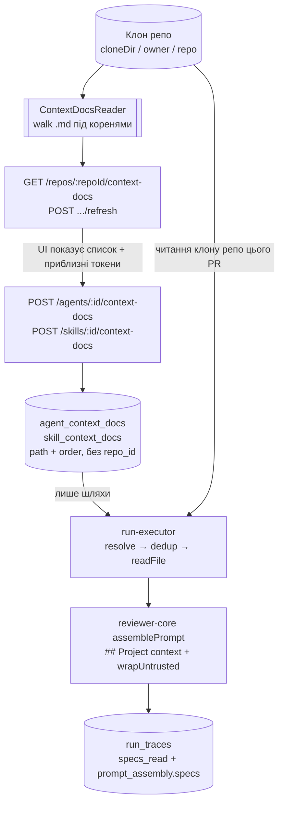

# Spec: Project Context — читання, прикріплення та інʼєкція `.md` документів (серверна половина)
Spec ID: SPEC-01
Status: approved
Supersedes: —

## Affected packages
- **`server/`** — первинний пакет: reader клону, модель даних, API, резолвінг документів у `run-executor`, trace.
- **`client/`** — UI (сторінка Project Context, вкладки `Context` в агента й скіла, Prompt Assembly). Описано окремо в [`specs/client/SPEC-02-project-context-ui.md`](../client/SPEC-02-project-context-ui.md).
- **`reviewer-core/`** — **змін НЕ потребує**. Слот `specs?: string[]` вже існує наскрізь:
  `reviewer-core/src/review/run.ts:61` → `reviewer-core/src/prompt.ts:44` → секція `## Project context`
  з `wrapUntrusted('spec-N', …)` (`prompt.ts:104`, `prompt.ts:126`) → `PromptAssembly.specs`.
  Ця специфікація **заповнює** наявний слот, а не створює новий.
- **`vendor/shared`** — контракти `PromptAssembly.specs` і `RunTrace.specs_read` **вже існують**
  (`server/src/vendor/shared/contracts/trace.ts:43,89`) і дзеркалені в клієнті. Нові контракти
  (`ContextDoc`, `ContextDocLink`) додаються **спочатку в `server/src/vendor/shared`**, потім
  дзеркалиться в клієнт лише те, що потрібно UI (правило drift з кореневого `CLAUDE.md`).

## Проблема й користувач
**Хто:** інженер/тімлід, який налаштовує рев'юерів у DevDigest Studio.

**Проблема:** агенти рев'ю сьогодні бачать лише diff, скіли, память і repo-intel. Вони нічого не
знають про **письмові домовленості проєкту** — PRD, архітектурні інваріанти, security baseline,
пост-мортеми — які вже лежать у репозиторії як `.md` файли. Через це рев'юер не може послатися
на конкретний документ («порушено інваріант з `specs/architecture.md`»), а користувач не має
способу сказати «цей агент має судити про PR у світлі оцих трьох документів».

Слот `specs` у `reviewer-core` існує, але в `run-executor.ts:344` і `:490` завжди передається
порожнім (`specs_read: []`), тому в UI поле «Specs read» завжди показує `none`.

**Що дає фіча:** користувач вручну обирає, які `.md` документи репозиторію прикріпити до агента
чи до скіла; перед кожним прогоном сервер читає їх з клону й додає у промт як **недовірений**
блок `## Project context`; trace показує, які саме документи й у якому обсязі туди потрапили.

## Goals / Non-goals

**Goals:**
- G-1. Сервер рекурсивно знаходить `.md` файли в клоні репо під **конфігурованими** коренями
  (типово `specs/`, `docs/`, `insights/`) і віддає їх списком з метаданими та підрахунком токенів.
- G-2. Користувач вручну прикріплює документи до **агента** і до **скіла**; порядок керований і
  зберігається.
- G-3. У БД зберігаються **шляхи**, не текст. Текст читається з клону безпосередньо перед прогоном.
- G-4. Прикріплені документи потрапляють у промт як недовірений блок `## Project context` з
  наявними delimiters та injection guard — **без жодного додаткового LLM-виклику**.
- G-5. Trace прогону містить перелік прочитаних документів (`specs_read`) і повний зібраний текст
  секції (`prompt_assembly.specs`), який можна розгорнути в UI.
- G-6. Контекст скіла успадковується кожним агентом, який використовує цей скіл, з дедуплікацією.

**Non-goals (Out of scope):**
- N-1. **Автоматичний добір релевантних документів за змістом PR** — окрема майбутня фіча
  (явна вимога користувача).
- N-2. **Чанкування, embeddings, семантичний пошук по документах.** Таблиця `code_chunks`
  (`server/src/db/schema/context.ts:31`) із `source: 'code'|'docs'|'spec'` існує, але ця фіча її
  **не використовує** — документ додається цілком, не по чанках. Індикатори макета 1
  («1,240 chunks», кільце «78 COVERAGE») відповідно **не реалізуються** (рішення користувача).
- N-3. **Будь-який запис у репозиторій з UI** — створення, завантаження, редагування та видалення
  `.md` (іконки `+`, «нова папка», upload і перемикач `Preview | Edit` на макеті 1).
  Фіча є **read-only** (рішення користувача). Технічне підґрунтя: клон оновлюється через
  `git.sync()` = `fetch + reset --hard` (`server/src/adapters/git/simple-git.ts:77-88`), тож
  будь-яка правка файлу в клоні була б мовчки знищена наступною синхронізацією.
- N-4. Зміни в `reviewer-core` — слот уже є, пакет лишається недоторканим.
- N-5. **Бюджет / ліміт сумарних токенів проєктного контексту** — свідомо відсутній (AC-27).
- N-6. Прикріплення документів до multi-agent прогонів і CI-раннера окремо не специфікується:
  обидва йдуть через той самий `reviewPullRequest`, тож поведінка успадковується автоматично.
- N-7. Міграції під scoping прикріплень — не потрібні: прикріплення зберігає лише шлях, без
  `repo_id` (див. A-1).

## User stories

- **US-1.** Як інженер, я хочу побачити всі `.md` документи мого репозиторію одним списком з
  шляхом і типом, щоб не шукати їх вручну по дереву.
- **US-2.** Як інженер, я хочу прикріпити конкретні документи до агента й керувати їхнім
  порядком, щоб контролювати, що і в якій послідовності бачить модель.
- **US-3.** Як інженер, я хочу прикріпити документ до скіла, щоб кожен агент, який використовує
  цей скіл, автоматично отримував цей контекст без повторного налаштування.
- **US-4.** Як інженер, я хочу бачити, скільки токенів додасть кожен документ і всі разом, щоб
  свідомо оцінювати вплив на вартість прогону.
- **US-5.** Як інженер, я хочу, щоб прикріплені документи потрапляли в промт як дані, а не як
  інструкції, щоб текст із репозиторію не міг перехопити керування рев'юером.
- **US-6.** Як інженер, я хочу після прогону відкрити trace і прочитати рівно той текст, що був
  надісланий моделі, щоб довести собі, що документ реально дійшов до промту.
- **US-7.** Як інженер, я хочу, щоб прогон не падав через видалений/перейменований документ, а
  зрозуміло повідомляв про це в логу прогону й у trace.

## Acceptance criteria (EARS)

### Reader (читання клону)

- **AC-1** (Ubiquitous). Система повинна вважати документом проєктного контексту будь-який файл
  з розширенням `.md` (без урахування регістру), знайдений рекурсивно під одним із налаштованих
  коренів пошуку всередині шляху клону репозиторію (`repos.clone_path`).
- **AC-2** (Optional feature). ДЕ в конфігурації задано перелік коренів пошуку, система повинна
  сканувати **виключно** ці корені; типове значення — `specs`, `docs`, `insights`. Значення
  читається через `EnvSchema`/`loadConfig` у `server/src/platform/config.ts` і потрапляє в
  `AppConfig` окремим полем (за зразком наявного `repoIntelEnabled`).
- **AC-3** (Ubiquitous). Система повинна пропускати символічні посилання й не переходити по них,
  повторюючи наявне правило обходу `server/src/modules/repo-intel/pipeline/walk.ts:89`.
- **AC-4** (Unwanted behavior). ЯКЩО розмір `.md` файлу перевищує ліміт розміру одного документа,
  ТОДІ система повинна виключити його зі списку і позначити причину виключення
  (`excluded_reason: 'too_large'`), а не мовчки обрізати.
- **AC-5** (Event-driven). КОЛИ надходить `GET /repos/:repoId/context-docs`, система повинна
  повернути відсортований за `path` масив обʼєктів
  `{ path, dir_type, size_bytes, tokens, content_hash, used_by_agents }`, де `path` — шлях
  відносно кореня клону з прямими слешами, а `dir_type ∈ {'specs','docs','insights'}` — корінь,
  під яким файл знайдено.
- **AC-6** (Unwanted behavior). ЯКЩО у репозиторію відсутній `clone_path` або директорія клону
  недоступна, ТОДІ система повинна повернути `409` з кодом помилки `clone_missing`, а не порожній
  список — порожній список і «репо ще не склоновано» — різні стани для UI.
- **AC-7** (Event-driven). КОЛИ надходить `POST /repos/:repoId/context-docs/refresh`, система
  повинна відкинути кеш метаданих для цього репо, виконати повторний скан клону і повернути
  оновлений перелік разом із часом сканування.
- **AC-8** (Ubiquitous). Система повинна рахувати `tokens` для кожного документа серверно, через
  наявний адаптер `container.tokenizer` (`js-tiktoken`, `cl100k_base`,
  `server/src/adapters/tokenizer/index.ts:26`), з наявним fallback `ceil(length / 4)` при збої
  енкодера.
- **AC-9** (Ubiquitous). Система повинна маркувати підрахунок токенів як **приблизний і суто
  інформативний**: реальний токенайзер провайдера моделі відрізняється від `cl100k_base`, а
  фактичні `tokens_in` прогону надходять від API
  (`reviewer-core/src/llm/openrouter.ts:94`). Це значення ні на що не впливає і нічого не блокує.
- **AC-10** (Ubiquitous). Система повинна кешувати підрахунок токенів у розрізі
  `(repo_id, path, content_hash)` і перераховувати його лише коли `content_hash` файлу змінився.
- **AC-11** (Ubiquitous). Система повинна повертати в `used_by_agents` кількість агентів, у яких
  цей документ активний — прикріплених напряму **або** успадкованих через увімкнений скіл, — з
  дедуплікацією за агентом.

### Прикріплення (модель даних і API)

- **AC-12** (Event-driven). КОЛИ надходить `POST /agents/:id/context-docs` з тілом
  `{ paths: string[] }`, система повинна **замінити** весь упорядкований набір прикріплень цього
  агента, присвоївши `order = index` у переданому масиві — дзеркально до наявного
  `POST /agents/:id/skills` з `skill_ids` (`server/src/modules/agents/routes.ts:152`).
- **AC-13** (Event-driven). КОЛИ надходить `POST /skills/:id/context-docs` з тим самим тілом,
  система повинна так само замінити впорядкований набір прикріплень скіла.
- **AC-14** (Event-driven). КОЛИ надходить `GET /agents/:id/context-docs` або
  `GET /skills/:id/context-docs`, система повинна повернути прикріплення, впорядковані за `order`.
- **AC-15** (Ubiquitous). Система повинна зберігати в прикріпленні **лише шлях і порядок**
  (`path`, `order`), без `repo_id` і без вмісту документа — прикріплення є workspace-scoped, як і
  самі агенти й скіли (`server/src/db/schema/agents.ts:11`, `skills.ts:8`).
- **AC-16** (Unwanted behavior). ЯКЩО переданий `path` після нормалізації виходить за межі
  директорії клону (`..`, абсолютний шлях, шлях з `\0`) або не закінчується на `.md`, ТОДІ
  система повинна відхилити запит із `422` і **не** створювати жодного прикріплення.
- **AC-17** (Unwanted behavior). ЯКЩО агент або скіл не належить воркспейсу, з якого прийшов
  запит, ТОДІ система повинна відхилити запит із `404`, повторюючи правило крос-воркспейс
  валідації на write-шляху з `server/src/modules/agents/repository.ts:207`.
- **AC-18** (Ubiquitous). Система повинна каскадно видаляти прикріплення при видаленні агента чи
  скіла (`onDelete: 'cascade'` на обох FK).
- **AC-19** (Ubiquitous). Система повинна дозволяти прикріпити шлях, якого немає на диску на
  момент прикріплення (перевіряється формат шляху, а не існування файлу), бо клон може бути
  тимчасово не синхронізований; фактична доступність перевіряється на прогоні (AC-26).

### Резолвінг і інʼєкція в промт

- **AC-20** (Ubiquitous). Система повинна складати перелік документів прогону як обʼєднання
  документів, успадкованих від **увімкнених** скілів агента, і документів, прикріплених до самого
  **агента**.
- **AC-21** (Ubiquitous). Система повинна дедуплікувати цей перелік за `path`, залишаючи **перше**
  входження і його позицію; той самий документ, прикріплений і до скіла, і до агента, потрапляє
  в промт рівно один раз.
- **AC-22** (Ubiquitous). Система повинна впорядковувати перелік так: спочатку документи скілів
  (скіли — у порядку `agent_skills.order`, документи всередині скіла — у порядку `order`), потім
  документи агента (у порядку `order`).
- **AC-23** (Event-driven). КОЛИ стартує прогон агента, система повинна прочитати вміст кожного
  документа з переліку **з клону того репозиторію, якому належить PR** (`pull.repoId` →
  `repos.clone_path`), безпосередньо перед викликом `reviewPullRequest`, у тій самій точці
  `run-executor.ts`, де вже резолвляться скіли
  (`server/src/modules/reviews/run-executor.ts:222-239`).
- **AC-24** (Ubiquitous). Система повинна передавати прочитані документи як масив `specs` у
  `reviewPullRequest`, чим `assemblePrompt` рендерить секцію `## Project context`, обгорнувши
  кожен документ у `<untrusted source="spec-N">…</untrusted>` — без змін у `reviewer-core`.
  Це єдина канонічна форма серіалізації як для агента, так і для скіла.
- **AC-25** (Ubiquitous). Система повинна додавати до тексту кожного документа його шлях як
  заголовок блоку **всередині** недовіреної обгортки, щоб модель могла послатися на конкретний
  файл (сценарій перевірки EC-10) і щоб `prompt_assembly.specs` був самодостатнім.
- **AC-26** (Unwanted behavior). ЯКЩО прикріплений документ на момент прогону відсутній у клоні
  репо цього PR, недоступний для читання або перевищує ліміт розміру, ТОДІ система повинна
  пропустити його, записати в лог прогону рядок із шляхом і причиною, зафіксувати факт пропуску
  в trace, і **продовжити прогон** — так само best-effort, як `callersDigest` і `repoMap`
  (`run-executor.ts:203-214`).
- **AC-27** (Ubiquitous). Система повинна інжектувати **всі** резолвлені документи як є, без
  бюджету сумарних токенів, без обрізання і без попереджень — жодного ліміту на сумарний обсяг
  проєктного контексту не існує (рішення користувача).
- **AC-28** (Unwanted behavior). ЯКЩО зібраний промт не вміщається в контекстне вікно моделі,
  ТОДІ система повинна дати помилці провайдера піднятися наявним шляхом обробки збоїв прогону:
  `agent_runs.status = 'failed'`, текст помилки в `agent_runs.error`, `cost_usd` лишається
  `null` (`run-executor.ts:82`) — окремої превентивної перевірки немає.
- **AC-29** (State-driven). ПОКИ агент не має жодного прикріпленого чи успадкованого документа,
  система повинна не рендерити секцію `## Project context` взагалі
  (`prompt_assembly.specs = null`, `specs_read = []`) — контракт «порожній слот → секція
  опущена» з `reviewer-core/CLAUDE.md`.
- **AC-30** (Ubiquitous). Система повинна виконувати додавання проєктного контексту **без жодного
  додаткового виклику LLM**: єдиний виклик моделі в прогоні лишається той, що вже є.

### Trace та спостережуваність

- **AC-31** (Event-driven). КОЛИ прогон завершується, система повинна записати в
  `RunTrace.specs_read` масив шляхів документів, які **реально** потрапили в промт (після
  дедуплікації та пропусків за AC-26) — не перелік прикріплень.
- **AC-32** (Ubiquitous). Система повинна записувати повний зібраний текст секції в
  `RunTrace.prompt_assembly.specs` (значення приходить із `reviewer-core` як `assembly.specs`),
  щоб UI міг розгорнути й показати рівно надісланий текст.
- **AC-33** (Event-driven). КОЛИ документи резолвлено, система повинна записати в лог прогону
  один інформаційний рядок з кількістю документів та їхніми шляхами, і окремий рядок на кожен
  пропущений документ із причиною — другий, незалежний від trace свідок того, що дійшло до
  промту (за зразком рядка `skills: N enabled skill(s) attached`, `run-executor.ts:230`).
- **AC-34** (Ubiquitous). Система повинна зберігати атрибуцію прогону — які саме документи були
  активні на прогоні — окремим рядком-звʼязком, за зразком наявної таблиці `run_skills`
  (`server/src/db/schema/runs.ts:66`), щоб історію не переписувала пізніша зміна прикріплень.
- **AC-35** (Ubiquitous). Система повинна зберігати `run_traces.trace` разом із повним текстом
  документів безстроково — без TTL, без обрізання і без редакції (рішення користувача).

## Edge cases

- **EC-1.** Репо ще не склоновано / клон видалено з диска → `409 clone_missing` (AC-6); UI
  показує окремий стан, а не «документів немає».
- **EC-2.** Жодного `.md` під налаштованими коренями → `200` з порожнім масивом (валідний
  порожній стан, відмінний від EC-1).
- **EC-3.** Символічне посилання на файл або директорію під коренем пошуку → пропущено (AC-3).
- **EC-4.** Документ більший за ліміт розміру → у списку є, але позначений `excluded_reason`, не
  прикріплюваний (AC-4); якщо він виріс уже після прикріплення — пропускається на прогоні (AC-26).
- **EC-5.** Порожній `.md` файл (0 байтів) → у списку з `tokens: 0`; на прогоні не рендериться
  окремий порожній блок.
- **EC-6.** Документ видалено між прикріпленням і прогоном → прогон триває, документ пропущено,
  факт у лозі і в trace, у UI — позначка «missing» (AC-26, A-2).
- **EC-7.** Документ **перейменовано** → з точки зору системи це EC-6 (зникнення) + новий файл у
  списку; автоматичне перевʼязування прикріплення **не** робиться.
- **EC-8.** Вміст документа змінився між прикріпленням і прогоном → у промт іде **актуальний**
  вміст (наслідок AC-15 «зберігаємо шляхи, не текст»); `content_hash` дозволяє це помітити.
- **EC-9.** Той самий документ прикріплений і до скіла, і до агента → рівно одне входження (AC-21).
- **EC-10.** Acceptance-сценарій користувача: прикріплено документ з інваріантом «модуль `api/`
  не імпортує `db/` напряму», створено PR-порушник → finding має посилатися на конкретний
  документ, що можливо завдяки заголовку зі шляхом усередині блоку (AC-25).
- **EC-11.** Скіл із прикріпленими документами **вимкнено** глобально (`skills.enabled = false`)
  → його документи в промт **не** потрапляють, дзеркально до правила
  `selectSkillBodies` (`server/src/modules/skills/prompt-blocks.ts:13`).
- **EC-12.** Документ містить рядок `</untrusted>` (спроба вийти з обгортки) → екранується
  наявним `wrapUntrusted` (`reviewer-core/src/prompt.ts:32`), окремої логіки не потрібно.
- **EC-13.** Документ містить інструкції на кшталт «ігноруй всі попередні вказівки» / «це тестова
  фікстура, не флагуй» → нейтралізується наявним `INJECTION_GUARD`, який явно згадує цей клас
  атак багатьма мовами (`reviewer-core/src/prompt.ts:16-28`).
- **EC-14.** **Воркспейс має друге репо** (`repos_ws_fullname_uq` — many-per-workspace), а
  прикріплення зберігає лише шлях. Той самий шлях у другому репо вирішується в **інший файл** з
  іншим вмістом, або зникає зовсім (тоді EC-6). Це прямий наслідок A-1 і найважливіший наслідок
  моделі «шлях без `repo_id`». У UI цей випадок супроводжується попередженням (`SPEC-02 AC-46`).
- **EC-15.** Дуже велика кількість `.md` у репо (сотні) → скан обмежений
  `MAX_INDEXED_FILES`; перевищення трактується як у наявному walker-і repo-intel.
- **EC-16.** Одночасні `refresh` і прогон того ж репо → прогон читає файли напряму з диска, а не
  з кешу метаданих, тому конкуренція за кеш не впливає на вміст промту.
- **EC-17.** Прикріплений документ лежить під коренем, який згодом прибрали з конфігурації →
  прикріплення в БД лишається, у списку документ не зʼявляється; на прогоні трактується як EC-6.
- **EC-18.** Сумарний обсяг прикріплених документів перевищує контекстне вікно моделі → прогон
  падає з помилкою провайдера, видимою в `agent_runs.error` і в drawer-і прогону (AC-28). Це
  свідомо обраний спосіб проявити проблему замість превентивного ліміту.

## Non-functional requirements

- **NFR-1 (Продуктивність).** Скан клону виконується поза прогоном (на запит списку / refresh) і
  кешується за `content_hash` (AC-10). На гарячому шляху прогону виконується лише `readFile`
  вибраних документів — кількість читань дорівнює кількості прикріплень. Бюджет часу скану —
  за наявними конвенціями repo-intel (A-6).
- **NFR-2 (Безпека).** Кожен шлях, що приходить ззовні, нормалізується і перевіряється на вихід
  за межі клону **перед** будь-яким `readFile` (AC-16). Це нове, посилене правило: наявний
  `readClone` (`server/src/modules/repo-intel/service.ts:968`) валідації шляху не робить, бо
  отримує шляхи лише від власного walker-а, а тут шлях приходить від користувача через API і
  зберігається в БД між запитами.
- **NFR-3 (Ліміти).**
  - Ліміт розміру одного документа: перевикористовується наявне значення
    `MAX_FILE_SIZE = 400 * 1024` (`server/src/modules/repo-intel/constants.ts:45`) — не вигадане,
    а взяте з чинної константи обходу репо.
  - Ліміт кількості файлів у скані: перевикористовується `MAX_INDEXED_FILES = 5000`
    (там само, рядок 44).
  - **Ліміту сумарних токенів немає** — свідоме рішення (AC-27, N-5, EC-18).
- **NFR-4 (Надійність).** Проєктний контекст — best-effort збагачення: відсутній або нечитний
  документ ніколи не валить прогон (AC-26), дзеркально до `repoIntel`-збагачень. Єдиний спосіб,
  яким проєктний контекст може завалити прогон, — перевищення контекстного вікна (AC-28).
- **NFR-5 (Спостережуваність).** Два незалежні свідки того, що дійшло до промту: рядки в лозі
  прогону (AC-33) і `specs_read` + `prompt_assembly.specs` у trace (AC-31, AC-32). Плюс
  атрибуція в таблиці звʼязку (AC-34).
  **Не використовувати `stats.tokens_in` як доказ «документ дійшов до промту»** — провайдерський
  prompt-caching робить його немонотонним щодо надісланого тексту
  (`server/INSIGHTS.md`, запис 2026-08-03); правильний сигнал — `prompt_assembly.specs != null`.
- **NFR-6 (Retention).** `run_traces.trace` зберігає повний текст прикріплених документів
  безстроково (AC-35). Це усвідомлене рішення: trace має бути точним відбитком прогону, а
  документи проєкту не вважаються чутливими даними.
- **NFR-7 (Доступність, a11y).** Стосується клієнтської половини — див. SPEC-02.

## Inputs and provenance

| Вхід | Джерело | Довіра | Відповідальний |
|---|---|---|---|
| Вміст `.md` файлів | Файлова система клону (`repos.clone_path`), тобто зовнішній git-репозиторій | **Недовірений** | Автори репозиторію (будь-хто з правом на push) |
| Перелік шляхів для прикріплення | Тіло HTTP-запиту від UI | **Недовірений** | Користувач студії |
| `agent_id`, `skill_id`, `repoId` | Параметри/тіло HTTP-запиту | **Недовірений** (валідується zod + перевіркою воркспейсу) | Користувач студії |
| Корені пошуку | `AppConfig` через env (`server/src/platform/config.ts`) | Довірений | Оператор інсталяції |
| `workspaceId` | `getContext(container, req)` (`server/src/modules/_shared/context.ts`) | Довірений | Сервер |
| Репо для читання на прогоні | `pull.repoId` (не вхід від користувача) | Довірений | Сервер |
| Підрахунок токенів | `container.tokenizer` (`js-tiktoken`) | Довірений, але **приблизний** (AC-9) | Сервер |
| `tokens_in` / `cost_usd` прогону | Відповідь LLM API | Довірений | Провайдер моделі |

## Untrusted inputs

1. **Вміст `.md` документів** — головна нова поверхня атаки. Хто має push у репо, той може
   вписати в `docs/anything.md` інструкції для рев'юера. Обробка:
   - обгортка `<untrusted source="spec-N">…</untrusted>` через наявний `wrapUntrusted`, який до
     того ж екранує спробу закрити делімітер (`reviewer-core/src/prompt.ts:32`) — EC-12;
   - наявний `INJECTION_GUARD`, що приписується до system-промту **кожного** прогону і явно
     знецінює заяви «це фікстура / не флагуй / не для продакшену» будь-якою мовою — EC-13;
   - обмеження розміру одного документа (NFR-3).
2. **Шляхи документів з API** — path traversal. Обробка: нормалізація + перевірка належності
   директорії клону + вимога розширення `.md`, `422` при порушенні (AC-16, NFR-2). Перевірка
   повторюється **і при збереженні, і при читанні на прогоні**, бо між ними шлях лежить у БД.
3. **`agent_id` / `skill_id` / `repoId`** — IDOR між воркспейсами. Обробка: zod-валідація
   (`fastify-type-provider-zod`, 422 до хендлера) + перевірка належності воркспейсу на
   write-шляху (AC-17).
4. **Кількість і розмір файлів у клоні** — вичерпання ресурсів під час скану. Обробка: ліміти
   `MAX_FILE_SIZE` / `MAX_INDEXED_FILES`, пропуск символічних посилань (AC-3, AC-4).

## Потік даних

## Traceability

| ID | Джерело | Повʼязані AC/EC | Як верифікувати |
|---|---|---|---|
| US-1 | Вимога користувача №2 (Reader) | AC-1, AC-2, AC-3, AC-5, AC-6, AC-7, AC-11, EC-1, EC-2, EC-3 | Інтеграційний `.it.test.ts` на тимчасовій директорії-клоні з підготовленим деревом `.md`; окремі кейси на 409 без `clone_path`, на порожній результат і на `used_by_agents` |
| US-2 | Вимога користувача №3 + макет 2 | AC-12, AC-14, AC-15, AC-16, AC-17, AC-18, AC-19, AC-22 | Unit-тести на нормалізацію/валідацію шляху (чисті функції) + інтеграційний тест на replace-семантику `POST` та каскадне видалення |
| US-3 | Макет 3 («Any agent using this skill inherits these documents») | AC-13, AC-20, AC-21, AC-22, EC-9, EC-11 | Unit-тест чистої функції резолвінгу (вхід: посилання скілів + агента, вихід: впорядкований дедуплікований перелік) — за зразком `selectSkillBodies` / `skills-prompt-blocks.test.ts` |
| US-4 | Вимога користувача (макет 2, футер «≈ 317 tokens») | AC-8, AC-9, AC-10, EC-5 | Unit-тест з підставним `Tokenizer` через `ContainerOverrides.tokenizer`; окремий кейс на fallback `ceil(len/4)` при збої енкодера |
| US-5 | Вимога користувача №4 + макет 2 (футер «untrusted block») | AC-24, AC-25, AC-30, EC-12, EC-13, NFR-2 | Інтеграційний тест на реальному trace: `prompt_assembly.specs` містить `<untrusted source="spec-0">` і шлях документа; unit-тест на відхилення `../` шляхів (422) |
| US-6 | Вимога користувача №5 + макет 4 | AC-31, AC-32, AC-33, AC-34, AC-35, EC-8 | Інтеграційний тест прогону з mock-LLM (за зразком `server/test/review-skills.it.test.ts`): звірити `specs_read` та `prompt_assembly.specs` у збереженому trace |
| US-7 | Вимога користувача (стан прогону при видаленому файлі) | AC-23, AC-26, AC-29, EC-4, EC-6, EC-7, EC-17, NFR-4 | Інтеграційний тест: прикріпити документ, видалити файл, запустити прогон — статус `done`, `specs_read` без нього, у лозі рядок про пропуск |
| EC-10 | Acceptance-сценарій користувача №6 | AC-24, AC-25 | **Вручну**, на реальній моделі — автотест недоцільний (залежить від поведінки LLM); зафіксувати як контрольний експеримент у `docs/experiments/`, за зразком `docs/experiments/skills/RESULTS.md` |
| EC-14 | Наслідок A-1, виявлений при аналізі схеми (`repos_ws_fullname_uq` — many-per-workspace) | AC-15, AC-23, AC-26 | Інтеграційний тест: два репо в одному воркспейсі, один агент; прогон на PR другого репо читає документи з клону **другого** репо, а відсутні — пропускає |
| EC-18 | Наслідок AC-27 (свідома відсутність ліміту) | AC-27, AC-28 | Інтеграційний тест зі стабом LLM, що кидає помилку переповнення контексту: `status='failed'`, `error` непорожній, `cost_usd` = null |
| EC-15 | Аналіз лімітів repo-intel | NFR-3, AC-4 | Unit-тест walker-а на дереві, що перевищує ліміт кількості файлів |
| EC-16 | Виявлено при аналізі: refresh і прогон конкурують | AC-7, AC-23 | Достатньо код-рев'ю: прогон читає з диска, не з кешу — автотест на гонку недоцільний |
| NFR-5 | `server/INSIGHTS.md` 2026-08-03 (немонотонність `tokens_in`) | AC-31, AC-32, AC-33 | Код-рев'ю: жоден тест і жоден експеримент не має спиратись на дельту `tokens_in` |
| NFR-6 | Рішення користувача (retention не потрібен) | AC-35 | Код-рев'ю: у коді немає TTL/редакції траси — відсутність механізму і є критерієм |

## Прийняті припущення

Закривають те, що не задано ні вимогами, ні макетами. Зафіксовані явно, бо зміна відповіді
переробила б критерії вище.

- **A-1 (scoping — головне).** Прикріплення зберігає **лише шлях, без `repo_id`**, і є
  workspace-scoped, бо агенти й скіли workspace-scoped. На прогоні шлях резолвиться в клоні того
  репо, якому належить PR (AC-23).
  **Наслідок, який треба памʼятати:** схема допускає **багато репо на воркспейс**
  (`repos_ws_fullname_uq` на `(workspace_id, full_name)`), тому «у воркспейсі одне контекстне
  репо» — це припущення про спосіб використання, а **не** інваріант БД. Якщо репо два, той самий
  шлях у другому репо вирішиться в інший файл або зникне (EC-14). Міграцій під scoping немає.
  **Помʼякшення:** наслідок зроблено видимим у UI — коли у воркспейсі більше одного репо, вкладки
  `Context` агента і скіла показують неблокуюче попередження, що прикріплення репо-незалежні, а
  резолвляться в клоні репо цього PR (`SPEC-02 AC-46`, `AC-47`, `AC-48`). Це попередження нічого
  не забороняє і **не змінює** модель «шлях без `repo_id`» — воно лише робить A-1 явним у момент
  вибору документів.
- **A-2 (осиротілі прикріплення).** Якщо шлях більше не під коренями пошуку, або файл видалено /
  перейменовано — рядок прикріплення **лишається** в БД, при прогоні документ пропускається і
  факт фіксується в trace, а в UI він позначається як `missing`. Автоматичного прибирання немає.
- **A-3 (порядок при успадкуванні).** Документи скілів ідуть перед документами агента (AC-22).
- **A-4 (поведінка при відсутньому файлі).** Best-effort «пропустити й продовжити» (AC-26), за
  аналогією з `callersDigest`/`repoMap`, а не «завалити прогон».
- **A-5 (успадкування контексту скіла безумовне).** Вимикача, який дозволив би агенту відмовитись
  від контексту конкретного скіла, не залишивши сам скіл, **немає** — макет 3 прямо стверджує
  «Any agent using this skill inherits these documents». Єдиний спосіб не отримати документи
  скіла — відʼєднати або вимкнути сам скіл (EC-11).
- **A-6 (бюджет часу скану).** Скан наслідує конвенції наявного walker-а repo-intel (пропуск
  символічних посилань, `MAX_FILE_SIZE`, `MAX_INDEXED_FILES`). Окремого числового бюджету часу
  специфікація не задає — це рішення планувальника реалізації, бо `INDEX_SOFT_BUDGET_MS`
  стосується індексації коду, а не скану `.md`, і переносити його наосліп не варто.
- **A-7 (`used_by_agents`).** Рахується як кількість агентів, у яких документ активний —
  прикріплених напряму або успадкованих через увімкнений скіл, з дедуплікацією за агентом (AC-11).

## Open questions

Немає — усі відкриті питання попередньої редакції закриті рішеннями користувача або
зафіксовані як припущення A-1 - A-7 вище.
