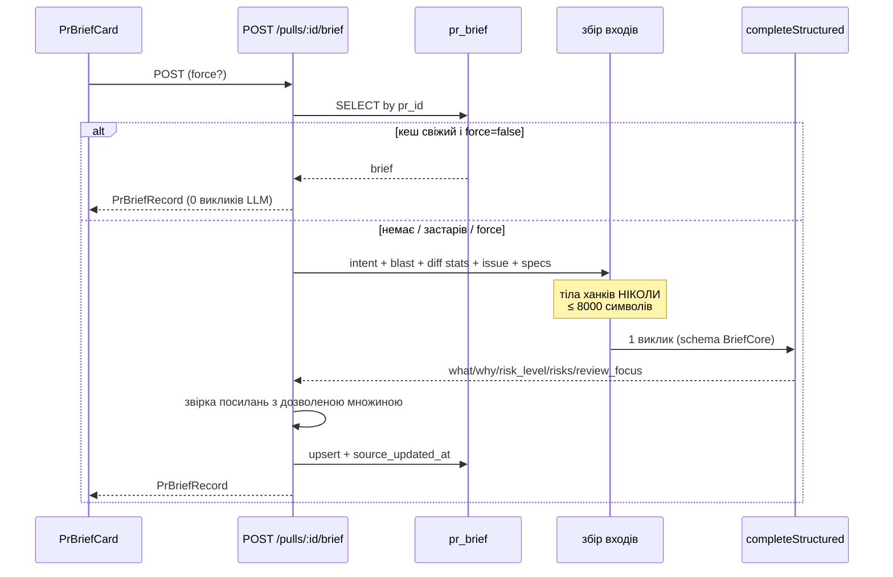

# Spec: PR Brief — збір контексту, один структурований LLM-виклик, кеш за станом PR (серверна половина)
Spec ID: SPEC-03
Status: draft
Supersedes: —

## Affected packages
- **`server/`** — первинний пакет: `POST /pulls/:id/brief`, `GET /pulls/:id/brief`, збір входів,
  один `completeStructured` виклик, детермінована пост-валідація посилань, кеш у `pr_brief`.
- **`client/`** — `PrBriefCard` + хуки. Описано окремо в
  [`specs/client/SPEC-04-pr-brief-card.md`](../client/SPEC-04-pr-brief-card.md).
- **`vendor/shared`** — контракти `PrBrief`/`Risk`/`RiskLevel`/`ReviewFocusItem`/`PrBriefRecord`
  додаються **спочатку** в `server/src/vendor/shared/contracts/`, потім дзеркаляться в клієнт
  лише в обсязі, потрібному UI (правило drift з кореневого `CLAUDE.md`).
- **`reviewer-core/`** — **змін не потребує**. Brief — окремий, дешевий виклик поза
  `reviewPullRequest`, як і Intent.

## Проблема й користувач
**Хто:** рев'юер/тімлід, який відкриває сторінку PR і має за 10 секунд зрозуміти, з чим має справу.

**Проблема:** на сторінці PR уже є `IntentCard` (що і навіщо змінює автор) і `BlastRadiusCard`
(на що це впливає), але вони не відповідають на питання рев'юера: **наскільки це ризиковано і
що дивитись першим**. Сьогодні цю відповідь треба збирати вручну з двох карток, списку файлів
і опису PR.

**Що дає фіча:** одна картка з рівнем ризику, конкретними ризиками з посиланнями на **реальні**
файли й переліком «дивитись першим». Результат кешується за станом PR, тож повторне відкриття
тієї самої версії PR не коштує жодного виклику моделі.

## Goals / Non-goals

**Goals:**
- G-1. `POST /pulls/:id/brief` збирає входи: Intent (L03), summary blast radius (L04), diff-статистику,
  повʼязаний issue, релевантні specs — **без жодного тіла diff-ханка**.
- G-2. Рівно **один** структурований LLM-виклик повертає
  `{ what, why, risk_level, risks[], review_focus[] }`.
- G-3. Кожне посилання на файл у `risks[]` і `review_focus[]` детерміновано звіряється зі списком
  файлів, що реально були у вході; неспівпадіння відкидається сервером, а не «довіряється моделі».
- G-4. Результат кешується в наявній таблиці `pr_brief` **за станом PR**; окрема дія примусово
  перегенеровує.
- G-5. Обсяг входу моделі обмежений узгодженим бюджетом у **символах** (NFR-3).

**Non-goals:**
- N-1. Будь-яке передавання **тіл** diff-ханків моделі — заборонено (AC-6), і не стане опцією.
- N-2. Пошук по власних `specs/**/SPEC-NN*.md` цього репозиторію. «Релевантні specs» = наявний
  механізм context-docs (`resolveContextDocs()` / `readContextDocsForRun()` → `PromptParts.specs`).
  Нового пошуку не вводиться (рішення користувача).
- N-3. Заповнення `PrBrief.history` — фічі PR-history не існує, продюсера немає (див. A-3).
- N-4. Обʼєднання з числовим «PR Score» (0-100) з `VerdictBanner`. `risk_level` — **інше** поле
  іншого потоку (findings/verdict); вони не звіряються й не виводяться одне з одного.
- N-5. Асинхронна черга/`JobRunner`. Виклик синхронний, як `POST /pulls/:id/intent`.
- N-6. Автогенерація brief під час прогону рев'ю (lazy-auto шлях, який має Intent). Тільки явна дія
  користувача.
- N-7. Новий `FeatureModelId`. У реєстрі вже є `risk_brief`
  (`server/src/vendor/shared/contracts/platform.ts:59`) — використовується він (A-1).

## User stories
- **US-1.** Як рев'юер, я хочу одним запитом отримати brief по PR, щоб не збирати картину вручну.
- **US-2.** Як рев'юер, я хочу бачити ризики з посиланнями на файли, які **справді** є в цьому PR,
  щоб не гнатися за вигаданим моделлю шляхом.
- **US-3.** Як рев'юер, я хочу, щоб повторне відкриття того самого стану PR не коштувало нового
  виклику моделі.
- **US-4.** Як рев'юер, я хочу окремою дією перегенерувати brief, коли PR змінився.
- **US-5.** Як власник бюджету, я хочу, щоб вхід моделі був обмежений і передбачуваний.

## Acceptance criteria (EARS)

### Збір входів

- **AC-1** (Event-driven). КОЛИ надходить `POST /pulls/:id/brief`, система повинна зібрати
  вхідний набір: Intent PR, blast radius, diff-статистику (перелік змінених файлів з
  `+додано/-видалено` та hunk-**заголовки**), повʼязаний issue і релевантні specs.
- **AC-2** (Ubiquitous). Система повинна брати Intent із наявного шляху `service.getIntent()`;
  ЯКЩО intent для цього PR ще не класифіковано, ТОДІ система повинна класифікувати його
  наявним `classifyAndStoreIntent()` перед складанням brief — щоб `POST /pulls/:id/brief` був
  самодостатньою дією (наслідок: у цьому випадку прогін коштує **два** LLM-виклики, і це
  єдиний випадок, коли їх більше одного).
- **AC-3** (Ubiquitous). Система повинна брати blast radius через наявний
  `BlastService.getForPr()` і подавати моделі **лише summary-рівень**: `summary`, `status`,
  `message`, імена й файли `changed_symbols`, а з `downstream` — `symbol`, `callers[].file/name`,
  `endpoints_affected[].value/file`, `crons_affected[].value/file`. Повні `coverage`-масиви й
  `rank`/`depth` у промт не йдуть.
- **AC-4** (Unwanted behavior). ЯКЩО blast radius повертає `status: 'degraded'` або
  `reason: 'diff_not_loaded'`/`'no_index'`, ТОДІ система повинна **не** переривати генерацію, а
  передати моделі його `message` як явну заяву про неповноту вхідних даних і згенерувати brief
  на тому, що є.
- **AC-5** (Ubiquitous). Система повинна брати повʼязаний issue тим самим шляхом, що й Intent —
  `ISSUE_REF_RE` по тілу PR + `container.github().getIssue()`
  (`server/src/modules/reviews/intent/sources.ts:35,69`) — і при недосяжності issue продовжувати
  без нього, записавши причину в лог.
- **AC-6** (Ubiquitous). Система повинна **ніколи** не включати у вміст запиту до моделі тіло
  diff-ханка (рядки `+`/`-`/контекст). Дозволені лише перелік файлів зі статистикою та
  hunk-заголовки формату `path @@ -a,b +c,d @@`, як їх уже будує
  `collectIntentSources` (`sources.ts:89-91`).
- **AC-7** (Ubiquitous). Система повинна отримувати «релевантні specs» **виключно** через наявний
  механізм context-docs (`server/src/modules/context-docs/resolve.ts:60` →
  `read-for-run.ts:53`), тобто той самий набір, що потрапляє в `PromptParts.specs`.
- **AC-8** (Ubiquitous). Система повинна обгортати **кожен** зовнішній рядок у вмісті запиту через
  наявний `wrapUntrusted(label, content)` (`server/src/platform/prompt.ts`): заголовок і тіло PR,
  тіло issue, шляхи й імена символів із blast, тексти specs.

### LLM-виклик

- **AC-9** (Ubiquitous). Система повинна виконувати рівно **один** виклик
  `(await container.llm(provider)).completeStructured<BriefCore>({ model, schema: BriefCore,
  schemaName: 'BriefCore', temperature: 0.2, maxRetries: 2, messages })` — та сама форма, що в
  `intent/classifier.ts:62` і `conventions/service.ts:144`.
- **AC-10** (Ubiquitous). Система повинна резолвити provider/model через
  `resolveFeatureModel(container, workspaceId, 'risk_brief')` — наявний ключ реєстру, новий
  `FeatureModelId` не додається (A-1).
- **AC-11** (Ubiquitous). Схема структурованої відповіді повинна бути
  `BriefCore = { what: string, why: string, risk_level: RiskLevel, risks: Risk[],
  review_focus: ReviewFocusItem[] }`, де `Risk` — **наявний** тип
  (`contracts/brief.ts:119`), `RiskLevel = z.enum(['low','medium','high'])`, а
  `ReviewFocusItem = { file: string, line: number|null, reason: string }`.
- **AC-12** (Ubiquitous). Система повинна **розширити** наявний `PrBrief`, а не вводити
  конкурентний тип: `PrBrief = BriefCore.extend({ intent: Intent, blast: BlastRadius,
  history: PrHistory.optional() })`. Поле `risks` при цьому стає `Risk[]` (плоский масив) замість
  обгортки `Risks` — це безпечно, бо `PrBrief` сьогодні не має **жодного** споживача в коді
  (перевірено: у `server/src` і `client/src` згадується лише таблиця `pr_brief`).
- **AC-13** (Unwanted behavior). ЯКЩО модель не повернула валідний за схемою обʼєкт після
  `maxRetries: 2`, ТОДІ система повинна відповісти помилкою і **не** записувати нічого в
  `pr_brief` — кеш ніколи не містить частково валідного brief.
- **AC-14** (Ubiquitous). Система повинна логувати два структуровані рядки — `brief: generation
  started` (з `prId`, `feature: 'risk_brief'`, `provider`, `model`, `promptChars`) і
  `brief: generation done` (з `tokensIn`, `tokensOut`, `costUsd`, `durationMs`,
  `riskLevel`, `droppedRefs`) — за зразком `intent/service.ts:50,65`.

### Заземлення посилань (grounding)

- **AC-15** (Ubiquitous). Система повинна будувати **множину дозволених посилань** із того самого
  вхідного набору, що пішов у промт: шляхи змінених файлів; `blast.changed_symbols[].file`;
  `blast.downstream[].callers[].file`; `blast.downstream[].endpoints_affected[].file` і
  `.crons_affected[].file`; значення `endpoints_affected[].value`/`crons_affected[].value` —
  для посилань на ендпоінти.
- **AC-16** (Unwanted behavior). ЯКЩО елемент `review_focus[]` посилається на `file`, якого немає
  в множині дозволених посилань, ТОДІ система повинна **відкинути цей елемент** перед записом і
  перед відповіддю, а не показувати його користувачу.
- **AC-17** (Unwanted behavior). ЯКЩО елемент `risks[]` містить у `file_refs[]` шляхи, яких немає
  в множині дозволених, ТОДІ система повинна **вилучити саме ці шляхи** з `file_refs`, лишивши
  сам ризик; а ЯКЩО після вилучення `file_refs` став порожнім — відкинути ризик цілком.
- **AC-18** (Ubiquitous). Система повинна виконувати звірку **детерміновано, у коді** (порівняння
  нормалізованих шляхів), і повинна повідомляти кількість відкинутих посилань у лозі (AC-14) —
  жодного повторного запиту до моделі задля виправлення.
- **AC-19** (State-driven). ПОКИ після звірки не лишилося жодного ризику або жодного пункту
  `review_focus`, система повинна повертати brief із порожнім відповідним масивом — це валідний
  результат, а не помилка (`what`/`why`/`risk_level` лишаються).
- **AC-20** (Ubiquitous). Система повинна зберігати `risk_level` таким, як його повернула модель;
  відкидання посилань (AC-16, AC-17) **не** перераховує рівень ризику.

### Кеш і перегенерація

- **AC-21** (Ubiquitous). Таблиця `pr_brief` (`server/src/db/schema/reviews.ts:91`) повинна
  отримати міграцією колонки за точним зразком `pr_intent` (`reviews.ts:69-89`):
  `source_updated_at timestamptz`, `provider text not null`, `model text not null`,
  `generated_at timestamptz not null default now()`. `pr_id` лишається PK, `json` — тілом brief.
- **AC-22** (Event-driven). КОЛИ brief генерується, система повинна записати в
  `source_updated_at` знімок поточного `pull_requests.updated_at` — так само як
  `classifyAndStoreIntent` (`intent/service.ts:87`).
- **AC-23** (Event-driven). КОЛИ надходить `POST /pulls/:id/brief` **без** `force`, і в `pr_brief`
  вже є рядок, у якого `source_updated_at` дорівнює поточному `pull_requests.updated_at`,
  система повинна повернути **кешований** brief і **не робити жодного виклику LLM**.
- **AC-24** (Event-driven). КОЛИ надходить `POST /pulls/:id/brief` з тілом `{ force: true }`,
  система повинна перегенерувати brief незалежно від стану кешу і перезаписати рядок (upsert
  за `pr_id`).
- **AC-25** (Event-driven). КОЛИ `pull_requests.updated_at` новіший за збережений
  `source_updated_at`, система повинна на `POST` без `force` перегенерувати brief — кеш
  провалено за станом PR.
- **AC-26** (Event-driven). КОЛИ надходить `GET /pulls/:id/brief`, система повинна повернути
  збережений brief як `PrBriefRecord` і **ніколи** не викликати LLM; ЯКЩО рядка немає — `404`,
  дзеркально до `GET /pulls/:id/intent` (`reviews/routes.ts:145-150`).
- **AC-27** (Ubiquitous). `PrBriefRecord` повинен бути точним дзеркалом форми `PrIntentRecord`
  (`contracts/review-api.ts:64-75`): `PrBrief.extend({ pr_id, provider, model, generated_at,
  source_updated_at: z.string().nullable() })`.
- **AC-28** (Ubiquitous). `POST /pulls/:id/brief` повинен мати той самий rate-limit, що й
  `POST /pulls/:id/intent`: `{ max: 5, timeWindow: '1 minute' }` (`reviews/routes.ts:157`).
- **AC-29** (Unwanted behavior). ЯКЩО PR не належить воркспейсу запиту, ТОДІ обидва маршрути
  повинні відповісти `404`, через наявний `getContext(container, req)` + `repo.getPull(workspaceId, prId)`.

### Бюджет входу

- **AC-30** (Ubiquitous). Система повинна вимірювати обсяг входу моделі **в символах** зібраного
  user-content рядка — функцією `briefPromptChars(bundle)`, дзеркальною наявній
  `intentPromptChars` (`intent/classifier.ts:90`), — і не перевищувати
  **8000 символів** (NFR-3).
- **AC-31** (Unwanted behavior). ЯКЩО зібраний user-content перевищує 8000 символів, ТОДІ система
  повинна детерміновано скорочувати його у фіксованому порядку пріоритетів, доки не вміститься:
  (1) тексти specs, (2) `callers` у blast, (3) перелік змінених файлів, (4) hunk-заголовки —
  і лише після цього обрізати хвіст рядка з явним маркером обрізання.
- **AC-32** (Ubiquitous). Система повинна обрізати тіло PR на наявній константі
  `MAX_PR_DESCRIPTION_CHARS = 4000` (`reviewer-core/src/prompt.ts:37`) і застосовувати ту саму
  межу до тіла повʼязаного issue — жодного нового «магічного» числа для цих двох входів.
- **AC-33** (Ubiquitous). Система повинна логувати фактичний `promptChars` (AC-14) і факт
  застосування скорочення — бюджет має бути спостережуваним, а не тихим.

## Edge cases

- **EC-1.** PR без опису й без issue → brief генерується на title + файли + blast; `why` спирається
  на Intent (AC-2).
- **EC-2.** `pr_files` ще не завантажено → blast повертає `reason: 'diff_not_loaded'`
  (`blast/service.ts:34-40`) → AC-4: brief генерується, множина дозволених посилань складається
  лише зі змінених файлів, відомих із diff.
- **EC-3.** Модель повернула шлях, якого немає в PR (галюцинація) → відкинуто (AC-16/AC-17),
  лічильник у лозі (AC-18).
- **EC-4.** Модель повернула всі посилання неіснуючими → `risks: []`, `review_focus: []`,
  `what`/`why`/`risk_level` лишаються (AC-19).
- **EC-5.** Той самий PR відкрито вдруге без змін → `GET` віддає кеш; `POST` без `force` теж
  віддає кеш (AC-23) — нуль викликів LLM. Це і є acceptance-сценарій завдання.
- **EC-6.** PR отримав новий коміт → `updated_at` зріс → `POST` без `force` перегенеровує (AC-25);
  доти `GET` віддає **старий** brief, а UI позначає його застарілим (SPEC-04 AC-9).
- **EC-7.** `pull_requests.updated_at` дорівнює `null` → знімок `null`; brief вважається
  застарілим не буде, і `POST` без `force` при наявному рядку віддасть кеш (те саме, що робить
  `IntentCard`, у якого staleness обчислюється лише коли обидві дати непорожні).
- **EC-8.** Дуже великий PR (сотні файлів) → спрацьовує скорочення AC-31; модель отримує
  усічений перелік, і множина дозволених посилань **звужується до того, що реально пішло в промт**
  (AC-15), тож моделі нема на що галюцинувати «поза бюджетом».
- **EC-9.** LLM-виклик впав або відповідь не валідна → `pr_brief` не змінюється, попередній
  кешований brief лишається читабельним через `GET` (AC-13).
- **EC-10.** Два одночасні `POST` для того самого PR → upsert за `pr_id`, останній запис виграє;
  дублікатів рядків бути не може (PK на `pr_id`).
- **EC-11.** Context-docs не налаштовані / порожні → секція specs у промті просто відсутня, brief
  генерується без неї.
- **EC-12.** У тексті spec-документа або тілі issue є інструкція «ігноруй попередні вказівки» →
  нейтралізується `wrapUntrusted` (AC-8) плюс явною вказівкою system-промту трактувати весь
  user-content як дані.

## Non-functional requirements

- **NFR-1 (Продуктивність).** Кешований шлях (AC-23/AC-26) — лише один `SELECT` по PK, без
  мережевих викликів. Генерація синхронна; бюджет часу окремо не задається — це та сама форма,
  що вже прийнята для `POST /pulls/:id/intent`.
- **NFR-2 (Безпека).** Увесь зовнішній текст іде в промт лише через `wrapUntrusted` (AC-8).
  Заборона на тіла diff-ханків (AC-6) — це і приватність (менше коду покидає периметр), і
  бюджет. Заземлення посилань (AC-15..AC-18) — захист від того, щоб UI зробив клікабельне
  посилання на вигаданий моделлю шлях.
- **NFR-3 (Ліміти).** Бюджет входу моделі — **8000 символів** зібраного user-content
  (не токенів). Одиниця обрана свідомо: у кодовій базі немає жодного tokenizer-based бюджетування
  промту, зате є два прецеденти підрахунку в символах — `MAX_PR_DESCRIPTION_CHARS = 4000`
  (`reviewer-core/src/prompt.ts:37`) і `intentPromptChars()` (`intent/classifier.ts:90`).
  System-промт у бюджет **не входить**: він статичний і контрольований розробником.
- **NFR-4 (Надійність).** Часткові вхідні дані ніколи не валять генерацію (AC-4); невалідна
  відповідь моделі ніколи не псує кеш (AC-13).
- **NFR-5 (Спостережуваність).** Два структуровані лог-рядки (AC-14) з `promptChars`, вартістю,
  токенами, рівнем ризику й кількістю відкинутих посилань — достатньо, щоб довести і бюджет,
  і факт заземлення. **Не** використовувати `tokensIn` як доказ «що саме дійшло до промту»
  (`server/INSIGHTS.md`, 2026-08-03: провайдерський prompt-caching робить його немонотонним);
  доказ бюджету — `promptChars`.
- **NFR-6 (Ліміти запитів).** `POST` — 5/хв на маршрут (AC-28), як у Intent.
- **NFR-7 (Retention / приватність).** `pr_brief` зберігає **результат**, а не надісланий промт;
  TTL не вводиться, рядок вмирає разом із PR (`onDelete: 'cascade'` уже є).

## Inputs and provenance

| Вхід | Джерело | Довіра | Відповідальний |
|---|---|---|---|
| Title / body PR | `pull_requests` (з GitHub) | **Недовірений** | Автор PR |
| Тіло повʼязаного issue | `container.github().getIssue()` | **Недовірений** | Автор issue |
| Перелік файлів + hunk-заголовки | `loadDiff()` → `UnifiedDiff` | Структура довірена, шляхи — **недовірені** | GitHub |
| Blast radius | `BlastService.getForPr()` → `container.repoIntel` | Довірений (власний індекс) | Сервер |
| Intent | `pr_intent` (L03) | Довірений за структурою, текст — від моделі | Сервер |
| Specs (context-docs) | `readContextDocsForRun()` з клону репо | **Недовірений** | Автори репозиторію |
| `risk_level`, `risks[]`, `review_focus[]` | Відповідь LLM | **Недовірений** — звіряється (AC-15..AC-18) | Модель |
| `workspaceId` | `getContext(container, req)` | Довірений | Сервер |
| `force` | Тіло HTTP-запиту (zod) | Недовірений, валідується | Користувач |

## Untrusted inputs

1. **Текст PR / issue / specs** — prompt injection. Обробка: `wrapUntrusted` на кожному рядку
   (AC-8), обрізання за AC-32, system-промт із явною вказівкою трактувати user-content як дані.
2. **Відповідь моделі** — головна нова поверхня. `file`/`file_refs` можуть бути вигадані.
   Обробка: детермінована звірка з множиною дозволених посилань (AC-15..AC-18) **до** запису в
   БД і **до** відповіді клієнту. Клієнт робить із цих значень клікабельні посилання
   (SPEC-04 AC-12), тому сервер — єдине місце, де ця перевірка має сенс.
3. **`:id` PR і `force`** — IDOR / некоректний ввід. Обробка: zod-схеми маршруту (422 до
   хендлера) + перевірка воркспейсу (AC-29).

## Потік даних

## Traceability

| ID | Джерело | Повʼязані AC/EC | Як верифікувати |
|---|---|---|---|
| US-1 | Вимога завдання (deliverable `POST /pulls/:id/brief`) | AC-1, AC-2, AC-3, AC-5, AC-7, AC-9, AC-10, EC-1, EC-11 | Інтеграційний `.it.test.ts` зі стабом LLM (`ContainerOverrides`): один POST → `pr_brief` заповнено, у відповіді всі пʼять полів |
| US-2 | Acceptance-критерій завдання «ризики посилаються на файли з blast-мапи» | AC-15, AC-16, AC-17, AC-18, AC-19, AC-20, EC-3, EC-4 | Unit-тест чистої функції звірки: вхід — відповідь моделі з двома валідними й двома вигаданими шляхами, вихід — лише валідні; окремий кейс «усе вигадане → порожні масиви» |
| US-3 | Acceptance-критерій завдання «повторне відкриття читає з кешу без нового виклику LLM» | AC-21, AC-22, AC-23, AC-26, EC-5, EC-7 | Інтеграційний тест зі стабом LLM, що **рахує виклики**: POST → 1 виклик; повторний POST і GET → лічильник лишається 1 |
| US-4 | Вимога завдання «окрема дія/кнопка перегенерації» | AC-24, AC-25, EC-6, EC-10 | Інтеграційний тест: POST `{force:true}` збільшує лічильник викликів; зміна `updated_at` робить те саме без `force` |
| US-5 | Acceptance-критерій завдання про бюджет входу | AC-30, AC-31, AC-32, AC-33, EC-8, NFR-3 | Unit-тест `briefPromptChars()` на штучно роздутому bundle: результат ≤ 8000 і порядок скорочення відповідає AC-31 |
| AC-6 | Вимога завдання «raw diff hunk bodies must NEVER be sent» | AC-6, NFR-2 | Unit-тест збірки user-content: у рядку немає жодного рядка тіла ханка (перевірка, що всі рядки з `+`/`-` з фікстури diff відсутні у виводі) |
| AC-11, AC-12, AC-27 | Рішення сесії №2 (розширити наявний `PrBrief`) | AC-11, AC-12, AC-27 | `pnpm typecheck` у `server/` + контрактний тест `PrBriefRecord.parse()` на еталонному обʼєкті (за зразком `server/test/contracts.test.ts`) |
| AC-13 | Аналіз надійності | AC-13, EC-9 | Інтеграційний тест зі стабом LLM, що повертає невалідний обʼєкт: 5xx і `pr_brief` без змін |
| AC-28, AC-29 | Дзеркало Intent-маршрутів | AC-28, AC-29 | Інтеграційний тест: PR чужого воркспейсу → 404; код-рев'ю конфігу rate-limit |
| AC-8 | Правило `wrapUntrusted` в обох наявних прикладах | AC-8, EC-12 | Unit-тест: у зібраному user-content кожен зовнішній блок обгорнутий `<untrusted source="...">` |
| NFR-5 | `server/INSIGHTS.md` 2026-08-03 (немонотонність `tokensIn`) | AC-14, AC-33 | Код-рев'ю: жоден тест не спирається на `tokensIn` як доказ вмісту промту |
| AC-4 | Аналіз деградацій blast (`BlastStatus`/`BlastReason`) | AC-4, EC-2 | Unit-тест: bundle з `status:'degraded'` дає непорожній user-content із `message` і не кидає |

## Процесні вимоги (не вимоги до коду)

Ці пункти є частиною acceptance-критеріїв завдання, але описують **процес**, а не поведінку
системи, тому свідомо не оформлені як EARS-критерії й не мають рядків у Traceability.

- **P-1.** `spec.md` (ця специфікація + SPEC-04) і `plan.md` (Implementation Plan) мають бути
  закомічені **до** коду фічі — окремим комітом, що передує будь-якій зміні в `server/src` чи
  `client/src`. Перевіряється історією git, а не тестом.
- **P-2.** Має бути зафіксована **крос-модельна нотатка рев'ю**: brief-генерація або самі
  артефакти прогнані через іншу модель, і розбіжності записані.
- **P-3.** Фінальний звіт `plan-verifier` має не містити жодної відкритої вимоги
  (жодного `FAIL`/`PARTIAL` без пояснення) — включно з покриттям кожного `AC-`/`EC-` цієї
  специфікації та SPEC-04.

## Прийняті припущення

- **A-1 (feature key).** Використовується **наявний** `FeatureModelId = 'risk_brief'`
  (`platform.ts:59`, label «Risk Brief», default `openai/gpt-4.1`), а не новий `'pr_brief'`.
  Реєстр не змінюється, Settings отримує фічу «безкоштовно». Це уточнення до вихідної вимоги,
  яка припускала, що ключ треба заводити.
- **A-2 (`GET` як окремий маршрут).** Завдання називає лише `POST`, але кешовий acceptance-критерій
  («відкриття PR не робить нового виклику») найпростіше довести через `GET`, дзеркальний до
  `GET /pulls/:id/intent`. `POST` при цьому теж кеш-обізнаний (AC-23), тож обидва прочитання
  вимоги задоволені.
- **A-3 (`history`).** `PrBrief.history` стає **опційним**: продюсера PR-history у репозиторії
  немає, а вимагати поле, яке нічим не заповнити, — вигадувати дані.
- **A-4 (Intent на вимогу).** `POST /pulls/:id/brief` сам класифікує Intent, якщо його ще нема
  (AC-2), замість повертати `409 intent_missing` — інакше кнопка «Generate brief» у порожньому
  стані картки не працювала б без попереднього ручного кроку.
- **A-5 (форма `review_focus`).** `{ file, line: number|null, reason }` — мінімум, достатній для
  вимоги «кожен пункт лінкується на файл/рядок». `line: null` — валідне значення для пункту про
  файл цілком.

## Open questions

- **OQ-1.** `risk_level` описано як окремий enum `RiskLevel` зі **тими самими** значеннями, що й
  наявний `RiskSeverity` (`['high','medium','low']`). Це свідоме дублювання (різні осі: рівень
  усього PR vs. тяжкість одного ризику). Якщо простіше — можна перевикористати `RiskSeverity`
  як тип поля `risk_level`; на решту специфікації це не впливає.
- **OQ-2.** Бюджет 8000 символів застосовано до **user-content** без system-промту (NFR-3).
  Якщо мався на увазі весь запит разом із system-промтом, змінюється лише формула вимірювання в
  AC-30, не поведінка.
- **OQ-3.** Порядок пріоритетів скорочення (AC-31) виведений із «що найдешевше втратити», а не
  заданий вимогою. Якщо specs важливіші за перелік файлів — міняється лише порядок у AC-31.
